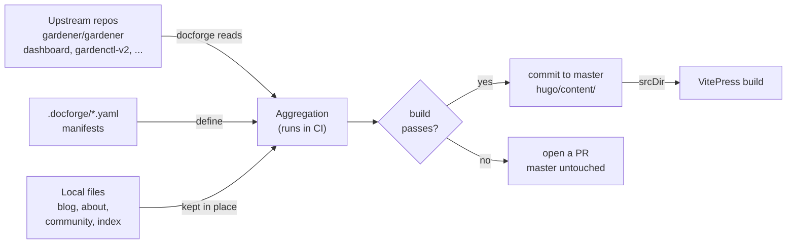
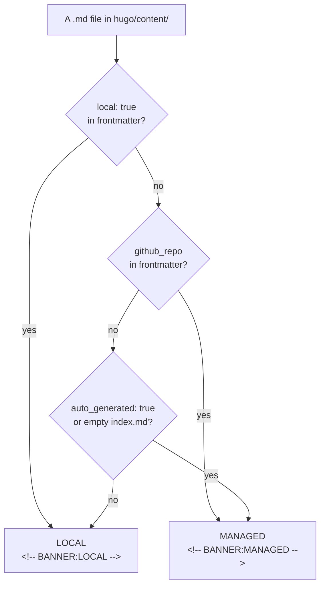
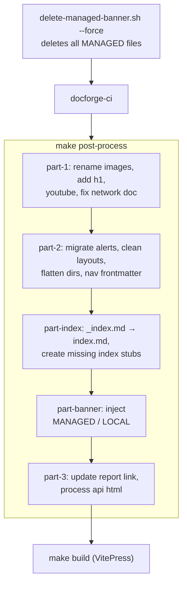
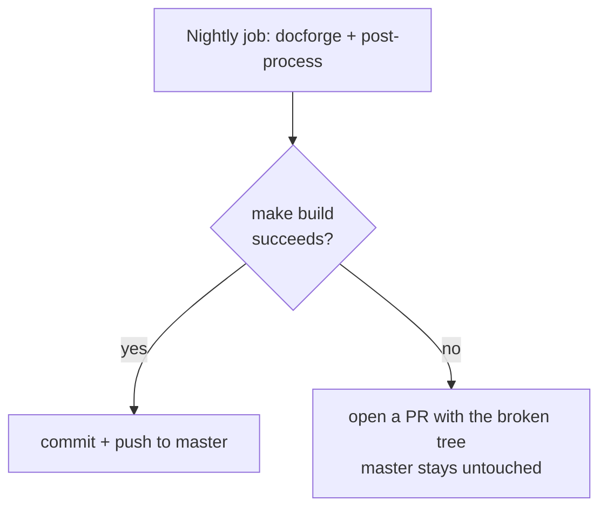

# Content Aggregation

This document explains how the Gardener documentation site assembles its content: the
distributed model behind it, the file lifecycle, the post-processing pipeline, and why
aggregation runs asynchronously instead of during the build. If you only want to *make a
change*, the [README](README.md) is enough — read this when you need to understand *why*
things are shaped the way they are.

## The distributed documentation model

Gardener is not one repository. The product is spread across dozens of repos
(`gardener/gardener`, `gardener/dashboard`, `gardener/gardenctl-v2`, extensions, and more),
and each one owns its own documentation next to its code. This repository **aggregates**
those docs into a single site and bundles in some general documentation of its own.

Keeping docs next to the code they describe means:

- **One source of truth.** A doc is edited where its code lives; there is no divergent
  second copy to keep in sync.
- **Docs ship with the code.** A feature PR and its documentation land in the same repo,
  reviewed by the same people who understand the change.
- **The site stays fresh automatically.** A scheduled job re-pulls every source, so
  upstream edits appear here without anyone touching this repository.

## Mental model

All docs live in `hugo/content/`. Some are **local** (blog, about, community, landing page)
and some are **aggregated** from upstream repositories. The aggregated documentation folder
structure is defined by manifests in `.docforge/*.yaml` and run through docforge in CI on a
daily schedule. The resulting tree is **committed to `master` only if the newly aggregated
files still build**. If the build fails, a PR is opened instead so the new content can be
fixed and merged asynchronously. This keeps `master` always publishable.



Two things to internalize:

- **Aggregation happens in CI, not on your machine.** A nightly job and any push to
  `master` that changes `.docforge/**` regenerate `hugo/content/` and commit it when the build passes (see
  [How a bad upstream change is kept off `master`](#how-a-bad-upstream-change-is-kept-off-master)).
  See [.github/workflows/aggregate-content.yml](.github/workflows/aggregate-content.yml).
- **`hugo/` is a legacy directory name.** The site runs on VitePress; `srcDir` points at
  `hugo/content/` for historical reasons. There is no Hugo in the build.

## Ownership: who owns which file

Every markdown file in `hugo/content/` carries exactly **one banner** as an HTML comment
right after its frontmatter. The banner is injected during post-processing
([post-processing/part-banner.js](post-processing/part-banner.js)) and is the visible
signal for who owns the file. Classification is derived from frontmatter. A hand-set `local: true` forces LOCAL and overrides all other rules (see below).



| Banner | Derived from | Source of truth | Edit here? |
|---|---|---|---|
| `MANAGED` | `github_repo`, `auto_generated`, or an empty `index.md` | the upstream repo, or the `.docforge/` manifests | **No.** The aggregation run recreates it. For upstream files the banner prints the exact upstream URL — open a PR there. For empty aggregator indexes and navigation stubs the banner points at `.docforge/` or `post-processing/part-index.js`. |
| `LOCAL` | none of the above (no `github_repo`, not an empty index) | this repository | **Yes.** Edit directly under `hugo/content/`. |

**Overriding classification with `local: true`.** Setting `local: true` in a file's frontmatter forces it to LOCAL, overriding every other rule including `github_repo` and `auto_generated`. Use it to hand-manage files that would otherwise be classified as MANAGED (e.g. an empty `index.md` navigation stub) or aggregated. The file survives `delete-managed-banner.sh` and gets a LOCAL banner on the next run. Because it overrides `github_repo`, a locally forked upstream file will no longer track upstream changes; the user accepts that risk.

A CI check ([enforce-managed-files.yml](.github/workflows/enforce-managed-files.yml))
runs [hack/check-managed.mjs](hack/check-managed.mjs) and **blocks any PR that touches a
MANAGED file**, because such edits would be silently lost on the next aggregation.

### What the banners look like

Each banner is an HTML comment (invisible in the rendered site) sitting directly after the
frontmatter. Open any file and you can tell at a glance who owns it.

**MANAGED (upstream)** — the banner ends with the exact upstream URL to open your PR
against. It is derived from `github_repo` + `github_subdir` in the frontmatter, so you
never have to reconstruct the path yourself. Example from
`hugo/content/docs/gardener/managed_seed.md`:

```markdown
<!-- BANNER:MANAGED -->
<!--
   █▀▀ ▀█▀ █▀█ █▀█
   ▀▀█  █  █ █ █▀▀
   ▀▀▀  ▀  ▀▀▀ ▀

   ┌────────────────────────────────────────────────┐
   │  MANAGED FILE — aggregated from upstream       │
   │                                                │
   │  Editing here is pointless: The nightly        │
   │  aggregation run overwrites this file.         │
   │                                                │
   │  Open a PR against the source instead: ─────┐  │
   │                          ┌──┐    ┌──────────┘  │
   │                          └──│────┘             │
   │           ┌─────────────────┘                  │
   └───────────│────────────────────────────────────┘
               ▼               
   https://github.com/gardener/gardener/blob/master/docs/operations/managed_seed.md
-->
```

**LOCAL** — no `github_repo`, so it is maintained here. Example from a blog post:

```markdown
<!-- BANNER:LOCAL -->
<!--
   █▀█ █▄▀
   █ █ █▀▄
   ▀▀▀ ▀ ▀

   ┌────────────────────────────────────────────────┐
   │  LOCAL FILE — maintained in gardener/          │
   │  documentation.                                │
   │                                                │
   │  Go ahead and edit this file directly.         │
   │  Changes here are the source of truth.         │
   └────────────────────────────────────────────────┘
-->
```

**MANAGED (empty aggregator index)** — an empty `index.md` that docforge emits for a
manifest `dir` whose `_index.md` node has no `source`. No upstream URL; the banner points
at the `.docforge/` manifests, where the directory is defined. Example from
`hugo/content/docs/faq/index.md`:

```markdown
<!-- BANNER:MANAGED -->
<!--
   █▀▀ ▀█▀ █▀█ █▀█
   ▀▀█  █  █ █ █▀▀
   ▀▀▀  ▀  ▀▀▀ ▀

   ┌────────────────────────────────────────────────┐
   │  MANAGED FILE — empty aggregator index         │
   │                                                │
   │  Editing here is pointless: The aggregation    │
   │  run overwrites this file.                     │
   │                                                │
   │  It is an empty index.md emitted by docforge   │
   │  for a manifest directory without a source.    │
   │  Change it in the manifests instead:           │
   │  .docforge/                                    │
   └────────────────────────────────────────────────┘
-->
```

**MANAGED (navigation stub)** — a stub written by post-processing when a directory has no
`index.md` of its own, marked `auto_generated: true`. No upstream source; the banner points
at the script that creates it. Example from
`hugo/content/docs/other-components/etcd-druid/deployment/index.md`:

```markdown
<!-- BANNER:MANAGED -->
<!--
   █▀▀ ▀█▀ █▀█ █▀█
   ▀▀█  █  █ █ █▀▀
   ▀▀▀  ▀  ▀▀▀ ▀

   ┌────────────────────────────────────────────────┐
   │  MANAGED FILE — navigation stub                │
   │                                                │
   │  Editing here is pointless: The aggregation    │
   │  run recreates this file.                      │
   │                                                │
   │  It has no upstream source. post-processing    │
   │  creates it because the directory would        │
   │  otherwise have no index.md:                   │
   │  post-processing/part-index.js                 │
   └────────────────────────────────────────────────┘
-->
```

## The aggregation pipeline

Aggregation is a strict pipeline. **Order matters** — running the steps out of order
produces ghost pages or an inconsistent tree.



Why each piece exists:

- **`delete-managed-banner.sh` runs first.** docforge writes purely additively and never
  deletes. If an entry is removed from a `.docforge/` manifest, its previously generated
  files would linger as ghost pages. Wiping all MANAGED files before each run clears those
  orphans while leaving LOCAL files untouched. (It also removes any leftover legacy
  GENERATED banner, a former banner type now folded into MANAGED.)
- **docforge** pulls the markdown from upstream repos as defined by the manifests
  ([.docforge/hugo.yaml](.docforge/hugo.yaml) and the files it includes).
- **post-process** ([Makefile](Makefile) target `post-process`) bridges the aggregated
  output to what VitePress renders: it normalizes directory indexes to `index.md`, injects
  the ownership banners, and translates legacy shortcode/frontmatter conventions. Never
  leave a bare docforge run without post-process — the tree would be half-migrated.

The whole pipeline is codified in the CI workflow and mirrored by the `make hugo-refresh`
target for local manifest testing.

## Why aggregation is asynchronous

Aggregation used to run **inside the build**. The repository kept two separate trees:

- **`website/`** — the local, hand-authored source (blog, about, community, landing page,
  and the docforge manifests).
- **`hugo/`** — the docforge **output**. It was **not committed**. Every `make local-preview`
  did `rm -rf hugo`, then ran docforge to pull upstream content, post-processed it, and
  built the site from the freshly generated tree.

That coupling caused several problems:

- Every build, and every contributor who wanted to test something, needed a
  `GITHUB_OAUTH_TOKEN` and a local docforge binary.
- A local preview took nearly two minutes because it re-aggregated `hugo/content/` from
  scratch every time — a full rebuild was always necessary to move new content from
  `website/` into `hugo/content/`, where VitePress then picked it up.
- Builds broke unpredictably when an upstream repo introduced syntax docforge or VitePress
  could not handle, or when GitHub rate-limited / cache-missed the aggregation.
- Local edits to content did not take effect until the whole re-aggregation ran.

docforge now runs once per night in a
GitHub Action, post-processes, and **commits the result**. The build simply reads the
committed tree. Once the build no longer generated `hugo/`, a separate
`website/` tree bought nothing it was just a second copy of the local files that had to be
merged into the aggregated tree anyway. So `website/` was dropped and its local files moved
**into** `hugo/content/`, alongside the aggregated ones, distinguished by their ownership
banner rather than by folder.

The payoff:

- **No token, no docforge needed to build.** The tree is already there, so there is no
  initial setup to contribute or test.
- **Local edits are instant.** VitePress hot reload picks up local content changes under
  `make dev` in seconds, with no aggregation on the critical path and no full rebuild.

### How a bad upstream change is kept off `master`

Because aggregation is asynchronous, a broken upstream source cannot break an unrelated
contributor's build. The nightly job
([aggregate-content.yml](.github/workflows/aggregate-content.yml)) guards `master`:



The job builds the freshly aggregated tree and **only pushes to `master` if the build
succeeds**. On failure, it opens a pull request containing the broken tree instead of
touching `master`. So a syntax error introduced upstream surfaces as a reviewable PR, not
as a red build for the next person who opens an unrelated documentation PR.
