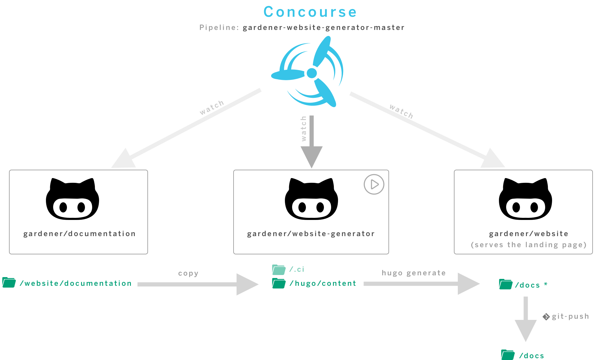

# Gardener Documentation

## Overview of CI/CD build 

### Documentation (this repository)
https://github.com/gardener/documentation/ contains the real content of the 
Landing page. Add/Remove/Modify/ pages or content here

### Generator
https://github.com/gardener/website-generator contains the site generator *Hugo*
and all the layout and js stuff.

### Website
The Repository https://github.com/gardener/website/ contains the generated
Landing page. All manual changes get lost.

# Contribute

## Add a new page

All content for your website will live inside the `./website/documentation` directory. Each top-level folder in Hugo is considered a 
content section. For example, if your site has three main sections — blog, getting-started, and tutorials — you will have 
three directories at `./website/documentation/010-blog`, `./website/documentation/020-getting-started`, and `./website/documentation/050-tutorials`.

### Order of content
Normally, the top navigation of a Hugo site is ordered by a `weight` attribute in the front matter section of the `_index.md`
file. For this website, I decide to use the **directory order and put a number in front of each directory**. With this
method, the directory order is synchronized with the menu order. This is more convenient for a content developer 
to navigate between website and content.

### Kind of pages
This website supports three kind of pages:

 - local
 - remote
 - repository
 
 
#### Local page
A `local` page is nothing special for hugo. A good example for a local page is 
the [./website/documentation/060-curated-links/_index.md](./website/documentation/060-curated-links/_index.md) file.

#### Remote Page
a `remote page` contains the front matter section with the reference to the remote `md` file.
Good example is [./website/documentation/020_getting_started/_index.md](./website/documentation/020_getting_started/_index.md)

#### Remote Repository
A `remote repo` contains just the front matter section. The real content is crawled during the build process.
A good example is the `./content/050-tutorials/content/app/https/_index.md` page. 

The remote repo is referenced by the `remote` attribute in the front matter.
