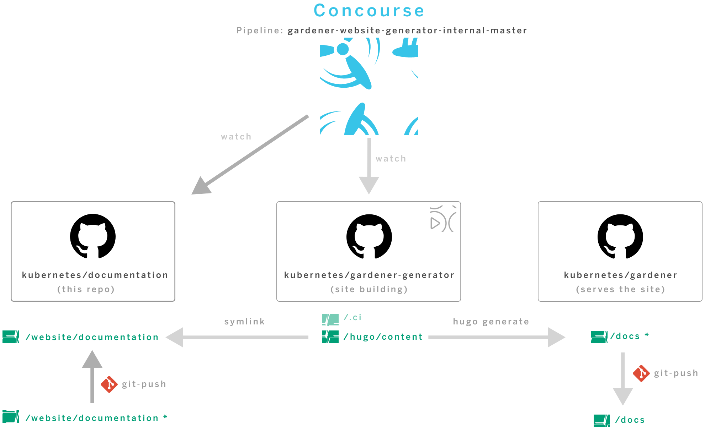
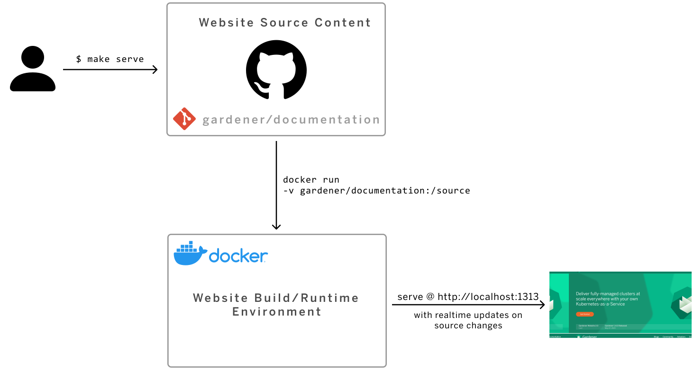

# Gardener Website Content Repository

[](https://reuse.software/)

## Website repositories and CI/CD Overview



The website builds and deployments are automated. They are orchestrated by Concourse CI/CD [pipeline](https://concourse.ci.gardener.cloud/teams/gardener/pipelines/gardener-website-generator-master) and triggered regularly (every 24h) or upon changes in [/gardener/documentation](https://github.com/gardener/documentation) or [/gardener/website-generator](https://github.com/gardener/website-generator) repos. The build results are then pushed to [/gardener/website/docs](https://github.com/gardener/website/tree/master/docs) and served as [GitHub Pages](https://pages.github.com/) site.


The repositories involved in the CI/CD are:
- [/gardener/documentation](https://github.com/gardener/documentation/) (this repository) is the **Website Source Content** repository . It contains the source content for the website, used by the builder to produce the static HTML to be served. This is the **primary repository for website content contributions - blogs, news, tutorials, etc**.
- [/gardener/website-generator](https://github.com/gardener/website-generator) is the **Website Generator** repository. It contains the tools, the scripts and build configuration for the website, including all common framework html, styles, javascript and images, as well as the scripts and build configuration for the build environment container image.
- [/gardener/website](https://github.com/gardener/website/) is the **Website** home repository. It hosts the generated website content and is configured to serve it using GitHub Pages. No manual contributions here.


## Setup Local Development Environment 

Prerequisites:
- Mac/Linux/Windows WSL
- Docker



1. Clone the website source content
   ```sh
   $ git clone https://github.com/gardener/documentation.git
   ```
1. Run the website locally with real-time update on changes
   ```sh
   $ cd documentation
   $ make serve
   ```

For scenarios other than content development, or if you can't meet some of the prerequisites, please refer to the [reference](https://github.com/gardener/website-generator#build-locally) for setting up build environment locally available at [/gardener/website-generator](https://github.com/gardener/website-generator).


## Contribute

### Add a new page

All content for your website will live inside the `./website/documentation` directory. Each top-level folder in Hugo is considered a 
content section. For example, if your site has three main sections — blog, getting-started, and tutorials — you will have 
three directories at `./website/documentation/blog`, `./website/documentation/getting-started` (WiP), and `./website/documentation/tutorials`.

### Order of content
Normally, the top navigation of a Hugo site is ordered by a `weight` attribute in the front matter section of the `_index.md`
file. For this website, I decide to use the **directory order and put a number in front of each directory**. With this
method, the directory order is synchronized with the menu order. This is more convenient for a content developer 
to navigate between website and content.


### Kind of pages
This website supports three kind of pages:

 - local
 - remote
 - repository
 
 
#### Local page
A `local` page is nothing special for hugo. A good example for a local page is 
the [./website/documentation/060-curated-links/_index.md](./website/documentation/060-curated-links/_index.md) file.


#### Remote Page
a `remote page` contains the front matter section with the reference to the remote `md` file.
Good example is [./website/documentation/getting-started.md](./website/documentation/getting-started.md)


#### Remote Repository
A `remote repo` contains just the front matter section. The real content is crawled during the build process.
A good example is the [./website/documentation/guides/applications/https.md](./website/documentation/guides/applications/https.md) page. 

The remote repo is referenced by the `remote` attribute in the front matter.
