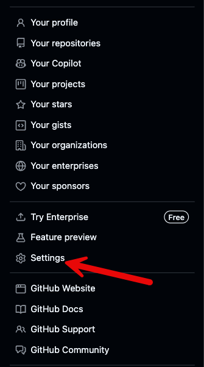
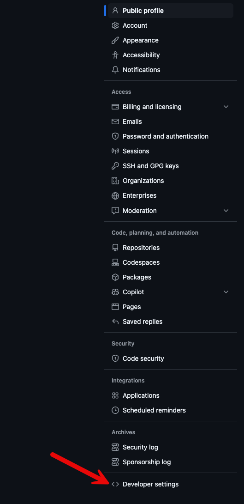
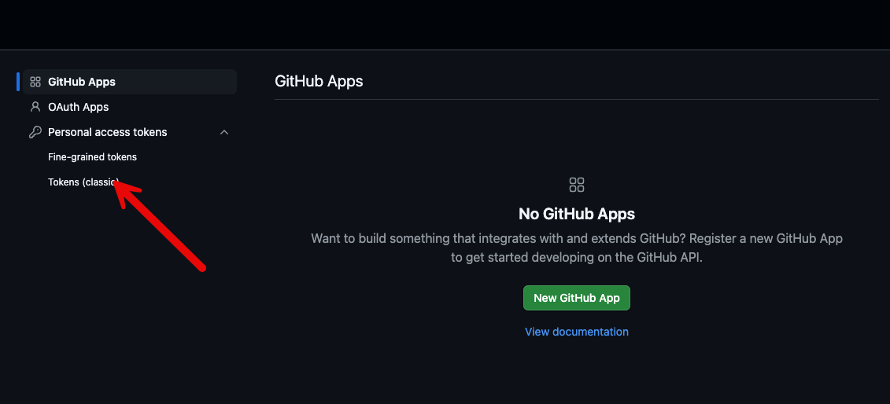
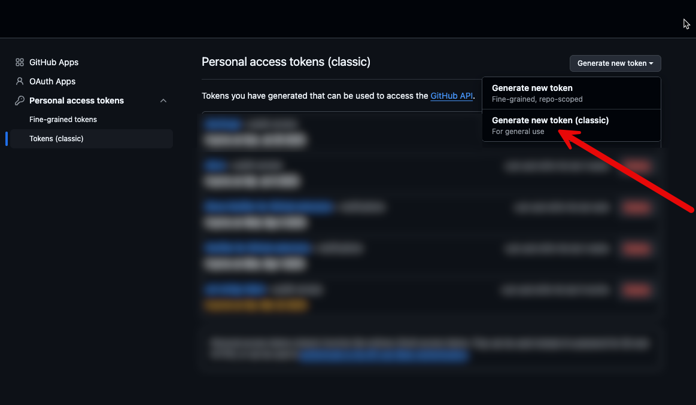
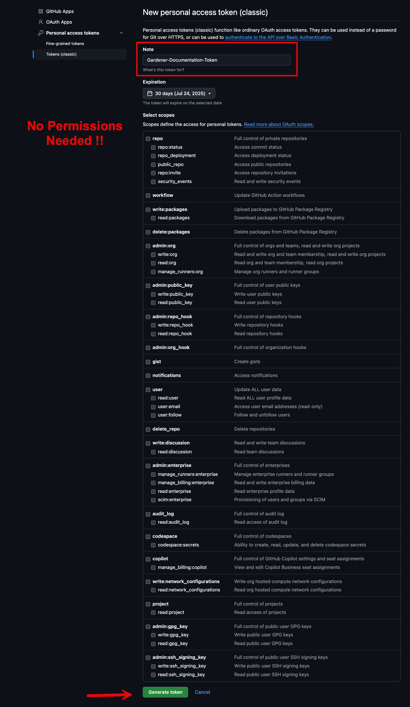

# 🌱 Gardener Documentation

## 🚀 Quick Start

Ready to jump in? Follow these steps to get the Gardener documentation running locally:

### Prerequisites

* [Docker](https://www.docker.com/) installed and running.
* A [GitHub](https://github.com/settings/personal-access-tokens) personal access token for API rate limits.
  * See the section [Getting the correct GitHub token](#getting-the-correct-github-token) below for details.
  * Alternatively, install the [gh CLI](https://cli.github.com/) and run `gh auth login --hostname github.com` once.

### Steps

1. Set the `GITHUB_OAUTH_TOKEN` environment variable (_optional with the `gh` CLI installed_):

```shell
export GITHUB_OAUTH_TOKEN=<token>
```

2. Build and run a Docker container:

```shell
make docker-preview
```

3. Visit [http://localhost:5173](http://localhost:5173) in your browser! 🎉

## 📚 Understanding the Documentation Structure

The Gardener documentation uses a **distributed documentation model** where content is gathered from multiple repositories into `hugo/content/` by a scheduled CI job (docforge). The aggregated tree is committed to `master`, so local builds and PRs work against `hugo/content/` directly without running docforge.

### Key Locations

All content lives in the committed `hugo/content/` tree. Every markdown file carries exactly one frontmatter marker that tells you who owns it:

- **`local: true`** — locally maintained. Edit these files directly here in `gardener/documentation`.
  - `hugo/content/blog/` - Blog posts
  - `hugo/content/community/` - Community-related content
  - `hugo/content/about/` - About pages
  - `hugo/content/index.md` - Landing page
  - `hugo/content/public/` - Static assets (favicon, logos, og-image); not markdown, so no marker

- **`managed: true`** — aggregated from an upstream repository. **Do not edit here.** The nightly aggregation run overwrites these files, so any local change is silently lost. The `github_repo` / `github_subdir` frontmatter fields point at the upstream source; open your PR there instead. A CI check (`enforce-managed-files`) blocks PRs that touch `managed: true` files.

### Manifest Files Explained

The `.docforge/` folder contains YAML files that define which **upstream** repositories are aggregated into `hugo/content/`:

- **`website.yaml`**: The main entry point that defines the top-level structure
- **`documentation/documentation.yaml`**: Defines the structure of the docs section
- Other YAML files for specific sections (extensions, adopters, etc.)

Here's a simplified view of how it works:
```
.docforge/website.yaml            # Main structure
  ↳ .docforge/documentation/*.yaml # Various section structures
    ↳ Content from remote repositories → committed to hugo/content/
```

## ✏️ Contributing

### Local Content

1. To modify local content, edit the `local: true` files directly in `hugo/content/`
2. Content changes are reflected immediately when using `make docs-dev`

### Blog Posts

1. Create new blog posts in `hugo/content/blog/YEAR/MONTH/your-post.md`
2. Include front matter at the top of your file:
   ```yaml
   ---
   local: true
   title: Your Awesome Blog Post
   description: "A brief description of your post"
   date: 2025-06-24
   authors:
   - name: Your Name
     email: your.email@example.com
   ---
   ```

### Remote Content 

Gardener documentation pulls content from multiple repositories. Key remote sources include:

- `gardener/gardener`: Core Gardener documentation
- `gardener/dashboard`: Dashboard documentation
- `gardener/gardenctl-v2`: CLI documentation

To modify these, submit changes to their respective repositories.

## 🔧 Available Commands

### Documentation Development

- `make docs-dev` - Start the development server with live reloading (port 5173)

### Docforge (Content Gathering)

- `make docforge-download` - Get the docforge binary for your OS
- `make docforge` - Run docforge with default config
- `make docforge-run ARGS="..."` - Run docforge with custom parameters


## Getting the correct GitHub token






