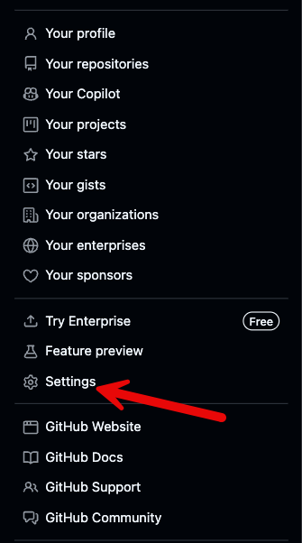
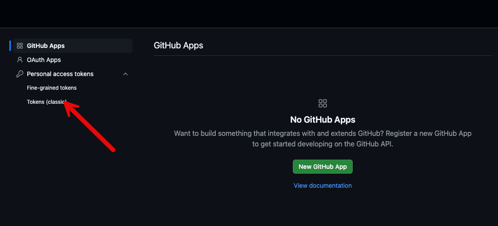
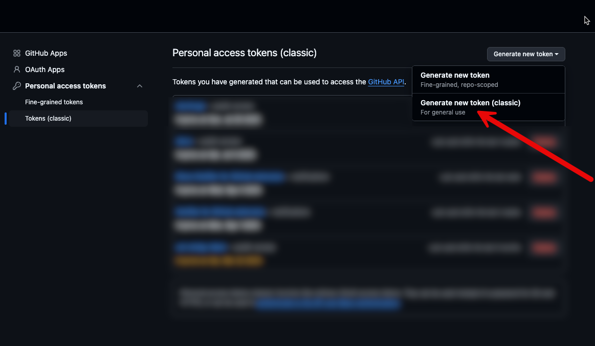
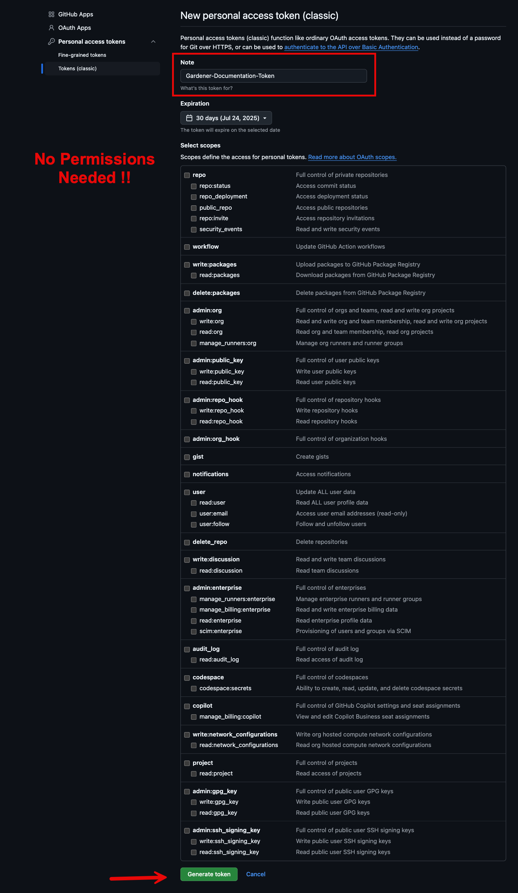

# 🌱 Gardener Documentation

## 🚀 Quick Start

Ready to jump in? Follow these steps to get the Gardener documentation running locally:

1. **Prerequisites**
   - Docker installed and running
   - GitHub token (for API rate limits)

2. **Set up environment variables**
   ```bash
   export DOCFORGE_CONFIG=.docforge/config.yaml
   export GITHUB_OAUTH_TOKEN=your_github_token 
   ```

To get the correct Github token -> [Getting the correct GitHub token](#getting-the-correct-github-token)

1. **Start the development server**
   ```bash
   make docs-dev
   ```

2. **Visit [http://localhost:5173](http://localhost:5173) in your browser** 🎉

## 📚 Understanding the Documentation Structure

The Gardener documentation uses a **distributed documentation model** where content is gathered from multiple repositories and organized into a single website using docforge.

### Key Locations

- **Local content**: `website/` directory
  - `website/documentation/` - Core documentation files
  - `website/blog/` - Blog posts 
  - `website/community/` - Community-related content

- **Remote content**: 
  - Content from other repositories is pulled in during the build process
  - The structure is defined in `.docforge/*.yaml` manifest files

### Manifest Files Explained

The `.docforge/` folder contains YAML files that define the structure of the documentation site:

- **`website.yaml`**: The main entry point that defines the top-level structure
- **`documentation/documentation.yaml`**: Defines the structure of the docs section
- Other YAML files for specific sections (extensions, adopters, etc.)

Here's a simplified view of how it works:
```
.docforge/website.yaml            # Main structure
  ↳ .docforge/documentation/*.yaml # Various section structures
    ↳ Content from local files and remote repositories
```

## ✏️ Contributing

### Local Content

1. To modify local content, simply edit files in the `website/` directory
2. Content changes are reflected immediately when using `make docs-dev`

### Blog Posts

1. Create new blog posts in `website/blog/YEAR/MONTH/your-post.md`
2. Include front matter at the top of your file:
   ```yaml
   ---
   title: Your Awesome Blog Post
   description: "A brief description of your post"
   date: 2025-06-24
   authors:
   - name: Your Name
     email: your.email@example.com
   ---
   ```

### Remote Content 

Gardener documentation pulls content from multiple repositories. Key remote sources include:

- `gardener/gardener`: Core Gardener documentation
- `gardener/dashboard`: Dashboard documentation
- `gardener/gardenctl-v2`: CLI documentation

To modify these, submit changes to their respective repositories.

## 🔧 Available Commands

### Documentation Development

- `make docs-dev` - Start the development server with live reloading (port 5173)

### Docforge (Content Gathering)

- `make docforge-download` - Get the docforge binary for your OS
- `make docforge` - Run docforge with default config
- `make docforge-run ARGS="..."` - Run docforge with custom parameters


## Getting the correct GitHub token






