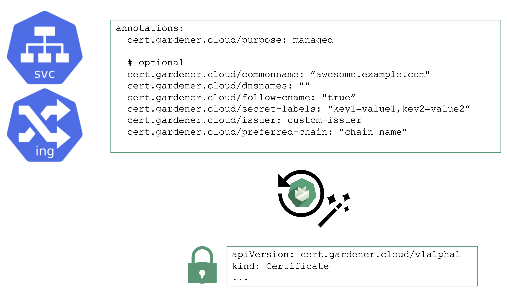

## Certificate Management

For proper consumption, any service should present a TLS certificate to its consumers. However, self-signed certificates are not fit for this purpose - the certificate should be signed by a CA trusted by an application's userbase. Luckily, Issuers like Let's Encrypt and others help here by offering a signing service that issues certificates based on the ACME challenge (Automatic Certificate Management Environment).

There are plenty of tools you can use to perform the challenge. For Kubernetes, cert-manager certainly is the most common, however its configuration is rather cumbersome and error prone. So let's see how a Gardener extension can help here.

## Manage Certificates with Gardener

You may annotate a Service or Ingress resource to trigger the cert-manager to request a certificate from the any configured issuer (e.g. Let's Encrypt) and perform the challenge. A Gardener operator can add a default issuer for convenience.
With the DNS extension discussed previously, setting up the DNS TXT record for the ACME challenge is fairly easy. The requested certificate can be customized by the means of several other annotations known to the controller. Most notably, it is possible to specify SANs via `cert.gardener.cloud/dnsnames` to accommodate domain names that have more than 64 characters (the limit for the CN field).

The user's request for a certificate manifests as a `certificate` resource. The status, issuer, and other properties can be checked there.

Once successful, the resulting certificate will be stored in a secret and is ready for usage.

With additional configuration, it is also possible to define custom issuers of certificates.

For more information, see the [Manage certificates with Gardener for public domain](https://github.com/gardener/gardener-extension-shoot-cert-service/blob/master/docs/usage/request_cert.md) topic and the [cert-management repository](https://github.com/gardener/cert-management#follow-cname).
