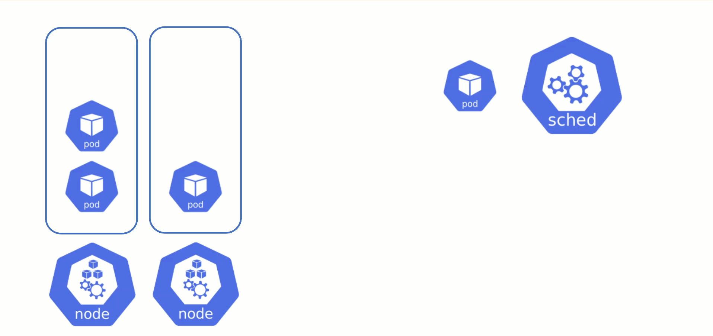
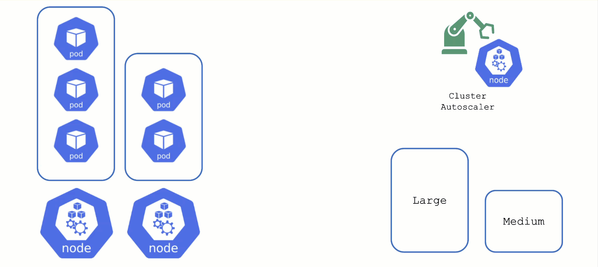

## Obtaining Aditional Nodes

The scheduler will assign pods to nodes, as long as they have capacity (CPU, memory, Pod limit, # attachable disks, ...). But what happens when all nodes are fully utilized and the scheduler does not find any suitable target?

**Option 1:** Evict other pods based on priority. However, this has the downside that other workloads with lower priority might become unschedulable.

**Option 2:** Add more nodes. There is an upstream Cluster Autoscaler project that does exactly this. It simulates the scheduling and reacts to pods not being schedulable events. Gardener has forked it to make it work with machine-controller-manager abstraction of how node (groups) are defined in Gardener.
The cluster autoscaler respects the limits (min / max) of any worker pool in a shoot's spec. It can also scale down nodes based on utilization thresholds. For more details, see the [autoscaler documentation](https://github.com/gardener/autoscaler/blob/machine-controller-manager-provider/cluster-autoscaler/FAQ.md).

## Scaling by Priority

For clusters with more than one  node pool, the cluster autoscaler has to decide which group to scale up. By default, it randomly picks from the available / applicable. However, this behavior is customizable by the use of so-called expanders.

This section will focus on the priority based expander.

Each worker pool gets a priority and the cluster autoscaler will scale up the one with the highest priority until it reaches its limit.

To get more information on the current status of the autoscaler, you can check a "status" configmap in the `kube-system` namespace with the following command:

`kubectl get cm -n kube-system cluster-autoscaler-status -oyaml`

To obtain information about the decision making, you can check the logs of the cluster-autoscaler pod by using the shoot's monitoring stack.

For more information, see the [cluster-autoscaler FAQ](https://github.com/gardener/autoscaler/blob/machine-controller-manager-provider/cluster-autoscaler/FAQ.md#what-are-expanders) and the [Priority based expander for cluster-autoscaler](https://github.com/gardener/autoscaler/blob/machine-controller-manager-provider/cluster-autoscaler/expander/priority/readme.md) topic.
