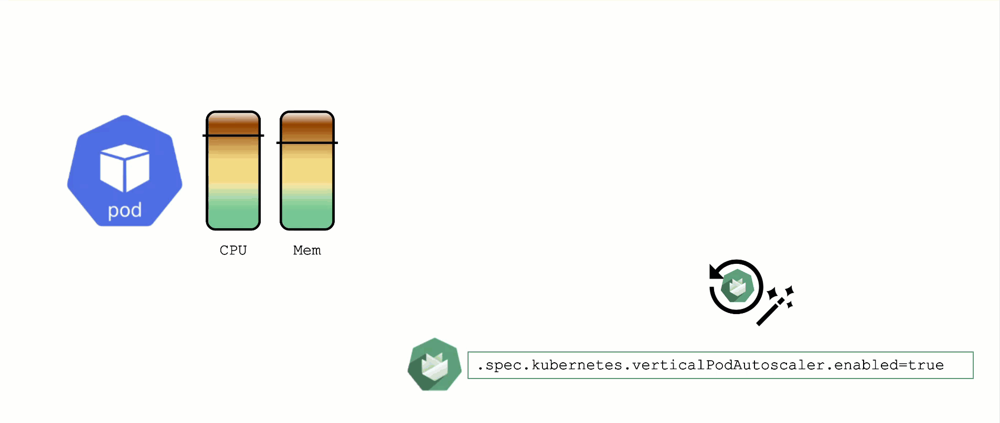

## Vertical Pod Autoscaler

When a pod's resource CPU or memory grows, it will hit a limit eventually. Either the pod has resource limits specified or the node will run short of resources. In both cases, the workload might be throttled or even terminated. When this happens, it is often desirable to increase the request or limits. To do this autonomously within certain boundaries is the goal of the Vertical Pod Autoscaler project.

Since it is not part of the standard Kubernetes API, you have to install the CRDs and controller manually. With Gardener, you can simply flip the switch in the shoot's spec and start creating your VPA objects.

Please be aware that VPA and HPA operate in similar domains and might interfere.

A controller & CRDs for vertical pod auto-scaling can be activated via the shoot's spec.
