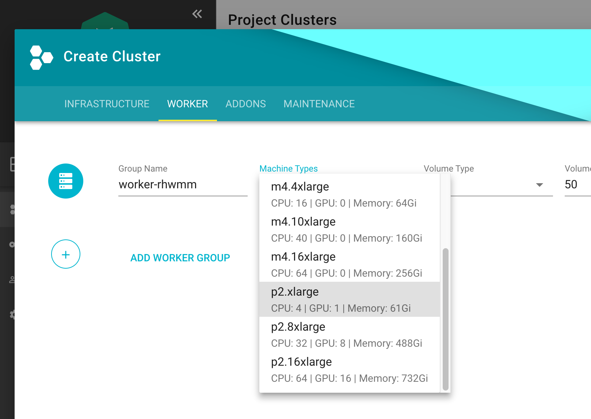

## Disclaimer

Be aware, that the following sections might be opinionated. Kubernetes, and the GPU support in particular, are rapidly evolving, which means that this guide is likely to be outdated sometime soon. For this reason, **contributions are highly appreciated** to update this guide.

## Create a Cluster

First thing first, let’s create a Kubernetes (K8s) cluster with GPU accelerated nodes. In this example we will use an AWS **p2.xlarge** EC2 instance because it's the cheapest available option at the moment. Use such cheap instances for learning to limit your resource costs. **This costs around 1€/hour per GPU**



## Install NVidia Driver as Daemonset

```yaml
apiVersion: apps/v1
kind: DaemonSet
metadata:
  name: nvidia-driver-installer
  namespace: kube-system
  labels:
    k8s-app: nvidia-driver-installer
spec:
  selector:
    matchLabels:
      name: nvidia-driver-installer
      k8s-app: nvidia-driver-installer
  template:
    metadata:
      labels:
        name: nvidia-driver-installer
        k8s-app: nvidia-driver-installer
    spec:
      hostPID: true
      initContainers:
      - image: squat/modulus:4a1799e7aa0143bcbb70d354bab3e419b1f54972
        name: modulus
        args:
        - compile
        - nvidia
        - "410.104"
        securityContext:
          privileged: true
        env:
        - name: MODULUS_CHROOT
          value: "true"
        - name: MODULUS_INSTALL
          value: "true"
        - name: MODULUS_INSTALL_DIR
          value: /opt/drivers
        - name: MODULUS_CACHE_DIR
          value: /opt/modulus/cache
        - name: MODULUS_LD_ROOT
          value: /root
        - name: IGNORE_MISSING_MODULE_SYMVERS
          value: "1"          
        volumeMounts:
        - name: etc-coreos
          mountPath: /etc/coreos
          readOnly: true
        - name: usr-share-coreos
          mountPath: /usr/share/coreos
          readOnly: true
        - name: ld-root
          mountPath: /root
        - name: module-cache
          mountPath: /opt/modulus/cache
        - name: module-install-dir-base
          mountPath: /opt/drivers
        - name: dev
          mountPath: /dev
      containers:
      - image: "gcr.io/google-containers/pause:3.1"
        name: pause
      tolerations:
      - key: "nvidia.com/gpu"
        effect: "NoSchedule"
        operator: "Exists"
      volumes:
      - name: etc-coreos
        hostPath:
          path: /etc/coreos
      - name: usr-share-coreos
        hostPath:
          path: /usr/share/coreos
      - name: ld-root
        hostPath:
          path: /
      - name: module-cache
        hostPath:
          path: /opt/modulus/cache
      - name: dev
        hostPath:
          path: /dev
      - name: module-install-dir-base
        hostPath:
          path: /opt/drivers
```

## Install Device Plugin

```yaml
apiVersion: apps/v1
kind: DaemonSet
metadata:
  name: nvidia-gpu-device-plugin
  namespace: kube-system
  labels:
    k8s-app: nvidia-gpu-device-plugin
    #addonmanager.kubernetes.io/mode: Reconcile
spec:
  selector:
    matchLabels:
      k8s-app: nvidia-gpu-device-plugin
  template:
    metadata:
      labels:
        k8s-app: nvidia-gpu-device-plugin
      annotations:
        scheduler.alpha.kubernetes.io/critical-pod: ''
    spec:
      priorityClassName: system-node-critical
      volumes:
      - name: device-plugin
        hostPath:
          path: /var/lib/kubelet/device-plugins
      - name: dev
        hostPath:
          path: /dev
      containers:
      - image: "k8s.gcr.io/nvidia-gpu-device-plugin@sha256:08509a36233c5096bb273a492251a9a5ca28558ab36d74007ca2a9d3f0b61e1d"
        command: ["/usr/bin/nvidia-gpu-device-plugin", "-logtostderr", "-host-path=/opt/drivers/nvidia"]
        name: nvidia-gpu-device-plugin
        resources:
          requests:
            cpu: 50m
            memory: 10Mi
          limits:
            cpu: 50m
            memory: 10Mi
        securityContext:
          privileged: true
        volumeMounts:
        - name: device-plugin
          mountPath: /device-plugin
        - name: dev
          mountPath: /dev
  updateStrategy:
    type: RollingUpdate
```

## Test

To run an example training on a GPU node, first start a base image with Tensorflow with GPU support & Keras:

```yaml
apiVersion: apps/v1
kind: Deployment
metadata:
  name: deeplearning-workbench
  namespace: default
spec:
  replicas: 1
  selector:
    matchLabels:
      app: deeplearning-workbench
  template:
    metadata:
      labels:
        app: deeplearning-workbench
    spec:
      containers:
      - name: deeplearning-workbench
        image: afritzler/deeplearning-workbench
        resources:
          limits:
            nvidia.com/gpu: 1
      tolerations:
      - key: "nvidia.com/gpu"
        effect: "NoSchedule"
        operator: "Exists"
```

> [!NOTE]
> The `tolerations` section above is not required if you deploy the `ExtendedResourceToleration` admission controller to your cluster. You can do this in the `kubernetes` section of your Gardener cluster `shoot.yaml` as follows:

```yaml
  kubernetes:
    kubeAPIServer:
      admissionPlugins:
      - name: ExtendedResourceToleration
```


Now exec into the container and start an example Keras training:

```bash
kubectl exec -it deeplearning-workbench-8676458f5d-p4d2v -- /bin/bash
cd /keras/example
python imdb_cnn.py
```

## Related Links

* [Andreas Fritzler](https://github.com/afritzler/kubernetes-gpu) from the Gardener Core team for the R&D, who has provided this setup.
* [Build and install NVIDIA driver on CoreOS](https://github.com/squat/modulus)
