## Introduction
Creating a Kubernetes cluster in an AWS Account is easy and the Gardener UI should be self-explanatory/.

# Gardener
## Create a new Project in Gardener

[Create new Project](https://dashboard.garden.canary.k8s.ondemand.com/login)

## Copy policy from the Gardener

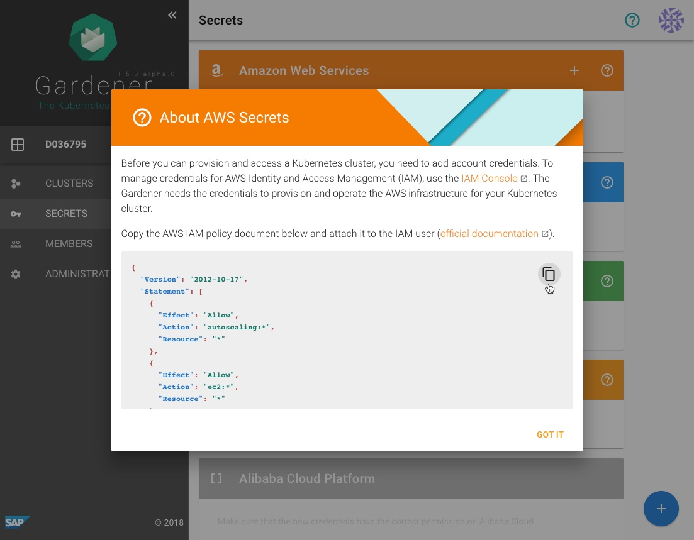

# AWS

## Create new policy
[Create new policy](https://console.aws.amazon.com/iam/home?#/policies)

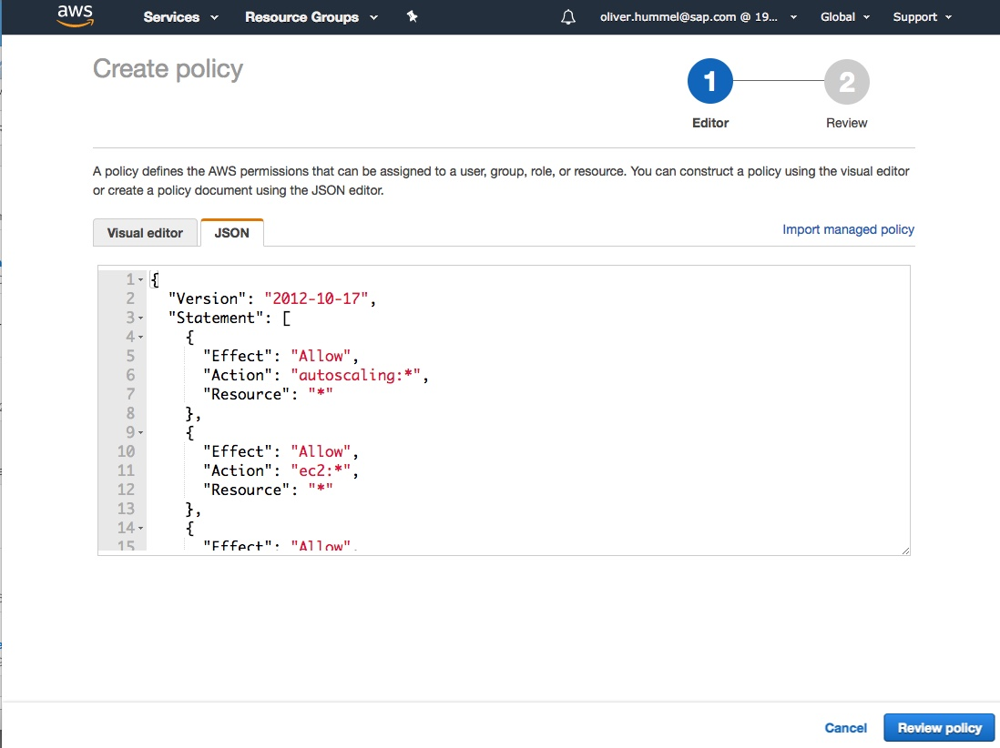

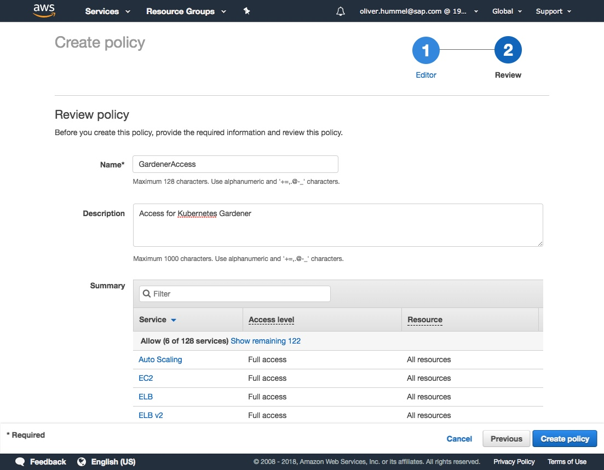

## Create a new technical user
[Create a new technical user](https://console.aws.amazon.com/iam/home?#/users$new?step=details)

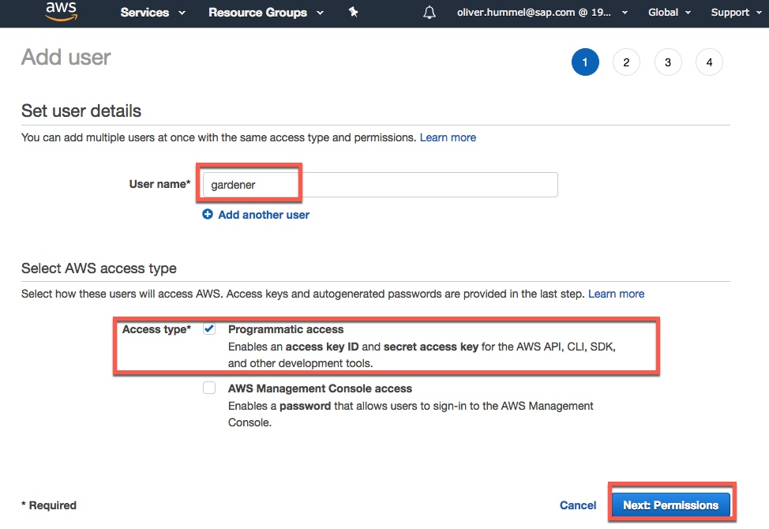

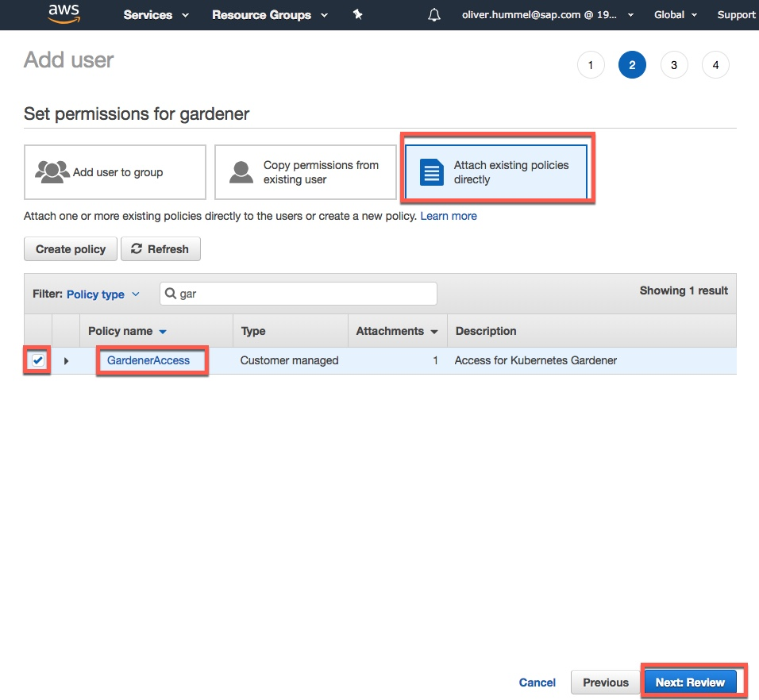

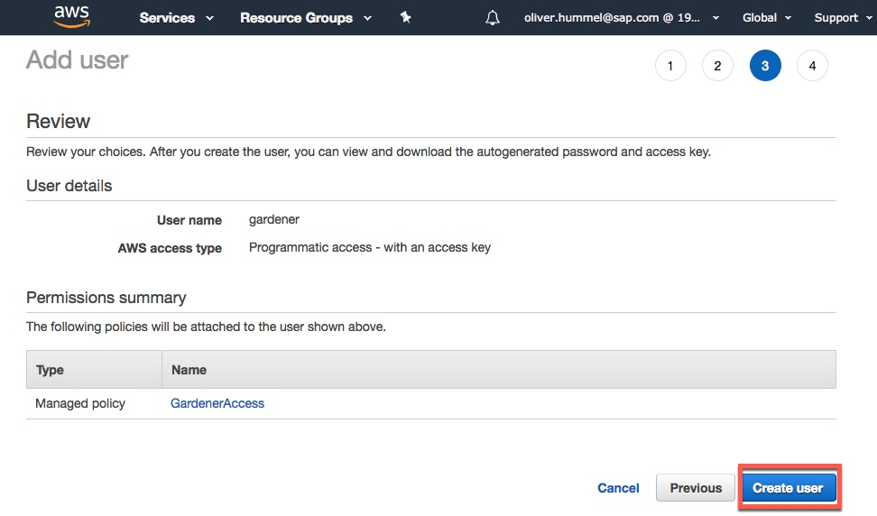
save the keys of the user, you will need them later on

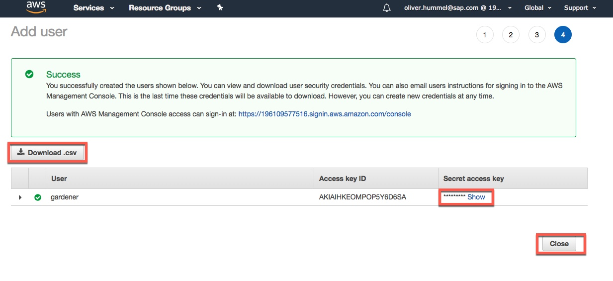

# Gardener
## Add AWS Secret
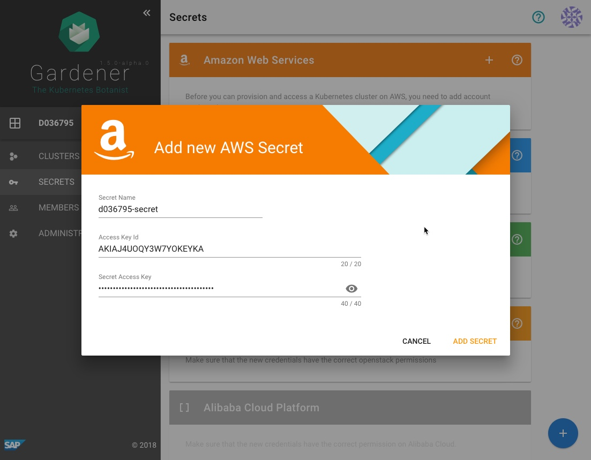

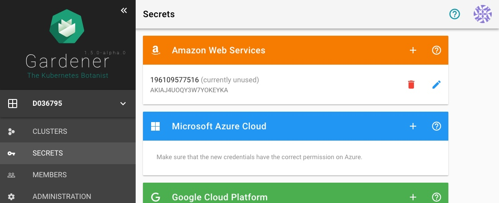

## Create a new Cluster
[Create a new cluster](https://dashboard.garden.canary.k8s.ondemand.com)

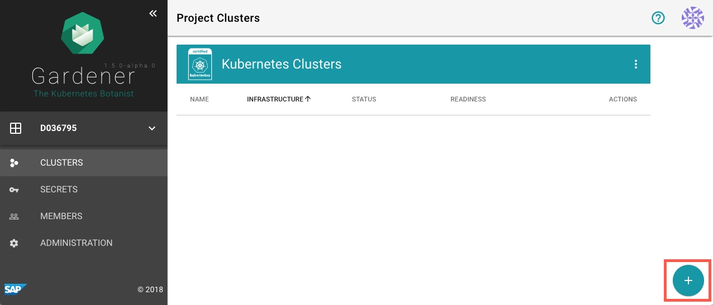

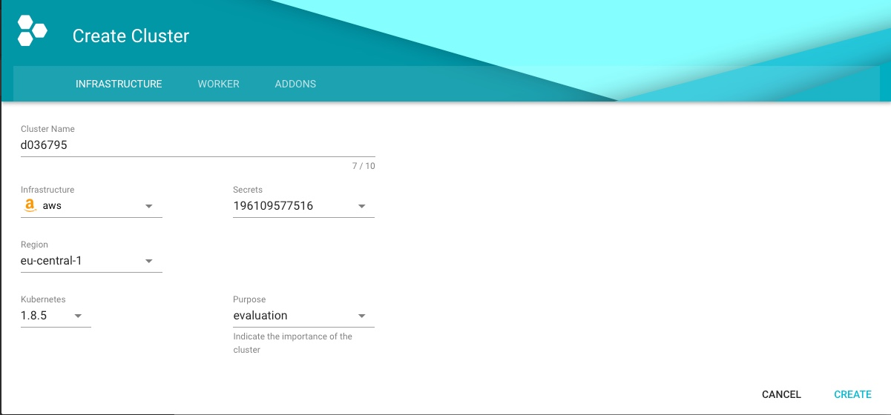

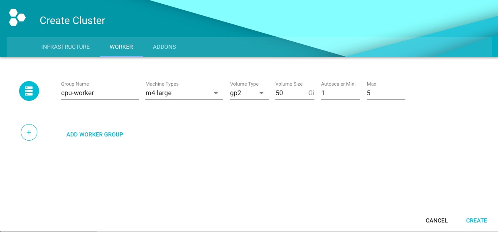

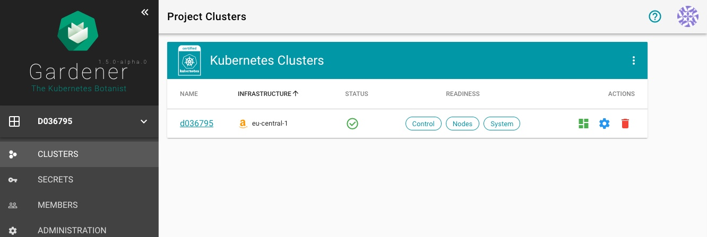

## Copy kubeconfig
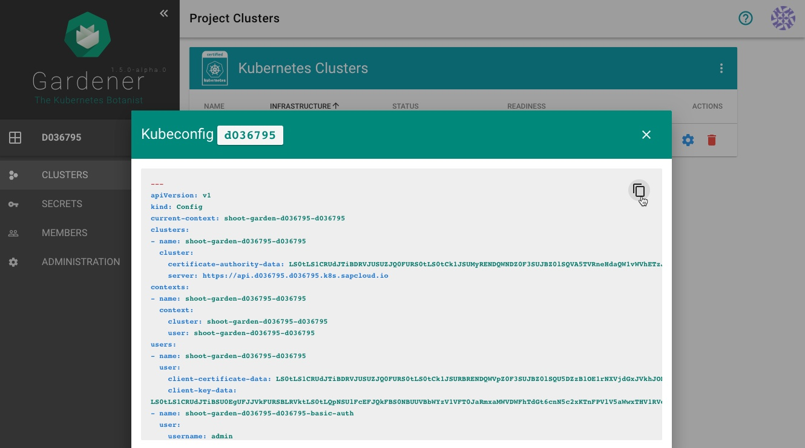
