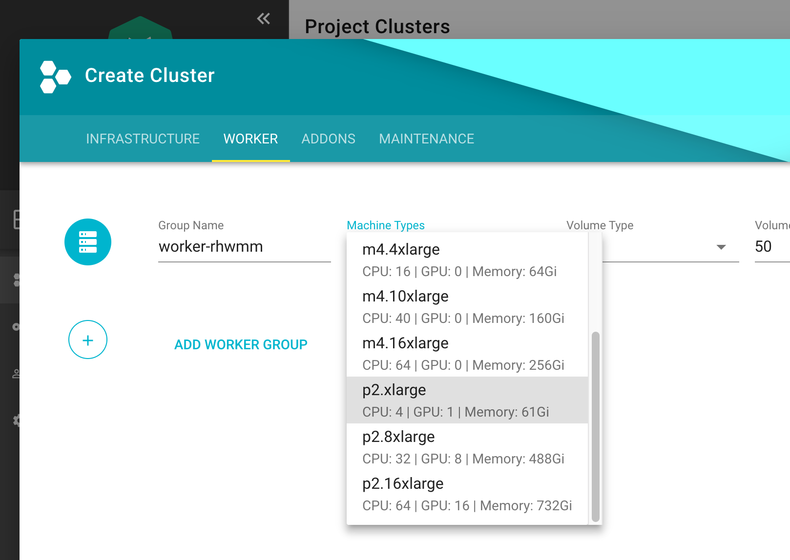

## Intro
Be aware, that the following sections might be opinionated. Kubernetes, and the GPU support in particular, is a 
rapidly developing environment, which means that this guide is likely to be outdated sometimes. For this reason, 
**contributions are highly appreciated**.

## Create a Cluster
First thing first, let’s create a k8s cluster with GPU accelerated nodes. In this example we will use AWS 
**p2.xlarge** EC2 instance because it's the cheapest available option at the moment. If you are also trying 
this out I'd suggest you using this instance type to avoid hitting your bill heavily. **More or less 1€/hour per GPU**



## Install NVidia Driver as Deamonset

```yaml
apiVersion: extensions/v1beta1
kind: DaemonSet
metadata:
  name: nvidia-driver-installer
  namespace: kube-system
  labels:
    k8s-app: nvidia-driver-installer
spec:
  template:
    metadata:
      labels:
        name: nvidia-driver-installer
        k8s-app: nvidia-driver-installer
    spec:
      hostPID: true
      initContainers:
      - image: squat/modulus:13bb5a54d558ddce0ad2a7702fdd18083f0b4ac7
        name: modulus
        args:
        - compile
        - nvidia
        - "390.48"
        securityContext:
          privileged: true
        env:
        - name: MODULUS_CHROOT
          value: "true"
        - name: MODULUS_INSTALL
          value: "true"
        - name: MODULUS_INSTALL_DIR
          value: /opt/drivers
        - name: MODULUS_CACHE_DIR
          value: /opt/modulus/cache
        - name: MODULUS_LD_ROOT
          value: /root
        volumeMounts:
        - name: etc-coreos
          mountPath: /etc/coreos
          readOnly: true
        - name: usr-share-coreos
          mountPath: /usr/share/coreos
          readOnly: true
        - name: ld-root
          mountPath: /root
        - name: module-cache
          mountPath: /opt/modulus/cache
        - name: module-install-dir-base
          mountPath: /opt/drivers
        - name: dev
          mountPath: /dev
      containers:
      - image: "gcr.io/google-containers/pause:3.1"
        name: pause
      tolerations:
      - key: "nvidia.com/gpu"
        effect: "NoSchedule"
        operator: "Exists"
      volumes:
      - name: etc-coreos
        hostPath:
          path: /etc/coreos
      - name: usr-share-coreos
        hostPath:
          path: /usr/share/coreos
      - name: ld-root
        hostPath:
          path: /
      - name: module-cache
        hostPath:
          path: /opt/modulus/cache
      - name: dev
        hostPath:
          path: /dev
      - name: module-install-dir-base
        hostPath:
          path: /opt/drivers
```

## Install Device Plugin

```yaml
apiVersion: extensions/v1beta1
kind: DaemonSet
metadata:
  name: nvidia-gpu-device-plugin
  namespace: kube-system
  labels:
    k8s-app: nvidia-gpu-device-plugin
    #addonmanager.kubernetes.io/mode: Reconcile
spec:
  template:
    metadata:
      labels:
        k8s-app: nvidia-gpu-device-plugin
      annotations:
        scheduler.alpha.kubernetes.io/critical-pod: ''
    spec:
      priorityClassName: system-node-critical
      volumes:
      - name: device-plugin
        hostPath:
          path: /var/lib/kubelet/device-plugins
      - name: dev
        hostPath:
          path: /dev
      containers:
      - image: "k8s.gcr.io/nvidia-gpu-device-plugin@sha256:0842734032018be107fa2490c98156992911e3e1f2a21e059ff0105b07dd8e9e"
        command: ["/usr/bin/nvidia-gpu-device-plugin", "-logtostderr", "-host-path=/opt/drivers/nvidia"]
        name: nvidia-gpu-device-plugin
        resources:
          requests:
            cpu: 50m
            memory: 10Mi
          limits:
            cpu: 50m
            memory: 10Mi
        securityContext:
          privileged: true
        volumeMounts:
        - name: device-plugin
          mountPath: /device-plugin
        - name: dev
          mountPath: /dev
  updateStrategy:
    type: RollingUpdate
```

## Test
To run an example training on a GPU node, start first a base image with Tensorflow with GPU support & Keras

```yaml
apiVersion: apps/v1
kind: Deployment
metadata:
  name: deeplearning-workbench
  namespace: default
spec:
  replicas: 1
  selector:
    matchLabels:
      app: deeplearning-workbench
  template:
    metadata:
      labels:
        app: deeplearning-workbench
    spec:
      containers:
      - name: deeplearning-workbench
        image: afritzler/deeplearning-workbench
        resources:
          limits:
            nvidia.com/gpu: 1
      tolerations:
      - key: "nvidia.com/gpu"
        effect: "NoSchedule"
        operator: "Exists"
```

Now exec into the container and start an example Keras traing

```bash
kubectl exec -it deeplearning-workbench-8676458f5d-p4d2v -- /bin/bash
cd /keras/example
python imdb_cnn.py
```

## Acknowledgments & References
* [Andreas Fritzler](https://github.com/afritzler/kubernetes-gpu) from the Gardener Core team for the R&amp;D and providing this setup.
* [Build and install NVIDIA driver on CoreOS](https://github.com/squat/modulus)
* [Nvidia Device Plugin](https://github.com/kubernetes/kubernetes/blob/master/cluster/addons/device-plugins/nvidia-gpu/daemonset.yaml)
