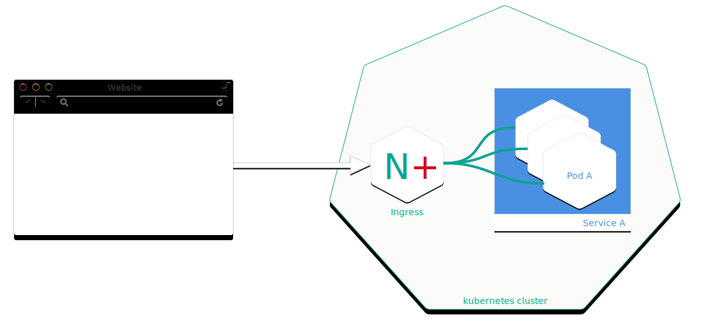

## Problem

**After updating your HTML and JS sources in your web application, 
the kubernetes cluster delivers outdated versions - why?**

## Preamble
By default, the Kubernetes service pods are not accessible over the external 
network, but only from other pods within the Kubernetes cluster. 

The Gardener cluster has a built-in configuration for HTTP load balancing called **Ingress**, 
the rules for external connectivity to Kubernetes services. Users who want external access 
to their Kubernetes services create an ingress resource that defines rules, 
including the URI path, backing service name, and other information. The Ingress controller 
can then automatically program a frontend load balancer to enable Ingress configuration.




## Example Ingress Configuration
```yaml
apiVersion: extensions/v1beta1
kind: Ingress
metadata:
  name: vuejs-ingress
spec:
  rules:
  - host: test.ingress.<GARDENER-CLUSTER>.<GARDENER-PROJECT>.shoot.canary.k8s-hana.ondemand.com
    http:
      paths:
      - backend:
          serviceName: vuejs-svc
          servicePort: 8080
```
where:
 - **&lt;GARDENER-CLUSTER&gt;**: The cluster name in the gardener
 - **&lt;GARDENER-PROJECT&gt;**: You project name in the gardener


## That's the crux of the matter.

The ingress controller we are using is **NGINX**.

> NGINX  is a software load balancer, web server, and **content cache** built on top of open 
source NGINX. NGINX Plus has exclusive production‑ready features on top of what's available 
in the open source offering, including session persistence, configuration via API, and active 
health checks. Use NGINX Plus instead of your hardware load balancer and get the freedom to 
innovate without being constrained by infrastructure.


**NGINX caches the content as specified in the HTTP header.** If the HTTP header is missing, 
it is assumed that the cache is **forever** and NGINX never updates the content in the 
stupidest case.

## Solution
In general you can avoid this pitfall with one of the solutions below:
 - use a cache buster + HTTP-Cache-Control(prefered)
 - use HTTP-Cache-Control with a lower timeframe
 - disable the caching in the ingress (just for dev purpose)
 
Please use your preferred search engine to get advice how to set the HTTP Header or setup a cache buster
for your web framework (e.g. Express/NodeJS, SpringBoot,...)

Below is an example how to disable the cache control for your ingress done with an annotation in your
 ingress YAML (just for dev purpose).
 
```yaml
---
apiVersion: extensions/v1beta1
kind: Ingress
metadata:
  annotations:
    ingress.kubernetes.io/cache-enable: "false"
  name: vuejs-ingress
spec:
  rules:
  - host: test.ingress.<GARDENER-CLUSTER>.<GARDENER-PROJECT>.shoot.canary.k8s-hana.ondemand.com
    http:
      paths:
      - backend:
          serviceName: vuejs-svc
          servicePort: 8080
```
