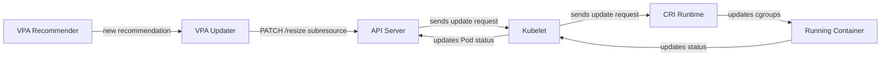

---
aliases:
  - /blog/2026/05/19/in-place-pod-resource-updates
authors:
  - avatar: 'https://avatars.githubusercontent.com/vitanovs'
    login: vitanovs
    name: Stoyan Vitanov
github_repo: 'https://github.com/gardener/documentation'
github_subdir: hugo/content/blog/2026/05
linkTitle: Adoption of In-Place Pod Resource Updates in Gardener
newsSubtitle: 'May 19, 2026'
params:
  github_branch: master
path_base_for_github_subdir:
  from: content/blog/2026/05/05-19-in-place-pod-resource-updates.md
  to: 05-19-in-place-pod-resource-updates.md
publishdate: '2026-05-19'
tags:
  - autoscaling
  - vpa
title: Adoption of In-Place Pod Resource Updates in Gardener
local: true
---

# Adoption of In-Place Pod Resource Updates in Gardener

As Kubernetes workloads evolve, the need for dynamic resource adjustments becomes increasingly critical. Traditional `Pod` resource updates require `Pod` recreation, leading to increased operational costs and potential service disruptions.
To address this shortcoming, Kubernetes introduced a new way of updating `Pod` resources *in-place*, without the need to *evict* workloads in order to apply the configuration change. With the [v1.27](https://kubernetes.io/releases/1.27/) release, a new `resize` subresource got introduced to the `Pod`'s API, acting as an interface to the underlying CRI implementations that manage the *cgroups* settings.

## What are the key benefits of *in-place* Pod resource updates?

Having the ability to bypass the rollout process when updating `Pod` resources drastically improves the scaling efficiency. Eliminating the overhead of `Pod` scheduling and application initialization is among the primary benefits of the new *update* mechanism. The following points summarize the key factors when considering using *in-place* updates:

- **Zero-downtime scaling**: Resources are adjusted without `Pod` recreation or service interruption
- **Reduced scheduling overhead**: No need to re-schedule `Pod`s across the cluster
- **Reduced initialization overhead**: Applications **do not** go through full initialization all over again
- **Preserved `Pod` identity**: `Pod` names, IPs, and volumes remain unchanged
- **Improved resource efficiency**: More granular and responsive resource optimization

To read more about the feature, refer to the official [documentation](https://kubernetes.io/blog/2025/12/19/kubernetes-v1-35-in-place-pod-resize-ga/).

## How does Gardener utilize the new *update* mechanism?

Gardener relies heavily on the [Vertical Pod Autoscaler](https://github.com/kubernetes/autoscaler) to advance the resource usage optimization and keep the *out-of-the-box* components running as efficiently as possible. With the [v1.4.0](https://github.com/kubernetes/autoscaler/releases/tag/vertical-pod-autoscaler-1.4.0) release, Vertical Pod Autoscaler introduced the ability to configure a new `.spec.updatePolicy.updateMode` for the `VerticalPodAutoscaler` resources:

```yaml
apiVersion: autoscaling.k8s.io/v1
kind: VerticalPodAutoscaler
metadata:
  name: demo-vpa
spec:
  targetRef:
    apiVersion: "apps/v1"
    kind:       Deployment
    name:       demo
  updatePolicy:
    updateMode: "InPlaceOrRecreate"
```

effectively performing *in-place* resource updates and *falling back* to *eviction* in case of failure. Adopting this release created the opportunity to leverage the new *update* mechanism, and with Gardener [v1.137](https://github.com/gardener/gardener/releases/tag/v1.137.0), a new automatic migration mechanism was introduced.

Historically, `VerticalPodAutoscaler` resources, created for the different Gardener components, were configured to use *update mode* `Auto` as it was the default option that mimics the behavior of `Recreate` - *evicting* `Pod`s to apply newly [calculated resource recommendations](https://github.com/kubernetes/autoscaler/blob/master/vertical-pod-autoscaler/docs/components.md#implementation-of-the-recommender). The subsequent Vertical Pod Autoscaler [v1.5.0](https://github.com/kubernetes/autoscaler/releases/tag/vertical-pod-autoscaler-1.5.0) release deprecated the `Auto` *update mode*, leaving only two viable options for continuous scaling: `Recreate` and `InPlaceOrRecreate`. The following graph illustrates the *flow* of `Pod` resource updates used in Gardener:



The *key* functionality behind this improved resource management is Linux [cgroups](https://www.man7.org/linux/man-pages/man7/cgroups.7.html), which are responsible for grouping processes and limiting the host resources they can utilize.

### How are `VerticalPodAutoscaler` resources configured?

Like any cluster-wide configuration change, migrating the `VerticalPodAutoscaler` resources' *update mode* presented a unique challenge that solved this by leveraging the [Gardener Resource Manager](/docs/gardener/concepts/resource-manager/) and its extensible architecture.

We developed a dedicated `MutatingWebhook` that automatically filters relevant `VerticalPodAutoscaler` resources and applies the *update mode* change, making the migration seamless. The webhook is deployed through the `VPAInPlaceUpdates` *feature gate*, available in both `gardenlet` and [Gardener Operator](/docs/gardener/concepts/operator/).
In case the feature gate gets disabled, there is also a *rollback* mechanism, present in both components. During the initialization of either the `gardenlet` or the Gardener operator, the *update mode* gets automatically reverted. These changes have been available since Gardener [v1.137](https://github.com/gardener/gardener/releases/tag/v1.137.0), making *in-place* update mode adoption fully operational and ready for production use.

For detailed information on [usage](/docs/gardener/autoscaling/in-place-resource-updates/) and [enablement](/docs/gardener/enabling-in-place-resource-updates/), refer to the official documentation.

## How does Gardener benefit from the *in-place* Pod resource updates adoption ?

Apart from the above-mentioned advantages of using *in-place* resource updates, adopting the mechanism allows mitigation of a few shortcomings that have the potential to cause
severe troubles.
Since Gardener offers the ability to configure *non-HA* `Shoot` clusters, their `etcd` data stores become vulnerable to restarts. Having a `VerticalPodAutoscaler` resource with an
*update mode* `Recreate`, referencing a *single-node* `etcd` store, causes a short control plane downtime each time the recommender decides to apply new resource values.
An identical situation can be witnessed in the Gardener *monitoring* and *logging* stacks, where [Prometheus](https://prometheus.io) and [Vali](https://github.com/credativ/vali) run as *single-instances*, facing the *single-node* `etcd` problem when *evicted*.

Another good example of a Kubernetes flaw that could have been resolved by using *in-place* resources *update mode* has to do with the `kube-scheduler` and its prior behavior of getting `Pod`s, with volumes, scheduled on `Node`s that have already reached their volume attachment limit. Documented in a dedicated Kubernetes [issue](https://github.com/kubernetes/kubernetes/issues/126921), this problem had appeared when the CSI `Node` plugin `Pod` gets restarted during *eviction*, exactly how VPA was configured to do at the time of reporting it.
During the gap between the deletion and the new `Pod` creation, the `CSINode` object temporarily has an empty drivers section. The `kube-scheduler`'s `NodeVolumeLimits` plugin treated this missing information as "no limit" and incorrectly scheduled volume-backed pods to fully-saturated `Node`s.

The impact of adopting *in-place* resource updates is best illustrated by the numbers: enabling the feature on the `Seed` clusters and the runtime cluster results in roughly 98% of the `Pod` resource updates being applied *in-place*, drastically reducing the amount of disruptive `Pod` recreations across the Gardener landscape. The exact ratio may vary from one Seed or runtime cluster to another, depending on its configuration.

## Monitoring

Performing configuration migrations can become an exhausting task without a convenient dashboard to evaluate the process state. For this reason, as part of the effort to support *in-place* Pod resource updates, we introduced a brand new *dashboard* for the `vpa-updater` component.


With sections covering `VerticalPodAutoscaler` resource overviews (segregated by *update mode*) and panels displaying success rates per resource, the new dashboard can be used for both monitoring and generating status reports on applied resource recommendations.

## References

- [In-Place Pod Resize (GA in v1.35)](https://kubernetes.io/blog/2025/12/19/kubernetes-v1-35-in-place-pod-resize-ga/)
- [Resize Container Resources](https://kubernetes.io/docs/tasks/configure-pod-container/resize-container-resources/)
- [Pod v1 API Reference - resize subresource](https://kubernetes.io/docs/reference/kubernetes-api/workload-resources/pod-v1/#operations-pod-v1-resize)
- [VPA v1.4.0 Release Notes](https://github.com/kubernetes/autoscaler/releases/tag/vertical-pod-autoscaler-1.4.0) (introduces *update mode* `InPlaceOrRecreate`)
- [VPA v1.5.0 Release Notes](https://github.com/kubernetes/autoscaler/releases/tag/vertical-pod-autoscaler-1.5.0) (deprecates *update mode*  `Auto`)
- [VPA In-Place Updates Documentation](https://github.com/kubernetes/autoscaler/blob/master/vertical-pod-autoscaler/docs/features.md#in-place-updates-inplaceorrecreate)
- [Gardener Usage: In-Place Resource Updates](/docs/gardener/autoscaling/in-place-resource-updates/)
- [Gardener Operations: Enabling In-Place Resource Updates](/docs/gardener/enabling-in-place-resource-updates/)
- [Gardener Resource Manager](/docs/gardener/concepts/resource-manager/)
- [Gardener v1.137](https://github.com/gardener/gardener/releases/tag/v1.137.0)
- [Linux cgroups v2](https://www.kernel.org/doc/html/latest/admin-guide/cgroup-v2.html)
- [CRI (Container Runtime Interface) Specification](https://github.com/kubernetes/cri-api)
