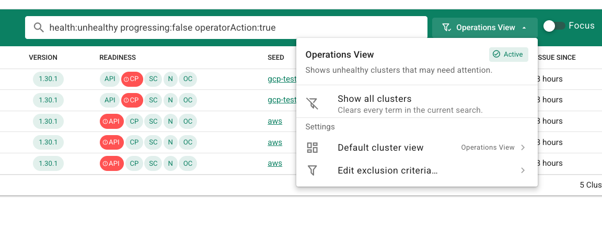
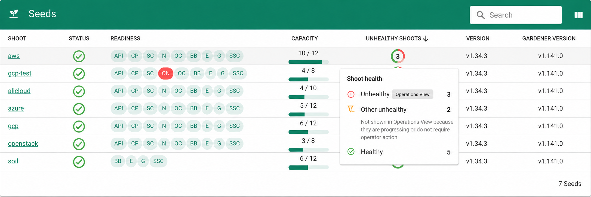

Gardener Dashboard 1.85.0 makes it easier to see which shoots may need operator attention. The All Projects list now makes its Operations View explicit, while the Seeds page gives a per-seed overview of shoot health and capacity. The release also improves visibility for landscape viewers and adds optional TLS support for the dashboard backend.

## Landscape Viewer Role Recognition

Non-admin users who can view shoots across all projects are now identified as *landscape viewers*. A badge on the avatar shows the role. Landscape viewers also see the control plane readiness chip, links to seeds, and seed readiness.

## Operations View in All Projects

The All Projects list already offered operations-oriented filtering. Dashboard 1.85 makes this an explicit product concept: **Operations View**, focused on shoots that may need operator attention. Healthy shoots are always excluded. In **Settings**, you can configure additional exclusions, for example progressing shoots or shoots that do not require operator action, and choose the default view. The menu lets you switch between Operations View and all clusters.

## Seed Health and Capacity at a Glance

On the **Seeds** page, the new indicators provide a structured, high-level overview. You can quickly see where issues are concentrated and how much capacity is available.

For each seed, the capacity indicator shows assigned shoots against allocatable capacity, including the remaining capacity when the seed reports it. The health donut mirrors Operations View by distinguishing unhealthy shoots that may need operator attention from other unhealthy shoots excluded by its criteria. It also shows healthy shoots. The figures update in real time.

Both indicators link to the relevant shoots, with the appropriate filters applied automatically.

## In-Cluster TLS Termination for the Dashboard Backend

The dashboard backend can now serve HTTPS, allowing the connection from the ingress gateway to the backend pod to be encrypted. In `gardener-operator`-managed deployments, TLS is configured automatically: the operator supplies the certificate and key and handles certificate rotation when the cluster CA changes.

For manual deployments, TLS is opt-in: configure both `tls.certFile` and `tls.privateKeyFile` in the dashboard configuration to enable HTTPS. Without them, the backend continues to serve HTTP.

## Field-Qualified Search

Shoot and seed list searches now accept field-qualified terms such as `seed:aws-ha` or `-region:eu`. These let you target a seed or exclude a region directly in the search field, alongside the visible Operations View filters.

## Links

- [Recording (dashboard segment)](https://youtu.be/IattXdELxSc?t=512)
- [Gardener Dashboard 1.85.0 release](https://github.com/gardener/dashboard/releases/tag/1.85.0)
