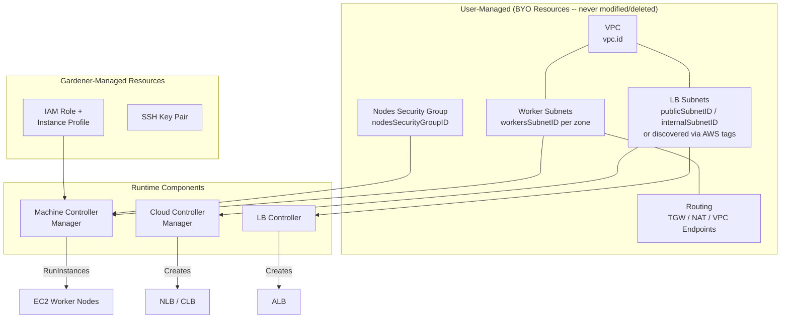
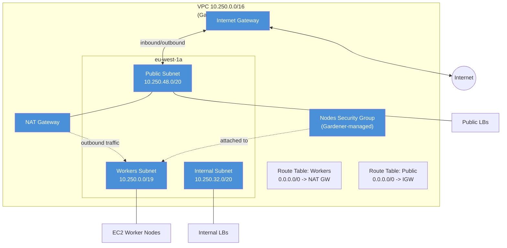
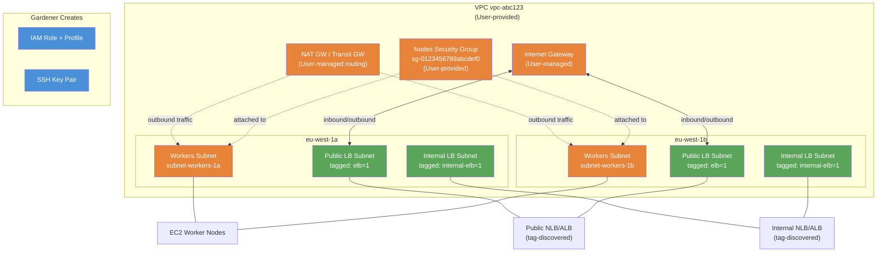
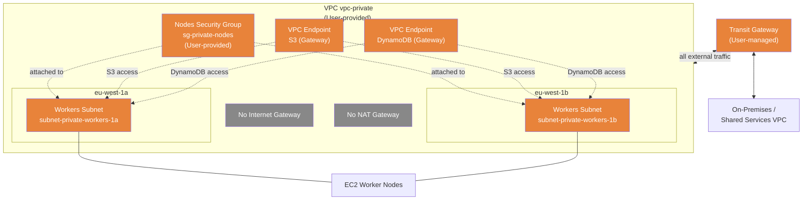
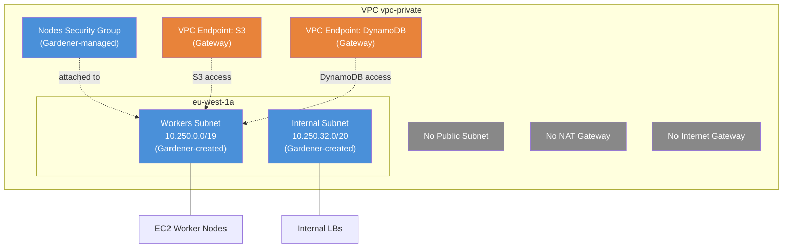
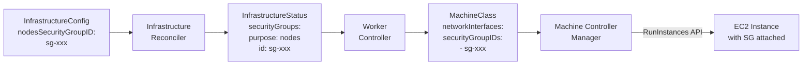
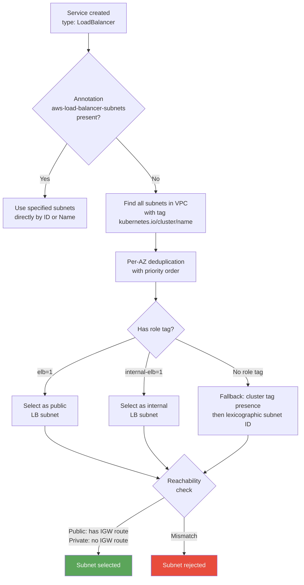
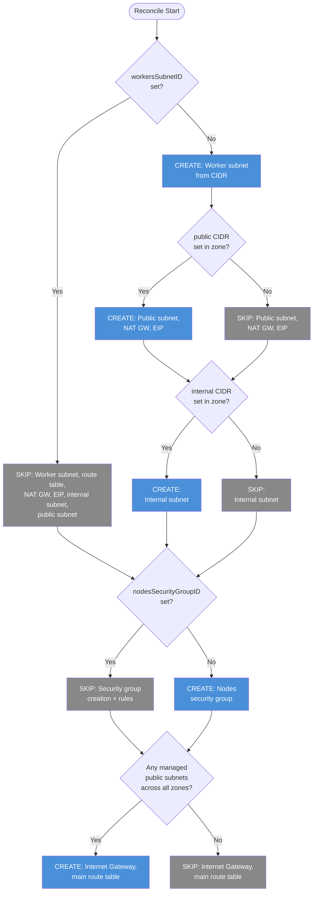

---
authors:
  - '@TBD'
creation-date: '2026-03-23'
github_repo: 'https://github.com/gardener/gardener-extension-provider-aws'
github_subdir: docs/proposals
params:
  github_branch: master
path_base_for_github_subdir:
  from: >-
    content/docs/extensions/infrastructure-extensions/gardener-extension-provider-aws/proposals/flexible-network-configuration.md
  to: flexible-network-configuration.md
reviewers:
  - '@TBD'
status: implementable
title: Flexible Network Configuration (BYOI)
prev: false
next: false
managed: true
---

# Flexible Network Configuration - Bring Your Own Infrastructure (BYOI)

## Table of Contents

- [Summary](#summary)
- [Motivation](#motivation)
  - [Goals](#goals)
  - [Non-Goals](#non-goals)
- [Proposal](#proposal)
  - [Resource Ownership Overview](#resource-ownership-overview)
  - [API Changes](#api-changes)
  - [Validation Rules](#validation-rules)
  - [Configuration Patterns](#configuration-patterns)
  - [Security Group Design](#security-group-design)
  - [Routing Requirements for BYO](#routing-requirements-for-byo)
  - [Load Balancer Subnet Discovery](#load-balancer-subnet-discovery)
  - [Implementation Approach](#implementation-approach)
- [Alternatives](#alternatives)
- [Open Questions](#open-questions)
- [FAQ](#faq)

## Summary

This proposal enables users to deploy Gardener-managed Kubernetes clusters into pre-provisioned AWS infrastructure. Users can bring their own:

1. **VPC** (already supported via `vpc.id`)
1. **Worker subnets** - existing subnets for EC2 node placement
1. **Security group** - existing nodes security group with corporate-compliant rules
1. **Routing** - Transit Gateway, centralized NAT, VPC endpoints, or any custom topology
1. **Load balancer subnets** - referenced by ID (Gardener auto-tags them) or discovered via standard AWS tags

The design principle is: **BYO resources are referenced, never created or deleted by Gardener.** Gardener adds AWS tags to BYO subnets for cluster association and LB discovery, and removes only the cluster-specific tags on teardown. Role tags (e.g., `kubernetes.io/role/elb`) are shared infrastructure and are never removed.

## Motivation

Enterprise organizations need to:

- **Reuse centrally-managed network infrastructure** (shared VPCs, hub-and-spoke topologies)
- **Comply with security policies** requiring pre-approved security groups and firewall rules
- **Deploy private clusters** using VPC endpoints or Transit Gateway (no Internet Gateway)
- **Optimize costs** through shared NAT gateways or centralized egress
- **Integrate with EKS-like architectures** where subnets, security groups, and routing are pre-provisioned by a platform team

Today, Gardener always creates subnets, security groups, NAT gateways, and route tables. This prevents integration with existing network infrastructure.

### Goals

- Allow users to reference pre-existing worker subnets instead of specifying CIDRs
- Allow users to provide their own nodes security group, replacing the Gardener-managed one entirely
- Support deployments without Internet Gateway or NAT gateways (Transit Gateway, VPC endpoints)
- Leverage standard AWS tag-based discovery for load balancer subnets (same as EKS)
- Zero breaking changes to existing clusters

### Non-Goals

- Allowing mixed BYO/Gardener-managed worker subnets across zones (all zones must be consistent)
- Allowing BYO worker subnets combined with Gardener-managed subnets in the same configuration (BYO mode means all subnets are user-managed)
- Managing or modifying any user-provided (BYO) resources beyond adding/removing AWS tags for cluster association and LB discovery
- Supporting IPv6-only BYO subnets in the initial release

## Proposal

### Resource Ownership Overview



### API Changes

#### Zone Structure

New optional fields allow referencing existing subnets:

```go
type Zone struct {
    Name string

    // Gardener-managed subnet CIDRs (mutually exclusive with WorkersSubnetID)
    Workers  *string  // +optional, mutually exclusive with WorkersSubnetID
    Internal *string  // +optional, forbidden when WorkersSubnetID is set
    Public   *string  // +optional, forbidden when WorkersSubnetID is set

    // BYO worker subnet
    WorkersSubnetID *string  // +optional, mutually exclusive with Workers

    // BYO load balancer subnets (only allowed when WorkersSubnetID is set)
    // Gardener auto-tags these with the cluster tag and the role tag on reconcile.
    // On delete, only the cluster tag is removed (the role tag is shared infrastructure).
    PublicSubnetID   *string  // +optional, BYO only
    InternalSubnetID *string  // +optional, BYO only

    // Only valid when Workers and Public CIDRs are set (Gardener-managed)
    ElasticIPAllocationID *string  // +optional
}
```

#### Networks Structure

One new optional field allows referencing an existing security group:

```go
type Networks struct {
    VPC   VPC
    Zones []Zone

    // NodesSecurityGroupID optionally specifies an existing security group for worker nodes.
    // When provided, Gardener will not create a nodes security group.
    // The security group must exist in the same VPC.
    // Requires VPC.ID to be set.
    // +optional
    NodesSecurityGroupID *string
}
```

> **Design note:** `NodesSecurityGroupID` is on `Networks` (not per-zone) because a single security group applies to all worker nodes across all availability zones. AWS security groups are VPC-scoped, not AZ-scoped. `WorkersSubnetID` is per-zone because subnets are AZ-specific.

### Validation Rules

| Field | Rule |
| --- | --- |
| `workers` / `workersSubnetID` | **Exactly one** must be provided per zone (XOR) |
| **Zone consistency** | **All zones must use the same approach**: either all `workersSubnetID` or all `workers` CIDR. Mixing is forbidden. |
| `internal` / `public` | **Forbidden** when `workersSubnetID` is set. In BYO mode, all subnets are user-managed; LB subnets are referenced by ID or tag-discovered. |
| `publicSubnetID` / `internalSubnetID` | **Only allowed** when `workersSubnetID` is set (BYO mode). Requires `VPC.ID`. Must exist in correct VPC/AZ. Immutable. No duplicates across zones. |
| `elasticIPAllocationID` | Only valid when both `workers` AND `public` CIDRs are set |
| `workersSubnetID` | Requires `VPC.ID` to be set. Must exist in correct VPC/AZ. Immutable. |
| `nodesSecurityGroupID` | Requires `VPC.ID` to be set. Must exist in correct VPC. Immutable. |
| `vpc.gatewayEndpoints` | **Forbidden** when `workersSubnetID` is set. Gateway endpoints require route table associations that Gardener cannot manage in BYO mode. |

Switching from CIDR-based to SubnetID-based workers (or vice versa) is **forbidden** on update. Adding a new zone to an existing cluster requires the new zone to use the same approach as existing zones (all BYO or all managed).

#### Why BYO Worker Subnets Require All Subnets to Be User-Managed

When `workersSubnetID` is used, specifying `internal` or `public` CIDRs is forbidden because:

- Gardener-managed internal/public subnets require an Internet Gateway and NAT gateway
- BYO worker subnets typically operate without an Internet Gateway (Transit Gateway, VPC endpoints)
- The conflicting infrastructure requirements would create an inconsistent network topology
- The BYO mode represents a clean contract: the user owns the network, Gardener owns the compute

### Configuration Patterns

#### Pattern 1: Traditional Gardener (Unchanged)

Gardener creates and manages all network infrastructure.



> All resources in blue are Gardener-managed.

```yaml
networks:
  vpc:
    cidr: 10.250.0.0/16
  zones:
    - name: eu-west-1a
      workers: 10.250.0.0/19
      internal: 10.250.32.0/20
      public: 10.250.48.0/20
```

---

#### Pattern 2: Complete BYO Infrastructure

User provides VPC, worker subnets, and security group. Gardener does not create any network resources. LB subnets are discovered via tags.



> Orange = User-provided (BYO) | Blue = Gardener-managed | Green = Tag-discovered by CCM/LBC

```yaml
networks:
  vpc:
    id: vpc-abc123
  nodesSecurityGroupID: sg-0123456789abcdef0
  zones:
    - name: eu-west-1a
      workersSubnetID: subnet-workers-1a
      publicSubnetID: subnet-public-1a       # auto-tagged by Gardener
      internalSubnetID: subnet-internal-1a   # auto-tagged by Gardener
    - name: eu-west-1b
      workersSubnetID: subnet-workers-1b
      publicSubnetID: subnet-public-1b
      internalSubnetID: subnet-internal-1b
```

**What Gardener creates:** IAM role, instance profile, SSH key pair only.

**User responsibilities:**
- Worker subnet routing (NAT/Transit Gateway/VPC endpoints for connectivity)
- Security group with appropriate rules (see [Security Group Requirements](#security-group-requirements))
- LB subnets: provide `publicSubnetID`/`internalSubnetID` per zone (recommended — Gardener auto-tags them), or pre-tag subnets manually with `kubernetes.io/role/internal-elb=1`, `kubernetes.io/role/elb=1`, and `kubernetes.io/cluster/<name>=shared`
- Minimum 8 available IPs per LB subnet; at least 2 AZs for ALBs

---

#### Pattern 3: Private Cluster (No IGW, Transit Gateway)

Fully private cluster with no Internet Gateway. All connectivity via Transit Gateway and VPC endpoints.



> Gray = Not present / disabled

```yaml
networks:
  vpc:
    id: vpc-private
    gatewayEndpoints:
      - s3
      - dynamodb
  nodesSecurityGroupID: sg-private-nodes
  zones:
    - name: eu-west-1a
      workersSubnetID: subnet-private-workers-1a
    - name: eu-west-1b
      workersSubnetID: subnet-private-workers-1b
```

No Internet Gateway required. Connectivity via Transit Gateway + VPC endpoints.

---

#### Pattern 4: Gardener Workers, No Public Subnet (VPC Endpoints Only)

Gardener creates worker and internal subnets, but no public subnet -- connectivity via VPC endpoints only. Since Gardener manages the subnets, it also manages the security group.



```yaml
networks:
  vpc:
    id: vpc-private
    gatewayEndpoints:
      - s3
      - dynamodb
  zones:
    - name: eu-west-1a
      workers: 10.250.0.0/19
      internal: 10.250.32.0/20
      # No public subnet -- no NAT gateway
```

---

### Security Group Design

#### Preferred: Full Replacement Model (User-provided SG replaces Gardener's)

When bringing your own infrastructure, the user provides a single security group ID via `nodesSecurityGroupID` that **replaces** Gardener's nodes SG entirely. Gardener does not create or manage any security group rules.

**Why this is the preferred approach:**

1. **Chicken-and-egg problem**: The security group ID must be known at MachineClass creation time, before any EC2 instances exist. You can't discover a SG from instances that don't exist yet.

1. **MCM is the sole consumer**: The security group flows from `InfrastructureStatus` -> Worker controller -> `MachineClass.providerSpec.networkInterfaces[].securityGroupIDs` -> MCM -> `RunInstances` API. It is attached to the EC2 instance's primary network interface at launch.

1. **The CCM does NOT manage SG rules**: Gardener configures `DisableSecurityGroupIngress=true` in the CCM's cloud-provider-config. This disables the CCM's `updateInstanceSecurityGroupForNLBTraffic` and `updateInstanceSecurityGroupsForLoadBalancer` functions, which would otherwise dynamically add per-Service ingress rules (client traffic, health checks, MTU discovery) to worker instance security groups at runtime. With this flag enabled, **neither Gardener nor the CCM will ever modify security group rules after initial creation** — the user's BYO security group must already contain all required rules, including NodePort ingress for NLB traffic and health checks.

1. **No standard tag convention exists**: Unlike subnets (which have well-defined `kubernetes.io/role/*` tags), there is no standard tag for "this is the nodes security group." EKS also requires explicit SG specification for node groups.

1. **Complete control for enterprises**: Corporate policy often mandates that all security groups are pre-approved by a security team. The replacement model allows users to restrict egress, tighten NodePort rules, or apply any custom rules without being constrained by Gardener's defaults.

##### Security Group Data Flow



##### Security Group Requirements

When providing `nodesSecurityGroupID`, the security group **must** include at minimum:

| Direction | Protocol | Ports | Source/Dest | Purpose |
| --- | --- | --- | --- | --- |
| Ingress | All | All | Self (same SG) | Pod-to-pod, node-to-node |
| Ingress | TCP | 30000-32767 | 0.0.0.0/0 or LB subnet CIDRs | NodePort services (NLB client traffic + health checks) |
| Ingress | UDP | 30000-32767 | 0.0.0.0/0 or LB subnet CIDRs | NodePort services (NLB client traffic) |
| Egress | All | All | 0.0.0.0/0 | Outbound connectivity |

Additional rules for EFS (TCP 2049 from worker subnet CIDRs) if using the CSI EFS driver.

> **NodePort note:** Because `DisableSecurityGroupIngress=true` is set, the CCM will **not** dynamically add per-NLB ingress rules (client traffic, health checks, ICMP MTU discovery) to the instance security group at runtime — unlike the default upstream behavior where the CCM's `updateInstanceSecurityGroupForNLBTraffic` function manages these rules automatically. The user must pre-provision NodePort ingress rules. Using `0.0.0.0/0` is the simplest option; for tighter security, use the CIDR ranges of the subnets where NLBs are placed (NLB health checks originate from the NLB's subnet IPs).

> **Egress note:** The `0.0.0.0/0` egress rule is the simplest configuration. For private clusters with strict egress policies, the minimum required destinations are: the Kubernetes API server endpoint, container registries (for image pulls), and AWS APIs (EC2, ELB, STS, S3). These can be reached via VPC endpoints or specific CIDR allowlists instead of a blanket egress rule.

**Risks the user must be aware of:**
- Missing self-referencing ingress rule -> broken pod-to-pod communication
- Missing NodePort range -> broken Services
- Missing egress rule -> nodes can't reach the API server or pull container images
- Gardener cannot recover from these misconfigurations automatically

> **Future work:** A health check that verifies the BYO security group contains the minimum required rules could be added as a condition on the Infrastructure resource, providing early feedback to operators without blocking reconciliation.

#### Alternative: Additive Model (Gardener base SG + user additional SGs)

In this model, Gardener **always** creates and manages a nodes security group with a minimal, known-good rule set. Users can **optionally** provide one or more additional security groups that are attached alongside Gardener's SG on the EC2 instance's primary network interface. AWS evaluates rules across all attached SGs as a union (most permissive wins).

**Gardener's base SG rules (always present in additive model):**

| Direction | Protocol | Ports | IPv4 Source/Dest | IPv6 Source/Dest | Purpose |
| --- | --- | --- | --- | --- | --- |
| Ingress | All | All | Self (same SG) | Self (same SG) | Pod-to-pod, node-to-node |
| Ingress | TCP | 30000-32767 | 0.0.0.0/0 | ::/0 | NodePort services |
| Ingress | UDP | 30000-32767 | 0.0.0.0/0 | ::/0 | NodePort services |
| Egress | All | All | 0.0.0.0/0 | ::/0 | All outbound |

The user's additional SG(s) would contain corporate/compliance rules: cross-VPC peering, custom ingress from corporate networks, compliance-mandated ports.

**Advantages of additive model:**
- **No broken clusters**: User cannot accidentally break pod-to-pod communication -- Gardener's base SG always has the self-referencing rule
- **Separation of concerns**: Gardener owns what it needs; users own what they need
- **Standard AWS pattern**: EKS managed node groups work the same way (cluster SG + additional SGs)

**Why additive is not the preferred approach:**
- Users **cannot** make rules more restrictive than Gardener's base set (AWS SG rules are unioned, most permissive wins)
- The base SG allows all egress and NodePort from `0.0.0.0/0` -- an additional SG can only add more permissions, not remove existing ones
- Corporate policies that mandate pre-approved-only security groups would still have Gardener creating an SG

> The additive model may be reconsidered as a complementary option in the future. The API field would be `AdditionalNodesSecurityGroupIDs []string`.

### Routing Requirements for BYO

In BYO mode, Gardener does **not** create any route tables, NAT gateways, or Internet Gateways. The user is fully responsible for all routing. Each BYO worker subnet must be associated with a route table that provides the connectivity required by a functioning Kubernetes cluster.

Routing is **not validated** by Gardener — every subnet in AWS is implicitly associated with the VPC's main route table if no explicit association exists, so there is always a route table. However, users must ensure the route table has the correct routes for their connectivity model. If routing is misconfigured, nodes will fail to join the cluster.

#### Connectivity Requirements

Worker nodes must be able to reach:

| Destination | Purpose | Typical Route |
| --- | --- | --- |
| Kubernetes API server (shoot control plane) | kubelet registration, API calls | Via NAT GW, TGW, or VPC peering to seed |
| Container registries | Image pulls | Via NAT GW, TGW, or VPC endpoints |
| AWS EC2/ELB/STS APIs | Cloud provider operations | Via NAT GW, TGW, or VPC endpoints |
| Other worker nodes (same VPC) | Pod-to-pod, node-to-node | VPC local route (automatic) |
| S3 / DynamoDB (if using ETCD backup, loki) | Backup and logging | Via gateway VPC endpoints (recommended) |

#### Connectivity Models

| Model | Default Route | When to Use |
| --- | --- | --- |
| **Centralized NAT Gateway** | `0.0.0.0/0` -> NAT GW (shared or per-AZ) | Standard outbound internet access via user-managed NAT |
| **Transit Gateway** | `0.0.0.0/0` -> TGW, or specific CIDRs -> TGW | Hub-and-spoke, on-premises connectivity, shared services |
| **VPC Endpoints only** | No default route; AWS service traffic stays in VPC | Fully private clusters, no internet access |
| **Direct Internet** | `0.0.0.0/0` -> IGW (subnet must be public) | Public-facing worker nodes (uncommon) |

#### The `aws-custom-route-controller` and Pod CIDR Routing

When network overlay is disabled (no VXLAN/Geneve encapsulation), Gardener deploys the [`aws-custom-route-controller`](https://github.com/gardener/aws-custom-route-controller) to manage **pod CIDR routes** in AWS VPC route tables. This controller:

1. Watches Kubernetes Node objects for `.spec.podCIDR` assignments
1. Creates AWS VPC routes in all discovered route tables: destination = node's podCIDR, target = node's ENI
1. Discovers route tables via the tag `kubernetes.io/cluster/<cluster-name>`

**In BYO mode**, the custom route controller will still be enabled when overlay is disabled. Since Gardener does not create route tables in BYO mode, the controller discovers them via tags. Users must ensure:

- The route table(s) associated with worker subnets are tagged with `kubernetes.io/cluster/<cluster-name>=shared`
- The AWS VPC route table limit (500 routes by default, expandable to 1000) is sufficient for the number of nodes

If overlay networking **is** enabled (default), the custom route controller is disabled and no route table tagging is needed for pod CIDR routing.

> **Note**: The CCM's built-in route controller is always disabled in Gardener (`--configure-cloud-routes=false`). Pod CIDR routing is exclusively handled by the `aws-custom-route-controller` when needed.

#### Route Table Requirements Summary

| Requirement | When |
| --- | --- |
| Worker subnets must have a route table with outbound connectivity | Always (user responsibility, not validated) |
| Route table tagged with `kubernetes.io/cluster/<name>=shared` | Only when overlay is disabled (custom route controller needs it) |
| Route table has capacity for pod CIDR routes (500 default, expandable to 1000) | Only when overlay is disabled |

### Load Balancer Subnet Discovery

#### Two Modes: Explicit IDs or Tag-Based Discovery

Load balancer subnets can be configured in two ways in BYO mode:

1. **Explicit IDs** (recommended): Provide `publicSubnetID` and/or `internalSubnetID` per zone. Gardener auto-tags these subnets with the cluster tag (`kubernetes.io/cluster/<name>=shared`) and the role tag (`kubernetes.io/role/elb=1` or `kubernetes.io/role/internal-elb=1`). On delete, only the cluster tag is removed — the role tag is shared infrastructure. After tagging, Gardener validates that the CCM would discover the same subnets (no ambiguity from other tagged subnets in the same AZ).

1. **Tag-based discovery** (fallback): If no explicit IDs are provided, subnets are discovered at runtime via standard AWS tags. The user must pre-tag subnets with both the cluster tag and the role tag. This is the same pattern as EKS.

#### Why explicit IDs are recommended

- **No manual tagging required**: Gardener handles both the cluster tag and the role tag.
- **Prevents CCM ambiguity**: If multiple subnets in the same AZ have the cluster tag + role tag, the CCM picks one by lexicographic subnet ID order. With explicit IDs, Gardener validates that the CCM would pick the intended subnet.
- **Ambiguity detection**: During reconciliation, Gardener discovers all tagged subnets and **errors if multiple subnets in the same AZ match** the same role tag + cluster tag. This prevents silent misrouting regardless of whether explicit IDs are used.
- **Clean lifecycle**: Cluster tags are added on reconcile and removed on delete. Role tags persist across cluster lifecycles (shared infrastructure).

#### Underlying Discovery Mechanism

The CCM and LBC still discover subnets via tags at runtime — the explicit IDs only control which subnets Gardener tags. Users can also override per-Service via the `service.beta.kubernetes.io/aws-load-balancer-subnets` annotation.

#### Discovery Flow

The CCM and LBC discover subnets automatically using the following process (verified from cloud-provider-aws source):

1. **Annotation override**: If `service.beta.kubernetes.io/aws-load-balancer-subnets` is set on the Service, those subnets are used directly (by ID or Name tag)
1. **Tag-based discovery**: Find all subnets in the VPC with cluster tag `kubernetes.io/cluster/<name>`
1. **Per-AZ deduplication** with priority:
   - Role tag: `kubernetes.io/role/elb=1` (public) or `kubernetes.io/role/internal-elb=1` (internal)
   - Cluster tag presence
   - Lexicographic subnet ID order
1. **Reachability check**: Public LB subnets must have an IGW route; private subnets must not



#### Required Tags on User-Provided LB Subnets

**Internal Load Balancers:**
```
kubernetes.io/role/internal-elb = 1
kubernetes.io/cluster/<cluster-name> = shared
```

**Public Load Balancers:**
```
kubernetes.io/role/elb = 1
kubernetes.io/cluster/<cluster-name> = shared
```

#### Requirements

- ALBs: at least 2 subnets across different AZs
- NLBs: can use a single subnet
- Each LB subnet: minimum 8 available IP addresses
- Public subnets: must have route to Internet Gateway
- Private subnets: must NOT have route to Internet Gateway

### Implementation Approach

#### Reconcile Flow Changes

| Condition | Skip |
| --- | --- |
| `workersSubnetID` set | Worker subnet creation, route table, NAT gateway, elastic IP, internal subnet, public subnet. BYO worker/public/internal subnets are tagged with the cluster tag. `publicSubnetID`/`internalSubnetID` are additionally tagged with role tags. |
| No `public` CIDR in zone | Public subnet, NAT gateway, elastic IP for that zone |
| No `internal` CIDR in zone | Internal subnet for that zone |
| `nodesSecurityGroupID` set | Nodes security group creation and rule management |
| No Gardener-managed public subnets anywhere | Main route table, Internet Gateway requirement |



#### Delete Flow

BYO resources are **never deleted**:
- Worker subnets referenced by `workersSubnetID` are not deleted
- Security groups referenced by `nodesSecurityGroupID` are not deleted
- VPC referenced by `VPC.ID` is already not deleted (existing behavior)

Cluster tags (`kubernetes.io/cluster/<name>=shared`) added to BYO subnets (workers, public, internal) during reconciliation **are removed** on teardown to prevent stale tags from accumulating across cluster lifecycles. Role tags (`kubernetes.io/role/elb`, `kubernetes.io/role/internal-elb`) are **never removed** — they are shared infrastructure that may be used by other clusters.

#### VPC Gateway Endpoints in BYO Mode

VPC gateway endpoints configured via `vpc.gatewayEndpoints` (e.g., S3, DynamoDB) are **skipped** in BYO mode. Gateway endpoints are VPC-level resources that require route table associations to function -- without associations, AWS does not add the prefix list routes that direct traffic through the endpoint. Since Gardener does not create or manage route tables in BYO mode, it cannot associate endpoints with the user's route tables, making any created endpoint non-functional.

Users who need VPC gateway endpoints in BYO mode must create and manage them independently, including associating them with their own route tables.

#### Bastion Hosts

The current bastion controller creates a bastion EC2 instance in a **Gardener-managed public subnet** (`<cluster>-public-utility-z0`). In BYO mode where no public subnets are created by Gardener, bastion creation will fail. Users needing SSH access to worker nodes in BYO mode should use [AWS Systems Manager Session Manager](https://docs.aws.amazon.com/systems-manager/latest/userguide/session-manager.html) or a bastion host in a user-managed public subnet.

> **Future work:** The bastion controller should be updated to support BYO mode, potentially by using a worker subnet with a public IP or by integrating with SSM. See [#109](https://github.com/gardener/gardener-extension-provider-aws/issues/109).

#### EFS (Elastic File System) in BYO Mode

When `elasticFileSystem.enabled` is set in BYO mode, Gardener's behavior differs from the managed case:

| Aspect | Managed Mode | BYO Mode |
| --- | --- | --- |
| File system creation | Gardener creates (encrypted, tagged) or user provides `elasticFileSystem.id` | User **must** provide `elasticFileSystem.id` (validated) |
| Mount target creation | Gardener creates one per zone in workers subnet | **Skipped** — user manages mount targets |
| Mount target discovery | N/A | Gardener discovers existing mount targets via `DescribeMountTargets` for state observability |
| SG NFS rule (TCP 2049) | Added to nodes SG using `zone.Internal` CIDR | Skipped (no internal CIDR in BYO). Not needed — the self-referencing rule covers intra-SG NFS traffic. |
| CSI driver config | `fileSystemID` from `InfrastructureStatus` | Same — only `fileSystemID` is needed |
| IAM permissions | EFS API permissions on node role | Same |

**Why mount targets are not created in BYO mode:**

1. **Only one mount target per AZ is allowed.** The user may already have mount targets in their subnets. Creating a duplicate would fail.
1. **Follows the BYO principle:** BYO resources are referenced, never created. Mount targets are infrastructure the user owns.
1. **The CSI driver doesn't need them from Gardener:** The EFS CSI driver discovers mount targets at runtime via the `elasticfilesystem:DescribeMountTargets` IAM permission. Only the `fileSystemID` (passed via the `StorageClass`) is needed for provisioning.

**EFS is bound to exactly one VPC.** The user-provided EFS must be in the same VPC referenced by `vpc.id`. Mount targets must exist in the same VPC. Changing the VPC requires deleting and recreating all mount targets.

**Validation:** When `workersSubnetID` is set and `elasticFileSystem.enabled` is true, `elasticFileSystem.id` is required. Gardener will not create a file system in BYO mode.

**Security group:** NFS traffic (TCP 2049) between worker nodes and mount targets is covered by the self-referencing SG rule (`Self: true, Protocol: -1`), provided both the nodes and the mount target ENI are members of the same security group. When using a BYO SG, the user must ensure the self-referencing ingress rule is present (already a documented requirement).

#### InfrastructureStatus

- `VPC.Subnets[purpose=nodes]`: reports BYO worker subnet ID (from `workersSubnetID`) or Gardener-created one
- `VPC.Subnets[purpose=public]`: reports explicit `publicSubnetID`, tag-discovered public LB subnet, or Gardener-created one
- `VPC.Subnets[purpose=internal]`: reports explicit `internalSubnetID`, tag-discovered internal LB subnet, or Gardener-created one
- `VPC.SecurityGroups[purpose=nodes]`: reports BYO security group ID or Gardener-created one
- `ElasticFileSystem.ID`: reports user-provided or Gardener-created EFS file system ID (when enabled)
- CCM config: uses workers subnet as `SubnetID` fallback when no public subnet exists

## Alternatives

### Additive Security Group Model Instead of Full Replacement

Instead of the full replacement model (`NodesSecurityGroupID`), we could keep Gardener's base SG and let users attach additional SGs via `AdditionalNodesSecurityGroupIDs []string`. This was not chosen because:

- Users cannot make rules more restrictive than Gardener's base set (AWS SG rules are unioned)
- Corporate policies that mandate pre-approved-only SGs would still have Gardener creating one
- The full replacement model gives users complete control, which is what enterprise BYO scenarios require

The additive model remains a valid future addition for users who want a safety net.

### Mixed BYO/Managed Subnets per Zone

Allowing `workersSubnetID` with `internal`/`public` CIDRs in the same configuration was rejected because:

- Creates conflicting infrastructure requirements (BYO routing vs Gardener-managed IGW/NAT)
- The BYO mode is designed as a clean boundary: user owns all network resources, Gardener owns compute
- Mixing ownership models increases complexity and creates an inconsistent network topology

## FAQ

### If I use BYO worker subnets, can I still have Gardener create internal or public subnets?

No. When `workersSubnetID` is used, **all subnets must be user-managed**. Specifying `internal` or `public` CIDRs alongside `workersSubnetID` is forbidden by validation. LB subnets are discovered via standard AWS tags.

### Can I add a BYO zone to an existing cluster that uses Gardener-managed subnets?

No. All zones must use the same approach. Adding a new zone with `workersSubnetID` to a cluster that uses `workers` CIDRs is forbidden by validation, and vice versa.

### What about IPv6 support with BYO subnets?

If `workersSubnetID` is provided, the extension will discover the IPv6 CIDR block from the subnet/VPC via the AWS API. The BYO subnet must have an IPv6 CIDR block when DualStack is enabled.

### What happens if LB subnets are not tagged?

If no `publicSubnetID`/`internalSubnetID` are provided and no subnets are pre-tagged, the CCM/LBC will not find subnets for load balancers. NLB/CLB Services will fail to provision. The CCM service controller may be disabled entirely if no tagged subnets are discovered during infrastructure reconciliation. Using explicit IDs is recommended — Gardener handles all tagging automatically.

### Does `nodesSecurityGroupID` replace Gardener's SG or add to it?

It replaces it entirely. When `nodesSecurityGroupID` is set, Gardener does **not** create a nodes security group. The user-provided SG is the only one attached to EC2 instances. The user is responsible for including all required rules (see [Security Group Requirements](#security-group-requirements)).

### Do I need to tag my route tables in BYO mode?

Only if network overlay is disabled. When overlay is disabled, the `aws-custom-route-controller` manages pod CIDR routes and discovers route tables via the `kubernetes.io/cluster/<cluster-name>=shared` tag. If overlay is enabled (default), no route table tagging is needed.

### Can I use bastion hosts in BYO mode?

Not with the current bastion controller. It requires a Gardener-managed public subnet which does not exist in BYO mode. Use AWS Systems Manager Session Manager or a bastion in a user-managed public subnet instead.

### Are VPC gateway endpoints managed by Gardener in BYO mode?

No. The `gatewayEndpoints` field in the VPC configuration is ignored in BYO mode. VPC gateway endpoints require route table associations to function, and since Gardener does not manage route tables in BYO mode, it cannot make endpoints functional. Users must create and manage their own VPC endpoints, including associating them with their route tables.

### Can I use EFS (Elastic File System) in BYO mode?

Yes, with constraints. Set `elasticFileSystem.enabled: true` and provide `elasticFileSystem.id` with the ID of an existing EFS file system in the same VPC. Gardener will **not** create a file system or mount targets — the user is responsible for both. The EFS CSI driver only needs the file system ID (passed via a `StorageClass`); it discovers mount targets at runtime via the AWS API. See [EFS in BYO Mode](#efs-elastic-file-system-in-byo-mode) for details.

## Open Questions

### BYO Security Group with Gardener-Managed Subnets

Currently, `nodesSecurityGroupID` only requires `VPC.ID` — it does not require `workersSubnetID`. This means a user can provide a BYO security group while letting Gardener manage all subnets (workers, internal, public). Gardener would skip SG creation but still create all network resources.

This is a valid use case: the user wants to control firewall rules (corporate compliance) while letting Gardener manage the network topology. However, the interaction with Gardener's SG rule construction (which uses `zone.Internal` CIDRs for EFS NFS rules) needs review. If we support this hybrid scenario long-term, it should be explicitly tested and documented.

### TCP 2049 NFS Rule Redundancy

The CIDR-based NFS ingress rule (TCP 2049) on the nodes SG uses `zone.Internal` as the source CIDR. However:
- Mount targets are placed in the **workers** subnet
- Worker nodes are also in the **workers** subnet
- Both the mount target ENI and the worker ENI are members of the **same** security group
- The self-referencing rule (`Self: true, Protocol: -1`) already allows **all** traffic between SG members

The CIDR-based NFS rule is therefore redundant in all cases where the mount target and nodes share a SG. It should be reviewed and potentially removed. This also exists on `origin/master` — it is not a regression from this PR.

### EFS in BYO Mode

EFS is supported in BYO mode with constraints — see [EFS in BYO Mode](#efs-elastic-file-system-in-byo-mode) in the proposal for full details. Remaining open question: should the mount target discovery populate the `InfrastructureStatus` with mount target details (beyond `fileSystemID`), or is the current `fileSystemID`-only approach sufficient for all consumers?

## Success Criteria

- Users can deploy clusters with pre-provisioned VPC + worker subnets + security group
- Users can deploy clusters without Internet Gateway or NAT gateways
- LB subnets are referenced by explicit IDs (auto-tagged) or discovered via standard AWS tags
- Ambiguous LB subnet configurations (multiple tagged subnets per AZ) are detected and rejected
- Zero breaking changes to existing clusters
- BYO resources are never modified or deleted by Gardener
