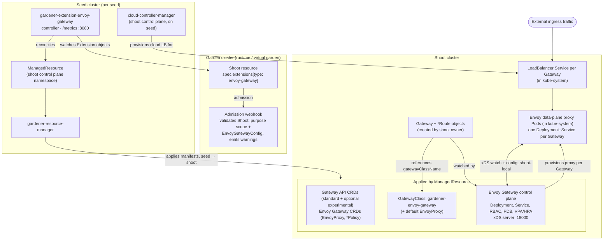
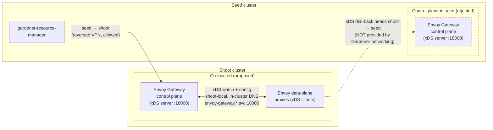

<!-- BANNER:MANAGED -->
<!--
   █▀▀ ▀█▀ █▀█ █▀█
   ▀▀█  █  █ █ █▀▀
   ▀▀▀  ▀  ▀▀▀ ▀

   ┌────────────────────────────────────────────────┐
   │  MANAGED FILE — aggregated from upstream       │
   │                                                │
   │  Editing here is pointless: The nightly        │
   │  aggregation run overwrites this file.         │
   │                                                │
   │  Open a PR against the source instead: ─────┐  │
   │                          ┌──┐    ┌──────────┘  │
   │                          └──│────┘             │
   │           ┌─────────────────┘                  │
   └───────────│────────────────────────────────────┘
               ▼               
   https://github.com/gardener/enhancements/blob/main/geps/0068-gateway-api-extension/README.md
-->


# GEP-68: Gateway API Extension for Gardener Shoot Clusters

## Summary

The Kubernetes ecosystem is converging on the [Gateway API](https://gateway-api.sigs.k8s.io/)
as the next generation implementation of the `Ingress` resource. [Gateway API graduated to GA
with v1.0 in October 2023](https://kubernetes.io/blog/2023/10/31/gateway-api-ga/) and has since received broad implementation support
across the CNCF landscape. With [GEP-57](/docs/proposals/0057-replace-nginx-ingress-shoot-addon-with-traefik-extension/)
already establishing a Traefik-based replacement for the retired Ingress NGINX
shoot addon, Gardener users now need a dedicated, first-class option for
Gateway API workloads in their shoot clusters.

After a detailed evaluation of several known open-source Gateway API
implementations — Envoy Gateway, Traefik, Istio, Kgateway, Cilium, Kong, and
NGINX Gateway Fabric — informed by the upstream conformance benchmark
[gateway-api-bench](https://github.com/howardjohn/gateway-api-bench), this GEP
recommends **[Envoy Gateway](https://gateway.envoyproxy.io/)** as the
implementation shipped to Gardener shoot clusters, with **[Traefik Gateway
API](https://doc.traefik.io/traefik/routing/providers/kubernetes-gateway/)**
documented as the runner-up.

The extension follows the standard Gardener extension contract (controller
registration, `ManagedResource`-based deployment, admission webhooks) and is
deliberately scoped narrowly: it manages (installs and updates) the Gateway
API CRDs in the shoot, deploys the Envoy Gateway control plane and the Envoy
data-plane proxies, and installs a `GatewayClass` named `gardener-envoy-gateway`
that shoot owners can reference from their `Gateway` and `*Route` objects.

In line with the Gardener
[component checklist](/contribute/gardener/component-checklist/),
the extension does **not** render the upstream Envoy Gateway Helm chart to
deploy the shoot-cluster workload; all shoot resources are authored as Go
types and delivered through a `ManagedResource`. Only the CRDs and the
`GatewayClass`/`EnvoyProxy` objects are carried as embedded (`go:embed`) raw
YAML. The details, and the reason for the CRD exception, are in
[Notes/Constraints/Caveats](#notesconstraintscaveats).

## Motivation

Gardener's current ingress story is anchored on the proven `Ingress` resource
and — going forward — on the Traefik-based `Ingress` controller implementation defined in GEP-57.
Both options serve the same purpose: a single resource type for HTTP host/path
routing. The shortcomings of `Ingress` are well known:

* The Kubernetes `Ingress` API has been frozen since 2020. New routing features
  (header rewrites, traffic splitting, mirroring, multi-protocol routing,
  cross-namespace references) cannot be expressed without controller-specific
  annotations, which destroy portability.
* No native L4 (TCP/TLS-passthrough) or gRPC routing.
* No clear separation of concerns between platform admins (who provision
  load balancers) and application teams (who attach routes).

Gateway API was designed by SIG-Network specifically to fix these issues. It
introduces a role-oriented set of resources:

* `GatewayClass` — declared by the infrastructure provider (analogous to
  `StorageClass`).
* `Gateway` — provisioned by the platform/cluster admin; describes the L4/L7
  listener (port, protocol, TLS, allowed namespaces).
* `HTTPRoute`, `GRPCRoute`, `TLSRoute`, `TCPRoute`, `UDPRoute` — owned by
  application teams; attach to a `Gateway` and describe routing rules.
* `ReferenceGrant` — explicit cross-namespace authorisation for backend
  references.

Key problems this GEP addresses:

* **Ecosystem convergence**: Most major service-mesh and ingress vendors
  (Istio, Cilium, Envoy Gateway, Traefik, Kong, NGINX, Kgateway, HAProxy)
  now implement Gateway API. Gardener users who do not have a supported
  Gateway API option in their shoots either roll their own (creating a
  fragmented, unsupported landscape) or stay on `Ingress` and accept its
  limitations.

* **Choice and forward compatibility**: `Ingress` remains a fully supported
  API and is not going away. However, some cluster owners will want to
  adopt Gateway API for its richer feature set. Providing a first-class
  extension gives shoot owners the freedom to choose — they can stay on
  `Ingress`, move to Gateway API, or run both side by side. For those who
  do decide to migrate, the transition can happen incrementally and
  per-shoot rather than as a big-bang break.

* **Optional role separation**: Some Gardener shoots are shared by multiple
  teams where platform admins and application developers have distinct
  responsibilities. Gateway API's persona-based resource model
  (`GatewayClass` → `Gateway` → `*Route`) enables a separation of concerns
  that `Ingress` does not offer natively. For single-team shoots or simpler
  setups where this split is unnecessary, `Ingress` remains a
  straightforward and perfectly valid choice.

* **Vendor neutrality and conformance**: Gateway API has a published
  conformance suite, and workloads that stick to the standard-channel
  resources (`HTTPRoute`, `GRPCRoute`, etc.) are portable across conformant
  implementations in principle. In practice, however, most non-trivial
  deployments will rely on implementation-specific extensions — Envoy
  Gateway's `EnvoyPatchPolicy`/`EnvoyExtensionPolicy`, Istio's
  `EnvoyFilter`, etc. — which limits real-world portability. The
  conformance suite nonetheless provides a useful baseline: the standard
  routing semantics are well-defined, and simple-to-moderate use cases
  transfer across implementations without modification.

### Goals

1. Introduce `gardener-extension-envoy-gateway` as an extension in the
   [Gardener GitHub organisation](https://github.com/gardener).
1. Ship **Envoy Gateway** as the bundled Gateway API implementation. Because
   the upstream Envoy Gateway Helm chart does not ship a `GatewayClass`, the
   extension installs one named `gardener-envoy-gateway` bound to the Envoy
   Gateway controller (`gateway.envoyproxy.io/gatewayclass-controller`). Shoot
   users reference it from their `Gateway` resources via
   `spec.gatewayClassName: gardener-envoy-gateway`.
1. Install (or reconcile) the Gateway API standard channel CRDs
   (`gateway.networking.k8s.io/v1`) in the shoot cluster.
1. Integrate with Gardener's standard resource-management, observability,
   and lifecycle mechanisms (`ManagedResource`, heartbeat, metrics, VPA/HPA).
1. Provide an opinionated baseline configuration that works out of the box
   on every cloud provider Gardener supports, while allowing users to
   override behaviour through the extension's `providerConfig`.
1. Enable safe, incremental rollout: restrict the extension initially to
   shoots with `purpose: evaluation`, mirroring the rollout strategy of
   GEP-57.
1. Document a clear migration path from `Ingress` (both legacy NGINX and
   the GEP-57 Traefik extension) to `HTTPRoute`, building on the upstream
   [Migrating from Ingress](https://gateway-api.sigs.k8s.io/guides/getting-started/migrating-from-ingress/)
   guide.

### Non-Goals

1. This GEP does **not** propose migrating Gardener core
   (`gardener/gardener`) to Gateway API. Gardener core is currently in the
   process of replacing its built-in NGINX-based ingress with [another
   solution](https://github.com/gardener/gardener/issues/13448); an internal switch from `Ingress` to Gateway
   API is not on the roadmap and is not what this GEP is about. This GEP
   strictly concerns user-facing ingress *inside* the shoot cluster.
1. This GEP does **not** deprecate or remove the GEP-57
   `gardener-extension-shoot-traefik` extension. Both extensions are
   designed to coexist; an operator can offer either, both, or neither.
1. This GEP does **not** prescribe a service mesh. East-west mesh routing
   ([the GAMMA initiative](https://gateway-api.sigs.k8s.io/docs/introduction/#gateway-api-for-service-mesh-the-gamma-initiative))
   has been part of the Gateway API standard channel since v1.1.0, so the
   *API surface* it uses (`HTTPRoute`, `GRPCRoute`, `ReferenceGrant`) is the
   same one this extension already installs. What keeps mesh out of scope is
   not API maturity but the required **data plane**: GAMMA attaches routes
   directly to `Service` objects (no `Gateway`/`GatewayClass` involved) and
   relies on a running service mesh — sidecars or an ambient/per-node proxy —
   to intercept and route pod-to-pod traffic. Envoy Gateway is a
   north/south *ingress* gateway and does not provide that mesh data plane;
   its `GatewayClass` deliberately governs only the ingress path. Shipping
   mesh would therefore mean bundling and operating a full service mesh
   (mTLS infrastructure, sidecar/ambient lifecycle, per-pod injection) inside
   every shoot — the same disproportionate footprint that led to rejecting
   Istio as the ingress implementation (see
   [Candidates Considered](#candidates-considered)). Users who want mesh can
   install one independently; because the mesh consumes the standard-channel
   route CRDs this extension already manages, the two compose cleanly. Adding
   first-class GAMMA support to this extension is noted under
   [Future Enhancements](#future-enhancements).
1. This GEP does **not** introduce multiple competing `GatewayClass`
   objects. The extension installs a single `GatewayClass` named
   `gardener-envoy-gateway` bound to the Envoy Gateway controller. Users may
   install additional `GatewayClass` objects pointing at other implementations
   independently of this extension.
1. This GEP does **not** cover automated integration with other Gardener
   extensions such as `shoot-dns-service` (DNS records) or `shoot-cert-service`
   (TLS certificates) for Gateway-exposed workloads. Gateway API resources can
   reference externally-managed DNS names and TLS secrets today, but wiring
   those extensions to react to `Gateway`/`HTTPRoute` objects is not on the
   initial roadmap.
1. This GEP does **not** cover network policy, mTLS automation, or advanced
   traffic policies (rate limiting, JWT auth, WAF). Envoy Gateway exposes these
   through its own policy CRDs (e.g. `SecurityPolicy`, `BackendTrafficPolicy`)
   which users may author on top of the standard `Gateway`/`HTTPRoute`
   resources. The extension itself neither creates nor manages these policies
   in the initial release.
1. The initial scope targets the `shoot` extension class only. Support for
   the `garden` and `seed` classes (so operators and other extensions can
   expose workloads in the garden/seed clusters via Gateway API) is **not**
   part of the first release — Gardener uses Istio for garden/seed exposure
   today, which is sufficient. However, the extension is deliberately designed
   so that adding `garden`/`seed` class support later is a natural extension
   point and does not require an API break; the extension name
   (`gardener-extension-envoy-gateway`, without a `shoot` infix) reflects that
   intent.

## Proposal

Introduce `gardener-extension-envoy-gateway` as a new extension in the
Gardener GitHub organisation. The extension follows the well-established
[Gardener Extension Concept](https://gardener.cloud/docs/gardener/extensions/)
and implements the `Extension` reconciler contract.

When enabled on a Shoot, the extension:

1. Reconciles `ManagedResource` objects in the shoot's control plane namespace
   on the seed. The `gardener-resource-manager` then applies the contained
   manifests into the shoot cluster (CRDs, RBAC, the Envoy Gateway control plane
   Deployment, the `gardener-envoy-gateway` `GatewayClass`, etc.).
1. Registers an admission webhook that validates `Shoot` objects enabling the
   extension to enforce the evaluation-purpose scope constraint and to
   validate the `EnvoyGatewayConfig` provider config.
1. Exposes a `/metrics` endpoint on the extension controller for Gardener's
   monitoring stack to scrape.
1. Participates in the Gardener heartbeat protocol to report extension health.

The extension type identifier is **`envoy-gateway`** (referenced in
`spec.extensions[].type` of the Shoot manifest).

#### Deployment Topology: Seed vs Shoot

To avoid ambiguity about *what runs where*, the diagram and table below list
every component the extension is responsible for and the cluster it ends up
in.



| Component | Cluster | Notes |
| --- | --- | --- |
| `gardener-extension-envoy-gateway` controller | Seed (per seed) | Watches `Extension` objects of type `envoy-gateway` and deploys `ManagedResource` objects. This is the Gardener-side "operator". |
| Admission webhook | Garden runtime / virtual garden | Validates `Shoot` resources at admission time. Standard Gardener admission deployment pattern. |
| Gateway API CRDs | Shoot | Standard channel `gateway.networking.k8s.io/v1`; optionally experimental channel. Delivered via `ManagedResource`. |
| Envoy Gateway CRDs (`EnvoyProxy`, `BackendTrafficPolicy`, `ClientTrafficPolicy`, `SecurityPolicy`, …) | Shoot | Required for the Envoy Gateway control plane to function. |
| Envoy Gateway **control plane** (Deployment, Service, RBAC, PDB, optional VPA/HPA) | Shoot | Runs as Pods inside the shoot. Translates `Gateway`/`*Route` resources into Envoy xDS configuration. |
| `GatewayClass` (`gardener-envoy-gateway`) | Shoot | Created by this extension via `ManagedResource`. Bound to controller `gateway.envoyproxy.io/gatewayclass-controller`. |
| Envoy **data plane** (proxy Pods) | Shoot (`kube-system`) | Spawned by the Envoy Gateway control plane in response to user-created `Gateway` objects. Each `Gateway` gets its own Envoy Deployment + `Service`, created in `kube-system` (Controller Namespace Mode) irrespective of the `Gateway`'s own namespace. |
| LoadBalancer `Service` per `Gateway` | Shoot (`kube-system`); LB provisioned from the control plane | The `Service` object lives in the shoot's `kube-system` namespace and is created **implicitly** by the Envoy Gateway control plane when it reconciles a `Gateway` — the extension does not provision it. The backing cloud load balancer is provisioned by the shoot's `cloud-controller-manager`, which runs in the shoot's control plane on the seed, exactly like an `Ingress`-mode LB today. |

There are deliberately **no components running in the seed on behalf of the
data path**. The seed hosts only the Gardener extension controller and the
shoot's control plane (including the `cloud-controller-manager` that
provisions load balancers). All ingress traffic, all xDS reconciliation, and
all CRD storage is shoot-local. The reasoning behind co-locating the Envoy
Gateway control plane with its data plane in the shoot — rather than in the
seed — is the xDS connectivity constraint illustrated below:



The shoot's data-plane Envoy proxies are xDS clients that must dial back to
the control plane's xDS server. Running the control plane in the seed would
require a shoot→seed connection, which Gardener's networking model (reversed
VPN, seed→shoot only) deliberately does not provide. Keeping the control
plane in the shoot makes the xDS link shoot-local.

### Selected Implementation: Envoy Gateway

Following the evaluation in [Evaluation of Gateway API Implementations](#evaluation-of-gateway-api-implementations),
the extension ships **Envoy Gateway** as the implementation behind the
`gardener-envoy-gateway` `GatewayClass`. Envoy Gateway was selected over
Traefik Gateway API and the other candidates because of:

* **Performance**: ~325k qps in the upstream
  [gateway-api-bench](https://github.com/howardjohn/gateway-api-bench) at 512
  connections, ~1.5x Traefik's throughput on the same hardware.
* **Architectural cleanliness**: Proper control plane / data-plane separation,
  per-namespace Gateway isolation that respects the Gateway API spec.
* **Conformance**: Full support for the Gateway API standard channel; no
  reported correctness issues in the upstream benchmark beyond a known
  memory leak under churn (see [Risks and Mitigations](#risks-and-mitigations)).
* **Foundation**: Built on [Envoy](https://www.envoyproxy.io/), the same
  data plane used by [Istio](https://istio.io/),
  [Kgateway](https://kgateway.dev/), and most cloud-native gateway and
  service-mesh products — a widely adopted and well-proven data path in
  the Kubernetes ecosystem.
* **CNCF stewardship**: Hosted under the [Envoy organisation](https://www.envoyproxy.io/community)
  in [CNCF](https://www.cncf.io/), with multi-vendor maintainers — no
  single-vendor lock-in.

Traefik Gateway API was a strong runner-up but rejected on architectural
correctness in multi-tenant scenarios, slow status reconciliation, and
benchmarked failures with large route volumes — see
[Why Envoy Gateway Over Traefik Gateway API](#why-envoy-gateway-over-traefik-gateway-api).

### Notes/Constraints/Caveats

* **Gateway API CRDs are installed cluster-wide.** The extension installs the
  Gateway API standard-channel CRDs (`gateway.networking.k8s.io/v1`:
  `GatewayClass`, `Gateway`, `HTTPRoute`, `GRPCRoute`, `ReferenceGrant`).
  These CRDs are non-namespaced and will exist in any shoot where the
  extension is enabled, even if no `Gateway` resource is created.

* **Experimental channel is opt-in.** The `gateway.networking.k8s.io/v1alpha2`
  experimental CRDs (`TCPRoute`, `TLSRoute`, `UDPRoute`, `BackendTLSPolicy`)
  are not installed by default. They can be enabled by setting
  `channel: experimental` in the extension's provider config
  (`spec.extensions[].providerConfig` on the Shoot, see [API](#api)).
  Operators should be aware that experimental APIs may change in
  backwards-incompatible ways between releases. To make this risk visible at
  the point of use, the admission webhook returns a non-fatal **warning** on
  every `Shoot` create/update that opts into `channel: experimental`;
  `kubectl` surfaces it inline without blocking the operation.

* **Envoy Gateway CRDs (e.g. `EnvoyProxy`, `BackendTrafficPolicy`,
  `ClientTrafficPolicy`, `SecurityPolicy`) are also installed.** These are
  namespaced and required for advanced Envoy-specific configuration. Users
  who only consume the standard Gateway API surface can ignore them.

* **Where the workload runs in the shoot.** The Envoy Gateway control plane
  (Deployment, Service, RBAC, PDB, VPA/HPA) is deployed into the
  `kube-system` namespace in the shoot. The per-`Gateway` Envoy
  data-plane proxy Deployments and their `LoadBalancer` Services are **also**
  created in `kube-system`, regardless of which namespace the `Gateway`
  object lives in. The cluster-scoped CRDs and `GatewayClass` are, by
  definition, not namespaced.

* **`GatewayClass` is `gardener-envoy-gateway`.** The extension installs a
  single `GatewayClass` named `gardener-envoy-gateway` bound to controller
  `gateway.envoyproxy.io/gatewayclass-controller` (see [Goals](#goals)). Users
  reference it from their `Gateway` objects via
  `spec.gatewayClassName: gardener-envoy-gateway`.

* **Exposure is configured per `Gateway`, not on the `GatewayClass`.** The
  `GatewayClass` is cluster-scoped and owned by the extension; a shoot owner
  does not (and should not) edit it. Exposure is controlled per `Gateway` using
  standard Gateway API / Envoy Gateway mechanisms. For example, to publish a
  workload on a private/internal network only, the shoot owner sets the
  provider-specific internal-load-balancer annotation on the `Gateway`'s
  generated `Service` via `spec.infrastructure.annotations` (or via a pinned
  `EnvoyProxy` template). The extension does not mediate this — it is a
  first-class part of the Gateway API surface.

* **Shoot resources are authored as Go types, not Helm.** Following the
  Gardener
  [component checklist](/contribute/gardener/component-checklist/),
  the workload deployed into the shoot (control plane `Deployment`, `Service`,
  RBAC, `PodDisruptionBudget`, `NetworkPolicy`, …) is constructed as typed
  Go objects and shipped via a `ManagedResource`. The upstream Envoy Gateway
  Helm chart is not rendered at runtime. CRDs and the
  `GatewayClass`/`EnvoyProxy` objects are the only exception — they are
  embedded as raw YAML (`go:embed`) so the extension does not need to import
  the Gateway API / Envoy Gateway Go types into its scheme.

* **Coexistence with shoot-traefik.** Both the GEP-57 Traefik ingress
  extension and this extension can be installed in the same shoot. They
  do not conflict at the IngressClass / GatewayClass level. See
  [Coexistence with `shoot-traefik`](#coexistence-with-shoot-traefik).

* **Scope is currently restricted to `purpose: evaluation` shoots.** This
  constraint is enforced by the admission webhook and exists to allow the
  extension to mature in low-risk environments before being opened up to
  development and production shoots. It is intended to become configurable by
  operators on the extension (rather than hard-coded) so the allowed purposes
  can be widened without a new release.

### Risks and Mitigations

| Risk | Likelihood | Impact | Mitigation |
| --- | --- | --- | --- |
| Control plane resource exhaustion under route/config churn | Medium | Medium | The control plane is scaled by a VPA. In line with the [Gardener pod autoscaling best practices](/docs/guides/applications/shoot-pod-autoscaling-best-practices/#summary), no memory *limit* is set; the VPA adjusts requests based on observed usage. The extension pins to a maintained Envoy Gateway release and bumps deliberately. |
| Initial-request errors during bootstrap | Medium | Low | Readiness gates on the data-plane Envoy pods; documentation advises users to use a startup-probe-based health check from their LB. |
| Gateway API CRD conflicts if user pre-installed them | Low | High | CRDs are part of the shoot `ManagedResource` and applied via server-side apply; existing CRDs are updated idempotently without field-ownership conflicts. The extension's CRD reconciliation is opt-out via `manageCRDs: false` for users who manage the Gateway API CRDs themselves. A conflict on the Envoy Gateway CRDs (`gateway.envoyproxy.io`) can only arise if another Envoy Gateway installation already exists in the shoot; running two Envoy Gateway control planes in one cluster is not supported. |
| Limited annotation/feature parity with NGINX or Traefik Ingress | High | Medium | Documented migration guide: most NGINX `Ingress` annotations have a direct `HTTPRoute` filter or Envoy `BackendTrafficPolicy` equivalent. Users requiring features not yet expressible in standard Gateway API are advised to remain on the Traefik extension until the experimental channel covers their case. |
| Operators end up with three concurrent ingress paths in one shoot (legacy NGINX, Traefik, Gateway API) | Medium | Medium | Documentation strongly recommends a single ingress path per shoot in production (see [Coexistence with `shoot-traefik`](#coexistence-with-shoot-traefik)). The evaluation-purpose scope of both extensions limits the blast radius during the rollout phase. |
| Ecosystem churn: Gateway API evolves rapidly (v1.5 as of early 2026, v1.6 in progress) | High | Low | The extension declares conformance against a specific Gateway API release in its release notes and bumps deliberately, not automatically. When a shoot opts into the experimental channel, the admission webhook additionally emits a non-fatal warning on create/update flagging the backwards-incompatibility risk. |

## Design Details

### Extension Registration

The extension is installed as Gardener resources, either as `Extension`:

```yaml
# Extension
apiVersion: operator.gardener.cloud/v1alpha1
kind: Extension
metadata:
  name: gardener-extension-envoy-gateway
spec:
  deployment:
    admission:
      runtimeCluster:
        helm:
          ociRepository:
            ref: europe-docker.pkg.dev/gardener-project/releases/charts/gardener/extensions/admission-envoy-gateway-runtime:latest
        values:
          image:
            repository: europe-docker.pkg.dev/gardener-project/releases/gardener/extensions/gardener-extension-envoy-gateway
            tag: latest
      virtualCluster:
        helm:
          ociRepository:
            ref: europe-docker.pkg.dev/gardener-project/releases/charts/gardener/extensions/admission-envoy-gateway-application:latest
    extension:
      helm:
        ociRepository:
          ref: europe-docker.pkg.dev/gardener-project/releases/charts/gardener/extensions/gardener-extension-envoy-gateway:latest
      values:
        image:
          repository: europe-docker.pkg.dev/gardener-project/releases/gardener/extensions/gardener-extension-envoy-gateway
          tag: latest
        replicaCount: 1
        resources:
          requests:
            cpu: 50m
            memory: 192Mi
        vpa:
          enabled: true
          resourcePolicy:
            minAllowed:
              memory: 128Mi
          updatePolicy:
            updateMode: Recreate
  resources:
  - clusterCompatibility:
    - shoot
    kind: Extension
    lifecycle:
      delete: BeforeKubeAPIServer
      migrate: AfterKubeAPIServer
      reconcile: AfterKubeAPIServer
    type: envoy-gateway
    workerlessSupported: false
```

or as `ControllerDeployment` and `ControllerRegistration`:

```yaml
# ControllerDeployment
apiVersion: core.gardener.cloud/v1beta1
kind: ControllerDeployment
metadata:
  name: gardener-extension-envoy-gateway
helm:
  rawChart: <base64-encoded Helm chart>
```

```yaml
# ControllerRegistration
apiVersion: core.gardener.cloud/v1beta1
kind: ControllerRegistration
metadata:
  name: envoy-gateway
spec:
  resources:
    - kind: Extension
      type: envoy-gateway
      globallyEnabled: false   # opt-in per shoot
      lifecycle:
        reconcile: AfterKubeAPIServer
        delete:   BeforeKubeAPIServer
        migrate: AfterKubeAPIServer
  deployment:
    deploymentRefs:
      - name: gardener-extension-envoy-gateway
```

The extension controller is deployed per seed and watches `Extension` objects
of type `envoy-gateway`.

### API

The extension introduces a new API group `envoy-gateway.extensions.gardener.cloud`
with a single versioned kind `EnvoyGatewayConfig`:

```yaml
apiVersion: envoy-gateway.extensions.gardener.cloud/v1alpha1
kind: EnvoyGatewayConfig

# Envoy Gateway control plane settings.
controlPlane:
  # Number of control plane replicas (default: 2).
  replicas: 2
  # Log level: debug | info | warn | error (default: info).
  logLevel: info

# Envoy data-plane (proxy) settings, applied per Gateway.
dataPlane:
  # Number of proxy replicas per Gateway (default: 2).
  replicas: 2
  # Log level: debug | info | warn | error (default: info).
  logLevel: info

# Gateway API channel to install (default: standard). Selecting `experimental`
# additionally installs the experimental-channel CRDs (TCPRoute, TLSRoute,
# UDPRoute, BackendTLSPolicy), whose APIs may change in backwards-incompatible
# ways between releases.
channel: standard

# Manage (install and update) the Gateway API CRDs. Set to false if CRDs
# are owned externally. (default: true)
manageCRDs: true

# Optional pinned EnvoyProxy template applied to every Gateway via the
# `gateway.envoyproxy.io/v1alpha1.EnvoyProxy` reference.
envoyProxyDefaults:
  resources:
    requests:
      cpu: 100m
      memory: 256Mi
  accessLogging: true
```

This object is embedded as `providerConfig` in the Shoot's
`spec.extensions[].providerConfig` field. Following the convention of other
extension `providerConfig` APIs, it has no `spec`/`status` wrapper — the
configuration fields live at the top level. Internal type conversion and
defaulting are handled by the API machinery registered under
`envoy-gateway.extensions.gardener.cloud/v1alpha1`.

A Shoot enabling the extension looks like this:

```yaml
apiVersion: core.gardener.cloud/v1beta1
kind: Shoot
metadata:
  name: my-shoot
  namespace: garden-my-project
spec:
  purpose: evaluation
  extensions:
  - type: envoy-gateway
    providerConfig:
      apiVersion: envoy-gateway.extensions.gardener.cloud/v1alpha1
      kind: EnvoyGatewayConfig
      controlPlane:
        replicas: 2
      dataPlane:
        replicas: 2
      channel: standard
  # ... remaining shoot spec
```

To enable the experimental Gateway API CRDs, set `channel: experimental` in
the provider config above.

### Coexistence with `shoot-traefik`

A shoot may have both `shoot-traefik` and `envoy-gateway` enabled. The
two extensions reconcile disjoint resources:

| Resource | Owner |
| --- | --- |
| `IngressClass: nginx` / `IngressClass: traefik` | `shoot-traefik` |
| `GatewayClass: gardener-envoy-gateway` | `envoy-gateway` (installed by this extension) |
| Traefik Deployment, IngressRoute CRDs | `shoot-traefik` |
| Envoy Gateway Deployment, Gateway API CRDs, EnvoyProxy CRDs | `envoy-gateway` |

There is no IP/port conflict, because the two paths never share a `Service`:
`shoot-traefik` provisions its own `LoadBalancer` Service for the Traefik
proxy, while under `envoy-gateway` a `LoadBalancer` Service is created
per user `Gateway` by the Envoy Gateway control plane in `kube-system` (see
[Deployment Topology](#deployment-topology-seed-vs-shoot)) — the extension
itself provisions none. The cost consideration is therefore conditional: a
shoot that actually runs `Gateway` objects alongside Traefik ingress pays for
both sets of load balancers.

## Evaluation of Gateway API Implementations

This section documents the comparative evaluation that led to the selection
of Envoy Gateway as the implementation shipped by the extension.

The evaluation draws on the upstream
[gateway-api-bench](https://github.com/howardjohn/gateway-api-bench)
benchmark by John Howard (Istio maintainer), which evaluates seven
implementations on conformance, scale, and performance.

### Evaluation Criteria

| # | Criterion | Why it matters for Gardener |
| --- | --- | --- |
| C1 | **Conformance** to the Gateway API standard channel | Portability for shoot users; no surprise behaviour |
| C2 | **Performance** under realistic load (qps, p99 latency, CPU/memory) | Shoots are multi-tenant; data-plane efficiency directly affects cost |
| C3 | **Architectural correctness**: control- vs data-plane separation, per-namespace Gateway isolation | Multi-team shoots require strong tenant isolation |
| C4 | **Status reporting timeliness** | Slow status updates break GitOps workflows |
| C5 | **Scale**: number of Gateways, Routes, backends supported on a single control plane | A shoot can host hundreds of routes |
| C6 | **Project governance**: vendor neutrality, CNCF status, multi-vendor maintainers | Avoid vendor lock-in |
| C7 | **Operational footprint**: control plane components, dependency on a service mesh, CRD count | Operability inside a Gardener shoot |
| C8 | **NGINX/Ingress migration story**: support for users coming from `Ingress` | Backwards compatibility with GEP-57 Traefik ingress users |
| C9 | **L4 routing** (`TCPRoute`, `TLSRoute`, `UDPRoute`) | Gardener users running databases, gRPC, custom protocols |
| C10 | **Already in use within Gardener** | Reuse operational knowledge |

### Candidates Considered

The candidate list includes several common implementations that ship a usable
Gateway API standard-channel controller as of late 2025. Controllers that
implement only the classic Kubernetes `Ingress` API (`networking.k8s.io/v1`
`Ingress`/`IngressClass`) and not Gateway API are excluded, since this GEP is
about the Gateway API surface.

#### 1. [Envoy Gateway](https://gateway.envoyproxy.io/)

Selected. See [Why Envoy Gateway Over Traefik Gateway API](#why-envoy-gateway-over-traefik-gateway-api).

* **Throughput** (gateway-api-bench, 512 conns): ~325k qps
* **Architecture**: Clean control plane (Go) / data-plane (Envoy) split.
  Per-namespace Gateway isolation respected.
* **Conformance**: Full standard channel, partial experimental channel.
  No correctness issues reported in the upstream benchmark beyond a memory
  leak under churn.
* **Governance**: CNCF, hosted under the Envoy organisation. Multi-vendor
  maintainers (Tetrate, VMware, AIS, Bloomberg, others).
* **L4**: `TCPRoute`, `TLSRoute`, `UDPRoute` all supported.
* **Dependencies**: None beyond Kubernetes and the Gateway API CRDs.

#### 2. [Traefik Gateway API](https://doc.traefik.io/traefik/routing/providers/kubernetes-gateway/)

Runner-up. Rejected primarily on architectural correctness in multi-tenant
scenarios, on slow status reconciliation, and on benchmarked failures with
large route volumes.

* **Throughput** (gateway-api-bench): ~217k qps — solid mid-pack.
* **Architecture concern**: The upstream benchmark notes that Traefik
  *"consolidates all Gateways across namespaces unsafely"*, meaning a
  single Traefik process serves Gateways from multiple namespaces. This
  is essentially how most `Ingress` controllers operate and may be
  perfectly acceptable for single-team shoots, but it conflicts with
  Gateway API's explicit namespace-isolation model (a `Gateway`'s
  [`spec.listeners[].allowedRoutes.namespaces`](https://gateway-api.sigs.k8s.io/docs/concepts/api-overview/#attaching-routes-to-gateways)
  governs which namespaces may attach routes, and cross-namespace
  backend references require an explicit
  [`ReferenceGrant`](https://gateway-api.sigs.k8s.io/reference/api-types/referencegrant/);
  see the upstream
  [cross-namespace routing guide](https://gateway-api.sigs.k8s.io/guides/user-guides/multiple-ns/)
  and the [security model](https://gateway-api.sigs.k8s.io/docs/concepts/security/#crossing-namespace-boundaries))
  and creates a noisy-neighbour risk in multi-tenant scenarios.
* **Status reporting**: ~180 seconds latency to reflect status on large route
  sets — slow enough to cause timeouts or prolonged sync delays in GitOps
  tooling (Argo CD, Flux) that waits for `Ready` conditions.
* **Scale failure**: Reported failure to apply large route volumes. The
  extension would need to publish hard upper bounds on routes per shoot.
* **Migration story**: Best-in-class for users coming from NGINX `Ingress`,
  thanks to its `KubernetesIngressNGINX` provider — but this is the *Ingress*
  surface, not the Gateway API surface, so it does not benefit Gateway API
  workloads. For Ingress migration, GEP-57 already covers this.
* **Already in Gardener**: Yes, via GEP-57. This is a real plus for operational
  reuse, but not enough to outweigh the architectural and scale issues for
  the Gateway API path.
* **Governance**: Single-vendor (Traefik Labs). Open source, but no
  CNCF status.

#### 3. [Istio Ingress Gateway](https://istio.io/latest/docs/tasks/traffic-management/ingress/gateway-api/) (with Gateway API)

Strong technical fit but rejected on operational footprint.

* **Throughput** (gateway-api-bench): ~325k qps — tied with Envoy Gateway.
* **Architecture**: The upstream benchmark concludes *"no issues were found"*
  with Istio's Gateway API implementation — the most stable result of the
  field.
* **Operational ergonomics**: Istio auto-creates the `istio` `GatewayClass`
  on its own once installed; no manual `GatewayClass` provisioning is needed.
  (Envoy Gateway ships no `GatewayClass`, so this extension installs the
  `gardener-envoy-gateway` class on its behalf.)
* **Why rejected**: Istio bundles a full service mesh (sidecars, mTLS, mesh
  control plane). Installing it merely to get a Gateway API ingress imposes
  a significant operational footprint on every shoot. Users who *want* a
  mesh in their shoot can install Istio independently; its `istio`
  `GatewayClass` will be registered automatically and they can use it from
  their `Gateway` resources. This extension targets the lighter, mesh-free
  use case.

#### 4. [Kgateway](https://kgateway.dev/) (formerly Gloo Gateway, k8sgateway)

Best raw throughput in the benchmark but ruled out on maturity and
governance.

* **Throughput** (gateway-api-bench): ~400k qps — the highest of the field.
* **Architecture**: Clean separation, Envoy-based data plane, no
  correctness issues reported.
* **Why rejected**: The project rebranded from Gloo Gateway to Kgateway in
  2024 and entered the CNCF as a sandbox project shortly after. The CNCF
  sandbox stage is too early for a default Gardener shipping decision.
  Re-evaluation is appropriate once the project graduates to incubation.

#### 5. [Cilium Gateway API](https://docs.cilium.io/en/stable/network/servicemesh/gateway-api/gateway-api/)

Rejected on performance and configuration robustness.

* **Throughput** (gateway-api-bench): ~22k qps — by far the lowest of the
  field, ~15x slower than Envoy Gateway.
* **Architecture concern**: The upstream benchmark notes *"configuration
  updates fail silently beyond 1.5mb"*, meaning large route sets
  effectively stop reconciling without surfacing an error.
* **Why considered at all**: Tight Cilium integration is attractive for
  shoots that already use Cilium as their CNI. The extension does not
  preclude users from installing the Cilium `GatewayClass` independently;
  it just doesn't use it as the default.

#### 6. [Kong Gateway](https://docs.konghq.com/gateway/latest/)

Rejected on correctness and namespace isolation.

* **Throughput** (gateway-api-bench): ~104k qps — below Traefik.
* **Correctness concerns**: The upstream benchmark notes that Kong
  *"incorrectly reports route counts"* and *"consolidates Gateways
  unsafely"* across namespaces — the same multi-tenant isolation violation
  flagged for Traefik, with the additional issue of incorrect status
  reporting.
* **Governance**: Kong Inc. with a CNCF-adjacent ecosystem. Not blocking,
  but combined with the correctness issues this candidate did not advance.

#### 7. [NGINX Gateway Fabric](https://github.com/nginx/nginx-gateway-fabric)

Rejected on performance and stability.

* **Throughput** (gateway-api-bench): ~91k qps — roughly 3.5–4.5x lower
  than the Envoy-based front-runners (Envoy Gateway ~325k qps, Kgateway
  ~400k qps), and behind Traefik (~217k qps) and Kong (~104k qps) as well.
  In other words: NGINX Gateway Fabric is the second-slowest implementation
  in the field, only ahead of Cilium.
* **Stability concern**: The upstream benchmark reports that NGINX Gateway
  Fabric *"crashes during route changes"* — disqualifying for a
  multi-tenant shoot ingress.
* **Migration story**: Despite the NGINX brand, NGINX Gateway Fabric is a
  separate codebase from Ingress NGINX and does not provide annotation
  compatibility with the retired `ingress-nginx` controller. So the apparent
  migration benefit does not materialise.

### Final Decision Matrix

Score: **+** good, **o** acceptable, **−** problematic.

| Criterion | Envoy GW | Traefik | Istio | Kgateway | Cilium | Kong | NGINX GF |
| --- | :-: | :-: | :-: | :-: | :-: | :-: | :-: |
| C1 Conformance | + | + | + | + | o | o | o |
| C2 Performance | + | o | + | + | − | o | − |
| C3 Architecture / tenant isolation | + | − | + | + | o | − | o |
| C4 Status reporting | + | − | + | + | − | − | o |
| C5 Scale | + | − | + | + | − | o | − |
| C6 Governance / CNCF | + | o | + | o | + | o | + |
| C7 Operational footprint | + | + | − | + | + | o | + |
| C8 Ingress migration | o | + | o | o | o | o | − |
| C9 L4 routing | + | + | + | + | + | + | o |
| C10 Already in Gardener | − | + | o | − | o | − | − |
| **Result** | **Selected** | **Runner-up** | Rejected (footprint) | Rejected (maturity) | Rejected (perf) | Rejected (correctness) | Rejected (perf/stability) |

### Why Envoy Gateway Over Traefik Gateway API

The decision between Envoy Gateway and Traefik Gateway API is the core
trade-off this GEP resolves. Both are credible options. The argument for
Traefik is operational reuse — Gardener already ships a Traefik-based
ingress extension via GEP-57, and a Traefik Gateway API extension would let
operators consolidate on a single binary. The argument for Envoy Gateway is
that it is the technically better Gateway API implementation in every axis
that matters for a multi-tenant managed Kubernetes service. Specifically:

1. **Tenant isolation.** Gardener shoots are routinely shared by multiple
   teams, each with their own namespaces. Gateway API was explicitly designed
   so that a `Gateway` in namespace A and a `Gateway` in namespace B are
   isolated control surfaces. Envoy Gateway implements this faithfully:
   each `Gateway` gets its own data-plane Envoy instance. Traefik
   consolidates them into a shared process — a noisy-neighbour and
   blast-radius problem that contradicts Gateway API's design intent. For a
   product that markets itself as a multi-tenant Kubernetes platform,
   tenant isolation must be non-negotiable.

1. **Performance under load.** ~325k qps vs ~217k qps in the same benchmark
   is a 1.5x advantage. In a managed-service context, where data-plane
   resource cost is borne by every shoot, that margin compounds.

1. **Status reconciliation.** The 180-second status reconciliation latency
   reported for Traefik on large route sets is incompatible with GitOps
   workflows (Argo CD / Flux) that wait for `Ready` conditions before
   declaring a sync successful. Envoy Gateway reconciles in seconds.

1. **Scale failures.** Traefik failed to apply *all* routes in the upstream
   benchmark's largest scale test. Envoy Gateway did not. We must not ship
   a default that breaks at the upper end of expected production load.

1. **Forward path.** Envoy is the data plane behind Istio, Kgateway, Google
   Cloud Service Mesh, AWS App Mesh, and most major service-mesh products.
   Operational knowledge built on Envoy Gateway transfers to those
   neighbouring products. Traefik knowledge does not.

The remaining argument in Traefik's favour — that GEP-57 already runs
Traefik in shoots — does not carry over to the Gateway API surface. The
GEP-57 extension exists to provide a smooth migration off the retired
NGINX Ingress controller, and its value lies in NGINX annotation
translation, which is wholly an Ingress-API feature. Gateway API users do
not benefit from that translation. Therefore the operational-reuse argument
applies only to the binary, not to the user-facing API — and even there,
the two extensions can coexist (see
[Coexistence with `shoot-traefik`](#coexistence-with-shoot-traefik)).

For these reasons the extension ships Envoy Gateway. Operators who prefer
Traefik for the Gateway API surface can install it independently in their
shoots and register a separate `GatewayClass`; this GEP does not block
them.

## Future Enhancements

* **Promote out of `purpose: evaluation`.** Once the extension has soaked in
  evaluation shoots, the admission-webhook restriction will be widened to
  allow `development`/`production`. Because the restriction lives only in the
  webhook, this requires no API change (and can be made operator-configurable
  rather than needing a new extension release).

* **Additional Gateway API features.** Support for further experimental-channel
  features (`TCPRoute`, `BackendTLSPolicy`, mesh GAMMA bindings) can be surfaced
  through the `channel` field as they stabilise upstream — no new API shape is
  needed for the opt-in itself.

* **Implementation-version decoupling.** In the initial release, the Envoy
  Gateway version is pinned in the extension binary. Allowing operators to
  manage a catalog of Envoy Gateway versions with lifecycle classifications,
  and letting shoot owners pin a specific version, is a dedicated topic being
  worked out in a separate extension-versioning GEP; this extension plans to
  piggy-back on that mechanism rather than inventing its own.

* **GatewayClass parameters.** Expose a curated set of `EnvoyProxy` template
  fields through `EnvoyGatewayConfig` so shoot owners can tune common knobs
  without hand-writing `EnvoyProxy` objects. For example, a shoot owner could
  set default proxy resource requests, enable access logging or tracing, or
  request internal/private load-balancer exposure directly in the
  `providerConfig`, and the extension would translate that into the
  corresponding `EnvoyProxy` template referenced by the `GatewayClass`.

* **First-class GAMMA (service mesh) support.** A future iteration could
  integrate a mesh data plane (for example Envoy Gateway's mesh mode or a
  co-located ambient mesh) so shoot owners can attach `HTTPRoute`/`GRPCRoute`
  objects directly to `Service` resources without operators having to install
  and run a separate mesh. Why this is out of scope today is covered in
  [Non-Goals](#non-goals).

* **Migration tooling.** A helper that converts NGINX-style `Ingress` and
  Traefik `IngressRoute` objects into equivalent `Gateway` + `HTTPRoute`
  resources for users migrating off GEP-57. This would be delivered as a
  dedicated binary in this extension's repository (or a standalone
  repository/gist), not as a `gardenctl` subcommand.

* **Re-evaluation of Kgateway.** Once Kgateway graduates from CNCF sandbox,
  re-run the evaluation. Its raw throughput (~400k qps) is the highest of
  the field, and it is built on the same Envoy data plane. Note that any
  potential adoption would *not* be a drop-in switch: although both
  implementations sit on Envoy, their CRDs (`EnvoyProxy`,
  `BackendTrafficPolicy`, `SecurityPolicy`, …) are not API-compatible, and
  shoot users who rely on Envoy-Gateway-specific extensions would need a
  documented migration path. A switch is therefore conditional on (a)
  Kgateway graduating to CNCF incubation and (b) a clear plan for migrating
  existing user-facing configuration. If those preconditions are not met, the
  extension stays on Envoy Gateway.

## Drawbacks

* **Two ingress extensions to maintain.** Gardener will end up with both
  `shoot-traefik` (Ingress API) and `envoy-gateway` (Gateway API).
  This doubles the maintenance surface and creates a "which one do I
  use?" question for new users. Documentation will need to address this
  clearly, and there is a real risk of operator confusion in the
  transition window.

* **Envoy Gateway is younger than Traefik.** Envoy Gateway 1.0 shipped in
      2024. Although Envoy itself is mature, the Gateway-API-specific control
  plane has fewer production-years behind it than Traefik.

* **Coexistence cost.** Running both `shoot-traefik` and `envoy-gateway` in
  the same shoot doubles the load-balancer cost. The admission webhook
  surfaces this to shoot owners as a non-fatal warning on `Shoot`
  create/update.

## Alternatives

### 1. Do Nothing — Rely on `shoot-traefik` Plus User-Installed Gateway API

Users who want Gateway API in their shoot today install one of the
implementations themselves. This works but produces a fragmented landscape:
every team picks a different implementation, none of them benefit from the
extension's lifecycle integration (`ManagedResource`, heartbeat,
observability hooks), and there is no curated, supported default. **Rejected.**

### 2. Pick Traefik Gateway API for Operational Reuse

The argument: GEP-57 already ships Traefik; ship the same binary in Gateway
API mode and consolidate operational knowledge. **Rejected** for the reasons
in [Why Envoy Gateway Over Traefik Gateway API](#why-envoy-gateway-over-traefik-gateway-api)
(tenant-isolation violations, slow status reconciliation, scale failures);
see also candidate [Traefik Gateway API](#2-traefik-gateway-api).

### 3. Pick Istio for Best Conformance

The argument: Istio's Gateway API is the most mature and stable in the
upstream benchmark. **Rejected** on operational footprint — it requires a full
service mesh in every shoot that only wants Gateway API ingress. Details under
candidate [Istio Ingress Gateway](#3-istio-ingress-gateway-with-gateway-api).

### 4. Pick Kgateway for Best Performance

The argument: highest throughput of the field, clean architecture, no reported
correctness issues. **Rejected** because Kgateway is a recently-renamed CNCF
sandbox project — too early for a default. Reconsidered as a future
enhancement once it graduates; see candidate
[Kgateway](#4-kgateway-formerly-gloo-gateway-k8sgateway).

### 5. Cilium Gateway API for CNI Co-location

The argument: shoots using Cilium as CNI could collapse CNI and Gateway into a
single component. **Rejected** on the benchmarked performance and
silent-configuration-failure behaviour detailed under candidate
[Cilium Gateway API](#5-cilium-gateway-api).

### 6. NGINX Gateway Fabric for "Familiar" NGINX Branding

The argument: continuity for users coming from Ingress NGINX. **Rejected** —
it is a separate codebase from the retired `ingress-nginx` (no real
continuity), and the benchmark flags both low throughput and crashes during
route changes. See candidate [NGINX Gateway Fabric](#7-nginx-gateway-fabric).

### 7. Kong Gateway

**Rejected** on the same multi-tenant namespace-consolidation issue as Traefik
plus incorrect route-count reporting. See candidate
[Kong Gateway](#6-kong-gateway).

### 8. Use Gateway API CRDs Without a Bundled Implementation

The argument: install only the Gateway API CRDs (no `GatewayClass`, no
implementation) and let users bring their own controller — useful for
operators who run several controllers against a shared set of Gateway API
CRDs. **Rejected as a *mode* of this extension**, because coupling CRD
management to the Envoy Gateway lifecycle is exactly what keeps a single owner
for the CRDs and avoids version-skew when Envoy Gateway lags a new Gateway API
release. Splitting the two would reintroduce that ownership conflict. This is
a legitimate need, but it belongs in a *separate*, dedicated artifact: either
a standalone CRD-only extension, or Gardener's
[static manifests](/docs/gardener/extensions/static-manifests/)
mechanism for shipping the Gateway API CRDs independently of any
implementation. Providing no implementation at all in *this* extension would
otherwise be equivalent to "do nothing" for most users.
