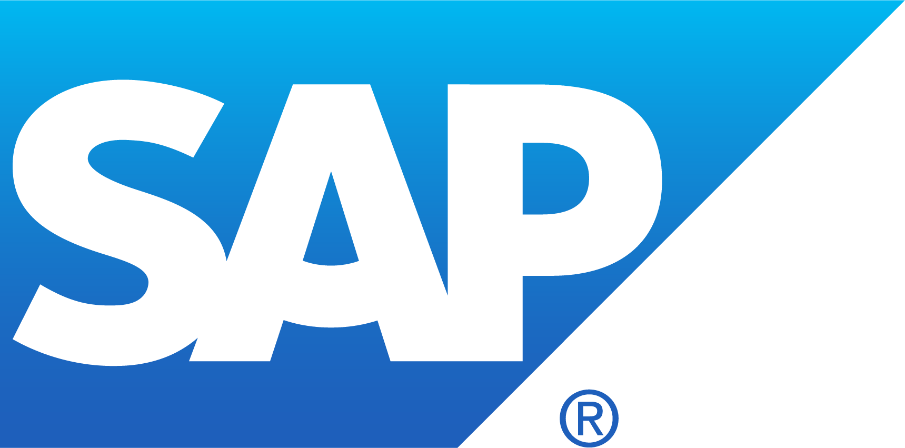
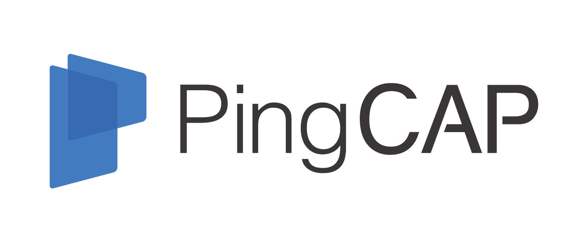
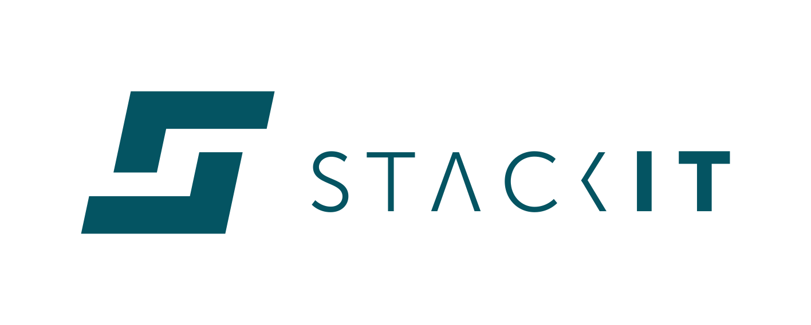
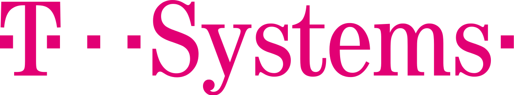
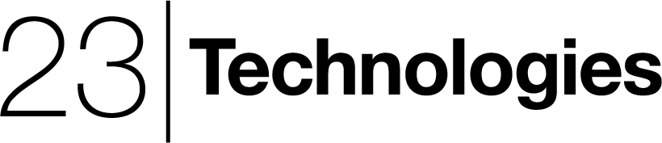

    
# See who is using Gardener
##  Gardener adopters in production environments that have publicly shared details of their usage.

|     |             |
| --- | ----------- |
| | <a href="https://www.sap.com" target="_blank">SAP</a> uses Gardener to deploy and manage Kubernetes clusters at scale in a uniform way across infrastructures (AWS, Azure, GCP, Alicloud, as well as generic interfaces to OpenStack and vSphere). Workloads include Databases (<a href="https://www.sap.com/products/hana/cloud.html" target="_blank">SAP HANA Cloud</a>), Big Data (<a href="https://www.sap.com/products/data-intelligence.html" target="_blank">SAP Data Intelligence</a>), <a href="https://kyma-project.io" target="_blank">Kyma</a>, many other cloud native applications, and diverse business workloads. |
| | <a href="https://www.scaleuptech.com" target="_blank" >ScaleUp Technologies</a> runs Gardener within their public Openstack Clouds (Hamburg, Berlin, Düsseldorf). Their clients run all kinds of workloads on top of Gardener maintained Kubernetes clusters ranging from databases to Software-as-a-Service applications. |
|| <a href="https://f-i-ts.de/" target="_blank">Finanz Informatik Technologie Services GmbH</a> uses Gardener to offer k8s as a service for customers in the financial industry in Germany. It is built on top of a "metal as a service" infrastructure implemented from scratch for k8s workloads in mind. The result is k8s on top of bare metal in minutes. |
|| <a href="https://pingcap.com" target="_blank">PingCAP</a> TiDB, is a cloud-native distributed SQL database with MySQL compatibility, and one of the most popular open-source database projects - with 23.5K+ stars and 400+ contributors. Its sister project <a target="_blank" href="https://github.com/tikv/tikv">TiKV</a> is a <a target="_blank" href="https://landscape.cncf.io/format=card-mode">Cloud Native Interactive Landscape project</a>. PingCAP envisioned their managed TiDB service, known as TiDB Cloud, to be multi-tenant, secure, cost-efficient, and to be compatible with different cloud providers and they chose Gardener. |
|| <a href="https://www.beezlabs.com/" target="_blank">Beezlabs</a> uses Gardener to deliver Intelligent Process Automation platform, on multiple cloud providers and reduce costs and lock-in risks. |
|| <a href="https://bnerd.com/de" target="_blank">b’nerd</a> uses Gardener as the core technology for its own managed Kubernetes as a Service solution and operates multiple Gardener installations for several cloud hosting service providers. |
|| <a href="https://stackit.de/en" target="_blank">STACKIT</a> is a digital brand of Europes’ biggest retailer, the Schwarz Group, which includes Lidl, Kaufland, but also production and recycling companies. It uses Gardener to offer public and private Kubernetes as a service in own data centers in Europe and targets to become the cloud provider for German and European small and mid-sized companies. |
|| Supporting and managing multiple application landscapes on-premises and across different hyperscaler infrastructures can be painful. At <a href="https://www.t-systems.com/" target="_blank">T-Systems</a> we use Gardener both for internal usage and to manage clusters for our customers. We love the openness of the project, the flexibility and the architecture that allows us to manage clusters around the world with only one team from one single pane of glass and to meet industry specific certification standards. The sovereignty by design is another great value, the technology implicitly brings along. |
|| The German-based company <a href="https://23technologies.cloud" target="_blank">23 Technologies</a> uses Gardener to offer an enterprise-class Kubernetes engine for industrial use cases as well as cloud service providers and offers managed and professional services for it. |
|| <a href="https://www.b1-systems.de" target="_blank">B1 Systems GmbH</a> is a international provider of Linux &amp; Open Source consulting, training, managed service &amp; support. We are founded in 2004 and based in Germany. Our team of 140 Linux experts offers tailor-made solutions based on cloud &amp; container technologies, virtualization &amp; high availability as well as monitoring, system &amp; configuration management. B1 is using Gardener internally and also set up solutions/environments for customers. |

### If you’re using Gardener and you aren’t on this list, [submit a pull request!](https://github.com/gardener/documentation/pulls)
