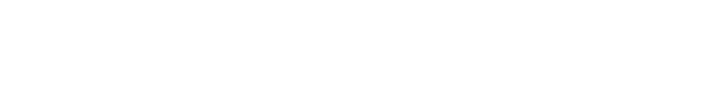

# See who is using Gardener
##  Gardener adopters in production environments that have publicly shared details of their usage.

|     |             |
| --- | ----------- |
| | <a href="https://www.sap.com/index.html" target="_blank">SAP</a> BTP, Kubernetes environment (internal) uses Gardener to deploy and manage Kubernetes clusters at scale in a uniform way across infrastructures (AWS, Azure, GCP, Alicloud, as well as generic interfaces to OpenStack and vSphere). Workloads include Databases (<a href="https://www.sap.com/products/technology-platform/hana.html" target="_blank">SAP HANA Cloud</a>), Big Data (<a href="https://www.sap.com/products/data-intelligence.html" target="_blank">SAP Data Intelligence</a>), <a href="https://kyma-project.io" target="_blank">Kyma</a>, many other cloud native applications, and diverse business workloads. |
|| Gardener can now be run by customers on the Public Cloud Platform of the leading European Cloud Provider <a href="https://www.ovh.ie/" target="_blank">OVHcloud</a>. |
| | <a href="https://www.scaleuptech.com/en/" target="_blank" >ScaleUp Technologies</a> runs Gardener within their public Openstack Clouds (Hamburg, Berlin, Düsseldorf). Their clients run all kinds of workloads on top of Gardener maintained Kubernetes clusters ranging from databases to Software-as-a-Service applications. |
|| <a href="https://f-i-ts.de/" target="_blank">Finanz Informatik Technologie Services GmbH</a> uses Gardener to offer k8s as a service for customers in the financial industry in Germany. It is built on top of a "metal as a service" infrastructure implemented from scratch for k8s workloads in mind. The result is k8s on top of bare metal in minutes. |
|| <a href="https://www.beezlabs.com/" target="_blank">Beezlabs</a> uses Gardener to deliver Intelligent Process Automation platform, on multiple cloud providers and reduce costs and lock-in risks. |
|| <a href="https://bnerd.com/de" target="_blank">b’nerd</a> uses Gardener as the core technology for its own managed Kubernetes as a Service solution and operates multiple Gardener installations for several cloud hosting service providers. |
|| <a href="https://stackit.de/en" target="_blank">STACKIT</a> is a digital brand of Europe's biggest retailer, the Schwarz Group, which includes Lidl, Kaufland, but also production and recycling companies. It uses Gardener to offer public and private Kubernetes as a service in own data centers in Europe and targets to become the cloud provider for German and European small and mid-sized companies. |
|| Supporting and managing multiple application landscapes on-premises and across different hyperscaler infrastructures can be painful. At <a href="https://www.t-systems.com/de/en/" target="_blank">T-Systems</a> we use Gardener both for internal usage and to manage clusters for our customers. We love the openness of the project, the flexibility and the architecture that allows us to manage clusters around the world with only one team from one single pane of glass and to meet industry specific certification standards. The sovereignty by design is another great value, the technology implicitly brings along. |
|| The German-based company <a href="https://23technologies.cloud" target="_blank">23 Technologies</a> uses Gardener to offer an enterprise-class Kubernetes engine for industrial use cases as well as cloud service providers and offers managed and professional services for it. 23T is also the team behind <a href="https://23technologies.github.io/okeanos/" target="_blank">okeanos.dev</a>, a public service  that can be used by anyone to try out Gardener. |
|| <a href="https://www.b1-systems.de" target="_blank">B1 Systems GmbH</a> is a international provider of Linux &amp; Open Source consulting, training, managed service &amp; support. We are founded in 2004 and based in Germany. Our team of 140 Linux experts offers tailor-made solutions based on cloud &amp; container technologies, virtualization &amp; high availability as well as monitoring, system &amp; configuration management. B1 is using Gardener internally and also set up solutions/environments for customers. |
|| <a href="https://codesphere.com" target="_blank">Codesphere</a> is a Cloud IDE with integrated and automated deployment of web apps. It uses Gardener internally to manage clusters that host customer deployments and internal systems all over the world.
|| <a href="https://plusserver.com/en" target="_blank">plusserver</a> combines its own cloud offerings with hyperscaler platforms to provide individually tailored multi-cloud solutions. The <a href="https://www.plusserver.com/en/product/managed-kubernetes/" target="_blank">plusserver Kubernetes Engine (PSKE)</a> based on Gardener reduces the complexity in managing multi-cloud environments and enables companies to orchestrate their containers and cloud-native applications across a variety of platforms such as plusserver's pluscloud open or hyperscalers such as AWS, either by mouseclick or via an API. With PSKE, companies remain vendor-independent and profit from guaranteed data sovereignty and data security due to GDPR-compliant cloud platforms in the certified plusserver data centers in Germany.
|| <a href="https://cyso.cloud" target="_blank">Cyso Cloud</a> uses Gardener as the basis for its <a href="https://cyso.cloud/managed-kubernetes/" target="_blank">Managed Kubernetes</a>, a <a href="https://my.fuga.cloud/post-emk" target="_blank">platform</a> that simplifies the management of your k8s and provides insight into usage and performance. The other Cyso Cloud service can be added with a mouse click, and the choice of another cloud provider is a negotiable option. Cyso stands for Digital Sovereignty, Data Portability and GDPR compatibility.
|| <a href="https://metalstack.cloud" target="_blank">metalstack.cloud</a> uses Gardener and is based on the open-source software <a href="https://metal-stack.io" target="_blank">metal-stack.io</a>, which is developed for regulated financial institutions. The focus here is on the highest possible security and compliance conformity. This makes metalstack.cloud perfect for running enterprise-grade container applications and provides your workloads with the highest possible performance.
|| <a href="https://cleura.com" target="_blank">Cleura</a> uses Gardener to power its Container Orchestration Engine for <a href="https://cleura.cloud">Cleura Public Cloud</a> and <a href="https://cleura.com/services/compliant-cloud/">Cleura Compliant Cloud</a>. Cleura Container Orchestration Engine simplifies the creation and management of Kubernetes clusters through their user-friendly Cleura Cloud Management Panel or API, allowing users to focus on deploying applications instead of maintaining the underlying infrastructure.
|| <a href="https://www.pitsdatenrettung.de/" target="_blank">PITS Globale Datenrettungsdienste</a> is a data recovery company located in Germany specializing in recovering lost or damaged files from hard drives, solid-state drives, flash drives, and other storage media. Gardener is used to handle highly-loaded internal infrastructure and provide reliable, fully-managed K8 cluster solutions.
|| <a href="https://www.exigo.ch/" target="_blank">exigo</a> is a Swiss cloud provider with over 25 years of experience, offering secure, high-performance IT solutions from its Swiss-based data centers.  To enhance its <a href="https://www.exigo.ch/produkte/kubernetes-und-mehr/exikube" target="_blank">Kubernetes services</a>, exigo developed exikube, a fully managed Kubernetes platform powered by Gardener. Running exclusively on exigo’s Swiss infrastructure, exikube ensures automated cluster management, scalability, and security, allowing businesses to deploy and manage applications with ease while staying compliant.
|  | **[noris network](https://www.noris.de/)** delivers premium IT from high-security German data centers: colocation, networks, managed services and sovereign cloud platforms.  [noris Sovereign Cloud (nSC)](https://www.noris.de/noris-sovereign-cloud-2/) combines OpenStack + Gardener into a 100% open source platform compliant with the German Administrative Cloud Strategy. |

### If you’re using Gardener and you aren’t on this list, [submit a pull request!](https://github.dev/gardener/documentation/blob/master/website/adopter/_index.md)
