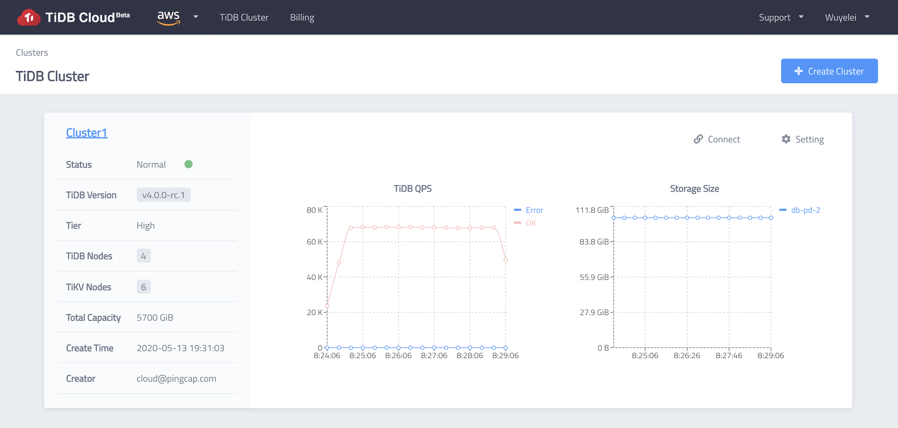
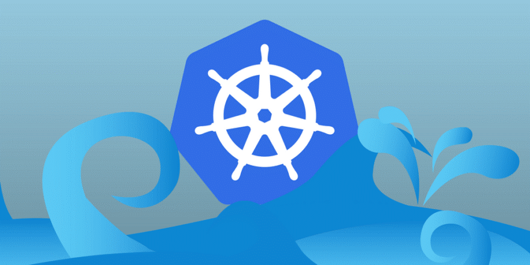

Gardener is showing successful collaboration with its growing community of contributors and adopters. With this come some success stories, including PingCAP using Gardener to implement its managed service. 

### About PingCAP and its TiDB Cloud

[PingCAP](https://pingcap.com/about/) started in 2015, when three seasoned infrastructure engineers working at leading Internet companies got sick and tired of the way databases were managed, scaled and maintained. Seeing no good solution on the market, they decided to build their own - the open-source way. With the help of a first-class team and hundreds of contributors from around the globe, PingCAP is building a distributed NewSQL, hybrid transactional and analytical processing (HTAP) database.

Its flagship project, [TiDB](https://en.wikipedia.org/wiki/TiDB), is a cloud-native distributed SQL database with MySQL compatibility, and one of the [most popular](https://github.com/pingcap/tidb) open-source database projects - with 23.5K+ stars and 400+ contributors. Its sister project [TiKV](https://github.com/tikv/tikv) is a [Cloud Native Interactive Landscape project](https://landscape.cncf.io/format=card-mode).

PingCAP envisioned their managed TiDB service, known as [TiDB Cloud](https://pingcap.com/tidb-cloud/sign-up/), to be multi-tenant, secure, cost-efficient, and to be compatible with different cloud providers. As a result, the company turned to Gardener to build their managed TiDB cloud service offering. 

<figcaption style="text-align:center;margin-top: -25px;margin-bottom: 30px;font-size: 90%;">TiDB Cloud Beta Preview</figcaption>

### Limitations with other public managed Kubernetes services

Previously, PingCAP encountered issues while using other public managed K8s cluster services, to develop the first version of its TiDB Cloud. Their worst pain point was that they felt helpless when encountering certain malfunctions. PingCAP wasn’t able to do much to resolve these issues, except waiting for the providers’ help. More specifically, they experienced problems due to cloud-provider specific Kubernetes system upgrades, delays in the support response (which could be avoided in exchange of a costly support fee), and no control over when things got fixed. 

There was also a lot of cloud-specific integration work needed to follow a multi-cloud strategy, which proved to be expensive both to produce and maintain. With one of these managed K8s services, you would have to integrate the instance API, as opposed to a solution like Gardener, which provides a unified API for all clouds. Such a unified API eliminates the need to worry about cloud specific-integration work altogether.

### Why PingCAP chose Gardener to build TiDB Cloud

><i>“Gardener has similar concepts to Kubernetes. Each Kubernetes cluster is just like a Kubernetes pod, so the similar concepts apply, and the controller pattern makes Gardener easy to manage. It was also easy to extend, as the team was already very familiar with Kubernetes, so it wasn’t hard for us to extend Gardener. We also saw that Gardener has a very active community, which is always a plus!”</i><footer>- Aylei Wu, (Cloud Engineer) at PingCAP</footer>

At first glance, PingCAP had initial reservations about using Gardener - mainly due to its adoption level (still at the beginning) and an apparent complexity of use. However, these were soon eliminated as they learned more about the solution. As Aylei Wu mentioned during the last [Gardener community meeting](https://www.youtube.com/watch?v=nqkzUylfIbU&feature=youtu.be), ***“a good product speaks for itself”***, and once the company got familiar with Gardener, they quickly noticed that the concepts were very similar to Kubernetes, which they were already familiar with.

They recognized that Gardener would be their best option, as it is highly extensible and provides a unified abstraction API layer. In essence, the machines can be managed via a machine controller manager for different cloud providers - without having to worry about the individual cloud APIs. 

They agreed that Gardener’s solution, although complex, was definitely worth it. Even though it is a relatively new solution, meaning they didn’t have access to other user testimonials, they decided to go with the service since it checked all the boxes (and as SAP was running it productively with a huge fleet). PingCAP also came to the conclusion that building a managed Kubernetes service themselves would not be easy. Even if they were to build a managed K8s service, they would have to heavily  invest in development and would still end up with an even more complex platform than Gardener’s. For all these reasons combined, PingCAP decided to go with Gardener to build its TiDB Cloud.

Here are certain features of Gardener that PingCAP found appealing:

- **Cloud agnostic:** Gardener’s abstractions for cloud-specific integrations dramatically reduce the investment in supporting more than one cloud infrastructure. Once the integration with Amazon Web Services was done, moving on to Google Cloud Platform proved to be relatively easy. (At the moment, TiDB Cloud has subscription plans available for both GCP and AWS, and they are planning to support Alibaba Cloud in the future.)
- **Familiar concepts:** Gardener is K8s native; its concepts are easily related to core Kubernetes concepts. As such, it was easy to onboard for a K8s experienced team like PingCAP’s SRE team.
- **Easy to manage and extend:** Gardener’s API and extensibility are easy to implement, which has a positive impact on the implementation, maintenance costs and time-to-market.
- **Active community:** Prompt and quality responses on Slack from the Gardener team tremendously helped to quickly onboard and produce an efficient solution.

### How PingCAP built TiDB Cloud with Gardener

On a technical level, PingCAP’s set-up overview includes the following:
- A Base Cluster globally, which is the top-level control plane of TiDB Cloud
- A Seed Cluster per cloud provider per region, which makes up the fundamental data plane of TiDB Cloud
- A Shoot Cluster is dynamically provisioned per tenant per cloud provider per region when requested
- A tenant may create one or more TiDB clusters in a Shoot Cluster

As a real world example, PingCAP sets up the Base Cluster and Seed Clusters in advance. When a tenant creates its first TiDB cluster under the us-west-2 region of AWS, a Shoot Cluster will be dynamically provisioned in this region, and will host all the TiDB clusters of this tenant under us-west-2. Nevertheless, if another tenant requests a TiDB cluster in the same region, a **new** Shoot Cluster will be provisioned. Since different Shoot Clusters are located in different VPCs and can even be hosted under different AWS accounts, TiDB Cloud is able to achieve hard isolation between tenants and meet the critical security requirements for our customers.

To automate these processes, PingCAP creates a service in the Base Cluster, known as the TiDB Cloud “Central” service. The Central is responsible for managing shoots and the TiDB clusters in the Shoot Clusters. As shown in the following diagram, user operations go to the Central, being authenticated, authorized, validated, stored and then applied asynchronously in a controller manner. The Central will talk to the Gardener API Server to create and scale Shoot clusters. The Central will also access the Shoot API Service to deploy and reconcile components in the Shoot cluster, including control components ([TiDB Operator](https://github.com/pingcap/tidb-operator), API Proxy, Usage Reporter for billing, etc.) and the TiDB clusters.

<figcaption style="text-align:center;margin-top: -25px;margin-bottom: 30px;font-size: 90%;">TiDB Cloud on Gardener Architecture Overview</figcaption>

### What’s next for PingCAP and Gardener

With the initial success of using the project to build TiDB Cloud, PingCAP is now working heavily on the stability and day-to-day operations of TiDB Cloud on Gardener. This includes writing Infrastructure-as-Code scripts/controllers with it to achieve GitOps, building tools to help diagnose problems across regions and clusters, as well as running chaos tests to identify and eliminate potential risks. After benefiting greatly from the community, PingCAP will continue to contribute back to Gardener.

In the future, PingCAP also plans to support more cloud providers like AliCloud and Azure. Moreover, PingCAP may explore the opportunity of running TiDB Cloud in on-premise data centers with the constantly expanding support this project provides. Engineers at PingCAP enjoy the ease of learning from Gardener’s kubernetes-like concepts and being able to apply them everywhere. Gone are the days of heavy integrations with different clouds and worrying about vendor stability. With this project, PingCAP now sees broader opportunities to land TiDB Cloud on various infrastructures to meet the needs of their global user group.

Stay tuned, more [blog posts](https://gardener.cloud/blog/) to come on how Gardener is collaborating with its contributors and adopters to bring fully-managed clusters at scale everywhere! If you want to join in on the fun, [connect with our community](https://gardener.cloud/community/). 