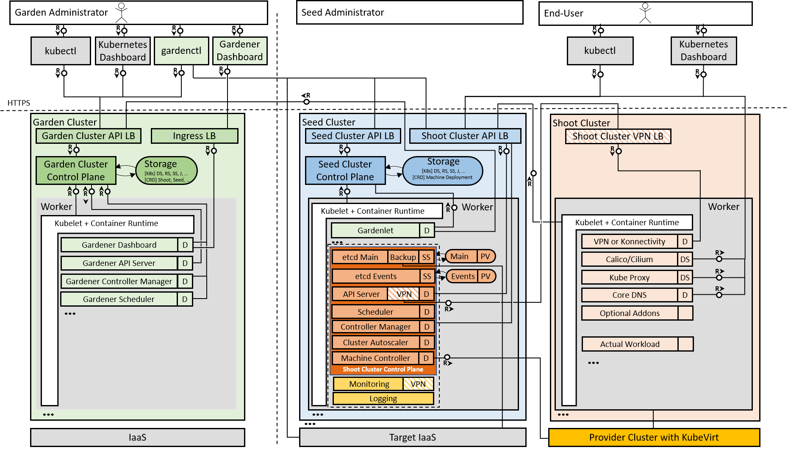
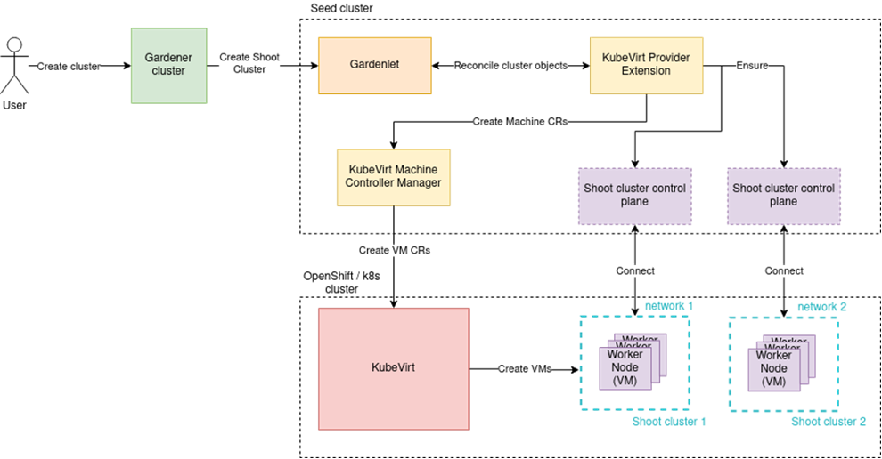

The Gardener team is happy to announce that [Gardener](https://gardener.cloud) now offers support for an additional, often requested, infrastructure/virtualization technology, namely [KubeVirt](https://kubevirt.io/)! Gardener can now provide [Kubernetes-conformant](https://github.com/cncf/k8s-conformance) clusters using KubeVirt managed Virtual Machines in the environment of your choice. This integration has been tested and works with any qualified Kubernetes (provider) cluster that is compatibly configured to host the required KubeVirt components, in particular for example [Red Hat OpenShift Virtualization](https://www.openshift.com/blog/openshift-virtualization-containers-kvm-and-your-vms).

Gardener enables Kubernetes consumers to centralize and operate efficiently homogenous Kubernetes clusters across different IaaS providers and even private environments. This way the same cloud-based application version can be hosted and operated by its vendor or consumer on a variety of infrastructures. When a new customer or your development team demands for a new infrastructure provider, Gardener helps you to quickly and easily on-board your workload. Furthermore, on this new infrastructure, Gardener keeps the seamless Kubernetes management experience for your Kubernetes operators, while upholding the consistency of the CI/CD pipeline of your software development team.

## Architecture and Workflow

Gardener is based on the idea of three types of clusters – *Garden cluster*, *Seed cluster* and *Shoot cluster* (see **Figure 1**). The Garden cluster is used to control the entire Kubernetes environment centrally in a highly scalable design. The highly available seed clusters are used to host the end users (shoot) clusters’ control planes. Finally, the shoot clusters consist only of worker nodes to host the cloud native applications.


<figcaption style="text-align:center;margin-top: -25px;margin-bottom: 30px;font-size: 90%;">Figure 1: Gardener Architecture</figcaption>
  
An integration of the Gardener open source project with a new cloud provider follows a standard [Gardener extensibility](https://github.com/gardener/gardener/blob/master/docs/extensions/overview.md) approach. The integration requires two new components: a [provider extension](https://github.com/gardener/gardener/blob/master/docs/extensions/overview.md) and a [Machine Controller Manager (MCM) extension](https://github.com/gardener/machine-controller-manager/blob/master/docs/development/cp_support_new.md). Both components together enable Gardener to instruct the new cloud provider. They run in the Gardener seed clusters that host the control planes of the shoots based on that cloud provider.  The role of the provider extension is to manage the provider-specific aspects of the shoot clusters’ lifecycle, including infrastructure, control plane, worker nodes, and others. It works in cooperation with the MCM extension, which in particular is responsible to handle machines that are provisioned as worker nodes for the shoot clusters. To get this job done, the MCM extension leverages the VM management/API capabilities available with the respective cloud provider.

Setting up a Kubernetes cluster always involves a flow of interdependent steps (see **Figure 2**), beginning with the generation of certificates and preparation of the infrastructure, continuing with the provisioning of the control plane and the worker nodes, and ending with the deployment of system components. Gardener can be configured to utilize the KubeVirt extensions in its generic workflow at the right extension points, and deliver the desired outcome of a KubeVirt backed cluster. 


<figcaption style="text-align:center;margin-top: -25px;margin-bottom: 30px;font-size: 90%;">Figure 2: Generic cluster reconciliation flow with extension points</figcaption>

### Gardener Integration with KubeVirt in Detail
 
Integration with KubeVirt follows the Gardener extensibility concept and introduces the two new components mentioned above: the [KubeVirt Provider Extension](https://github.com/gardener/gardener-extension-provider-kubevirt) and the [KubeVirt Machine Controller Manager (MCM) Extension](https://github.com/gardener/machine-controller-manager-provider-kubevirt).


<figcaption style="text-align:center;margin-top: -25px;margin-bottom: 30px;font-size: 90%;">Figure 3: Gardener integration with KubeVirt</figcaption>

The KubeVirt Provider Extension consists of three separate controllers that handle respectively the infrastructure, the control plane, and the worker nodes of the shoot cluster.
 
The **Infrastructure Controller** configures the network communication between the shoot worker nodes. By default, shoot worker nodes only use the provider cluster’s pod network. To achieve higher level of network isolation and better performance, it is possible to add more networks and replace the default pod network with a different network using container network interface (CNI) plugins available in the provider cluster. This is currently based on [Multus CNI](https://github.com/intel/multus-cni/blob/master/README.md) and [NetworkAttachmentDefinitions](https://github.com/intel/multus-cni/blob/master/doc/quickstart.md).

Example infrastructure configuration in a shoot definition:

```yaml
provider:
  type: kubevirt
  infrastructureConfig:
    apiVersion: kubevirt.provider.extensions.gardener.cloud/v1alpha1
    kind: InfrastructureConfig
    networks:
      tenantNetworks:
      - name: network-1
        config: |
          {
            "cniVersion": "0.4.0",
            "name": "bridge-firewall",
            "plugins": [
              {
                "type": "bridge",
                "isGateway": true,
                "isDefaultGateway": true,
                "ipMasq": true,
                "ipam": {
                  "type": "host-local",
                  "subnet": "10.100.0.0/16"
                }
              },
              {
                "type": "firewall"
              }
            ]
          }
        default: true
```

The **Control Plane Controller** deploys a *Cloud Controller Manager (CCM)*. This is a Kubernetes control plane component that embeds cloud-specific control logic. As any other CCM, it runs the Node controller that is responsible for initializing Node objects, annotating and labeling them with cloud-specific information, obtaining the node’s hostname and IP addresses, and verifying the node’s health. It also runs the Service controller that is responsible for setting up load balancers and other infrastructure components for Service resources that require them. 

Finally, the **Worker Controller** is responsible for managing the worker nodes of the Gardener shoot clusters.

Example worker configuration in a shoot definition:

```yaml
provider:
  type: kubevirt
  workers:
  - name: cpu-worker
    minimum: 1
    maximum: 2
    machine:
      type: standard-1
      image:
        name: ubuntu
        version: "18.04"
    volume:
      type: default
      size: 20Gi
    zones:
    - europe-west1-c
```

For more information about configuring the KubeVirt Provider Extension as an end-user, see [Using the KubeVirt provider extension with Gardener as end-user](https://github.com/gardener/gardener-extension-provider-kubevirt/blob/master/docs/usage-as-end-user.md).

### Enabling Your Gardener Setup to Leverage a KubeVirt Compatible Environment

The very first step required is to define the machine types (VM types) for VMs that will be available. This is achieved via the `CloudProfile` custom resource. The machine types configuration includes details such as CPU, GPU, memory, OS image, and more.

Example `CloudProfile` custom resource:

```yaml
apiVersion: core.gardener.cloud/v1beta1
kind: CloudProfile
metadata:
  name: kubevirt
spec:
  type: kubevirt
  providerConfig:
    apiVersion: kubevirt.provider.extensions.gardener.cloud/v1alpha1
    kind: CloudProfileConfig
    machineImages:
    - name: ubuntu
      versions:
      - version: "18.04"
        sourceURL: "https://cloud-images.ubuntu.com/bionic/current/bionic-server-cloudimg-amd64.img"
  kubernetes:
    versions:
    - version: "1.18.5"
  machineImages:
  - name: ubuntu
    versions:
    - version: "18.04"
  machineTypes:
  - name: standard-1
    cpu: "1"
    gpu: "0"
    memory: 4Gi
  volumeTypes:
  - name: default
    class: default
  regions:
  - name: europe-west1
    zones:
    - name: europe-west1-b
    - name: europe-west1-c
    - name: europe-west1-d
```

Once a machine type is defined, it can be referenced in shoot definitions. This information is used by the KubeVirt Provider Extension to generate `MachineDeployment` and `MachineClass` custom resources required by the KubeVirt MCM extension for managing the worker nodes of the shoot clusters during the reconciliation process.

For more information about configuring the KubeVirt Provider Extension as an operator, see [Using the KubeVirt provider extension with Gardener as operator](https://github.com/gardener/gardener-extension-provider-kubevirt/blob/master/docs/usage-as-operator.md).

### KubeVirt Machine Controller Manager (MCM) Extension

The [KubeVirt MCM Extension](https://github.com/gardener/machine-controller-manager-provider-kubevirt) is responsible for managing the VMs that are used as worker nodes of the Gardener shoot clusters using the virtualization capabilities of KubeVirt. This extension handles all necessary lifecycle management activities, such as machines creation, fetching, updating, listing, and deletion.

The KubeVirt MCM Extension implements the Gardener’s common [driver interface](https://github.com/gardener/machine-controller-manager/blob/master/pkg/util/provider/driver/driver.go) for managing VMs in different cloud providers. As already mentioned, the KubeVirt MCM Extension is using the `MachineDeployments` and `MachineClasses` – an abstraction layer that follows the Kubernetes native declarative approach - to get instructions from the KubeVirt Provider Extension about the required machines for the shoot worker nodes. Also, the cluster austoscaler integrates with the `scale` subresource of the `MachineDeployment` resource. This way, Gardener offers a homogeneous autoscaling experience across all supported providers.

When a new shoot cluster is created or when a new worker node is needed for an existing shoot cluster, a new [Machine](https://github.com/gardener/machine-controller-manager-provider-kubevirt/blob/master/kubernetes/machine.yaml) will be created, and at that time, the KubeVirt MCM extension will create a new KubeVirt `VirtualMachine` in the provider cluster. This `VirtualMachine` will be created based on a set of configurations in the [MachineClass](https://github.com/gardener/machine-controller-manager-provider-kubevirt/blob/master/kubernetes/machine-class.yaml) that follows the [specification](https://github.com/gardener/machine-controller-manager-provider-kubevirt/blob/master/pkg/kubevirt/apis/provider_spec.go) of the KubeVirt provider.

The KubeVirt MCM Extension has two main components. The **MachinePlugin** is responsible for handling the machine objects, and the **PluginSPI** is in charge of making calls to the cloud provider interface, to manage its resources.


<figcaption style="text-align:center;margin-top: -25px;margin-bottom: 30px;font-size: 90%;">Figure 4: KubeVirt MCM extension workflow and architecture</figcaption>

As shown in **Figure 4**, the MachinePlugin receives a machine request from the MCM and starts its processing by decoding the request, doing partial validation, extracting the relevant information, and sending it to the PluginSPI. 

The PluginSPI then creates, gets, or deletes `VirtualMachines` depending on the method called by the MachinePlugin. It extracts the kubeconfig of the provider cluster and handles all other required KubeVirt resources such as the secret that holds the `cloud-init` configurations, and `DataVolumes` that are mounted as disks to the VMs. 

### Supported Environments

The Gardener KubeVirt support is currently qualified on:

* [KubeVirt v0.32.0](https://kubevirt.io/2020/changelog-v0.32.0.html) (and later)
* [Red Hat OpenShift Container Platform 4.4](https://docs.openshift.com/container-platform/4.4/welcome/index.html) (and later)

There are also plans for further improvements and new features, for example integration with CSI drivers for storage management. Details about the implementation progress can be found in the [Gardener project on GitHub](https://github.com/gardener/gardener-extension-provider-kubevirt/issues).

You can find further resources about the open source project Gardener at [https://gardener.cloud](https://gardener.cloud).
 