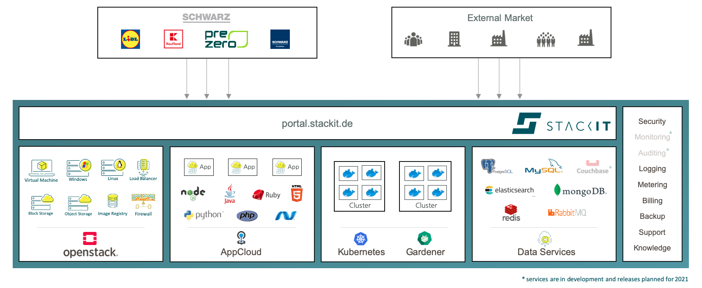

[STACKIT](https://stackit.de/en/) is a digital brand of Europe’s biggest retailer, the Schwarz Group, which consists of Lidl, Kaufland, as well as production and recycling companies. Following the industry trend, the Schwarz Group is in the process of a digital transformation. STACKIT enables this transformation by helping to modernize the internal IT of the company branches.

## What is STACKIT and the STACKIT Kubernetes Engine (SKE)?

STACKIT started with colocation solutions for internal and external customers in Europe-based data centers, which was then expanded to a full cloud platform stack providing an IaaS layer with VMs, storage and network, as well as a PaaS layer including Cloud Foundry  and a growing set of cloud services, like databases, messaging, etc.

With containers and Kubernetes becoming the lingua franca of the cloud, we are happy to announce the *STACKIT Kubernetes Engine (SKE)*, which has been released as Beta in November this year. We decided to use Gardener as the cluster management engine underneath SKE - for good reasons as you will see – and we would like to share our experiences with Gardener when working on the SKE Beta release, and serve as a testimonial for this technology.

<figcaption style="text-align:center;margin-top: 0px;margin-bottom: 30px;font-size: 90%;">Figure 1: STACKIT Component Diagram</figcaption>

## Why we chose Gardener as a cluster management tool

We started with the Kubernetes endeavor in the beginning of 2020 with a newly formed agile team that consisted of software engineers, highly experienced in IT operations and development. After some exploration and a short conceptual phase, we had a clear-cut opinion on how the cluster management for STACKIT should look like: we were looking for a highly customizable tool that could be adapted to the specific needs of STACKIT and the Schwarz Group, e.g. in terms of network setup or the infrastructure layer it should be running on. Moreover, the tool should be scalable to a high number of managed Kubernetes clusters and should therefore provide a fully automated operation experience. As an open source project, contributing and influencing the tool, as well as collaborating with a larger community were important aspects that motivated us. Furthermore, we aimed to offer cluster management as a self-service in combination with an excellent user experience. Our objective was to have the managed clusters come with enterprise-grade SLAs – i.e. with “batteries included”, as some say.

With this mission, we started our quest through the world of Kubernetes and soon found Gardener to be a hot candidate of cluster management tools that seemed to fulfill our demands. We quickly got in contact and received a warm welcome from the Gardener community. As interested potential adopter, but in the early days of the COVID-19 lockdown, we managed to organize an online workshop during which we got an introduction and deep dive into Gardener and discussed the STACKIT use cases. We learned that Gardener is extensible in many dimensions, and that contributions are always welcome and encouraged. Once we understood the basic Gardener concepts of Garden, Shoot and Seed clusters, its inception design and how this extends Kubernetes concepts in a natural way, we were eager to evaluate this tool in more detail.

After this evaluation, we were convinced that this tool fulfilled all our requirements - a decision was made and off we went.

## How Gardener was adapted and extended by SKE

After becoming familiar with Gardener, we started to look into its code base to adapt it to the specific needs of the STACKIT OpenStack environment. Changes and extensions were made in order to get it integrated into the STACKIT environment, and whenever reasonable, we contributed those changes back:

- To run smoothly with the STACKIT OpenStack layer, the Gardener configuration was adapted in different places, e.g. to support CSI driver or to configure the domains of shoot API server or ingress.
- Gardener was extended to support shoots and shooted seeds in dual stack and dual home setup. This is used in SKE for the communication between shooted seeds and the Garden cluster.
-	SKE uses a private image registry for Gardener installation to resolve dependencies to public image registries and to have more control over the used Gardener versions. To install and run Gardener with the private image registry, some new configurations need to be introduced into Gardener.
- Gardener is a first-class API based service what allowed us to smoothly integrate it into the STACKIT User Interface. We were able to jump-start and utilize also the Gardener Dashboard for our Beta release by merely adjusting the look-&-feel, i.e. colors, labels and icons.

<figcaption style="text-align:center;margin-top: 0px;margin-bottom: 30px;font-size: 90%;">Figure 2: Gardener Dashboard adapted to STACKIT UI style</figcaption>

## Experience with Gardener operations

As no OpenStack installation is identical to one another, getting Gardener to run stable on the STACKIT IaaS layer revealed some operational challenges. For instance, it was challenging to find the right configuration for Cinder CSI.

To test for its resilience, we tried to break the managed clusters with a Chaos Monkey test, e.g. by deleting services or components needed by Kubernetes and Gardener to work properly. The reconciliation feature of Gardener fixed all those problems automatically, so that damaged Shoot clusters became operational again after a short period of time. Thus, we were not able to break Shoot clusters from an end user perspective permanently, despite our efforts. Which again speaks for Gardener’s first-class cloud native design.

We also participated in a fruitful community support: For several challenges we contacted the community channel and help was provided in a timely manner. A lesson learned was that raising an issue in the community early on, before getting stuck too long on your own with an unresolved problem, is essential and efficient.

## Summary

Gardener is used by SKE to provide a managed Kubernetes offering for internal use cases of the Schwarz Group as well as for the public cloud offering of STACKIT. Thanks to Gardener, it was possible to get from zero to a Beta release in only about half a year’s time – this speaks for itself. Within this period, we were able to integrate Gardener into the STACKIT environment, i.e. in its OpenStack IaaS layer, its management tools and its identity provisioning solution.

Gardener has become a vital building block in STACKIT's cloud native platform offering. For the future, the possibility to manage clusters also on other infrastructures and hyperscalers is seen as another great opportunity for extended use cases. The open co-innovation exchange with the Gardener community member companies has also opened the door to commercial co-operation.
