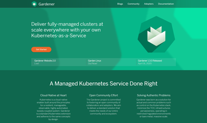

The [Gardener project website](https://gardener.cloud) just received a serious facelift. Here are some of the highlights:
- **A completely new landing page**, emphasizing both on Gardener's value proposition and the open community behind it.
- **The Community page** was reconstructed for quick access to the various community channels and will soon merge the Adopters page. It will provide a better insight into success stories from the communty.
- **A completely new News section and content type** available at [/documentation/news](https://github.com/gardener/documentation/tree/master/website/news). Use metadata such as `publishdate` and `archivedate` to schedule for news publish and archive automatically, regardless of when you contributed them. You can now track what's happening from the landing page or in the dedicated [News](https://gardener.cloud/news) section on the website and share.
- **Improved blogs** layout. One-click sharing options are available starting with simple URL copy link and twitter button and others will closely follow up. While we are at it, give it a try. Spread the word.

**Website builds** also got to a new level with:
  - **Containerization**. The whole build environment is containerized now, eliminating differences between local and CI/CD setup and reducing content developers focus only to the `/documentation` repository. Running a local server for live preview of changes as you make them when developing content for the website, is now as easy as runing `make serve` in your local `/documentation` clone.
  - **Numerous improvements to the buld scripts**. More [configuration options](https://github.com/gardener/website-generator#build-configuration), authenticated requests, fault tollerance and performance.
  - **Good news for Windows WSL users** who will now nejoy a significantly support. See the updated [README](https://github.com/gardener/website-generator#windows-10-users) for details on that.
  - **A number of improvements** in layouts styles, site assets and hugo site-building techniques.

**But hey, THAT'S NOT ALL!**

Stay tuned for more improvements around the corner. The biggest ones are aligning the documentation with the new theme and restructuring it along, more emphasis on community success stories all around, more sharing options and more than a handful of shortcodes for content development and ... let's cut the spoilers here.

I hope you will like it. Let us know what you think about it. Feel free to leave comments and discuss on [Twitter](https://twitter.com/GardenerProject) and [Slack](https://kubernetes.slack.com/archives/CB57N0BFG), or in case of issues - on [GitHub](https://github.com/gardener/documentation/issues).

**Go ahead and help us spread the word: https://gardener.cloud**

<picture>
    <!--source srcset="../../../blog/2020_week_20/website-screen-XL.png"
            media="(min-width: 1400px)"-->
    <!--source srcset="../../../blog/2020_week_20/website-screen-L.png"
            media="(min-width: 1000px)"-->
    <!--source srcset="../../../blog/2020_week_20/website-screen-M.png"
            media="(min-width: 750px)"-->
    <source srcset="../../blog/2020_week_20/website-screen-L.png"
            media="(min-width: 750px)">
    
</picture>

 