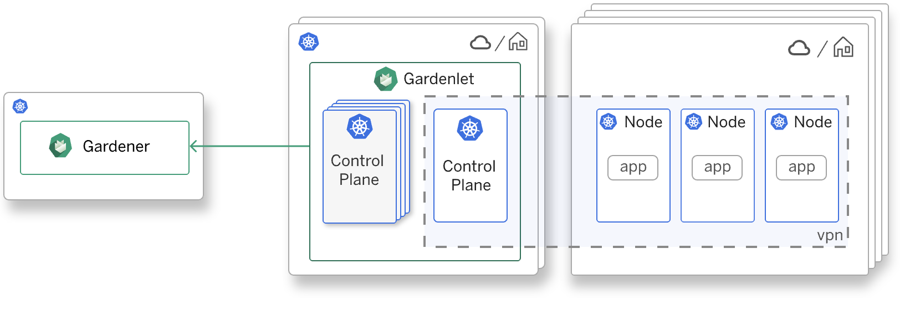

Happy New Year Gardeners!
As we greet 2021, we also celebrate Gardener’s third anniversary. Gardener was born with its first open source [commit](https://github.com/gardener/gardener/commit/d9619d01845db8c7105d27596fdb7563158effe1) on 10.1.2018 (its inception within SAP was of course some 9 months earlier):

```text
commit d9619d01845db8c7105d27596fdb7563158effe1
Author: Gardener Development Community <gardener.opensource@sap.com>
Date:   Wed Jan 10 13:07:09 2018 +0100
    Initial version of gardener
    This is the initial contribution to the Open Source Gardener project.
...
```

Looking back, three years down the line, the project initiators were working towards a special goal: Publishing Gardener as an open source project on Github.com.
Join us as we look back at how it all began, the challenges Gardener aims to solve and why open source and the community was and is the project’s key enabler.

## Gardener kick-off: “We opted to BUILD ourselves”

Early 2017, SAP put together a small, jelled team of experts with a clear mission: work out  how SAP could serve Kubernetes based environments (as a service) for all teams within the company.  Later that same year SAP also joined the [CNCF](https://www.cncf.io/) as platinum member.

We first deliberated intensively on the BUY options (including acquisitions, due to the size and estimated volume needed at SAP). There were some early products from commercial vendors and startups available that did not bind exclusively to one of the hyperscalers. But these products did not cover many of our crucial and immediate requirements for a multi-cloud environment.

Ultimately, we opted to BUILD ourselves. This decision was not made lightly, because right from the start, we knew that we would have to cover thousands of clusters, across the globe, on all kinds of infrastructures. We would have to be able to create them at scale as well as manage them 24x7. And thus, we predicted the need to invest into automation of all aspects, to keep the service TCO at a minimum, and to offer an enterprise worthy SLA early on. This particular endeavor grew into launching project Gardener, first internally, and ultimately fulfilling all checks, externally based on open source.
Its mission statement, in a nutshell, is “Universal Kubernetes at scale”.
Now, that’s quite bold. But we also had a nifty innovation that helped us tremendously along the way. And we can openly reveal the secret here: Gardener was built, not only for creating Kubernetes at scale, but it was built (recursively) in Kubernetes itself.

## What do you get with Gardener?

Gardener offers managed and homogenous Kubernetes clusters on IaaS providers like _AWS, Azure, GCP, AliCloud, Open Telekom Cloud, SCS, OVH_ and more, but also covers versatile infrastructures like _OpenStack, VMware_ or _bare metal_. Day-1 and Day-2 operations are an integral part of a cluster’s feature set. This means, that Gardener is not only capable of provisioning or de-provisioning thousands of clusters, but also of monitoring your cluster’s health state, upgrading components in a rolling fashion, or scaling the control plane as well as worker nodes up and down depending on the current resource demand. 

Some features mentioned above might sound familiar to you, simply because they’re squarely derived from Kubernetes. Concretely, if you explore a Gardener managed end-user cluster, you’ll never see so-called “control plane components” (_Kube-Apiserver, Kube-Controller-Manager, Kube-Scheduler, etc._) The reason is they run as Pods inside another, hosting/seeding Kubernetes cluster. Speaking in Gardener terms, the latter is called a _Seed_ cluster, and the end-user cluster is called a _Shoot_ cluster; and thus the botanical naming scheme for Gardener was born. Further assets like infrastructure components or worker machines are modelled as managed Kubernetes objects too. This allows Gardener to leverage all the great and production proven features of Kubernetes - for managing Kubernetes clusters. Our [blog post](https://kubernetes.io/blog/2019/12/02/gardener-project-update/) on Kubernetes.io reveals more details about architectural refinements.


<figcaption style="text-align:center;margin-top: 0px;margin-bottom: 30px;font-size: 90%;">Figure 1: Gardener architecture overview</figcaption>

End-users directly benefit from Gardener’s recursive architecture. Many requirements we identified for the Gardener service, turned out to be highly convenient for shoot owners. For instance, Seed clusters are usually equipped with _DNS_ and _x509 services_. At the same time, these service offerings can be extended to requests coming from the Shoot clusters i.e., end-users get domain names and certificates for their applications out of the box.

## Recognizing the power of open source

The Gardener team immediately profited from open source: from Kubernetes obviously, and all its ecosystem projects. That all facilitated our project’s very fast and robust development. But it does not answer:

_“Why would SAP open source a tool that clearly solves a monetizable enterprise requirement?"_

Short spoiler alert: it initially involved a leap of faith. If we just look at our own decision path, it is undeniable, developers, and with them entire industries, gravitate towards open source. We chose Linux, Containers and Kubernetes, exactly because they are open, and we could bet on network effects, especially around skills. The same decision process is currently replicated in thousands of companies, with the same results. Why? Because all companies are digitally transforming. They are becoming software companies as well to a certain extent. Many of them are also our customers and in many discussions, we recognized that they have the same challenges that we are solving with Gardener. This, in essence, was a key eye opener. We were confident that if we developed Gardener open source, we’d not only seize the opportunity to shape a Kubernetes management tool that finds broad interest and adoption outside our use case at SAP, but we could solve common challenges faster with the help of a community, and that in consequence would sustain continuous feature development.

Coincidently that was also when the _SAP Open Source Program Office (OSPO)_ was launched. It supported us making a case to develop Gardener completely as open source.
Today, we can witness that this strategy has unfolded. It opened the gates not only for adoption, but for co-innovation, investment security, and user feedback directly in code. Below you can see an example of how the Gardener project benefits from this external community power as contributions are submitted right away.


<figcaption style="text-align:center;margin-top: 0px;margin-bottom: 30px;font-size: 90%;">Figure 2: Example immediate community contribution</figcaption>

## Differentiating Gardener from other Kubernetes management solutions

Imagine you created a modern solid cloud native app or service, fully scalable, in containers. And the business case requires you to run the service on multiple clouds, like _AWS, AliCloud, Azure_, … maybe even on-premises like _OpenStack_ or _VMware_. Your development team did everything to ensure that the workload was highly portable. But they would need to qualify each providers’ managed Kubernetes offering and their custom _Bill-of-Material (BoM)_, their versions, their deprecation plan, roadmap etc. Your TCD would explode and this is exactly what teams at SAP experienced. Now, with Gardener you can, instead, roll out homogeneous clusters and stay in control of your versions and a single roadmap. Across all supported providers! 

Also, teams that have serious, or say, more demanding workloads running on Kubernetes will come to the same conclusion: They require the full management control of the Kubernetes underlay. Not only that, they need access, visibility, and all tuning options for the control plane to safeguard their service. This is a conclusion not only from teams at SAP, but also from our community members, like _PingCap_ who use Gardener to serve _TiDB Cloud service_. Whenever you need to get serious and need more than one or two clusters, Gardener is your friend.

## Who is using Gardener?

Well, there is SAP itself of course, but also the number of Gardener adopters and companies interested in Gardener is growing (~1700 GitHub stars), as more are challenged with multi-cluster and multi-cloud requirements.

_Flant, PingCap, StackIT, T-Systems, Sky_, or _b’nerd_ are among these companies, to name a few. They use Gardener to either run products they sell on top or offer managed Kubernetes clusters directly to their clients, or even only components that are re-usable from Gardener.

An interesting journey in the open source space started with _Finanz Informatik Technologie Service (FI-TS)_, a European Central Bank regulated and certified hoster for banks. They operate in very restricted environments, as you can imagine, and as such, they re-designed their datacenter for cloud native workloads from scratch, that is from cabling, racking and stacking to an API that serves bare metal servers.
For Kubernetes-as-a-Service they evaluated and chose Gardener because it was open and a perfect candidate. With Gardener’s extension capabilities, it was possible to bring managed Kubernetes clusters to their very own bare metal stack, [metal-stack.io](https://metal-stack.io/).
Of course, this meant implementation effort. But by reusing the Gardener project, _FI-TS_ was able to leverage our standard with minimal adjustments for their special use-case. Subsequently, with their contributions, SAP was able to make Gardener more open for the community.

## Full speed ahead with the community in 2021

Some of the current and most active topics are about the installer ([Landscaper](https://github.com/gardener/landscaper)), [control plane migration](https://github.com/gardener/gardener/blob/master/docs/proposals/07-shoot-control-plane-migration.md), [automated seed management](https://github.com/gardener/gardener/blob/master/docs/proposals/13-automated-seed-management.md) and documentation.
Even though once you are into Kubernetes and then Gardener, all complexity falls into place, you can make all the semantic connections yourself. But beginners that join the community without much prior knowledge should experience a ramp-up with slighter slope. And that is currently a pain point. Experts directly ask questions about documentation not being up-to-date or clear enough. We prioritized the functionality of what you get with Gardener at the outset and need to catch up.
But here is the good part: Now that we are starting the installation subject, later, we will have a much broader picture of what we need to install and maintain Gardener, and how we will build it.

<span style="display: block; text-align: center;">
  
</span>

In a [community call](https://www.youtube.com/watch?v=pGlHpJle7Zk) last summer, we gave an overview of what we are building:
The Landscaper. With this tool, we will be able to not only install a full Gardener landscape, but we will also streamline patches, updates and upgrades with the Landscaper. Gardener adopters can then attach to a release train from the project and deploy Gardener into a dev, canary and multiple production environments sequentially. Like we do at SAP.

## Key takeaways in three years of Gardener

### #1 Open Source is strategic

Open Source is not just about using freely available libraries, components, or tools to optimize your own software production anymore. It is strategic, unfolds for projects like Gardener, and that in the meantime also reached the Board Room. 

### #2 Solving concrete challenges by co-innovation

Users of a particular product or service increasingly vote/decide for open source variants, such as project Gardener. Because that allows them to freely innovate and solve concrete challenges by developing exactly what they require (see FI-TS example). This user-centric process has tremendous advantages. It clears out the middleman and other vested interests. You have access to the full code. And lastly, if others start using and contributing to your innovation, it allows enterprises to secure their investments for the long term. And that’s re-enforces point #1 for enterprises that yet have to create a strategic Open Source Program Office.

### #3 Cloud Native Skills

Gardener solves problems by applying Kubernetes and Kubernetes principles itself. Developers and operators who obtain familiarity with Kubernetes, will immediately notice, and appreciate our concept and can contribute intuitively. The Gardener maintainers feel responsible to facilitate community members and contributors. Barriers will further be reduced by our ongoing landscaper and documentation efforts. This is why we are so confident on [Gardener adoption](https://gardener.cloud/adopter/).

The Gardener team is gladly welcoming new community members, especially regarding adoption and contribution. Be invited to try out your very own Gardener installation, join our [Slack channel](https://kubernetes.slack.com/archives/CB57N0BFG) or [community calls](https://github.com/gardener/documentation/blob/master/CONTRIBUTING.md#bi-weekly-meetings). We’re looking forward to seeing you there!
