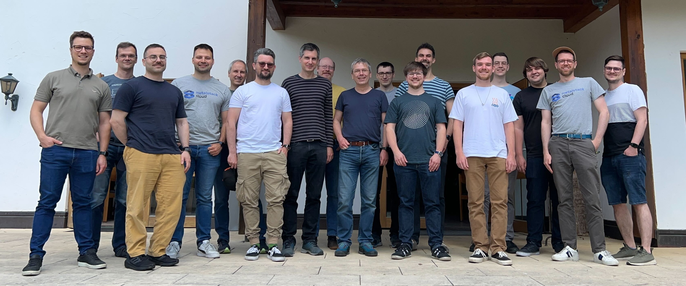

The Gardener community recently concluded its [5th Hackathon](https://github.com/gardener-community/hackathon/blob/main/2024-05_Schelklingen/README.md), a week-long event that brought together multiple companies to collaborate on common topics of interest. The Hackathon, held at [Schlosshof Freizeitheim](https://www.schlosshof-info.de/) in [Schelklingen, Germany](https://maps.app.goo.gl/28FZXpzZLjgaKNef9), was a testament to the power of collective effort and open-source, producing a tremendous number of results in a short time and moving the Gardener project forward with innovative solutions.

## A Week of Collaboration and Innovation

The Hackathon addressed a wide range of topics, from improving the maturity of the Gardener API to harmonizing development setups and automating additional preparation tasks for Gardener installations. The event also saw the introduction of new resources and configurations, the rewriting of VPN components from Bash to Golang, and the exploration of a Tailscale-based VPN to secure shoot clusters.

### Key Achievements

1. [🗃️ **OCI Helm Release Reference for ControllerDeployment**](https://github.com/gardener-community/hackathon/blob/main/2024-05_Schelklingen/README.md#%EF%B8%8F-oci-helm-release-reference-for-controllerdeployments): The Hackathon introduced the `core.gardener.cloud/v1` API, which supports OCI repository-based Helm chart references. This innovation reduces operational complexity and enables reusability for other scenarios.
2. [👨🏼‍💻 **Local `gardener-operator` Development Setup with gardenlet**](https://github.com/gardener-community/hackathon/blob/main/2024-05_Schelklingen/README.md#-gardener-operator-local-development-setup-with-gardenlets): A new Skaffold configuration was created to harmonize the development setups for Gardener. This configuration deploys `gardener-operator` and its `Garden` CRD together with a deployment of `gardenlet` to register a seed cluster, allowing for a full-fledged Gardener setup.
3. [👨🏻‍🌾 **Extensions for Garden Cluster via `gardener-operator`**](https://github.com/gardener-community/hackathon/blob/main/2024-05_Schelklingen/README.md#-extensions-for-garden-cluster-via-gardener-operator): The Hackathon focused on automating additional preparation tasks for Gardener installations. The `Garden` controller was augmented to deploy extensions as part of its reconciliation flow, reducing operational complexity.
4. [🪄 **Gardenlet Self-Upgrades for Unmanaged `Seed`s**](https://github.com/gardener-community/hackathon/blob/main/2024-05_Schelklingen/README.md#-gardenlet-self-upgrades-for-unmanaged-seeds): A new `Gardenlet` resource was introduced, allowing for the specification of deployment values and component configurations. A new controller within `gardenlet` watches these resources and updates the `gardenlet`'s Helm chart and configuration accordingly, effectively implementing self-upgrades.
5. [🦺 **Type-Safe Configurability in `OperatingSystemConfig`**](https://github.com/gardener-community/hackathon/blob/main/2024-05_Schelklingen/README.md#-type-safe-configurability-in-operatingsystemconfig-for-containerd-dns-ntp-etc): The Hackathon improved the configurability of the `OperatingSystemConfig` for `containerd`, DNS, NTP, etc. The `OperatingSystemConfig` API was augmented to support `containerd`-config related use-cases.
6. [👮 **Expose Shoot API Server in Tailscale VPN**](https://github.com/gardener-community/hackathon/blob/main/2024-05_Schelklingen/README.md#-expose-shoot-api-server-in-tailscale-vpn): The Hackathon explored the use of a [Tailscale](https://tailscale.com/)-based VPN to secure shoot clusters. [A document was compiled](https://gardener.cloud/docs/guides/administer-shoots/tailscale/) explaining how shoot owners can expose their API server within a Tailscale VPN.
7. [⌨️ **Rewrite `gardener/vpn2` from Bash to Golang**](https://github.com/gardener-community/hackathon/blob/main/2024-05_Schelklingen/README.md#%EF%B8%8F-rewrite-gardenervpn2-from-bash-to-golang): The Hackathon improved the VPN components by rewriting them in Golang. All functionality was successfully rewritten, and the pull requests have been opened for `gardener/vpn2` and the integration into `gardener/gardener`.
8. [🕳️ **Pure IPv6-Based VPN Tunnel**](https://github.com/gardener-community/hackathon/blob/main/2024-05_Schelklingen/README.md#%EF%B8%8F-pure-ipv6-based-vpn-tunnel): The Hackathon addressed the restriction of the VPN network CIDR by switching the VPN tunnel to a pure IPv6-based network (follow-up of [gardener/gardener#9597](https://github.com/gardener/gardener/pull/9597)). This allows for more flexibility in network design.
9. [👐 **Harmonize Local VPN Setup with Real-World Scenario**](https://github.com/gardener-community/hackathon/blob/main/2024-05_Schelklingen/README.md#-harmonize-local-vpn-setup-with-real-world-scenario): The Hackathon aimed to align the local VPN setup with real-world scenarios regarding the VPN connection. `provider-local` was augmented to dynamically create Calico's `IPPool` resources to emulate the real-world's networking situation.
10. [🐝 **Support Cilium `v1.15+` for HA `Shoot`s**](https://github.com/gardener-community/hackathon/blob/main/2024-05_Schelklingen/README.md#-support-cilium-v115-for-ha-shoots): The Hackathon addressed the issue of `Cilium v1.15+` not considering `StatefulSet` labels in `NetworkPolicy`s. A prototype was developed to make the `Service` resources for `vpn-seed-server` [headless](https://kubernetes.io/docs/concepts/services-networking/service/#headless-services).
11. [🍞 **Compression for `ManagedResource` `Secret`s**](https://github.com/gardener-community/hackathon/blob/main/2024-05_Schelklingen/README.md#-compression-for-managedresource-secrets): The Hackathon focused on reducing the size of `Secret` related to `ManagedResource`s by leveraging the [Brotli compression algorithm](https://de.wikipedia.org/wiki/Brotli). This reduces network I/O and related costs, improving scalability and reducing load on the ETCD cluster.
12. [🚛 **Making Shoot Flux Extension Production-Ready**](https://github.com/gardener-community/hackathon/blob/main/2024-05_Schelklingen/README.md#-making-shoot-flux-extension-production-ready): The Hackathon aimed to promote the [Flux extension](https://github.com/stackitcloud/gardener-extension-shoot-flux) to "production-ready" status. Features such as reconciliation sync mode, and the option to provide additional `Secret` resources were added.
13. [🧹 **Move `machine-controller-manager-provider-local` Repository into gardener/gardener**](https://github.com/gardener-community/hackathon/blob/main/2024-05_Schelklingen/README.md#-move-machine-contoller-manager-provider-local-repository-into-gardenergardener): The Hackathon focused on moving the `machine-controller-manager-provider-local` repository content into the `gardener/gardener` repository. This simplifies maintenance and development tasks.
14. [🗄️ **Stop Vendoring Third-Party Code in OS Extensions**](https://github.com/gardener-community/hackathon/blob/main/2024-05_Schelklingen/README.md#%EF%B8%8F-stop-vendoring-third-party-code-in-os-extensions): The Hackathon aimed to avoid vendoring third-party code in the OS extensions. Two out of the four OS extensions have been adapted.
15. [📦 **Consider Embedded Files for Local Image Builds**](https://github.com/gardener-community/hackathon/blob/main/2024-05_Schelklingen/README.md#-consider-embedded-files-for-local-image-builds): The Hackathon addressed the issue that changes to embedded files don't lead to automatic rebuilds of the Gardener images by `Skaffold` for local development. The related `hack` script was augmented to detect embedded files and make them part of the list of dependencies.

Note that a significant portion of the above topics have been built on top of the achievements of [previous Hackathons](https://github.com/gardener-community/hackathon).This continuity and progression of these Hackathons, with each one building on the achievements of the last, is a testament to the power of sustained collaborative effort.

## Looking Ahead

As we look towards the future, the Gardener community is already gearing up for the next Hackathon slated for the end of 2024. The anticipation is palpable, as these events have consistently proven to be a hotbed of creativity, innovation, and collaboration. The 5th Gardener Community Hackathon has once again demonstrated the remarkable outcomes that can be achieved when diverse minds unite to work on shared interests. The event has not only yielded an impressive array of results in a short span but has also sparked innovations that promise to propel the Gardener project to new heights. The community eagerly awaits the next Hackathon, ready to tackle new challenges and continue the journey of innovation and growth.
