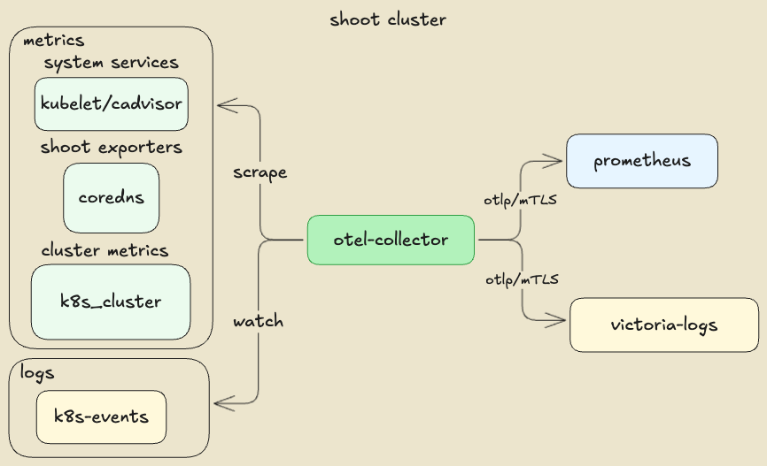
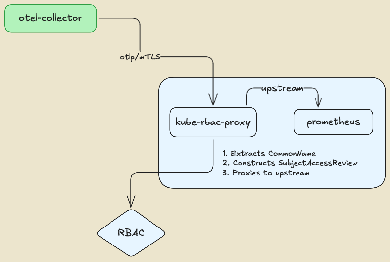
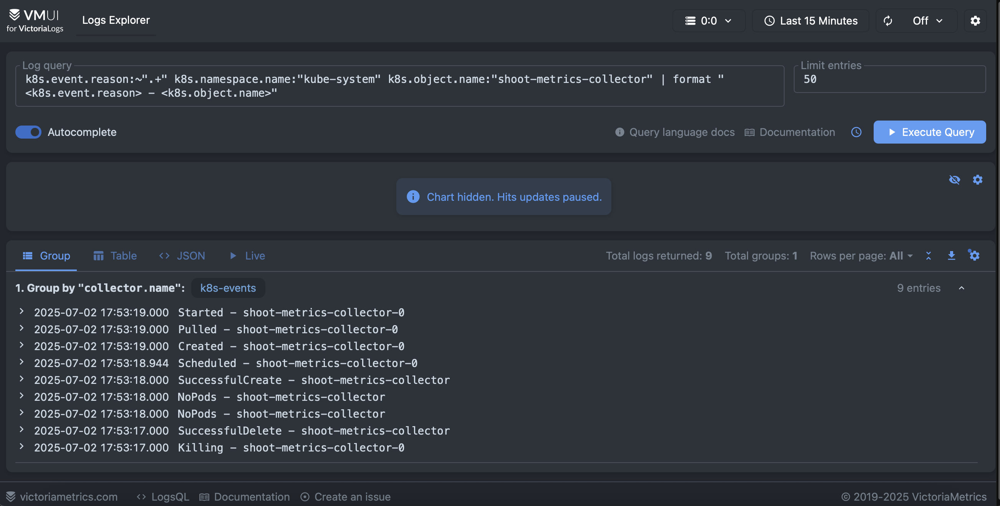
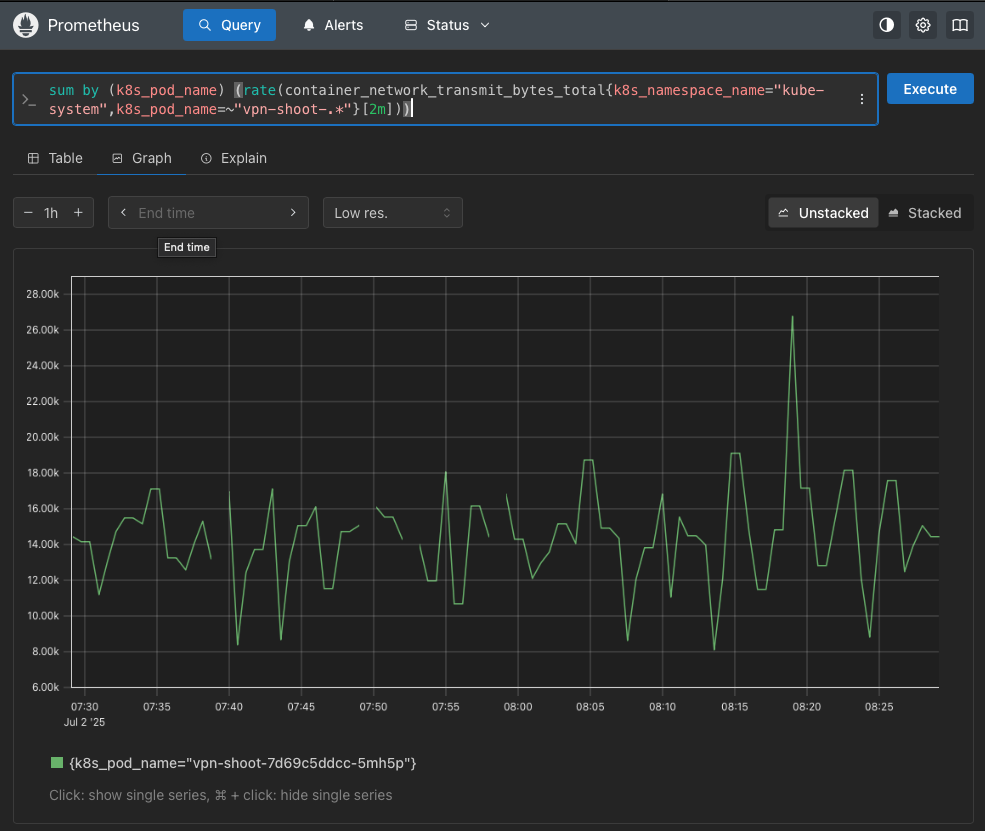

In this blog post, we will explore how to set up an [OpenTelemetry](https://opentelemetry.io/) based observability stack on a Gardener shoot cluster. OpenTelemetry is an open-source observability framework that provides a set of APIs, SDKs, agents, and instrumentation to collect telemetry data from applications and systems.
It provides a unified approach for collecting, processing, and exporting telemetry data such as traces, metrics, and logs. In addition, it gives flexibility in designing observability stacks, helping avoid vendor lock-in and allowing users to choose the most suitable tools for their use cases.

Here we will focus on setting up OpenTelemetry for a Gardener shoot cluster, collecting both logs and metrics and exporting them to various backends. We will use the [OpenTelemetry Operator](https://github.com/open-telemetry/opentelemetry-operator) to simplify the deployment and management of OpenTelemetry collectors on Kubernetes and demonstrate some best practices for configuration including security and performance considerations.

## Prerequisites

To follow along with this guide, you will need:

- A Gardener Shoot Cluster.
- `kubectl` configured to access the cluster.
- `shoot-cert-service` enabled on the shoot cluster, to manage TLS certificates for the OpenTelemetry Collectors and backends.

## Component Overview of the Sample OpenTelemetry Stack



## Setting Up a Gardener Shoot for mTLS Certificate Management

Here we use a self managed mTLS architecture with an illustration purpose. In a production environment, you would typically use a managed certificate authority (CA) or a service mesh to handle mTLS certificates and encryption. However, there might be cases where you want to have flexibility in authentication and authorization mechanisms, for example, by leveraging Kubernetes RBAC to determine whether a service is authorized to connect to a backend or not. In our illustration, we will use a `kube-rbac-proxy` as a sidecar to the backends, to enforce the mTLS authentication and authorization. The `kube-rbac-proxy` is a reverse proxy that uses Kubernetes RBAC to control access to services, allowing us to define fine-grained access control policies.



The `kube-rbac-proxy` extracts the identity of the client (OpenTelemetry collector) from the CommonName (CN) field of the TLS certificate and uses it to perform authorization checks against the Kubernetes API server. This enables fine-grained access control policies based on client identity, ensuring that only authorized clients can connect to the backends.

First, set up the `Issuer` certificate in the Gardener shoot cluster, allowing you to later issue and manage TLS certificates for the OpenTelemetry collectors and the backends. To allow a custom issuer, the shoot cluster shall be configured with the `shoot-cert-service` extension.

```yaml
kind: Shoot
apiVersion: core.gardener.cloud/v1beta1
metadata:
  name: my-shoot
  namespace: my-project
...
spec:
  extensions:
    - type: shoot-cert-service
      providerConfig:
        apiVersion: service.cert.extensions.gardener.cloud/v1alpha1
        kind: CertConfig
        shootIssuers:
          enabled: true
...
```

Once the shoot is reconciled, the `Issuer.cert.gardener.cloud` resources will be available.
We can use `openssl` to create a self-signed CA certificate that will be used to sign the TLS certificates for the OpenTelemetry Collector and backends.

```bash
openssl genrsa -out ./ca.key 4096
openssl req -x509 -new -nodes -key ./ca.key -sha256 -days 365 -out ./ca.crt -subj "/CN=ca"
# Create namespace and apply the CA secret and issuer
kubectl create namespace certs \
    --dry-run=client -o yaml | kubectl apply -f -

# Create the CA secret in the certs namespace
kubectl create secret tls ca --namespace certs \
    --key=./ca.key --cert=./ca.crt \
    --dry-run=client -o yaml | kubectl apply -f -
```

Next, we will create the cluster `Issuer` resource, referencing the CA secret we just created.

```yaml
apiVersion: cert.gardener.cloud/v1alpha1
kind: Issuer
metadata:
  name: issuer-selfsigned
  namespace: certs
spec:
  ca:
    privateKeySecretRef:
      name: ca
      namespace: certs
```

Later, we can create `Certificate` resources to securely connect the OpenTelemetry collectors to the backends.

## Setting Up the OpenTelemetry Operator

To deploy the OpenTelemetry Operator on your Gardener Shoot Cluster, we can use the [project helm chart](https://github.com/open-telemetry/opentelemetry-helm-charts/tree/main/charts/opentelemetry-operator) with a minimum configuration. The important part is to set the `collector` image to the latest `contrib` distribution image which determines the set of receivers, processors, and exporters plugins that will be available in the OpenTelemetry collector instance. There are several [pre-built distributions](https://github.com/open-telemetry/opentelemetry-collector-releases) available such as: `otelcol`, `otelcol-contrib`, `otelcol-k8s`, `otelcol-otlp`, and `otelcol-ebpf-profiler`. For the purpose of this guide, we will use the `otelcol-contrib` distribution, which includes a wide range of plugins for various backends and data sources.

```yaml
manager:
  collectorImage:
    repository: "otel/opentelemetry-collector-contrib"
```

## Setting Up the Backends (prometheus, victoria-logs)

Setting up the backends is a straightforward process. We will use plain resource manifests for illustration purposes, outlining the important parts allowing OpenTelemetry collectors to connect securely to the backends using mTLS. An important part is enabling the respective `OTLP` ingestion endpoints on the backends, which will be used by the OpenTelemetry collectors to send telemetry data. In a production environment, the lifecycle of the backends will be probably managed by the respective component's operators

### Setting Up Prometheus (Metrics Backend)

Here is the complete list of manifests for deploying a single prometheus instance with the `OTLP` ingestion endpoint and a `kube-rbac-proxy` sidecar for mTLS authentication and authorization:

- [Prometheus Certificate](./manifests/otel-prometheus/certificate.yaml)
  That is the serving certificate of the `kube-rbac-proxy` sidecar. The OpenTelemetry collector needs to trust the signing CA, hence we use the same `Issuer` we created earlier.
- [Prometheus](./manifests/otel-prometheus/prometheus.yaml)
  The prometheus needs to be configured to allow `OTLP` ingestion endpoint: [`--web.enable-OTLP-receiver`](https://prometheus.io/docs/guides/opentelemetry/#enable-the-OTLP-receiver). That allows the OpenTelemetry collector to push metrics to the Prometheus instance (via the `kube-rbac-proxy` sidecar).
- [Prometheus Configuration](./manifests/otel-prometheus/prometheus-config.yml)
  In Prometheus' case, the `OpenTelemetry` resource attributes usually set by the collectors can be used to determine labels for the metrics. This is illustrated in the collector's `prometheus` receiver configuration. A common and unified set of labels across all metrics collected by the OpenTelemetry collector is a fundamental requirement for sharing and understanding the data across different teams and systems. This common set is defined by the [OpenTelemetry Semantic Conventions](https://opentelemetry.io/docs/specs/semconv/) specification. For example ,`k8s.pod.name`, `k8s.namespace.name`, `k8s.node.name`, etc. are some of the common labels that can be used to identify the source of the observability signals. Those are also common across the different types of telemetry data (traces, metrics, logs), serving correlation and analysis use cases.
- [mTLS Proxy rbac](./manifests/otel-prometheus/mtls-rbac.yaml)
  This example defines a `Role` allowing requests to the prometheus backend to pass the kube-rbac-proxy.

  ```yaml
  rules:
  - apiGroups: ["authorization.kubernetes.io"]
    resources:
      - observabilityapps/prometheus
    verbs: ["get", "create"] # GET, POST
  ```

  In this example, we allow `GET` and `POST` requests to reach the prometheus upstream service, if the request is authenticated with a valid mTLS certificate and the identified user is allowed to access the Prometheus service by the corresponding `RoleBinding`. `PATCH` and `DELETE` requests are not allowed. The mapping between the http request methods and the Kubernetes RBAC verbs is seen at [kube-rbac-proxy/proxy.go](https://github.com/brancz/kube-rbac-proxy/blob/8d0b850862fc4dac71a0e2cbd8a3c8a1c5fdc61a/pkg/proxy/proxy.go#L47).

  ```yaml
  subjects:
  - apiGroup: rbac.authorization.k8s.io
    kind: User
    name: client
  ```

- [mTLS Proxy resource-attributes](./manifests/otel-prometheus/mtls-ra.yml)
  `kube-rbac-proxy` creates Kubernetes `SubjectAccessReview` to determine if the request is allowed to pass. The `SubjectAccessReview` is created with the `resourceAttributes` set to the upstream service, in this case the Prometheus service.

### Setting Up victoria-logs (Logs Backend)

In our example, we will use [victoria-logs](https://docs.victoriametrics.com/victorialogs/) as the logs backend. victoria-logs is a high-performance, cost-effective, and scalable log management solution. It is designed to work seamlessly with Kubernetes and provides powerful querying capabilities. It is important to note that any `OTLP` compatible backend can be used as a logs backend, allowing flexibility in choosing the best tool for the concrete needs.

Here is the complete manifests for deploying a single `victoria-logs` instance with the `OTLP` ingestion endpoint enabled and `kube-rbac-proxy` sidecar for mTLS authentication and authorization, using the upstream helm chart:

- [Victoria-Logs Certificate](./manifests/otel-victorialogs/certificate.yaml)
  That is the serving certificate of the `kube-rbac-proxy` sidecar. The OpenTelemetry collector needs to trust the signing CA hence we use the same `Issuer` we created earlier.
- [Victoria-Logs chart values](./manifests/otel-victorialogs/values.yaml)
  The certificate secret shall be mounted in the VictoriaLogs pod as a volume, as it is referenced by the `kube-rbac-proxy` sidecar.
- [Victoria-Logs mTLS Proxy rbac](./manifests/otel-victorialogs/mtls-rbac.yaml)
  There is no fundamental difference compared to how we configured the Prometheus mTLS proxy. The `Role` allows requests to the VictoriaLogs backend to pass the kube-rbac-proxy.
- [Victoria-Logs mTLS Proxy resource-attributes](./manifests/otel-victorialogs/mtls-ra.yml)

By now we shall have a working Prometheus and victoria-logs backends, both secured with mTLS and ready to accept telemetry data from the OpenTelemetry collector.

### Setting Up the OpenTelemetry Collectors

We are going to deploy two OpenTelemetry collectors: `k8s-events` and `shoot-metrics`. Both collectors will emit their own telemetry data in addition to the data collected from the respective receivers.

#### [k8s-events](./manifests/otel-collectors/k8s-events-otel.yaml) collector

In this example, we use 2 receivers:

- [k8s_events receiver](https://github.com/open-telemetry/opentelemetry-collector-contrib/tree/main/receiver/k8seventsreceiver) to collect Kubernetes events from the cluster.
- [k8s_cluster receiver](https://github.com/open-telemetry/opentelemetry-collector-contrib/tree/main/receiver/k8sclusterreceiver) to collect Kubernetes cluster metrics.

Here is an example of Kubernetes events persited in the `victoria-logs` backend. It filters logs which represents events from `kube-system` namesapce related to a rollout restart of the target statefulset. Then it formats the UI to show the event reason and object name.


The collector features few important configurations related to reliability and performance.
The collected metrics points are are sent in batches to the Prometheus backend using the corresponding OTLP exporter and the memory consumption of the collector is also limited. In general, it is always a good practice to set a memory limiter and batch processing in the collector pipeline.

```yaml
processors:
  memory_limiter:
    check_interval: 1s
    limit_percentage: 80
    spike_limit_percentage: 2
  batch:
    timeout: 5s
    send_batch_size: 1000
```

Allowing the collector to emit its own telemetry data is configured in the service section of the collector configuration.

```yaml
service:
  # Configure the collector own telemetry
  telemetry:
    # Emit collector logs to stdout, you can also push them to a backend.
    logs:
      level: info
      encoding: console
      output_paths: [stdout]
      error_output_paths: [stderr]
    # Push collector internal metrics to Prometheus
    metrics:
      level: detailed
      readers:
        - # push metrics to Prometheus backend
          periodic:
            interval: 30000
            timeout: 10000
            exporter:
              OTLP:
                protocol: http/protobuf
                endpoint: "${env:PROMETHEUS_URL}/api/v1/OTLP/v1/metrics"
                insecure: false # Ensure server certificate is validated against the CA
                certificate: /etc/cert/ca.crt
                client_certificate: /etc/cert/tls.crt
                client_key: /etc/cert/tls.key
```

The majority of the samples use an prometheus receiver to scrape the collector metrics endpoint, however that is not a clean solution because it puts the metrics via the pipeline, thus consuming resources and potentially causing performance issues. Instead, we use the `periodic` reader to push the metrics directly to the Prometheus backend.

Since the `k8s-events` collector obtains telemetry data from the kube-apiserver, it requires a corresponding set of permissions defined at [k8s-events rbac](./manifests/otel-collectors/k8s-events-rbac.yaml) manifests.

#### [shoot-metrics](./manifests/otel-collectors/shoot-metrics-otel.yaml) collector

In this example, we have a single receiver:

- [prometheus receiver](https://github.com/open-telemetry/opentelemetry-collector-contrib/tree/main/receiver/prometheusreceiver) scraping metrics from Gardener managed exporters present in the shoot cluster, including the `kubelet` system service metrics. This receiver accepts standard Prometheus scrape configurations using `kubernetes_sd_configs` to discover the targets dynamically. The `kubernetes_sd_configs` allows the receiver to discover Kubernetes resources such as pods, nodes, and services, and scrape their metrics endpoints.

Here, the example illustrates the `prometheus` receiver scraping metrics from the `kubelet` service, adding node kubernetes labels as labels to the scraped metrics and filtering the metrics to keep only the relevant ones. Since the kubelet metrics endpoint is secured, it needs the corresponding bearer token to be provided in the scrape configuration. The bearer token is automatically mounted in the pod by Kubernetes, allowing the OpenTelemetry collector to authenticate with the kubelet service.

```yaml
- job_name: shoot-kube-kubelet
  honor_labels: false
  scheme: https
  tls_config:
    insecure_skip_verify: true
  metrics_path: /metrics
  bearer_token_file: /var/run/secrets/kubernetes.io/serviceaccount/token
  kubernetes_sd_configs:
    - role: node
  relabel_configs:
    - source_labels:
        - job
      target_label: __tmp_prometheus_job_name
    - target_label: job
      replacement: kube-kubelet
      action: replace
    - target_label: type
      replacement: shoot
      action: replace
    - source_labels:
        - __meta_kubernetes_node_address_InternalIP
      target_label: instance
      action: replace
    - regex: __meta_kubernetes_node_label_(.+)
      action: labelmap
      replacement: "k8s_node_label_$${1}"
  metric_relabel_configs:
    - source_labels:
        - __name__
      regex: ^(kubelet_running_pods|process_max_fds|process_open_fds|kubelet_volume_stats_available_bytes|kubelet_volume_stats_capacity_bytes|kubelet_volume_stats_used_bytes|kubelet_image_pull_duration_seconds_bucket|kubelet_image_pull_duration_seconds_sum|kubelet_image_pull_duration_seconds_count)$
      action: keep
    - source_labels:
        - namespace
      regex: (^$|^kube-system$)
      action: keep
```

The collector also illustrates collecting metrics from `cadvisor` endpoints and Gardener specific exporters such as
`shoot-apiserver-proxy`, `shoot-coredns`, etc. The exporters usually reside in the `kube-system` namespace and are configured to expose metrics on a specific port.

Since we aimed at unified set of resources attribues accross all telemetry data, we can translate exporters metrics which do not conform the conventions in OpenTelemetry.
Here is an example of translating the metrics, produced by the kubelet, to the OpenTelemetry conventions using the `transform/metrics` processor:

```yaml
# Convert Prometheus metrics names to OpenTelemetry metrics names
transform/metrics:
  error_mode: ignore
  metric_statements:
    - context: datapoint
      statements:
        - set(attributes["k8s.container.name"], attributes["container"]) where attributes["container"] != nil
        - delete_key(attributes, "container") where attributes["container"] != nil
        - set(attributes["k8s.pod.name"], attributes["pod"]) where attributes["pod"] != nil
        - delete_key(attributes, "pod") where attributes["pod"] != nil
        - set(attributes["k8s.namespace.name"], attributes["namespace"]) where attributes["namespace"] != nil
        - delete_key(attributes, "namespace") where attributes["namespace"] != nil
```

Here is a visualization of `container_network_transmit_bytes_total` metric collected from the `cadvisor` endpoint of the `kubelet` service, showing the network traffic in bytes transmitted by the `vpn-shoot` containers.


Similarly to the `k8s-events` collector, the `shoot-metrics` collector also emits its own telemetry data, including metrics and logs. The collector is configured to push its own metrics to the Prometheus backend using the `periodic` reader, avoiding the need for a separate Prometheus scrape configuration. It requires a corresponding set of permissions defined at [shoot-metrics rbac](./manifests/otel-collectors/shoot-metrics-rbac.yaml) manifest.

## Summary

In this blog post, we have explored how to set up an OpenTelemetry based observability stack on a Gardener Shoot Cluster. We have demonstrated how to deploy the OpenTelemetry Operator, configure the backends prometheus and victoria-logs), and deploy OpenTelemetry collectors to obtain telemetry data from the cluster. We have also discussed best practices for configuration, including security and performance considerations. In this blog we have shown the unified set of resource attributes that can be used to identify the source of the telemetry data, allowing correlation and analysis across different teams and systems. We have demonstrated how to transform metrics labels which do not conform to the OpenTelemetry conventions, achieving a unified set of labels across all telemetry data. Finally, we have illustrated how to securely connect the OpenTelemetry collectors to the backends using mTLS and `kube-rbac-proxy` for authentication and authorization.

We hope this guide will inspire you to get started with OpenTelemetry on a Gardener managed shoot cluster and equip you with ideas and best practices for building a powerful observability stack that meets your needs. For more information, please refer to the [OpenTelemetry documentation](https://opentelemetry.io/docs/) and the [Gardener documentation](https://gardener.cloud/docs/).

## Manifests List

- [Prometheus certificate](./manifests/otel-prometheus/certificate.yaml)
- [Prometheus workload](./manifests/otel-prometheus/prometheus.yaml)
- [Prometheus configuration](./manifests/otel-prometheus/prometheus-config.yml)
- [Prometheus mTLS proxy rbac](./manifests/otel-prometheus/mtls-rbac.yaml)
- [Prometheus mTLS proxy resource-attributes](./manifests/otel-prometheus/mtls-ra.yml)

- [Victoria-Logs certificate](./manifests/otel-victorialogs/certificate.yaml)
- [Victoria-Logs helm chart values](./manifests/otel-victorialogs/values.yaml)
- [Victoria-Logs mTLS proxy rbac](./manifests/otel-victorialogs/mtls-rbac.yaml)
- [Victoria-Logs mTLS proxy resource-attributes](./manifests/otel-victorialogs/mtls-ra.yml)

- [OpenTelemetry collectors client certificate](./manifests/otel-collectors/otel-certificate.yaml)
- [K8S-Events collector](./manifests/otel-collectors/k8s-events-otel.yaml)
- [K8S-Events rbac](./manifests/otel-collectors/k8s-events-rbac.yaml)
- [Shoot-Metrics collector](./manifests/otel-collectors/shoot-metrics-otel.yaml)
- [Shoot-Metrics rbac](./manifests/otel-collectors/shoot-metrics-rbac.yaml)
