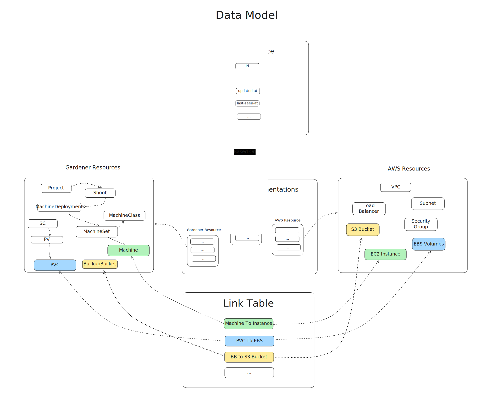
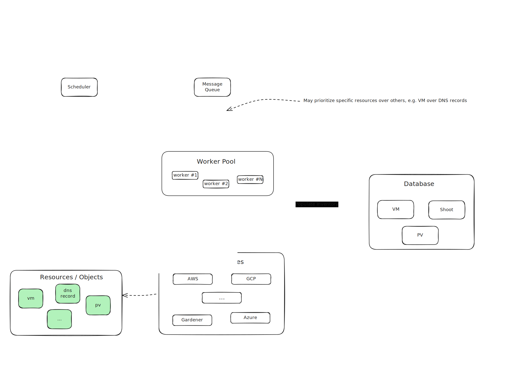
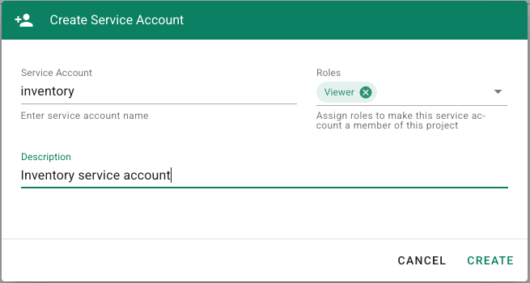
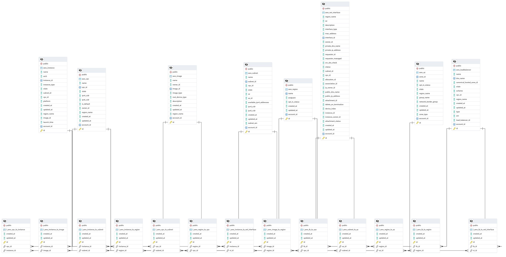
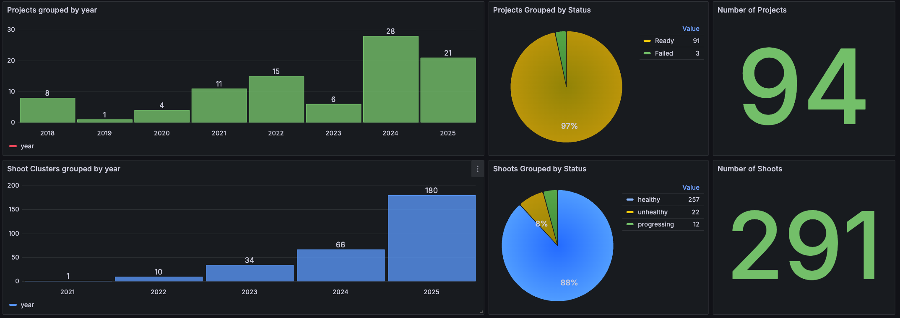
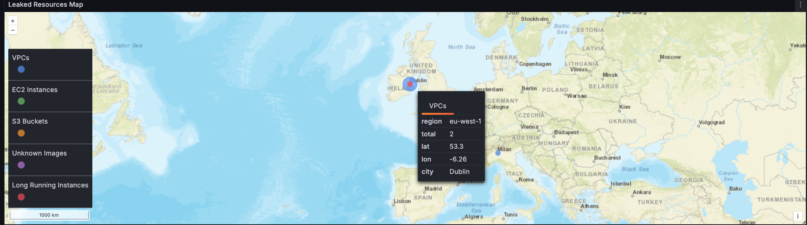
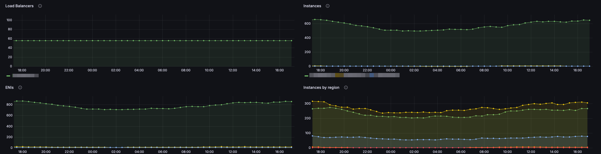
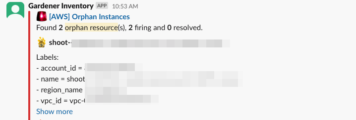
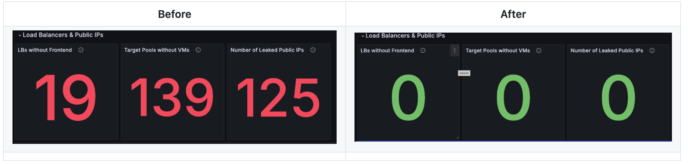

# Keeping Track of Your Cloud Resources with Gardener Inventory

Running Kubernetes clusters at scale comes with its own challenges.

How do you keep track of the resources under your control? How can you tell if a
resource has become orphaned and has started adding up to your monthly cloud cost?

This post introduces [gardener/inventory](https://github.com/gardener/inventory)
and shows how the Gardener project keeps track of the cloud resources it manages
in the various cloud providers such as GCP, AWS, Azure, and OpenStack.

It will also show how we can identify orphaned resources through a simple, yet
effective mechanism, by collecting and reporting from the respective cloud
providers.

## What is Gardener Inventory?

The Gardener Inventory is a system that collects resources from various data 
sources and persists them in a database, establishing relationships between 
the collected resources.

The collected data can be later analyzed to show the relationship and
dependencies between the various resources.

The diagram below provides a high-level overview of the data model for the
Inventory system.



Each Gardener resource tracked by Inventory is mapped to its corresponding
hyperscaler resource, e.g., a `Machine` resource on the Gardener side maps to a
virtual machine instance in GCP, AWS, Azure or OpenStack.

This allows us to ask different questions to the system:

- Do all my hyperscaler virtual machines map to a Gardener Machine?
- Do I have any unknown hyperscaler virtual machines?
- etc.

For more details about the design, please refer to the [Design
Goals](https://github.com/gardener/inventory/blob/main/docs/design.md) document.

## How does resource collection work?

This diagram shows a high-level overview of the collection mechanism implemented
by Inventory.



The Inventory `scheduler` is responsible for enqueuing tasks on regular basis to
a message queue. These tasks are then consumed and processed by the Inventory
`workers`. Each task is self-contained and independent from the rest of the
tasks in the system.

With this approach, that means that a single task failure does not affect any of
the other tasks in the system. That also means that we can run collection of
different resources at the same time (e.g., EC2 instances, VPCs, buckets, etc.)
and let the system take care of the automatic retry and recovery for us.

This is a typical [Event-driven architecture](https://en.wikipedia.org/wiki/Event-driven_architecture).

Another benefit of this architecture is that we can assign priorities for our
tasks, e.g., we may want to prioritize collection of virtual machines over
anything else.

## Requirements

In order to build and start using Inventory locally, you would need:

- Go 1.24.x
- Docker

When running Inventory locally, it is recommended that you use the provided
[docker-compose.yaml](https://github.com/gardener/inventory/blob/main/docker-compose.yaml)
manifest, which will start up all services for you. In order to start the
services locally, first clone the `gardener/inventory` repo and then run the
following command:

``` shell
make docker-compose-up
```

Alternatively, you can build the `inventory` CLI locally by using the `build`
makefile target:

``` yaml
make build
```

For running Inventory in a Kubernetes cluster, please refer to the provided
[kustomize manifests](https://github.com/gardener/inventory/tree/main/deployment/kustomize).

When using the kustomize manifests, make sure that you also create a separate
`config` overlay, which will provide your specific configuration for
`scheduler`, `worker`, `database`, etc. For more details, please check the
[deployment/kustomize/config](https://github.com/gardener/inventory/tree/main/deployment/kustomize/config)
overlay, which provides an example config file that you can customize.

When running Inventory in production environments, it is recommended that you
deploy Inventory in a Kubernetes cluster and configure [OIDC
trust](https://en.wikipedia.org/wiki/OpenID) between your Kubernetes workload
and the respective hyperscaler. With OIDC federation configured, the Inventory
workers will use short-lived credentials, so you don't need to worry about
maintaining any static long-lived credentials.

For more details on how to setup OIDC trust between your Inventory cluster and
the respective hyperscalers, please refer to the following documents:

- [OIDC trust between Inventory and AWS](https://github.com/gardener/inventory/blob/main/docs/oidc-aws.md)
- [OIDC trust between Inventory and GCP](https://github.com/gardener/inventory/blob/main/docs/oidc-gcp.md)
- [OIDC trust between Inventory and Azure](https://github.com/gardener/inventory/blob/main/docs/oidc-azure.md)

Please make sure that you also check the following documents, which provide
additional details on how to get started with the developing Inventory and
operating it:

- [Inventory Development Guide](https://github.com/gardener/inventory/blob/main/docs/development.md)
- [Inventory Operations Guide](https://github.com/gardener/inventory/blob/main/docs/ops-guide.md)

## Configuration

Inventory is flexible enough and you can configure it to collect from specific
datasources only. For example, if you are running your workloads in AWS only,
then you would configure Inventory to collect from AWS, and leave the rest of
the datasources deactivated.

Before we start collecting and mapping resources with Inventory, we would need a
Gardener Project and a hyperscaler account from which resources will be
collected.

While Gardener resources collection can be deactivated as well, it is not
recommended to do so, since we want to map hyperscaler resources with Gardener
resources. This way, Inventory can map resources together and detect when orphan
resources (e.g., virtual machines, disks, etc.) exist in the hyperscaler.

If your source-of-truth system is different from Gardener, then Inventory can be
extended to support other data sources, which provide additional resources.

An example of such an extension is the
[gardener/inventory-extension-odg](https://github.com/gardener/inventory-extension-odg),
which plugs into an existing Inventory deployment in order to integrate with
[Open Component Model](https://github.com/open-component-model) for reporting
compliance issues caused by leaked resources.

It is also recommended that you check the [example config
file](https://github.com/gardener/inventory/blob/main/examples/config.yaml),
which is well documented and provides details about each config section. In this
post we will focus on specific config sections only, but please make sure to
refer to the sample config for more details on each setting.

In order to keep things simple and easier to follow, we will be configuring
Inventory to collect from Gardener and AWS only. For configuring Inventory with
other datasources (e.g., GCP, Azure, OpenStack, etc.), please refer to the
documentation provided in the
[gardener/inventory](https://github.com/gardener/inventory) repository.

> [!NOTE]
> When configuring Inventory for collection against remote systems, bear in mind
> that Inventory itself requires read-only permissions. Keep that in mind when
> configuring your RBAC roles for Inventory in the respective system and grant
> it read-only access.

First, we will configure Inventory and grant it access to our Gardener
Project. In order to do that, navigate to the Gardener Dashboard, select your
project and go to the `Members` section. Then add a new service account.



After the service account has been created, you should download its
`kubeconfig`, which we will configure in the next step. This snippet represents
the `gardener` config section of our configuration file.

``` yaml
# Gardener specific configuration
gardener:
  is_enabled: true

  # Specifies the endpoint of the Gardener APIs.
  endpoint: https://api.dev.gardener.cloud.sap

  # User-Agent to set for the API clients
  user_agent: gardener-inventory/0.1.0

  # Authentication mechanism to use when communicating with the Gardener APIs.
  # Supported mechanisms are `in_cluster', `token_path' and `kubeconfig'.
  authentication: kubeconfig

  # Path to kubeconfig file to use. Should be used with `kubeconfig'
  # authentication only.
  kubeconfig: /path/to/inventory-sa-kubeconfig.yaml
```

> [!NOTE]
> Other authentication mechanisms exist as well. For example, instead of using a
> static kubeconfig when accessing your Gardener Project, you could configure
> Inventory to leverage OIDC trust instead and use a token signed by a trusted
> IdP. For more details and examples, please refer to the examples/config.yaml
> file.

Next, we will configure Inventory for collecting resources from AWS. Here is a
sample configuration file for AWS, which configures the `worker` to use the
shared AWS credentials file (`~/.aws/credentials`) when authenticating against
the AWS APIs.

``` yaml
# AWS specific configuration
aws:
  # Setting `is_enabled' to false would not create API clients for AWS, and as a
  # result Inventory will not process any of the AWS collection tasks.
  is_enabled: true

  region: eu-central-1  # Frankfurt
  default_region: eu-central-1  # Frankfurt
  app_id: gardener-inventory  # Optional application specific identifier

  # This section provides configuration specific to each AWS service and which
  # named credentials are used for each service. This allows Inventory to
  # connect to multiple AWS accounts based on the named credentials which are
  # used. Inventory will connect to all configured named credentials (accounts)
  # during collection from the respective AWS service.
  services:
    ec2:
      use_credentials:
        - my-aws-account
    elb:
      use_credentials:
        - my-aws-account
    elbv2:
      use_credentials:
        - my-aws-account
    s3:
      use_credentials:
        - my-aws-account

  # The `credentials' section provides named credentials, which are used by the
  # various AWS services. The currently supported token retrievers are `none',
  # `kube_sa_token', and `token_file'. See docs/oidc-aws.md for more details.
  credentials:
    my-aws-account:
      # When using `none' as the token retriever, only the shared AWS
      # credentials file (~/.aws/credentials) is used.
      token_retriever: none
```

> [!NOTE]
> The example AWS config file above uses a named credential, which authenticates
> against AWS using the shared credentials file ~/.aws/credentials. This
> approach is good enough for local testing during development, but when running
> in production environments it is recommended that you leverage OIDC trust and
> use short-lived access tokens instead.  Make sure that you check the
> examples/config.yaml file for additional examples on how to configure OIDC
> trust between an Inventory cluster and AWS.

Collection may be configured for multiple AWS accounts as well. In case you need
to collect from multiple AWS accounts, make sure to configure them in the
`aws.credentials` section, and enable these accounts in the respective
`aws.services` section.

If you are using the provided
[docker-compose.yaml](https://github.com/gardener/inventory/blob/main/docker-compose.yaml)
file for local development, then all required services will be started up for
you. This includes the PostgreSQL database, Valkey, `scheduler`, `worker`,
etc. In case you need to connect Inventory to an external PostgreSQL database or
a Redis/Valkey instance, then make sure to configure them in their respective
configuration sections. This would be the `database` and `redis` config
sections.

Also, make sure that you check the [Inventory Operations
Guide](https://github.com/gardener/inventory/blob/main/docs/ops-guide.md), which
provides additional details on how to configure Inventory to use multiple config
files, use environment variables, and how to interface with the `inventory` CLI.

## Getting Started

Before we start collecting data, we need to initialize the database. The commands
below assume that you already have everything configured and your config file is
exposed via the `INVENTORY_CONFIG` environment variable.

``` shell
export INVENTORY_CONFIG=/path/to/inventory/config.yaml
```

Initialize and migrate the database.

> [!NOTE]
> Database initialization and migration is handled automatically by the provided
> Docker and Kubernetes manifests. You need to run these commands only if you
> are running a local environment of Inventory.

``` shell
$ inventory db init
$ inventory db migrate
database migrated to group #1 (200 migrations (20240522121536 ... 20250715110847))
```

Check the status of the database.

``` shell
$ inventory db status
pending migration(s): 0
database version: group #1 (200 migrations (20240522121536 ... 20250715110847))
database is up-to-date
```

We can now start up the `worker`. In order to start the `worker`, run the
following command.

``` shell
$ inventory worker start
```

You should see a similar output showing the worker being initialized and ready
to process tasks.

``` shell
time=2025-08-08T13:20:50.675+03:00 level=INFO msg="configuring Gardener API client" authentication=kubeconfig kubeconfig=/path/to/inventory-sa-kubeconfig.yaml
time=2025-08-08T13:20:50.675+03:00 level=INFO msg="configured Gardener API client" host=https://api.dev.gardener.cloud.sap
time=2025-08-08T13:20:50.675+03:00 level=INFO msg="configuring db client"
time=2025-08-08T13:20:50.675+03:00 level=INFO msg="configuring asynq client"
time=2025-08-08T13:20:50.675+03:00 level=INFO msg="configuring asynq inspector"
time=2025-08-08T13:20:50.675+03:00 level=WARN msg="Vault is not enabled, will not create API clients"
time=2025-08-08T13:20:50.675+03:00 level=WARN msg="GCP is not enabled, will not create API clients"
time=2025-08-08T13:20:50.675+03:00 level=WARN msg="Azure is not enabled, will not create API clients"
time=2025-08-08T13:20:50.675+03:00 level=WARN msg="OpenStack is not enabled, will not create API clients"
time=2025-08-08T13:20:50.675+03:00 level=INFO msg="registered task" name=aux:task:delete-archived-tasks
time=2025-08-08T13:20:50.675+03:00 level=INFO msg="registered task" name=gcp:task:collect-all
time=2025-08-08T13:20:50.675+03:00 level=INFO msg="registered task" name=aws:task:collect-azs
time=2025-08-08T13:20:50.675+03:00 level=INFO msg="registered task" name=aws:task:collect-instances
...
...
...
time=2025-08-08T13:20:50.675+03:00 level=INFO msg="registered task" name=g:task:collect-aws-machine-images
time=2025-08-08T13:20:50.675+03:00 level=INFO msg="registered task" name=gcp:task:collect-vpcs
time=2025-08-08T13:20:50.675+03:00 level=INFO msg="worker concurrency" level=100
time=2025-08-08T13:20:50.675+03:00 level=INFO msg="queue priority" strict=false
time=2025-08-08T13:20:50.675+03:00 level=INFO msg="queue configuration" name=default priority=1
asynq: pid=9332 2025/08/08 10:20:50.675999 INFO: Starting processing
asynq: pid=9332 2025/08/08 10:20:50.676050 INFO: Send signal TSTP to stop processing new tasks
asynq: pid=9332 2025/08/08 10:20:50.676052 INFO: Send signal TERM or INT to terminate the process
time=2025-08-08T13:20:50.676+03:00 level=INFO msg="starting metrics server" address=:6080 path=/metrics
```

We can list the currently running workers by using the `worker list`
sub-command, e.g.:

``` shell
$ inventory worker list
 HOST       │ PID  │ CONCURRENCY │ STATUS │ PROCESSING │ UPTIME       │ QUEUES
────────────┼──────┼─────────────┼────────┼────────────┼──────────────┼───────────
 some.node  │ 9332 │ 100         │ active │ 0          │ 4m10.282643s │ default:1
```

We can submit tasks to the Inventory workers by using the `inventory task submit`
sub-command. Usually, tasks are enqueued by the `scheduler` on
regular basis, so that collection happens periodically, but here we will show
how to trigger an ad-hoc task execution.

Make sure that you also check the `examples/config.yaml` file which provides
details about the existing tasks and the payloads they expect. The following
specifies a task payload, which will collect Gardener resources from a specific
project only.

``` yaml
---
project_name: my-project-name
```

In order to run an ad-hoc task for projects collection, we can run the
following command.

``` shell
$ inventory task submit --task g:task:collect-projects --payload-file /path/to/payload.yaml
default/0afa4bc2-d8f1-48d3-b7a9-351fc627b168
```

Check the `worker` logs and you should see the project being collected, e.g.:

``` shell
time=2025-08-08T13:41:20.650+03:00 level=INFO msg="received task" task_id=0afa4bc2-d8f1-48d3-b7a9-351fc627b168 task_queue=default task_name=g:task:collect-projects
time=2025-08-08T13:41:20.650+03:00 level=INFO msg="collecting Gardener project" task_id=0afa4bc2-d8f1-48d3-b7a9-351fc627b168 task_queue=default task_name=g:task:collect-projects project=my-project-name
time=2025-08-08T13:41:20.858+03:00 level=INFO msg="populated gardener projects" task_id=0afa4bc2-d8f1-48d3-b7a9-351fc627b168 task_queue=default task_name=g:task:collect-projects count=1
time=2025-08-08T13:41:20.864+03:00 level=INFO msg="populated gardener project members" task_id=0afa4bc2-d8f1-48d3-b7a9-351fc627b168 task_queue=default task_name=g:task:collect-projects count=2
time=2025-08-08T13:41:20.864+03:00 level=INFO msg="task finished" task_id=0afa4bc2-d8f1-48d3-b7a9-351fc627b168 task_queue=default task_name=g:task:collect-projects duration=213.589417ms
```

In order to collect all shoots from all known projects, we can invoke the
`g:task:collect-shoots` task, e.g.:

``` shell
$ inventory task submit --task g:task:collect-shoots
```

Notice that we haven't specified any payload for this task. In this case,
Inventory uses the already known Gardener projects and internally enqueues tasks for each of them.

This mechanism allows Inventory to perform dynamic task enqueuing based on
already collected data, such as the project we've collected in the previous
step. In other words, already known top-level resources allow dynamic
collection of other sub-resources, as is the case with the `shoots` from this
example.

The same mechanism is used for other data sources. For example, collecting AWS
regions enables the sub-sequent collection of all VPCs from these regions, which
in turn enable collection of all EC2 instances, subnets, etc. from the
discovered VPCs.

> [!NOTE]
> The `inventory task submit` command is usually used for running ad-hoc tasks.
> In production environments, these tasks and their respective payloads will be
> enqueued by the Inventory Scheduler instead.

## Monitoring and Reporting

Querying collected data may be done either via SQL queries against the database
or via the `inventory model query` sub-command.

This example shows how to generate a simple report of the collected AWS
instances using a [text/template](https://pkg.go.dev/text/template) provided to
the `inventory` CLI.

``` shell
$ inventory model query \
    --model aws:model:instance \
    --template '{{ range . }}{{ printf "%s is %s\n" .Name .State}}{{end}}'
```

Example output:

``` shell
shoot--foo--worker-a-z1-996c4-rbwtz is running
shoot--bar--worker-hln3f-z2-6d5fb-mxv6d is running
shoot--baz--worker-qlbgk-z1-b67b7-t56wt is terminated
```

The `inventory model query` command also understands relationships between
resources, which allows us to generate more complex reports by loading resources,
as well as any related to them resources.

This command, for example, can be used to generate a report of the collected
Gardener `Project` resources, but also loads the `Shoot` and `Member`
relationships, allowing us to report on related data.

``` shell
inventory model query \
    --model g:model:project \
    --relation Shoots \
    --relation Members \
    --template-file gardener-projects-report.tmpl
```

Additional examples on how to query the data in Inventory by using SQL queries
or the CLI can be found in the following documents:

- [Database Queries](https://github.com/gardener/inventory/blob/main/docs/db-queries.md)
- [Querying Models](https://github.com/gardener/inventory/blob/main/docs/ops-guide.md#querying-models)

The provided
[docker-compose.yaml](https://github.com/gardener/inventory/blob/main/docker-compose.yaml)
also comes with a [pgadmin](https://www.pgadmin.org/) service, which you can use
to query and inspect the schema, which is handy when you need to familiarize
yourself with the existing schema.



In order to get better insights of the data collected by Inventory, you can
connect your Inventory database with [Metabase](https://www.metabase.com/),
[Grafana](https://grafana.com/) or [Apache Superset](https://superset.apache.org/).

This would make it possible to create nice reports and provide various
dashboards for your users, if needed.

Additionally, you may want to connect the Inventory database with your [ITSM
system](https://en.wikipedia.org/wiki/IT_service_management). That
way Inventory can be used to enable various IT processes, if needed.

Besides the data collected from various data sources, Inventory exposes metrics
about its inner workings, which can be scraped, for example, by
[Prometheus](https://prometheus.io/) and can also be used for alerting.

The following screenshot shows a summary of some of the data collected from a
Gardener landscape.



This screenshot here displays a map of resources identified by Inventory as
being orphaned.



And here we can see some of the `worker` metrics, showing us information about
the AWS-related tasks.



Hooking up Inventory with your alerting system allows for early notification of
orphan resources as soon as they are being discovered. Here we can see Inventory
posting an alert about orphan EC2 instances in Slack.



Ever since our team started using Inventory to track our hyperscaler
resources, we have identified a significant number of virtual machines
that have long been forgotten and unused, a.k.a orphaned VMs. Besides virtual machines,
we've discovered a big number of unaccounted for and no longer in use disks, so
we've cleaned those up and saved some space.

Reserved, but unused public IP addresses are also part of resources which we are
actively tracking, and we've discovered more than a hundred public IPs in one of
our environments, which we've cleaned up well.



Inventory helped with keeping our garden clean and cut some cloud costs.

## References

Please refer to the following documents for more information about Inventory,
how to use it and start tracking your cloud resources with it.

- [gardener/inventory repository](https://github.com/gardener/inventory)
- [OIDC trust between Inventory and AWS](https://github.com/gardener/inventory/blob/main/docs/oidc-aws.md)
- [OIDC trust between Inventory and GCP](https://github.com/gardener/inventory/blob/main/docs/oidc-gcp.md)
- [OIDC trust between Inventory and Azure](https://github.com/gardener/inventory/blob/main/docs/oidc-azure.md)
- [Inventory Development Guide](https://github.com/gardener/inventory/blob/main/docs/development.md)
- [Inventory Operations Guide](https://github.com/gardener/inventory/blob/main/docs/ops-guide.md)
- [Inventory Database Queries](https://github.com/gardener/inventory/blob/main/docs/db-queries.md)
- [Inventory Kubernetes manifests](https://github.com/gardener/inventory/blob/main/deployment)
