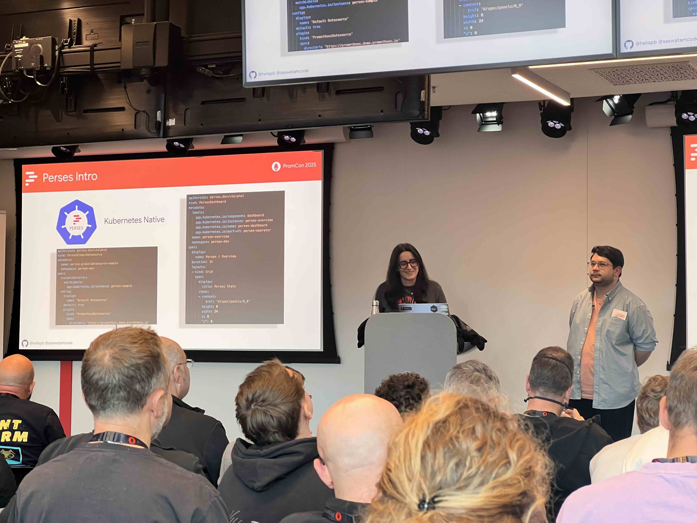

# PromCon EU 2025 Highlights

PromCon EU 2025, the 10th annual conference for Prometheus users and developers, took place on October 21st and 22nd. After being held in Berlin for two years, the event was kindly hosted by Google in Munich again this year. Since Prometheus and related tools are the core of Gardener's monitoring stack, we were excited to attend, connect with the community, and learn about the latest developments in the Prometheus ecosystem.

## OpenTelemetry and Prometheus

After OpenTelemetry support was added with Prometheus 3.0, the community is still discussing how the OpenTelemetry and Prometheus ecosystems can coexist in the best way. Julius Volz started with a talk about the advantages of Prometheus' native instrumentation. György Krajcsovits and Bartłomiej Płotka gave a preview of the planned changes for OpenMetrics 2.0. The new OpenMetrics version aims to integrate features into the standard that have already been added to Prometheus. While these two talks pointed out that the Prometheus concepts still have relevance, the OpenTelemetry support in Prometheus improves. Fiona Liao presented her work to improve the support for metrics with delta temporality in Prometheus. Arve Knudsen and Owen Williams contributed numerous improvements to the OTLP compatibility and ingestion performance. The topic was concluded by Victoria Nduka and Andrej Kiripolský presenting a UX research report about the different possibilities to improve handling OpenTelemetry Resource Attributes. Victoria's work was kindly supported through the CNCF's LFX mentorship program.

## Generated Observability

Who has not experienced empty dashboard panels or missing alerts because of misspelled metric names, changed labels, or similar errors? Arthur Sens and Dominik Süß demonstrated the use of OpenTelemetry Weaver to make observability type-safe and, with that, more robust by avoiding such errors. Using Jsonnet to generate the configuration of a monitoring system is a controversial approach. While it clearly helps to eliminate redundancy, the added tooling and complexity are drawbacks. Its generality makes it hard to validate the semantic correctness of the generated configuration. Saswata Mukherjee and Hélia Barroso addressed Jsonnet's issues by generating a monitoring configuration with pure Go code. Their approach targets, among other things, the Perses dashboard and has the potential to simplify the diverse ecosystem of monitoring mixins.

## AI Everywhere

The ongoing AI trend certainly does not exclude the monitoring domain. Pavan Yekbote demonstrated an agent built for a simplified root cause analysis. The agent is based on well-known large language models and utilizes the MCP protocol to access observability data from Prometheus and OpenSearch. Kyle Hounslow presented an AI agent that generates PromQL statements from natural language and utilized the HolmesGPT agentic AI framework for the implementation.

## A New Persistence Layer for Prometheus?

While Prometheus' time-series database (TSDB) is highly optimized, it has its limitations when storing high cardinality data or outsourcing blocks to an object store. Jesus Vazquez, Alan Protasio, and Michael Hoffmann joined forces to implement a prototype that replaces the TSDB with Parquet files as the persistence layer. Their evaluation showed promising results regarding resource consumption and opened the discussion about the future of Prometheus' storage engine. Ruihang Xia went in a similar direction with his attempt to implement a Prometheus-like system purely in Rust, using existing tooling to persist metrics in the Parquet format.

## Alertmanager with Amnesia

People often struggle with Alertmanager clusters to drop their state after a restart of different monitoring components. After the problem was already presented in a lightning talk on the first conference day, Joel Verezhak proposed a solution to that problem by persisting Alertmanager's state before a shutdown. As a Gardener operator, you might have experienced the enormous waste of disk space caused by attaching a persistent volume to each Alertmanager instance just to store a few kilobytes of data. We were excited to see Giantswarm's silence-operator, presented in a lightning talk, that utilizes Kubernetes CRDs to persist silenced alerts and has the potential to solve both the state inconsistency and disk space waste problems.

## Visiting Bavaria

Besides excellent content, the conference organizers provided the chance to experience some of the local culture during the social event after the first conference day. The conference participants had the opportunity to visit Augustiner Bräustuben, one of Munich's traditional beer halls, and enjoy Bavarian food and drinks. One of the conference organizers demonstrated that they were not just able to organize a great conference, but also had the talent of tapping a wooden beer barrel.
