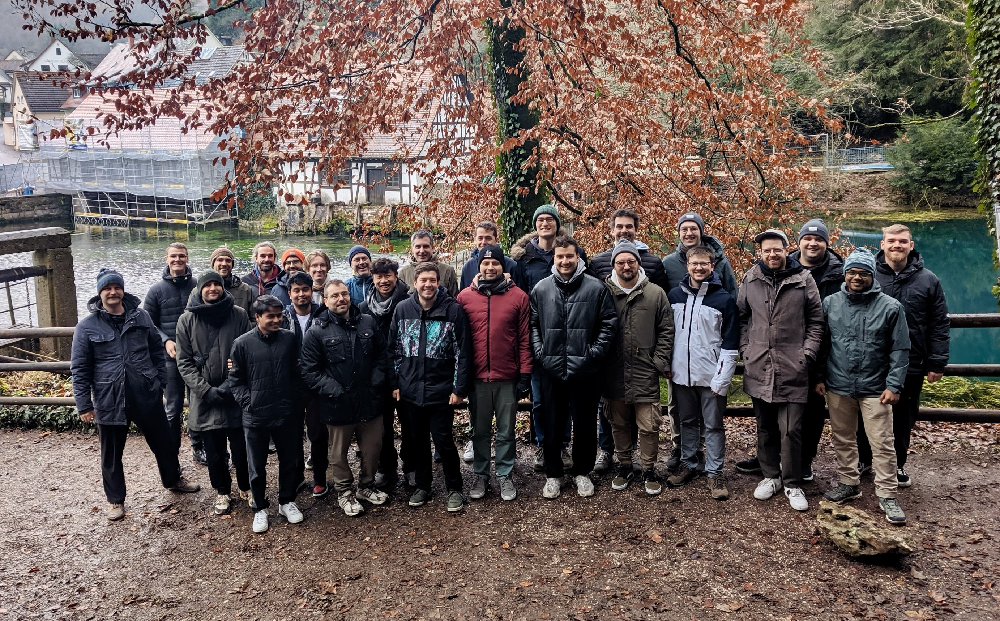
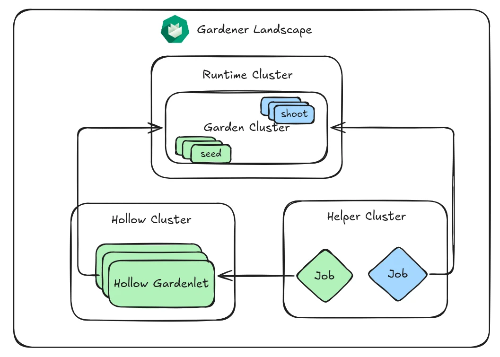

# Hack The Garden November 2025: Self-Hosted Shoots, Build Caches, and Networking Modernization

From November 24–28, 2025, the Gardener community gathered at [Schlosshof in Schelklingen](https://www.schlosshof-info.de/) for another week of focused collaboration, organized by [x-cellent](https://www.x-cellent.com/).
The full per-topic write-up is available on the [community page](../../../community/hackathons/2025-11.md), and the [review meeting recording](../../../community/review-meetings/2025-reviews.md#_2025-12-03-hack-the-garden-wrap-up) covers the highlights.
Continue reading to find out more about the larger storylines that emerged!



## 🐶 Self-Hosted Shoots and "Eating Our Own Dog Food"

A major track of the hackathon advanced [GEP-28 self-hosted shoot clusters](https://github.com/gardener/enhancements/tree/main/geps/0028-self-hosted-shoot-clusters), with the goal of running Gardener's own end-to-end (E2E) tests inside a single-node, self-hosted `Shoot` provisioned via `gardenadm`.

The team successfully ran `gardenadm init` inside a Docker container, an approach tracked as **`gind`** (**G**ardener **in** **D**ocker, inspired by [KinD](https://kind.sigs.k8s.io/)).
[etcd-druid](https://github.com/gardener/etcd-druid)-managed etcd was made optional so the system can continue with a bootstrap etcd when no backup is configured in the `Shoot` manifest.
Several networking and DNS issues were addressed along the way: `NetworkPolicies` for CoreDNS, registry hostnames now consistently exposed via `docker compose`, a cleaned-up `provider-local` `Service` controller in the traditional `kind`-based setup, and hard-coded IPs in the `kind` CoreDNS `Corefile`.
Additional work ensured that multiple controllers — `gardener-resource-manager`, `etcd-druid`, `vpa` — do not conflict with each other, and that `gardener-resource-manager` and extensions remain in the host network.

Code lives across several PRs and branches, including a new [`--use-bootstrap-etcd` flag for `gardenadm init`](https://github.com/gardener/gardener/pull/13542), [registries-as-containers via `docker compose`](https://github.com/gardener/gardener/pull/13551), the [`provider-local` cleanup](https://github.com/gardener/gardener/pull/13549), and the [`gind` branch](https://github.com/timebertt/gardener/tree/gind).

In parallel, [GEP-28](https://github.com/gardener/enhancements/tree/main/geps/0028-self-hosted-shoot-clusters)'s API server exposure design progressed.
A new `SelfHostedShootExposure` resource was introduced in the `extensions.gardener.cloud/v1alpha1` API to abstract cloud-specific exposure (load balancers, `kube-vip`, …) into an extension model, with `.spec.provider.workers[].controlPlane.exposure` configurable on the `Shoot`.
An `Actuator` interface with `Reconcile` and `Delete` methods was defined for extension controllers, and `gardenlet` will run a controller that watches control plane `Node`s and updates `.spec.endpoints[]` with the latest `Node` addresses.
Tracking [issue #2906](https://github.com/gardener/gardener/issues/2906) collects the work; the next step is finalizing the GEP and presenting it to the [Technical Steering Committee](../../../community/steering).

## 🛜 Networking Modernization: Gateway API, nftables, and Calico Whisker

Following the [Ingress NGINX retirement announcement](https://kubernetes.io/blog/2025/11/11/ingress-nginx-retirement/), the team began **evaluating the [Gateway API](https://gateway-api.sigs.k8s.io/) as a replacement for ingress in the Garden runtime/`Seed` clusters**.
A first hurdle — Gardener's restrictive Istio `defaultVirtualServiceExportTo` mesh config — was identified and fixed by setting it to `'.'`, which is required for the Istio ingress gateway to export services.
A functional branch demonstrates Gateway API usage for Plutono, with HTTP basic authentication implemented via an `EnvoyFilter` and an external authorization server, the `gardener-resource-manager` network policy controller extended to handle `HTTPRoute` resources, and Gateway API and Istio resources served on the same port.
Open follow-ups include native Istio external authorization, completing the translation of NGINX annotations, migrating `DestinationRules` to Gateway API traffic policy resources (like `XBackendTrafficPolicy`), and integrating the changes into both the operator and `Shoot` reconciliation flows.
Code lives in a [WIP branch](https://github.com/metal-stack/gardener/tree/gateway-api).

Initial **support for `nftables` mode in `kube-proxy`** was implemented in [gardener/gardener#13558](https://github.com/gardener/gardener/pull/13558), allowing operators to provision and test `Shoot` clusters with the modern, more efficient successor to legacy `iptables` (stable since Kubernetes 1.31).
Comprehensive testing under various loads is up next, with the long-term goal of making `nftables` the default for sufficiently recent Kubernetes versions.

The [Calico](https://github.com/projectcalico/calico) story also moved forward.
A working prototype integrated **[Calico Whisker](https://www.tigera.io/blog/calico-whisker-your-new-ally-in-network-observability/)** for traffic monitoring and tracing, bringing Calico clusters closer to feature parity with [Cilium](https://cilium.io/)'s [Hubble](https://github.com/cilium/hubble).
The prototype reuses code from the [tigera-operator](https://github.com/tigera/operator) to manage Calico Whisker and Calico Goldmane, handles the mTLS requirement between `calico-node` and `calico-typha` via the Gardener secrets manager, and includes the necessary network policies between extension, `Shoot` API servers, `calico-node`, and `goldmane`.
Productization into the [main Calico networking extension](https://github.com/gardener/gardener-extension-networking-calico) is the next step ([WIP branch](https://github.com/ScheererJ/gardener-extension-networking-calico/tree/calico/whisker)).

A separate effort enabled **pulling `gardener-node-agent` through a registry mirror**, breaking the chicken-and-egg problem during initial `Node` provisioning.
A new `provisionRelevant` flag on a `Mirror` causes its configuration to be written into the `provision` `OperatingSystemConfig`, ensuring the mirror is available before `gardener-node-agent` starts.
After bootstrap, the agent takes over and maintains the `containerd` config as before; CA bundles can also be configured per `Mirror` ([PR #495](https://github.com/gardener/gardener-extension-registry-cache/pull/495)).

## 🗃️ A Go Build Cache for Prow

The team tackled build and test caching for [Gardener's Prow](https://prow.gardener.cloud/) jobs with three goals: speed up time-to-feedback on PRs, reduce load on build clusters, and do so securely — presubmits must be able to read from the cache but never write to it, to keep untrusted PRs and broken jobs from polluting it.

After reviewing approaches from [Istio](https://github.com/istio/test-infra) (`hostPath` per node, lots of misses with autoscaling) and [Kubermatic](https://github.com/kubermatic/machine-controller) (cache archive download/upload around builds), the team settled on Go's new [`GOCACHEPROG`](https://pkg.go.dev/cmd/go/internal/cacheprog) interface together with the open-source [`saracen/gobuildcache`](https://github.com/saracen/gobuildcache), backed by Google Cloud Storage.
This avoids whole-cache up- and downloads, leverages Go's per-unit cache granularity, and benefits from GCS's free intra-region network costs.
Read-only and read-write GCP principals are federated from the Prow shoot cluster via [Workload Identity Federation](https://cloud.google.com/iam/docs/workload-identity-federation).

The impact on the `kind`-based E2E job is striking: end-to-end wall-clock time stayed roughly the same (~85 minutes), but **CPU time dropped from ~65 minutes across 12 cores to under 3 minutes across fewer than 2 cores** — more than a 90% reduction in build-cluster CPU consumption.

```terminaloutput
real        85m20.914s   # without cache
user        64m51.059s
sys          6m42.249s
```

```terminaloutput
real        82m53.159s   # with cache
user         2m33.118s
sys          1m0.021s
```

Some workloads benefit less.
`go test` only caches results when a limited flag set is used, and the `ginkgo.junit-report=junit.xml` flag we rely on for JUnit reports disables test result caching; in local experiments, removing it reduced unit-test time from ~40 minutes to under 5 minutes — a strong incentive to revisit our reporting setup.

## 📦 Gardener API Types as a Standalone Go Module

Today, importing Gardener API types from [gardener/gardener](https://github.com/gardener/gardener) drags in the full dependency graph of the main module — a long-standing pain point for extensions and other API-only consumers.
The team opened [PR #13536](https://github.com/gardener/gardener/pull/13536) to extract `pkg/apis` into a dedicated Go module with a strictly minimal dependency set (`k8s.io/{api,apimachinery,utils}`), enforced via `.import-restrictions`.
The plan is to release the API module alongside the main module using Go submodule tags (similar to [gardener/cc-utils#1382](https://github.com/gardener/cc-utils/pull/1382)) and use Go workspaces in `gardener/gardener` for convenient parallel development.
This addresses long-standing [issue #2871](https://github.com/gardener/gardener/issues/2871).

In the same modernization spirit, two PRs together **eliminated `VGOPATH`** from the main repository: [#13545](https://github.com/gardener/gardener/pull/13545) moved tool dependencies to the standard Go modules `tools` directory pattern, and [#13556](https://github.com/gardener/gardener/pull/13556) removed `VGOPATH` and `hack/vgopath-setup.sh`, replacing them with module-aware Go commands.
The result: a simpler bootstrap for new contributors and one less piece of non-standard tooling to explain.

## 💾 Backups, Restore, and Disaster Recovery

Two efforts targeted operational resilience around etcd backups.

A small prototype enables **relocating ETCD backups**, today only achievable via a disruptive `Seed` migration with downtime for all owners.
The proposed change makes the relevant fields mutable so a `StatefulSet` redeployment is triggered during the next `Shoot` reconciliation; the new etcd pod continues with PVC data and immediately writes a full snapshot to the new bucket, requiring no changes to the backup-restore sidecar.
The prototype also relaxes the requirement that the bucket name be derived from the `Seed` UID.
Tracked in [issue #13579](https://github.com/gardener/gardener/issues/13579) with a [prototype branch](https://github.com/metal-stack/gardener/tree/relocate-backups).

In parallel, work began on a **`force-restore` operation annotation for `Shoot`s** to give operators a clear way to force a restore from existing backups during disaster scenarios.
Required `gardenlet` changes around backup-copy logic and missing source `BackupEntry`s were identified ([issue #12952](https://github.com/gardener/gardener/issues/12952)), alongside a related blocker in [gardener-extension-provider-openstack#1217](https://github.com/gardener/gardener-extension-provider-openstack/issues/1217).

## 🫆 Enriching Shoot Logs with Istio Access Logs

The Istio ingress gateway emits valuable access logs — particularly with L7 load balancing — but today they are only available to `Seed` operators.
For `Shoot` owners, especially those running with restricted access (e.g. via the ACL extension), this limits debugging visibility.

The team implemented enrichment of the `Shoot` log stream with Istio access logs, integrated directly into the [main Gardener repository](https://github.com/gardener/gardener/pull/13548) after an initial attempt in the [logging extension](https://github.com/gardener/logging/pull/398).
The same approach can be extended to other `Seed` components that impact `Shoot` operations.

## 📈 Scale-Out Tests with Hollow Gardenlets

Inspired by [Kubemark](https://github.com/kubernetes/community/blob/master/contributors/devel/sig-scalability/kubemark-guide.md)'s hollow `Node`s, the team prototyped **hollow `gardenlet`s** that register themselves with the Garden, report ready, and mark their scheduled `Shoot`s as healthy without ever spawning real control planes.
A simulated request load against the Gardener API server, parameterized by the number of `Shoot`s per `Seed`, models a realistic scenario.

On a local operator setup running on an M4 Mac with 48 GB of RAM, ~200 hollow `gardenlet`s could be scheduled before resource exhaustion.
A 10-hour run aiming for 50 `Shoot`s/minute and 1 `Seed` every 3 minutes reached **800 `Seed`s and 21,600 `Shoot`s** before melting down around 4 a.m., with unequal request balancing on the kube-apiservers (no L7 load balancing yet) as a notable observation.
While not productized yet, the [WIP implementation](https://github.com/acumino/gardener/tree/hollow-gardenlet) is a useful starting point for future scalability work.



## 🗽 Talos as a Node OS: A Feasibility Study

The team evaluated [Talos OS](https://www.talos.dev/) — minimal, immutable, API-driven — as a worker `Node` OS for Gardener `Shoot`s.
A local-provider PoC successfully bootstrapped Talos `Node`s as `Pod`s, joined them to the cluster using bootstrap tokens and a CA-configured `kubelet`, disabled the Talos-native CNI in favor of Gardener's, resolved an SNI issue by disabling `KubePrism`, and deployed `trustd` in the control plane with Istio routing.

The conclusion: technically feasible, but **not** being pursued to production at this time.
Productization would require evolving `OperatingSystemConfig` and `gardener-node-agent` to abstract away `systemd` (Talos has no shell, no SSH, no `systemd`), rewriting extensions that inject `systemd` units to use containerized sidecars or `DaemonSet`s, and standardizing how the Talos API daemon (`apid`) is exposed to operators for debugging.

## 🤖 A Tool-Enabled Agent for Shoots

Finally, the team developed **agents that support operators answering end-user questions** about Gardener and specific `Shoot` clusters.
The agents combine LLMs for planning with concrete tools: knowledge-base search, ticket-database search, `Garden`/`Seed`/`Shoot` access via `bash`/`kubectl`, and metrics and log extraction.
This lets the agent drill into details that would otherwise consume significant operator time.

The platform tooling is implemented and already in use internally; public availability is gated on scrubbing internal data from the knowledge sources.

## ⚖️ Smaller Wins

Several smaller, focused workstreams improved day-to-day operations:

- **Real load balancer controller for `provider-local`**: an IP-allocation prototype assigns IPs from `172.18.255.64/26` to `Service`s of type `LoadBalancer` and uses Docker port mapping to expose containerized workloads externally — a foundation for making `ManagedSeed` tests succeed ([branch](https://github.com/timebertt/cloud-provider-kind/tree/allocate-ips)).
- **Respect terminating `Node`s in load balancing**: applying the `ToBeDeletedByClusterAutoscaler` taint when a `Machine` is marked for deletion now reliably triggers both `cloud-provider` reconciliation and `kube-proxy` health-check updates, preventing connections to terminating `Node`s ([PR #1054](https://github.com/gardener/machine-controller-manager/pull/1054)).
- **`SIGINFO` (`^T`) handling in `gardenadm`/`flow`**: a new `CommandLineProgressReporter` integrates with the `flow` package to print the currently executing step, giving developers visual confirmation of progress in long-running multi-step operations ([PR #13565](https://github.com/gardener/gardener/pull/13565)).
- **MCM in-place updates for underlying machines**: a feature-branch prototype added an `UpdateMachine` method to the MCM provider driver interface, enabling infrastructure-level updates (such as OS images on memory-booted bare metal) without full node recreation. The team concluded that the current changes are too invasive for upstream contribution and will revisit the rolling-update approach instead.

---

## 🌷 Closing Thoughts

This event made strong progress on multi-hackathon storylines — self-hosted shoots, networking modernization, scalability — while delivering immediately useful operational wins like the Prow Go build cache and Istio access log enrichment.
Several topics are now ready for cleanup, GEPs, and PR submission.

The next hackathon is already on the horizon.
If you want to join, drop by the [Gardener Slack](https://join.slack.com/t/gardener-cloud/shared_invite/zt-33c9daems-3oOorhnqOSnldZPWqGmIBw) ([#hack-the-garden](https://gardener-cloud.slack.com/archives/C0531FVMZFU)).
See you there! ✌️

<hr />


