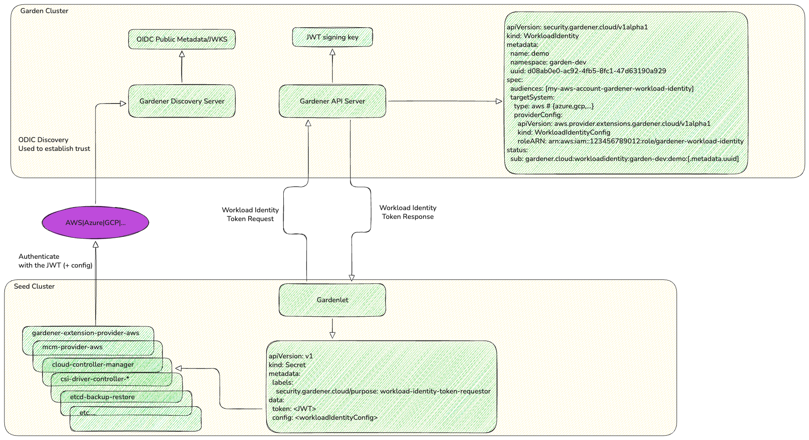

Gardener now supports **Workload Identity Federation** for AWS, Azure, and GCP. Instead of storing long-lived static credentials (access keys, service principal secrets, service account keys), you can configure trust between your cloud account and the Gardener Workload Identity Issuer. Gardener then issues short-lived, auto-rotated JSON Web Tokens that your shoot clusters use to authenticate with cloud APIs — no secrets to manage, rotate, or risk leaking.

## The Problem with Static Credentials

Every Gardener shoot cluster needs credentials to interact with cloud provider APIs — creating VMs, managing load balancers, provisioning volumes, configuring DNS records. Traditionally, this required creating a cloud provider service account or access key and storing it as a Kubernetes Secret in the garden cluster.

This approach comes with well-known operational and security challenges:

- **Long-lived secrets** — credentials often have extended or unlimited lifetimes, increasing the blast radius of a leak.
- **Manual rotation** — operators must periodically rotate credentials and update them across all consumers.
- **Broad permissions** — credentials are often over-provisioned because tightening them requires careful auditing.
- **Storage risks** — secrets stored in multiple locations (CI/CD pipelines, Secret managers, Kubernetes clusters) multiply the attack surface.
- **Expired credentials break reconciliation** — if a credential silently expires, cluster operations stall until someone notices and fixes it.

## How Workload Identity Solves This

With workload identity, Gardener acts as an **OIDC-compatible token issuer**. Instead of handing Gardener a static secret, you establish a one-time trust relationship between your cloud provider account and the Gardener issuer. From that point on:

1. **Gardener issues short-lived JWTs** — tokens are created on-demand by the Gardener API server and contain claims identifying the specific shoot, project, and seed.
1. **Tokens are auto-rotated** — gardenlet continuously refreshes tokens before they expire, with no manual intervention.
1. **No credentials are stored** — tokens are ephemeral and never persisted by the issuer. The cloud provider validates them using the publicly available OIDC discovery metadata.
1. **Fine-grained access control** — cloud-side trust policies can restrict Gardener workload identities (by subject claim) to concrete IAM roles, enabling per-shoot or per-project isolation.

The following diagram shows how the components interact end-to-end — from the `WorkloadIdentity` resource in the garden cluster, through token issuance by the Gardener API server, to token validation by the cloud provider:



## What's in the Token?

Each JWT issued by Gardener carries rich contextual information:

```json
{
  "aud": "<your-configured-audience>",
  "iss": "https://<gardener-workload-identity-issuer-url>",
  "sub": "gardener.cloud:workloadidentity:<namespace>:<name>:<uid>",
  "gardener.cloud": {
    "workloadIdentity": { "name": "my-infra", "namespace": "garden-myproject", "uid": "..." },
    "shoot": { "name": "production-1", "namespace": "garden-myproject", "uid": "..." },
    "project": { "name": "myproject", "uid": "..." },
    "seed": { "name": "eu-seed-1", "uid": "..." }
  }
}
```

This means your cloud IAM policies can scope permissions not just to the Gardener issuer, but down to the individual shoot or project requesting access.

## Getting Started

The setup follows three steps, regardless of your cloud provider:

### Step 1: Create a Trust Relationship in Your Cloud Account

Configure your cloud provider to trust the Gardener Workload Identity Issuer as an external identity provider. There is a ConfigMap in the Gardener API that advertises the workload identity token issuer URL.

```bash
$ kubectl -n gardener-system-public get configmap gardener-info -o yaml
...
data:
  gardenerAPIServer: |
    workloadIdentityIssuerURL: https://issuer.gardener.cloud.local
...
```

Use the value of `workloadIdentityIssuerURL` when configuring the OIDC identity provider in your cloud account. For more details, see the [Gardener Info ConfigMap documentation](https://github.com/gardener/gardener/blob/master/docs/operations/configmap.md).

### Step 2: Create a `WorkloadIdentity` Resource

Define a `WorkloadIdentity` in your Garden project namespace specifying the target cloud system and provider-specific configuration (like the IAM role to assume):

```yaml
apiVersion: security.gardener.cloud/v1alpha1
kind: WorkloadIdentity
metadata:
  name: my-infra-identity
  namespace: garden-myproject
spec:
  audiences:
  - <user-specified-audience>
  targetSystem:
    type: aws  # or "azure" or "gcp"
    providerConfig:
      # Provider-specific configuration (see below)
```

### Step 3: Reference It in Your Shoot

Create a `CredentialsBinding` that references your `WorkloadIdentity`, then point your Shoot's `.spec.credentialsBindingName` to it:

```yaml
apiVersion: security.gardener.cloud/v1alpha1
kind: CredentialsBinding
metadata:
  name: my-wi-binding
  namespace: garden-myproject
provider:
  type: aws  # or "azure" or "gcp"
credentialsRef:
  apiVersion: security.gardener.cloud/v1alpha1
  kind: WorkloadIdentity
  name: my-infra-identity
```

```yaml
apiVersion: core.gardener.cloud/v1beta1
kind: Shoot
metadata:
  name: my-shoot
  namespace: garden-myproject
spec:
  credentialsBindingName: my-wi-binding
  # ... rest of Shoot spec
```

## Provider-Specific Setup

### AWS

1. Register the Gardener Workload Identity Issuer as an **OpenID Connect identity provider** in your AWS account.
1. Create an IAM Role with a trust policy that allows the Gardener-issued tokens to assume it. The trust policy's `Condition` can restrict access by the subject claim for fine-grained control.
1. Set the `providerConfig` in your `WorkloadIdentity` to reference the IAM Role ARN:

```yaml
providerConfig:
  apiVersion: aws.provider.extensions.gardener.cloud/v1alpha1
  kind: WorkloadIdentityConfig
  roleARN: arn:aws:iam::<account-id>:role/<role-name>
```

For detailed instructions, see the [AWS Workload Identity Federation documentation](https://github.com/gardener/gardener-extension-provider-aws/blob/master/docs/usage/usage.md#aws-workload-identity-federation).

### Azure

1. Register a **Federated Identity Credential** on an Azure App Registration (Service Principal), specifying the Gardener issuer URL and the subject claim of your `WorkloadIdentity`.
1. Set the `providerConfig` to reference your Azure tenant, app (client) ID, and subscription:

```yaml
providerConfig:
  apiVersion: azure.provider.extensions.gardener.cloud/v1alpha1
  kind: WorkloadIdentityConfig
  tenantID: <tenant-id>
  clientID: <client-id>
  subscriptionID: <subscription-id>
```

For detailed instructions, see the [Azure Workload Identity Federation documentation](https://github.com/gardener/gardener-extension-provider-azure/blob/master/docs/usage/usage.md#azure-workload-identity-federation).

### GCP

1. Create a **Workload Identity Pool** and **OIDC Provider** in your GCP project, pointing to the Gardener issuer URL.
1. Grant the Workload Identity Pool principal access to a GCP Service Account with the required permissions.
1. Set the `providerConfig` to reference the project number, pool ID, and provider ID:

```yaml
providerConfig:
  apiVersion: gcp.provider.extensions.gardener.cloud/v1alpha1
  kind: WorkloadIdentityConfig
  projectID: <project-id>
  credentialsConfig:
    universe_domain: googleapis.com
    type: external_account
    audience: //iam.googleapis.com/projects/<project_number>/locations/global/workloadIdentityPools/<pool_name>/providers/<provider_name>
    subject_token_type: urn:ietf:params:oauth:token-type:jwt
    service_account_impersonation_url: https://iamcredentials.googleapis.com/v1/projects/-/serviceAccounts/<service_account_email>:generateAccessToken
    token_url: https://sts.googleapis.com/v1/token
```

For detailed instructions, see the [GCP Workload Identity Federation documentation](https://github.com/gardener/gardener-extension-provider-gcp/blob/master/docs/usage/usage.md#gcp-workload-identity-federation).

## Workload Identity for DNS

Gardener Workload Identity isn't limited to infrastructure credentials. You can also use it for **DNS providers**. The same `WorkloadIdentity` resource (with `spec.targetSystem.type` set to the cloud provider — `aws`, `azure`, or `gcp`) can be reused for both infrastructure and DNS purposes, simplifying your credential management further.

To configure DNS with Workload Identity, reference the `WorkloadIdentity` as a named resource in your shoot and use it in the `shoot-dns-service` extension's `providerConfig`:

```yaml
apiVersion: core.gardener.cloud/v1beta1
kind: Shoot
metadata:
  name: my-shoot
  namespace: garden-myproject
spec:
  extensions:
  - type: shoot-dns-service
    providerConfig:
      apiVersion: service.dns.extensions.gardener.cloud/v1alpha1
      kind: DNSConfig
      providers:
      - credentials: my-dns-identity
        type: aws-route53  # or "azure-dns", "google-clouddns"
  resources:
  - name: my-dns-identity
    resourceRef:
      apiVersion: security.gardener.cloud/v1alpha1
      kind: WorkloadIdentity
      name: my-infra-identity
```

For provider-specific DNS instructions:
- [AWS Route53 with WorkloadIdentity](https://github.com/gardener/gardener-extension-shoot-dns-service/blob/master/docs/usage/workloadidentity/aws.md)
- [Azure DNS with WorkloadIdentity](https://github.com/gardener/gardener-extension-shoot-dns-service/blob/master/docs/usage/workloadidentity/azure.md)
- [Google Cloud DNS with WorkloadIdentity](https://github.com/gardener/gardener-extension-shoot-dns-service/blob/master/docs/usage/workloadidentity/gcp.md)
- [DNS Providers Configuration](https://github.com/gardener/gardener-extension-shoot-dns-service/blob/master/docs/usage/dns_providers.md)

Alternatively, you can reference the `WorkloadIdentity` via `.spec.dns.providers`.

> [!NOTE]
> This approach is **deprecated** — the extension-based configuration shown above is the preferred method

```yaml
spec:
  dns:
    providers:
    - type: aws-route53  # or "azure-dns", "google-clouddns"
      credentialsRef:
        apiVersion: security.gardener.cloud/v1alpha1
        kind: WorkloadIdentity
        name: my-infra-identity
```

## Migrating Existing Shoots

Already have shoots running with static credentials? The migration is a two-step process. If your shoot still uses the deprecated `SecretBinding`, you must first move to a `CredentialsBinding` (still referencing the same `Secret`), and then switch to `WorkloadIdentity`.

### Step 1: Migrate from `SecretBinding` to `CredentialsBinding`

If your shoot references a `SecretBinding`, create a `CredentialsBinding` that points to the **same Secret** and update the shoot:

```yaml
apiVersion: security.gardener.cloud/v1alpha1
kind: CredentialsBinding
metadata:
  name: my-infra-credentials
  namespace: garden-myproject
credentialsRef:
  apiVersion: v1
  kind: Secret
  name: my-infra-secret
  namespace: garden-myproject
provider:
  type: aws  # or "azure" or "gcp"
```

Then replace `.spec.secretBindingName` with `.spec.credentialsBindingName` in your Shoot:

```yaml
spec:
  credentialsBindingName: my-infra-credentials  # was: secretBindingName: my-old-binding
```

> [!NOTE]
> This step requires that the new `CredentialsBinding` references the exact same `Secret` as the old `SecretBinding`.
> A direct migration from `SecretBinding` to a `CredentialsBinding` referencing a `WorkloadIdentity` is not allowed.

For detailed instructions, see the [SecretBinding to CredentialsBinding migration guide](https://github.com/gardener/gardener/blob/master/docs/usage/shoot-operations/secretbinding-to-credentialsbinding-migration.md).

### Step 2: Switch to Workload Identity

Once your shoot is using a `CredentialsBinding` with a `Secret`, you can move to `WorkloadIdentity`:

1. Set up the trust relationship in your cloud provider account (see [Provider-Specific Setup](#provider-specific-setup) above).
1. Create a `WorkloadIdentity` resource in your project namespace.
1. Create a **new** `CredentialsBinding` that references the `WorkloadIdentity`:

    ```yaml
    apiVersion: security.gardener.cloud/v1alpha1
    kind: CredentialsBinding
    metadata:
      name: my-infra-wi-binding
      namespace: garden-myproject
    credentialsRef:
      apiVersion: security.gardener.cloud/v1alpha1
      kind: WorkloadIdentity
      name: my-infra-identity
    provider:
      type: aws  # or "azure" or "gcp"
    ```

1. Update your Shoot's `.spec.credentialsBindingName` to point to the new binding:

    ```yaml
    spec:
      credentialsBindingName: my-infra-wi-binding
    ```

Since the `credentialsRef` field of `CredentialsBinding` is immutable, you must create a new `CredentialsBinding` rather than modifying the existing one. The migration is seamless — Gardener handles the transition without cluster downtime.

> [!TIP]
> DNS credentials can be migrated to Workload Identity independently of infrastructure credentials.
> If your shoot uses static `Secret`s for DNS providers, you can create a `WorkloadIdentity` and reference it in the `shoot-dns-service` extension configuration (see [DNS Credentials Too](#workload-identity-for-dns) above) without changing your infrastructure credentials binding.

## Security Benefits at a Glance

| Static Credentials | Workload Identity |
| :--- | :--- |
| Long-lived or non-expiring | Short-lived, auto-rotated (default: 6 hours) |
| Stored in Kubernetes Secrets | Never persisted, issued on demand |
| Shared across tools and environments | Scoped to specific Gardener workloads |
| Manual rotation required | Automatic rotation by gardenlet |
| Broad IAM policies common | Fine-grained: scope by shoot, project, or seed |
| Credential leaks require immediate response | No credentials to leak |

## Further Reading

- [Shoot Workload Identity Documentation](https://github.com/gardener/gardener/blob/master/docs/usage/shoot/shoot-workload-identity.md)
- [SecretBinding to CredentialsBinding Migration Guide](https://github.com/gardener/gardener/blob/master/docs/usage/shoot-operations/secretbinding-to-credentialsbinding-migration.md)
- [GEP-26: Workload Identity Enhancement Proposal](https://github.com/gardener/enhancements/blob/main/geps/0026-workload-identity/README.md)
- [AWS Provider Extension — Workload Identity Federation](https://github.com/gardener/gardener-extension-provider-aws/blob/master/docs/usage/usage.md#aws-workload-identity-federation)
- [Azure Provider Extension — Workload Identity Federation](https://github.com/gardener/gardener-extension-provider-azure/blob/master/docs/usage/usage.md#azure-workload-identity-federation)
- [GCP Provider Extension — Workload Identity Federation](https://github.com/gardener/gardener-extension-provider-gcp/blob/master/docs/usage/usage.md#gcp-workload-identity-federation)

## Start Today

Workload Identity is production-ready and available now for AWS, Azure, and GCP. We encourage all Gardener users to migrate their shoot clusters away from static credentials. The one-time setup of a cloud-side trust relationship pays for itself through eliminated credential rotation overhead, reduced security risk, and simplified operations.

If you have questions or need help with the migration, reach out to the Gardener community.
