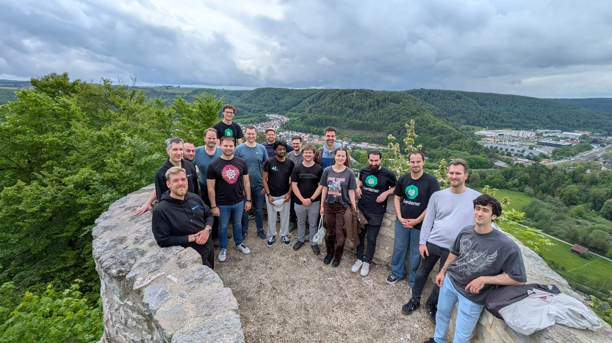

# Hack The Garden May 2026: Self-Hosted Shoots, Disaster Recovery, and a Modernized VPN

From May 4–8, 2026, the Gardener community gathered at [Schlosshof in Schelklingen](https://www.schlosshof-info.de/) for another week of focused collaboration.
The full per-topic write-up is available on the [community page](../../../community/hackathons/2026-05.md), and the [review meeting recording](../../../community/review-meetings/2026-reviews.md#_2026-05-13-hack-the-garden-wrap-up) covers the highlights.
Continue reading to find out more about larger storylines that emerged!

## 🌿 GEP-28: Self-Hosted Shoot Clusters Take Shape

A large portion of the hackathon was dedicated to advancing [GEP-28 (Self-Hosted Shoot Clusters)](https://github.com/gardener/enhancements/blob/main/geps/0028-self-hosted-shoot-clusters), with multiple workstreams pushing the design closer to production-readiness.

The `shoot/shoot` controller — previously missing from `gardenadm connect` — was prototyped to run inside `gardenlet`, with the `flow` package extended by reusable `TaskGroup`s so that the hosted and self-hosted flows can share tasks instead of being maintained separately ([branch](https://github.com/rfranzke/gardener/tree/gep28/shoot-shoot)).

A [kubeadm](https://kubernetes.io/docs/reference/setup-tools/kubeadm/)-inspired **discovery token mechanism** removes the need to pass the full CA bundle on the command line.
`gardenadm init` now publishes a signed `kube-public/cluster-info` `ConfigMap`, and `gardenadm join`/`connect` accept a `--discovery-token-ca-cert-hash sha256:<64-hex>` flag that verifies the JWS signature, validates the CA against the supplied SPKI pin, and only then re-fetches over TLS.
The same mechanism was extended to `gardener-operator` via a new `Garden.Spec.VirtualCluster.Kubernetes.KubeAPIServer.EnableBootstrapDiscovery` field ([branch](https://github.com/gardener/gardener/compare/master...jamand:gardener:feat/gardenadm-ca-discovery)).

Following [GEP-28's March 2026 demo](../../../community/hackathons/2026-03.md#🐳-gep-28-self-hosted-shoot-gardener-in-docker-gind), running garden and seed inside a self-hosted shoot was extended to **managed infrastructure**, where nodes are provisioned by machine-controller-manager.
A `make gind-up SCENARIO=full` target now automates the full path to a healthy seed.
A side-track explored running local provider "machines" directly as Docker containers, which enabled a first successful local control plane migration without workload downtime.

For exposing self-hosted API servers, [GEP-36](https://github.com/gardener/enhancements/tree/main/geps/0036-self-hosted-shoot-exposure)'s `SelfHostedShootExposure` API was implemented in the [Cilium extension](https://github.com/gardener/gardener-extension-networking-cilium) using L2 Announcements ([PR#693](https://github.com/gardener/gardener-extension-networking-cilium/pull/693)).
A connectivity issue — [Cilium](https://cilium.io/) losing its connection to the default Kubernetes service when the API server rolls over to manage itself — was resolved by pointing Cilium to localhost via a `CiliumNodeConfig` targeted at control plane nodes.

Finally, the team reworked the approach to **joining control plane nodes in managed infrastructure**.
Rather than dynamically updating the `OperatingSystemConfig` with node-specific etcd certificates, the new design pushes only CA secrets through the OSC and lets `etcd-backup-restore` generate node-specific certificates on startup, with [`etcd-druid`](https://github.com/gardener/etcd-druid)/`backup-restore` managing the etcd member list dynamically.
This removes the need for `Etcd.spec.externallyManagedMemberAddresses` for self-hosted shoots ([WIP PR](https://github.com/gardener/gardener/pull/14589)).

## 🛜 Networking and VPN Modernization

The long-running effort to **replace [OpenVPN](https://openvpn.net/) with [WireGuard](https://www.wireguard.com/)**, [continued from June 2025](../../../community/hackathons/2025-06.md#⚡%EF%B8%8F-replace-openvpn-with-wireguard), reached a working state for multiple shoots in parallel.
A `wpex` sidecar multiplexes connections behind a single Istio ingress: the first packet is forwarded to all configured `vpn-seed-server`s, and each either responds or silently ignores based on the WireGuard public key.
[Istio Ingress](https://istio.io/latest/docs/tasks/traffic-management/ingress/) can now be scaled beyond a single replica, and `NetworkPolicy`s are managed via labels on `istio-ingress` and `vpn-seed-server`.
A related VPN bug was fixed along the way ([gardener/gardener#14776](https://github.com/gardener/gardener/pull/14776)).
Code lives across [gardener](https://github.com/gardener/gardener/compare/master...metal-stack:gardener:wireguard-3), [vpn2](https://github.com/gardener/vpn2/compare/master...metal-stack:vpn2:wireguard-2), and [wpex](https://github.com/weiiwang01/wpex/compare/main...majst01:wpex:go-1.26).

Building on [gardener/gardener#14420](https://github.com/gardener/gardener/pull/14420), the [ACL extension](https://github.com/stackitcloud/gardener-extension-acl) gained **virtual garden support** for IP allowlisting ([PR #280](https://github.com/stackitcloud/gardener-extension-acl/pull/280)).
The work also identified that the virtual garden API server domain needs to be exposed in the `Garden` status, captured in a [WIP branch](https://github.com/gardener/gardener/compare/master...hown3d:gardener:garden-advertised-addresses).

## 💾 Disaster Recovery and Backup Security

Two efforts targeted the resilience of garden and shoot state.

The **`GardenState` resource** addresses a long-standing pain point: today, recovering a destroyed Garden cluster is fully manual.
The team encoded `GardenState` as a `Secret` (label `operator.gardener.cloud/purpose: garden-state`) in the runtime cluster's `garden` namespace, containing a JSON snapshot of `persist=true` secrets, `Garden` metadata and spec, extension state from `DNSRecord`/`BackupEntry`/`Extension` CRDs, and the `Garden` UID (preserving the etcd backup bucket name).
A `Secret` was chosen over a CRD because it is available before CRDs are installed, can be extracted with plain `kubectl`, and is straightforward to back up externally.
A bootstrapper in `gardener-operator` detects a `garden-state` secret without a `Garden` resource on startup and drives the restore flow ([branch](https://github.com/LucaBernstein/gardener/tree/hackathon-2026-05/gardenstate-dr)).

In parallel, **per-shoot etcd backup encryption** was prototyped to limit the blast radius of a compromised control plane.
Today, all shoot` backups on a seed` share a bucket; with this change, gardener generates a shoot-specific encryption secret persisted in `ShootState`, etcd-druid wires it into `etcd-backup-restore` via an `EncryptionConfig` analogous to `kube-apiserver` encryption-at-rest, and `etcd-backup-restore` implements AESGCM encryption with full key rotation via an encrypted keyring stored alongside the backups.
Code spans [gardener](https://github.com/gardener/gardener/compare/master...metal-stack:gardener:etcd-backup-encryption), [etcd-druid](https://github.com/gardener/etcd-druid/compare/master...Gerrit91:etcd-druid:etcd-backup-encryption), and [etcd-backup-restore](https://github.com/RadaBDimitrova/etcd-backup-restore/tree/add-backup-encryption).

## 🌐 Domain and DNS Flexibility

A design effort tackled the rigidity of Gardener's **internal domain handling**.
Three use cases were scoped:

1. **Optional internal domain per shoot** via a new `Shoot.spec.dns.internalDomain.enabled` field. Disabling on existing shoots requires a coordinated CA rotation across node rollout and `DNSRecord` lifecycle.
2. **Changing the external domain of a shoot**, modeled as a two-phase CA rotation that adds the new domain in the preparing phase and removes the old one in the completing phase.
3. **Changing the internal domain of all shoots on a seed**, with the seed spec carrying a list of internal domains and a shoot-owner-initiated CA rotation migrating each shoot.

A WIP implementation of the first use case is available ([branch](https://github.com/timebertt/gardener/tree/internal-domain-optional)); [STACKIT](https://stackit.com/) plans to formalize all three in an enhancement proposal.

## 🛠️ Operational Improvements

Several smaller workstreams improved day-to-day operations.

**Debugging failed node joins** got significantly easier: the `gardener-node-agent` now performs a connection test during bootstrap, and fatal errors after bootstrap are written to the node's console log instead of disappearing once the agent connects to the API server ([PR #14760](https://github.com/gardener/gardener/pull/14760)).

`gardenctl` learned a **`defaultKubeconfigAccessLevel`** per garden, supporting `admin`, `viewer`, and `auto` for both `shoots` and `managedSeeds` — letting admins default to a viewer kubeconfig and reducing the blast radius of accidental writes.
`gardenctl config set-garden` automatically refreshes the symlinked kubeconfig when the access level changes ([PR #735](https://github.com/gardener/gardenctl-v2/pull/735)).

For shoots with `confineSpecUpdateRollout` enabled, an admission plugin was prototyped that **stages spec changes in a ConfigMap** rather than writing them directly to `.spec`.
The staged state is applied at the start of the next maintenance window, keeping `.spec` a faithful representation of what is currently running while making pending changes inspectable and cancellable.

## 📉 Reducing Secret Watch Pressure on Seeds

`gardener-resource-manager` stores all rendered manifests in `Secret`s referenced by `ManagedResource.spec.secretRefs`, including those without sensitive data.
Measurements on production-like seeds quantified the cost:

| Cluster | Shoots | ManagedResources | Secrets | In-memory size |
|---------|--------|------------------|---------|----------------|
| 1       | 193    | 11,753           | 12,453  | **204.90 MB**  |
| 2       | 272    | 15,605           | 16,374  | **281.22 MB**  |

On average, `ManagedResource` secret data accounts for more than half of all secret data on a seed — roughly 1 MB per shoot control plane.
A prototype introduced a new `ManagedResourceData` CRD for non-sensitive manifests, with `ManagedResource.spec` extended by `dataRefs` alongside `secretRefs`.
In a single-shoot local test, 38 of 51 control plane manifests moved out of `Secret`s ([commit](https://github.com/plkokanov/gardener/commit/04acab4585039ac7f6db95090948226057215167)).
Open questions remain around the schema, classification interface, and garbage collection strategy for mutable `ManagedResourceData` objects.

## 🍂 Dropping `ManagedSeedSet`

Not every topic ended in a continuation.
After implementing and evaluating a WIP controller for the long-incomplete [`ManagedSeedSet` proposal](https://github.com/gardener/enhancements/tree/main/geps/0013-automated-seed-management#managedseedsets), the team concluded that finishing it isn't worth the cost:

- Keeping gardenlet/`Seed` config in sync across set members is unreliable because `gardenlet` version propagation via the parent `gardenlet` bypasses controllers trying to keep members uniform.
- Production landscapes prefer declarative, manual seed management over autoscaling.
- Partition-based staged rollouts remain hard due to config drift.
- The feature has no known production users.

Unless someone strongly objects, the API will be removed in the near future.

---

## 🌷 Closing Thoughts

This event pushed several multi-hackathon projects — GEP-28 self-hosted shoots, the WireGuard transition — substantially forward, while also opening new directions in disaster recovery and seed-side resource pressure.
Many topics are now ready for cleanup, GEPs, and PR submission.

The next hackathon is already up on the horizon.
If you want to join, drop by the [Gardener Slack](https://join.slack.com/t/gardener-cloud/shared_invite/zt-33c9daems-3oOorhnqOSnldZPWqGmIBw) ([#hack-the-garden](https://gardener-cloud.slack.com/archives/C0531FVMZFU)).
See you there! ✌️

