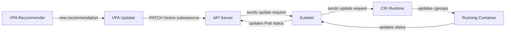
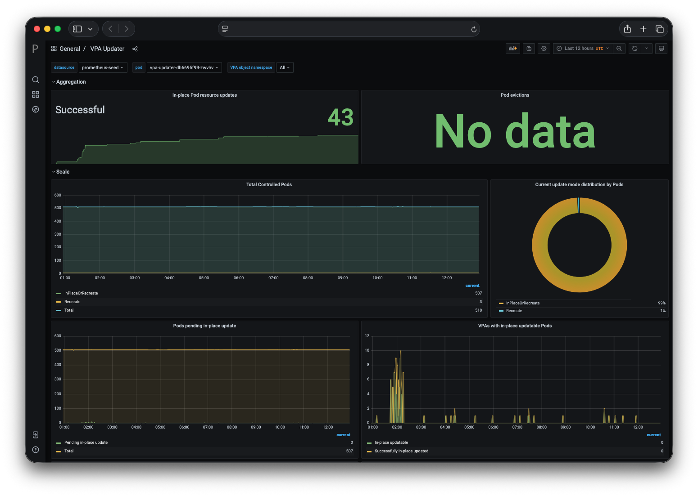

As Kubernetes workloads evolve, the need for dynamic resource adjustments becomes increasingly critical. Traditional `Pod` resource updates require `Pod` recreation, leading to increased operational costs and potential service disruptions.
To address this shortcoming, Kubernetes introduced a new way of updating `Pod` resources _in-place_, without the need to _evict_ workloads in order to apply the configuration change. With the [v1.27](https://kubernetes.io/releases/1.27/) release, a new `resize` subresource got introduced to the `Pod`'s API, acting as an interface to the underlying CRI implementations that manage the _cgroups_ settings.

## What are the key benefits of _in-place_ Pod resource updates?

Having the ability to bypass the rollout process when updating `Pod` resources drastically improves the scaling efficiency. Eliminating the overhead of `Pod` scheduling and application initialization is among the primary benefits of the new _update_ mechanism. The following points summarize the key factors when considering using _in-place_ updates:

- __Zero-downtime scaling__: Resources are adjusted without `Pod` recreation or service interruption
- __Reduced scheduling overhead__: No need to re-schedule `Pod`s across the cluster
- __Reduced initialization overhead__: Applications __do not__ go through full initialization all over again
- __Preserved `Pod` identity__: `Pod` names, IPs, and volumes remain unchanged
- __Improved resource efficiency__: More granular and responsive resource optimization

To read more about the feature, refer to the official [documentation](https://kubernetes.io/blog/2025/12/19/kubernetes-v1-35-in-place-pod-resize-ga/).

## How does Gardener utilize the new _update_ mechanism?

Gardener relies heavily on the [Vertical Pod Autoscaler](https://github.com/kubernetes/autoscaler) to advance the resource usage optimization and keep the _out-of-the-box_ components running as efficiently as possible. With the [v1.4.0](https://github.com/kubernetes/autoscaler/releases/tag/vertical-pod-autoscaler-1.4.0) release, Vertical Pod Autoscaler introduced the ability to configure a new `.spec.updatePolicy.updateMode` for the `vpa` resources:

```yaml
apiVersion: autoscaling.k8s.io/v1
kind: VerticalPodAutoscaler
metadata:
  name: demo-vpa
spec:
  targetRef:
    apiVersion: "apps/v1"
    kind:       Deployment
    name:       demo
  updatePolicy:
    updateMode: "InPlaceOrRecreate"
```

effectively performing _in-place_ resource updates and _falling back_ to _eviction_ in case of failure. Adopting this release created the opportunity to leverage the new _update_ mechanism, and with Gardener [v1.137](https://github.com/gardener/gardener/releases/tag/v1.137.0), a new automatic migration mechanism was introduced.

Historically, `VerticalPodAutoscaler` resources, created for the different Gardener components, were configured to use _update mode_ `Auto` as it was the default option that mimics the behavior of `Recreate` - _evicting_ `Pod`s to apply newly [calculated resource recommendations](https://github.com/kubernetes/autoscaler/blob/master/vertical-pod-autoscaler/docs/components.md#implementation-of-the-recommender). The subsequent Vertical Pod Autoscaler [v1.5.0](https://github.com/kubernetes/autoscaler/releases/tag/vertical-pod-autoscaler-1.5.0) release deprecated the `Auto` _update mode_, leaving only two viable options for continuous scaling: `Recreate` and `InPlaceOrRecreate`. The following graph illustrates the _flow_ of `Pod` resource updates used in Gardener:



The _key_ functionality behind this improved resource management is Linux [cgroups](https://www.man7.org/linux/man-pages/man7/cgroups.7.html), which are responsible for grouping processes and limiting the host resources they can utilize.

### How are `VerticalPodAutoscaler` resources configured?

Like any cluster-wide configuration change, migrating the `vpa` resources' _update mode_ presented a unique challenge that solved this by leveraging the [Gardener Resource Manager](https://github.com/gardener/gardener/blob/master/docs/concepts/resource-manager.md) and its extensible architecture.

We developed a dedicated `MutatingWebhook` that automatically filters relevant `vpa` resources and applies the _update mode_ change, making the migration seamless. The webhook is deployed through the `VPAInPlaceUpdates` _feature gate_ (available in both `gardenlet` and [Gardener Operator](https://github.com/gardener/gardener/blob/master/docs/concepts/operator.md)).
We also built a _rollback_ mechanism to ensure safety—if the feature gate is disabled, migration scripts automatically revert the _update mode_ changes during `gardenlet` or `operator` initialization. These changes have been available since Gardener [v1.137](https://github.com/gardener/gardener/releases/tag/v1.137.0), making _in-place_ update mode adoption fully operational and ready for production use.

For detailed information on [usage](https://github.com/gardener/gardener/blob/master/docs/usage/autoscaling/in-place-resource-updates.md) and [enablement](https://github.com/gardener/gardener/blob/master/docs/operations/enabling-in-place-resource-updates.md), refer to the official documentation.

## Monitoring

Performing configuration migrations can become an exhausting task without a convenient dashboard to evaluate the process state. For this reason, as part of the effort to support _in-place_ Pod resource updates, we introduced a brand new _dashboard_ for the `vpa-updater` component.



With sections covering `VerticalPodAutoscaler` resource overviews (segregated by _update mode_) and panels displaying success rates per resource, the new dashboard can be used for both monitoring and generating status reports on applied resource recommendations.

## References

The following list of references can be used for further reading and technical deep dives into the topic.

### Kubernetes Documentation

- [In-Place Pod Resize (GA in v1.35)](https://kubernetes.io/blog/2025/12/19/kubernetes-v1-35-in-place-pod-resize-ga/)
- [Resize Container Resources](https://kubernetes.io/docs/tasks/configure-pod-container/resize-container-resources/)
- [Pod v1 API Reference - resize subresource](https://kubernetes.io/docs/reference/kubernetes-api/workload-resources/pod-v1/#operations-pod-v1-resize)

### Vertical Pod Autoscaler

- [VPA v1.4.0 Release Notes](https://github.com/kubernetes/autoscaler/releases/tag/vertical-pod-autoscaler-1.4.0) (introduced InPlaceOrRecreate)
- [VPA v1.5.0 Release Notes](https://github.com/kubernetes/autoscaler/releases/tag/vertical-pod-autoscaler-1.5.0) (deprecated Auto mode)
- [VPA In-Place Updates Documentation](https://github.com/kubernetes/autoscaler/blob/master/vertical-pod-autoscaler/docs/features.md#in-place-updates-inplaceorrecreate)

### Gardener Documentation

- [Usage: In-Place Resource Updates](https://github.com/gardener/gardener/blob/master/docs/usage/autoscaling/in-place-resource-updates.md)
- [Operations: Enabling In-Place Resource Updates](https://github.com/gardener/gardener/blob/master/docs/operations/enabling-in-place-resource-updates.md)
- [Gardener Resource Manager](https://github.com/gardener/gardener/blob/master/docs/concepts/resource-manager.md)
- [Gardener v1.137.0 Release Notes](https://github.com/gardener/gardener/releases/tag/v1.137.0)

### Technical Deep Dives

- [Linux cgroups v2](https://www.kernel.org/doc/html/latest/admin-guide/cgroup-v2.html)
- [CRI (Container Runtime Interface) Specification](https://github.com/kubernetes/cri-api)
