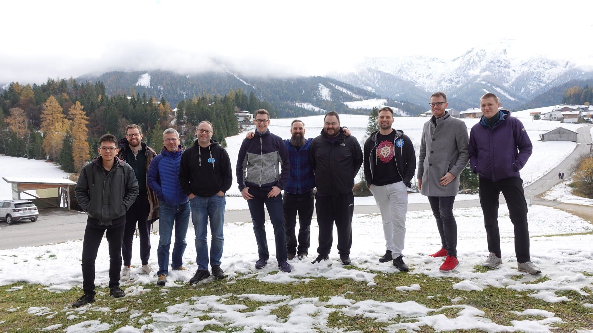

# Hack The Garden 11/2021 Wrap Up

- 🗓️ **Date:** 02.11.2021 – 06.11.2021
- 📍 **Location:** [Mesnerhof C, Steinberg am Rofan, Österreich](https://www.mesnerhof-c.at/)
- 👤 **Organizer:** [x-cellent](https://www.x-cellent.com/)
- 📘 **Topics:** /

We, the gardener and metal-stack team, were thinking of organizing a hackathon together since autumn 2019, but then the pandemic made this impossible.
After all, we managed to arrange such a hackathon this November in the beautiful Tyrolean Alps in an even more beautiful hut, the [Mesnerhof-C](https://www.mesnerhof-c.at/).

This location is equipped with all you need for a serious hacking event, like kicker, dart, excellent WLAN, projector and lots of space to hang around and hack together.
It is also a perfect place to go outside hiking between intense sessions to get your brain and body refreshed.

## Preparation

First we collected a list of projects suitable for implementation during this hackathon and then voted for the winners.
Two major topics have been identified and a list of smaller topics which could be done in small teams in `fast tracks`.

The topics we would implement with two bigger teams were:

- Implement the ability to create shoot clusters without worker nodes, aka `kubernetes control plane as a service`.
- Allow shoot cluster users to specify the kubernetes version per worker pool.

And the fast track contents have been:

- allow shoot clusters on metal-stack to be hibernated
- port gardener dev setup to the `darwin/arm64` platform
- migrate the metal-stack mini-lab away from vagrant to containerlabs
- simplify the gardener local-setup and allow developers to run a fully functional garden setup locally without any cloud provider (kind cluster provider)

### Kubernetes Control plane as a Service

Or in other words create a shoot cluster without any worker nodes. This reduces the amount of required fields in the shoot spec dramatically.
Use case for this would be to offer just a kubernetes api for applications that just rely on the kubernetes api. Metal-Stack would use this feature to create "Firewall as a Service". Or if you want to add servers as nodes to a control plane which are not controlled by gardener.

The following portions of the shoot spec become optional when using the feature:

- Infrastructure
- Networking
- Worker

Also, workerless mode doesn't require a lot of components that are usually deployed (i.e. `coredns`, `vpn`, etc). It runs very stripped version of the Kubernetes control plane with only following services: kube-apiserver, kube-controller-manager and ETCD.

This stream was implemented to a point where it was basically usable and a lot of open points have been identified.
As we all agreed that the given goal is worth the effort, we decided to write a dedicated GEP (Gardener Enhancement Proposal) which describes the goals and non-goals of this feature. The PR of the proposal will follow soon.

### Kubernetes Version per Worker Pool

This is a feature request coming from different groups of cluster users. One scenario which makes this feature invaluable is for clusters that require careful update operations.
Storage or big database workloads would like to migrate their pods gradually to worker nodes which are already on the next version of kubernetes and keep the rest of the workloads still running on the current version of kubernetes. Think of a blue/green deployment, but for kubernetes workload in one cluster.

This feature was completely implemented and we raised two pull requests:

- kube-proxy Deployment must match kubelet version: [https://github.com/gardener/gardener/pull/4969](https://github.com/gardener/gardener/pull/4969)
- Kubernetes version configurable per worker pool: [https://github.com/gardener/gardener/pull/4971](https://github.com/gardener/gardener/pull/4971)

The first PR was raised because during the development we identified an issue in the way gardener updates the workers and the system components.
The kubernetes version skew policy requires that the `kube-proxy` running on a worker node must be at the exact same version as the `kubelet`. The first PR ensures that.

The second PR allows shoot cluster users to set the kubernetes version per worker pool. If not set, the worker pool simply inherits the version from the control plane as before.
It is allowed to specify the same version of kubernetes for the worker pool as the control plane, and later stay up to two minor versions behind the control plane version.

### Fast Tracks

Also progress was made during the fast track sessions:

- allow shoot clusters on metal-stack to be hibernated  [https://github.com/metal-stack/gardener-extension-provider-metal/pull/221](https://github.com/metal-stack/gardener-extension-provider-metal/pull/221)
- port gardener dev setup to the `darwin/arm64` platform [https://github.com/gardener/gardener/pull/4955](https://github.com/gardener/gardener/pull/4955)
- migrate the metal-stack mini-lab from vagrant to containerlabs [https://github.com/metal-stack/mini-lab/pull/74](https://github.com/metal-stack/mini-lab/pull/74)
- simplify the gardener local-setup and allow developers to run a fully functional garden setup locally without any cloud provider [https://github.com/gardener/gardener/issues/5024](https://github.com/gardener/gardener/issues/5024)

## Conclusion

This is the beauty of Open Source collaboration! I can't imagine such a smooth and friendly work together with the same goal in mind otherwise.
I'm looking forward repeating this type of hackathon on a regular basis because I think there is no more funny and more productive way of working.
My impression is that this feeling is common to all attendees.
