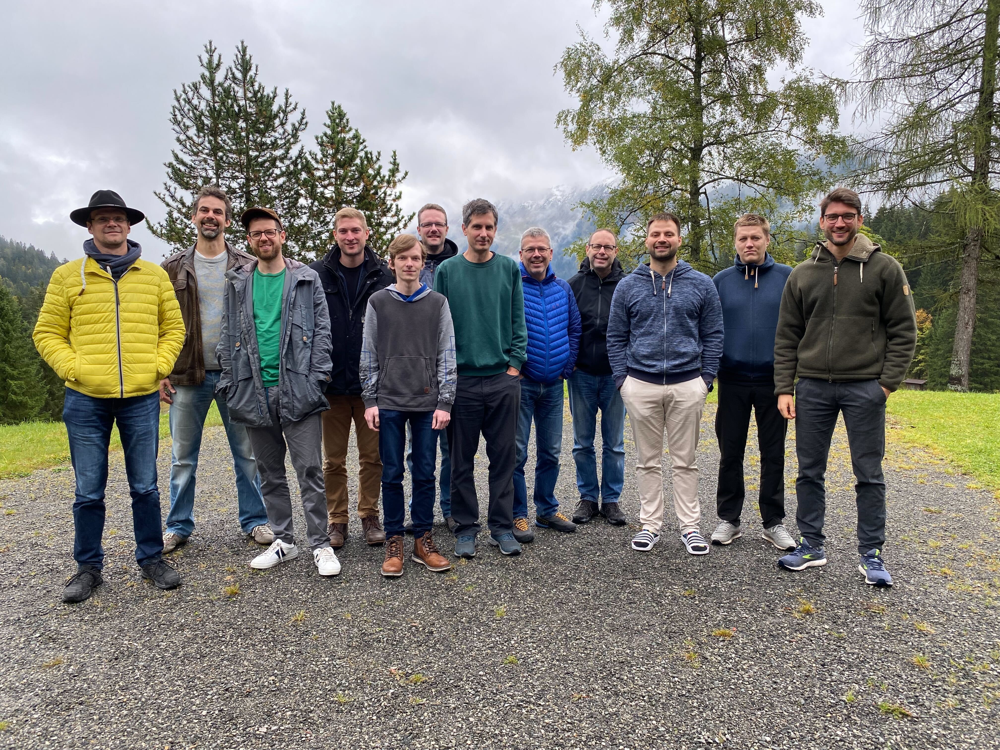

# Hack The Garden 09/2022 Wrap Up

- 🗓️ **Date:** 26.09.2022 – 30.09.2022
- 📍 **Location:** [Württemberger Haus, Hirschegg, Österreich](https://www.wuerttembergerhaus.de/)
- 👤 **Organizer:** [SAP](https://www.sap.com/)
- 📘 **Topics:** /

## IPv6

- There is an open PR which adapts some assumptions about the IPv4 CIDRs in `gardener/gardener` (changes are rather minimal).
- Shoot creation currently stops at 83%.
- `DNSRecord` extension needs to be adapted to support `AAAA` records.
- Focus was on the local setup only for now (which comes with its own issues). **As a follow-up, we want to try the same with real infrastructures**.
- **Everybody is invited to try the IPv6 setup at home (where you have IPv6 internet access) and provide feedback in the open PR.**
- With IPv6, the network CIDRs cannot be defined before shoot cretion (which is different compared to how it works with IPv4 today). **We need to discuss the target picture.**

## Canary Rollout

- There is a PoC which marks `Seed`s as canaries and works with both extensions and new gardenlet versions.
- A new freeze controller would stop gardenlets from continuing reconciling `Shoot`s in case too many clusters became unhealthy after the update.
- The `ManagedSeed` controller now also uses `ControllerDeployment`s for rolling out gardenlets.
- There are still some open questions, e.g. "how to validate provider extensions" (given that a seed cluster is typically only responsible for one provider) and "how to determine the canary seeds".
- **We have to discuss the approach and solve the open questions before writing up a GEP**.

## Registry Cache Extension

- There is a new controller (`gardener/gardener-extension-registry-cache`) for `Extension` resources which deploys the Docker registries (one per upstream repository) into the shoot cluster.
- The `containerd` configuration for the mirrors is stored in a `ConfigMap` and picked up by a `DaemonSet` from there which applies it and restarts the `containerd.`
- The `DaemonSet` pods are quite privileged and **we need to discuss how to improve security concerns here** (don't use it in production for now).
- **Some unit and integration tests (and docs) are missing and have to be added**, however Prow is already connected to it.
- There is an issue with `containerd` which only allows mirrors to be configured from one file.
- There was also a bug in `gardener/gardener` which prevented additional `containerd` imports from working properly.
- Another issue in `gardener/gardener` was found regarding removing the extension from shoot clusters (still needs to be investigated).
- Potentially, we should refactor the current implementation to rely on `OperatingSystemConfig` webhooks.

## Access Control For Shoot Clusters

- The open PR from Gerrit in `gardener/gardener` was closed in favor of an extension developed by StackIT.
- **It needs to be adapted to a new approach using `EnvoyFilter`s instead of `AuthorizationPolicy`s** (otherwise, we would risk `kube-apiserver` outages).
- End-users should not be bothered with specifying the "right" IPs (source IPs vs. proxy protocol). For this, **the provider extension need to be adapted to make this convenient for the users.** (This is only for convenience - the extension can operate on its own).
- The 23T colleagues created a new GitHub organization called `gardener-community` which might be a good place to host this new extension.

## Cilium Support For Metal Stack

- The Cilium extension was enhanced to support some more configuration options which make Cilium now possible on Metal Stack.
- In addition, Cilium was tested successfully with `provider-local` (works out of the box).

## Kubelet Server Certificate

- The kubelet was still using a self-signed server certificate (valid for `1y`) and was now adapted to create `CertificateSigningRequest` resources (same process compared to what it does to retrieve its client certificate).
- There is a new controller in `gardener-resource-manager` which approves such CSRs so that `kube-controller-manager` can issue the certificate.
- With this, the server certificate is only valid for `30d` and rotated regularly.
- Documentation and tests are still missing and need to be adapted.
- OpenShift follows a similar approach (they have their own CSR approver controller).

## Replacement Of The Last Remaining Shell Script In Metal Stack

- Awesome

## Resource Manager Health Check Watches

- Previously, the health controller was polling periodically which caused quite some delays in reporting the actual status of the world.
- This prolonged various operations unnecessarily.
- Now, it watches all resources it detects in the `status` of the `ManagedResource` which makes it reacting MUCH faster. 🎉
- This only works for the `ManagedResource`s in the seed since we currently disable the cache for shoot clusters (however, enabling it comes with quite more memory usage, so we have to check).
