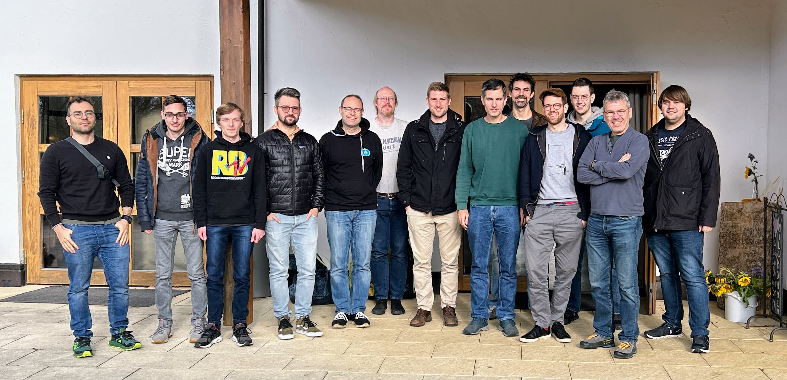

# Hack The Garden 11/2023 Wrap Up

- 🗓️ **Date:** 06.11.2023 – 10.11.2023
- 📍 **Location:** [Schlosshof Freizeitheim, Schelklingen](https://www.schlosshof-info.de/)
- 👤 **Organizer:** [x-cellent](https://www.x-cellent.com/)
- 📘 **Topics:** https://hackmd.io/H6w7MK4DTeOLbNd84QoeYQ

## 🏛️ ARM Support For OpenStack Extension

**Problem Statement:** Today, the [OpenStack extension](https://github.com/gardener/gardener-extension-provider-openstack) does not support shoot clusters with nodes based on the ARM architecture. However, some OpenStack installations support virtual machines with ARM, so Gardener should be able to provision them (similar to how it's already possible on AWS, for example).

**Motivation/Benefits**: ✨ Support more use cases/scenarios.

**Achievements:** To support multiple architectures, `provider-openstack` required enhancement for mapping machine images to the respective architecture (e.g., x86 nodes get a different OS image than ARM nodes). This capability has been implemented and validated successfully on STACKIT's OpenStack installation.

**Next Steps:** Review and merge the PR.

**Code**: [gardener/gardener-extension-provider-openstack#690](https://github.com/gardener/gardener-extension-provider-openstack/pull/690)

## 🛡️ Make [ACL Extension](https://github.com/stackitcloud/gardener-extension-acl) Production-Ready

**Problem Statement:** The [ACL extension](https://github.com/stackitcloud/gardener-extension-acl) for restricting shoot cluster API server access via IP allow-lists only had support for the OpenStack infrastructure and single `istio-ingressgateway`s (i.e., it did neither support HA control planes nor the `ExposureClass` feature of Gardener).

**Motivation/Benefits**: 🛡️ Increased cluster security, ✨ support more use cases/scenarios.

**Achievements:** The correct `istio-ingressgateway` is now identified which supports HA control planes and `ExposureClass`es. To allow for generic cloud provider support, the idea is to extend the `extensions.gardener.cloud/v1alpha1.InfrastructureStatus` API with a new field for publishing the egress IPs of the shoot cluster used for communicating with the control plane. Then, the ACL extension can just use this field and no longer needs a big `switch` statement with special code for the various cloud providers. All other provider extensions (AWS, Azure, etc.) have been adapted to publish their IPs to the new fields. However, there are some issues with GCP with dynamic IP allocation for NAT gateways (worker node scale-up might add new IPs - mitigation is to force users to use pre-allocated IPs when they want to use the ACL extension). Azure also has issues when no NAT gateways are used (random egress IPs are used in the case - mitigation is to force users to configure NAT gatways when they want to use the ACL extension).

**Next Steps:** Finish, review and merge the open PRs. Open a proposal issue for extending the `extensions.gardener.cloud/v1alpha1.InfrastructureStatus` API. Verify extension with different cloud providers. Consider how to add validation for preventing misconfigurations.

**Code**: https://github.com/kon-angelo/gardener/tree/hackathon-acl, https://github.com/stackitcloud/gardener-extension-acl/tree/feature/SupportForMultipleIstioNamespaces, [stackitcloud/gardener-extension-acl#28](https://github.com/stackitcloud/gardener-extension-acl/pull/28), [stackitcloud/gardener-extension-acl#31](https://github.com/stackitcloud/gardener-extension-acl/pull/31), [stackitcloud/gardener-extension-acl#35](https://github.com/stackitcloud/gardener-extension-acl/pull/35)

## 🕵️ Continuation Of `gardener-node-agent`

**Problem Statement:** `cloud-config-downloader` is an ever-growing shell script running on all worker nodes of all shoot clusters. It is templated via Golang and has a high complexity and development burden. It runs every `60s` and checks whether new systemd units or files have to be downloaded. There are several scalability drawbacks due to less flexibility with shell scripts compared to a controller-based implementation, for example unnecessary restarts of systemd units (e.g., `kubelet`) just because the shell script changed (which often results in short interrupts/hick-ups for end-users).

**Motivation/Benefits**: 💰 Reduction of costs due to less traffic, 📈 better scalability due to less API calls, ⛔️ prevented interrupts/hick-ups due to undesired `kubelet` restarts, 👨🏼‍💻 improved developer productivity, 🔧 reduced operation complexity.

**Achievements:** In the [previous Hackathon](https://github.com/gardener-community/hackathon/tree/main/2023-05_Leverkusen#%EF%B8%8F-introduction-of-gardener-node-agent), `gardener-node-agent` has been introduced. Thus far, we hadn't managed to put it into use since a few features were still missing. In this Hackathon, we continued working on those, e.g., by letting it write `Lease` objects for health/liveness checks (similar to how the `kubelet` reports its liveness via `Lease` objects in the `kube-node-leases` namespace). Additionally, two remaining large shell scripts for `{kubelet,containerd}-monitor` units have been refactored to Golang controllers. Furthermore, we had [a discussion](https://github.com/gardener-community/hackathon/pull/3) about making `kubelet` restarts across the entire fleet of nodes more robust.

**Next Steps:** Merge the open PRs, integrate `gardener-node-agent` into `gardenlet` (behind a feature gate), and start rolling it out gradually.

**Issue:** [gardener/gardener#8023](https://github.com/gardener/gardener/issues/8023)

**Code**: [gardener/gardener#8767](https://github.com/gardener/gardener/pull/8767), [gardener/gardener#8786](https://github.com/gardener/gardener/pull/8786)

## 🧑🏼‍🌾 Deploy `gardenlet`s Through Custom Resource Via `gardener-operator`

**Problem Statement:** `gardener-operator` can only deploy the Gardener control plane components (API server, controller-manager, etc.). `gardenlet`s must be deployed manually to target seed clusters (typically, via the Helm chart). When the `gardener-operator` can reach such seed clusters network-wise, it should be possible to make it easily deploy `gardenlet`s via a new `operator.gardener.cloud/v1alpha1.Gardenlet` custom resource.

**Motivation/Benefits**: 👨🏼‍💻 Improved developer productivity, 🔧 reduced operation complexity.

**Achievements:** A new `Gardenlet` CRD has been introduced and [`gardenlet'`s `ManagedSeed` controller](https://github.com/gardener/gardener/tree/master/pkg/gardenlet/controller/managedseed) code has been made reusable such that `gardener-operator` can also instantiate it. The local scenario with `kind` clusters is not yet fully working, but conceptually, the approach has been proven promising.

**Next Steps:** Finish the implementation and the local scenario, add missing unit/integration tests and documentation.

**Issue:** [gardener/gardener#8802](https://github.com/gardener/gardener/issues/8802)

**Code**: https://github.com/metal-stack/gardener/tree/hackathon-operator-gardenlet

## 🦅 Shoot Control Plane Live Migration (Without Downtime)

**Problem Statement:** Today, shoot control plane migrations cause a temporary downtime of the shoot cluster since ETCD must be backed-up and deleted before it can be restored in a new seed cluster. During this time frame, the API server is obviously destroyed as well. Workload in the shoot cluster itself continues to run, but cannot be reconciled/scaled/updated/...

**Motivation/Benefits**: ⛔️ Prevented downtime during control plane migration, ✨ support more use cases/scenarios (think "seed draining/shoot evictions" or simplified seed cluster deletions).

**Achievements:** The basic idea is to span new ETCD members in the destination seed cluster that join the existing ETCD cluster in the source seed. This way, a gradual move to the destination seed could be established without the necessity to terminate the ETCD cluster. The requirements for such scenario were analysed - changes to [`etcd-druid`](https://github.com/gardener/etcd-druid) and [`etcd-backup-restore`](https://github.com/gardener/etcd-backup-restore) would be required to allow joining new ETCD members into an existing cluster. Manual experiments were performed successfully (including adding multiple load balancers, new DNS records, and mutating the cluster-internal DNS resolution). Another `kube-apiserver` instance was successfully started on the destination seed, effectively spanning the control plane over multiple seeds. In addition, first steps for implementing the ideas in `gardenlet` were performed.

**Next Steps:** Multiple `gardenlet`s (on source and target seed) need to coordinate migration, this is completely different from what we have today. Discuss the mechanism and implications of this. Also, ETCD experts should be involved for checking/refining the design. Questions, learnings, and ideas should be noted down as basis for further investigations and discussions after the Hackathon. It needs to be decided whether the topic is worth being pushed forward.

**Repo**: For more details see our small [gardener-control-plane-live-migration](https://github.com/ScheererJ/gardener-control-plane-live-migration) notes repo.

## 🗄️ Stop Vendoring Third-Party Code In `vendor` Folder

**Problem Statement:** The `vendor` folder in the root of Go modules contains a copy of all third-party code the module depends on. This blows up the repository and source code releases, makes reviewing pull requests harder because many different files are changed, and creates merge conflicts for many files when both `master` and a PR change dependencies. Committing the `vendor` folder to version control systems is discouraged with newer versions of Golang.

**Motivation/Benefits**: 👨🏼‍💻 Improved developer productivity by removing clutter from PRs and speeding up `git` operations.

**Achievements:** The custom `gomegacheck` linter was replaced with the upstream `ginkgolinter` part of `golangci-lint`. With the help of [`vgopath`](https://github.com/ironcore-dev/vgopath), the code and protobuf generation was adapted to run outside the `GOPATH` and without vendoring. The deprecated `go-to-protobuf` generator still requires the `vendor` directory (works with the `vgopath` approach). We don't intend to get rid of it for now as `kubernetes/kubernetes` is still using it as well.

**Next Steps:** The failing tests in the PR have to be fixed. The https://github.com/gardener/gardener/tree/master/hack/tools/logcheck should be moved into a [dedicated repository](https://github.com/gardener/golangci-logcheck). Verification with one example extension is needed to prevent missing on side-effects to other systems (e.g., Concourse).

**Code**: https://github.com/afritzler/gardener/tree/enh/remove-vendoring, [gardener/gardener#8769](https://github.com/gardener/gardener/pull/8769), [gardener/gardener#8775](https://github.com/gardener/gardener/pull/8775)

## 🔍 Generic Extension For Shoot Cluster Audit Logs

**Problem Statement:** Audit logs of shoot clusters need to be managed outside of Gardener (no built-in/out-of-the-box solution available). Every community member has developed their own closed-source implementations of an audit log extension. Can we find a generic approach that works for everybody and allows for different backends?

**Motivation/Benefits**: 👨‍👩‍👧‍👦 Harmonize various proprietary implementations, 📦 provide out-of-the-box solution for Gardener community.

**Achievements:** [A new design](https://github.com/metal-stack/gardener-extension-audit/blob/main/architecture.drawio.svg) has been proposed for reworking the existing implementation (contributed by x-cellent) to be more reliable and reusable: A new `StatefulSet` is added to the shoot control plane that can receive the API server's audit logs via an audit webhook. The webhook backend's logs can be collected via `fluent-bit` and transported to a desired sink from there. The backend basically acts as an audit log buffer. The first steps for implementing the new design were finished and collecting the audit logs in the buffer works.

**Next Steps:** Implement the missing parts of the design, and move the repository to the [`gardener-community`](https://github.com/gardener-community) GitHub organization.

**Code**: https://github.com/metal-stack/gardener-extension-audit

## 🚛 Rework [Shoot Flux Extension](https://github.com/stackitcloud/gardener-extension-shoot-flux)

**Problem Statement:** The flux extension is currently unmaintained and has a hacky access to the garden cluster (using `gardenlet`'s kubeconfig secret). In addition, users cannot configure the flux installation (e.g., version) and bootstrap configuration (e.g., which `git` repository to connect to) per shoot but only once per garden project. The extension generates an SSH key secret per shoot which needs to be added as a deploy key to the repository afterwards. This is all quite unintiuitive and outdated.

**Motivation/Benefits**: 📦 Simple delivery of software to shoot clusters, ✨ support more use cases/scenarios.

**Achievements:** The overall goal should be to simply hook in a shoot into your fleet management by a single apply: Configure everything in the `Shoot` spec once and deploy everything using pure GitOps afterwards. The extension has been brought to the current state of the art (upgraded tools/dependencies, introduced linter and skaffold-based dev setup). The `providerConfig` API was designed and implemented to replace the old project-wide `ConfigMap` approach. The controller has been reworked to deploy and bootstrap flux according to the `providerConfig`. With this, SSH key/credentials for accessing `GitRepository`s are now properly handled. Also, the extension no longer needs access to the garden cluster anymore.

**Next Steps:** Implement missing unit tests, perform final cleanups of go packages, charts, and entrypoint. Add documentation and test control plane migration. Implement reconciliation of flux installation and resources in additional to initial one-time bootstrap. Move extension to the [`gardener-community`](https://github.com/gardener-community) GitHub organization and switch from GitHub actions to Gardener's Prow.

**Code**: https://github.com/stackitcloud/gardener-extension-shoot-flux

## 🤖 Auto-Update Skaffold Dependencies

**Problem Statement:** Today, `make check` fails when the dependencies in the `skaffold{-operator}.yaml` file are outdated. As human, the list has to be maintained manually, i.e., new dependencies have to be added and old dependencies have to be removed manually.

**Motivation/Benefits**: 👨🏼‍💻 Improved developer productivity.

**Achievements:** A new script `hack/update-skaffold-deps.sh` has been added for automatically updating Skaffold dependencies for the binaries. It can be run in case `make check` reports failures.

**Code**: [gardener/gardener#8766](https://github.com/gardener/gardener/pull/8766)

## 🪟 Discussion: Air-Gapped Shoot Clusters

**Problem Statement:** Customers are interested in limiting internet access for shoot clusters. Today, the clusters need access to the internet by default for bootstrapping nodes, pulling images from the container registry, resolving DNS names, etc.

**Motivation/Benefits**: 🛡️ Increased cluster security, ✨ support more use cases/scenarios.

**Achievements:** Ideas and the underlying problems were discussed. The conclusion is that it would be possible to achieve restricting internet access by hosting a container registry with the required images, and by either running the seed cluster in a restricted environment or by explicitly allow-listing the access to the seed networks. Overall, the concrete goals of the interested customers are not perfectly clear yet.

**Next Steps:** Note down all the thoughts and collect feedback from the discussion with customers.
