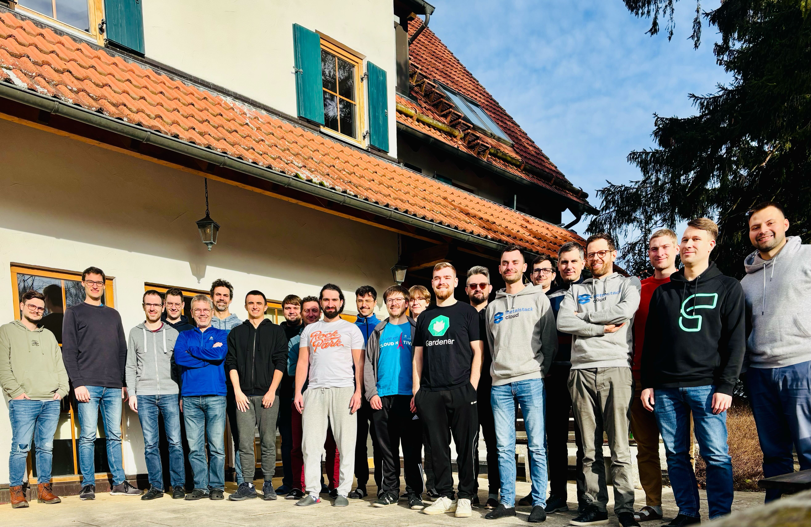

# Hack The Garden 12/2024 Wrap Up

- 🗓️ **Date:** 02.12.2024 – 06.12.2024
- 📍 **Location:** [Schlosshof Freizeitheim, Schelklingen](https://www.schlosshof-info.de/)
- 👤 **Organizer:** [x-cellent](https://www.x-cellent.com/)
- 📘 **Topics:** https://hackmd.io/RSU9-ZteSDakBxDQAfI3rg
- 🎤 **Review Meeting Summary:** https://gardener.cloud/community/review-meetings/2024-reviews/#_2024-12-11-hack-the-garden-wrap-up

## 🌐 IPv6 Support On [IronCore](https://github.com/ironcore-dev)

**Problem Statement:** IPv6-only shoot clusters are not yet supported on IronCore, yet it is clear that we eventually have to support it, given the limited scalability and phase-out of IPv4.

**Motivation/Benefits**: ✨ Support more use cases/scenarios.

**Achievements:** Due to incompatibilities of the recent Gardener version with the extension for IronCore, which had to be fixed first, the progress was delayed a bit. Eventually, we were able to create dual-stack shoot clusters. However, there are still quite some open issues, e.g., `Service` of type `LoadBalancer` don't not work for them, node-to-node communication does not work for IPv6 traffic, and a few more.

**Next Steps:** Now that a shoot cluster can at least be created (reconciles to 100%), the issues can be investigated and hopefully fixed one-by-one.

**Code/Pull Requests:** https://github.com/ironcore-dev/machine-controller-manager-provider-ironcore/pull/436, https://github.com/ironcore-dev/gardener-extension-provider-ironcore/pull/669, https://github.com/ironcore-dev/cloud-provider-ironcore/pull/473

## 🔁 Version Classification Lifecycle In `CloudProfile`s

**Problem Statement:** Kubernetes or machine image versions typically go through different classifications whilst being offered to users via `CloudProfile`s. Usually, they start with `preview`, transition to `supported`, and eventually to `deprecated` before they expire. Today, human operators have to manually facilitate these transitions and change the respective `CloudProfile`s at the times when they want to promote or demote a version. The goal of this task is to allow predefining the timestamps when a certain classification is reached. This does not only lift manual effort of the operators, but also makes the transitions more predictable/plannable for end-users.

**Motivation/Benefits**: 🔧 Reduced operational complexity, 🤩 improved user experience.

**Achievements:** After a lot of brainstorming, we decided that it makes sense to write a GEP to get more opinions on how the API should look like. The current tendency is to maintain the lifecycle times for the classifications in the `spec`, while a controller would then maintain the currently active classification in the `status` for clients to read.

**Next Steps:** The GEP has been filed and is currently in review. There is a PoC implementation according to the description, so once the design has been approved, the work can be finalized and the pull requests can be prepared.

**Code/Pull Requests:** https://github.com/gardener/gardener/pull/10982, https://github.com/metal-stack/gardener/pull/9

## 💡 Gardener SLIs: Shoot Cluster Creation/Deletion Times

**Problem Statement:** We lack observability in our end-to-end testing whether a change introduces a regression in terms of prolonged shoot cluster creation or deletion times. The goal is to (a) expose these metrics via `gardenlet`, and (b) collect and push them to a [Prometheus](https://prometheus.io/) instance running in our [Prow cluster](https://prow.gardener.cloud/). From there, we can centrally observe the SLIs over time and potentially even define alerting rules.

**Motivation/Benefits**: 👨🏼‍💻 Improved developer productivity, 🧪 increased output qualification.

**Achievements:** A new Prometheus instance in the Prow cluster now collects the metrics for cluster/creation time as well as times for individual tasks in the large `Shoot` reconciliation flow. Dashboards nicely show the data for service providers to evaluate and reason about. While the metrics are mainly collected in the CI system for e2e test executions, productive deployments of `gardenlet`s also expose them. Hence, we now also get some data for real systems.

**Code/Pull Requests:** https://github.com/gardener/gardener/pull/10964, https://github.com/gardener/gardener/pull/10967, https://github.com/gardener/ci-infra/pull/2807

## 🛡️ Enhanced `Seed` Authorizer With Label/Field Selectors

**Problem Statement:** The `Seed` Authorizer is used to restrict `gardenlet` to only access resources which belong to the `Seed` it is responsible for. However, until Kubernetes `v1.31`, there was no technical possibility to limit its visibility for resources it watches (e.g., `Shoot`s). This means that all `gardenlet`s are able to see all `Shoot`s even if they don't belong to their `Seed`. With Kubernetes `v1.31`, a new feature allows to pass label/field selectors to authorizers, which finally allows us to enforce that the `gardenlet` uses respective selectors.

**Motivation/Benefits**: 🛡️ Increased cluster security.

**Achievements:** We enabled the selector enforcement for the `Shoot`, `ControllerInstallation`, `Bastion`, and `Gardenlet` APIs. Unfortunately, it requires to enable the new `AuthorizeWithSelectors` feature gate on both `{kube,gardener}-apiserver`. We have also introduced a new feature gate in `gardener-admission-controller` (serving the `Seed` authorizer webhook) in order to be able to enforce the selector (this can only work with Kubernetes `v1.31` when the feature gates are enabled, or with `v1.32`+ where the feature gates got promoted to beta). On our way, we have discovered more opportunity to tune the authorizer, for example shrinking `gardenlet`'s permissions for other `Seed` resources.

**Next Steps:** A PoC implementation has been prepared, yet it has to be finalized and the mentioned feature gate has to be introduced. There are separate/independent work branches for the other improvements we discovered, and also they have to be finalized.

**Code/Pull Requests:** https://github.com/rfranzke/gardener/tree/improve-seed-authz

## 🔑 Bring Your Own ETCD Encryption Key Via Key Management Systems

**Problem Statement:** Gardener uses the AESCBC algorithm to compute the encryption key for ETCD of shoot clusters. This key is stored as `Secret` in the seed cluster. Yet, some users prefer to manage the encryption key on their own via a key management system (e.g., Vault or AWS KMS). Kubernetes already supports [various KMS providers](https://kubernetes.io/docs/tasks/administer-cluster/kms-provider/). The goal is to allow configuring an external KMS and key in the `Shoot` specification to support this feature.

**Motivation/Benefits**: 🛡️ Increased cluster security.

**Achievements:** We came up with a new API called `ControlPlaneEncryptionConfig` in the `extensions.gardener.cloud` API group. This way, we can write new extensions for arbitrary external KMS plugins. In the `Shoot` API, the mentioned encryption config can be passed via `.spec.kubernetes.kubeAPIServer.encryptionConfig`. The respective extension is then responsible to create the [`EncryptionConfiguration` for `kube-apiserver`](https://kubernetes.io/docs/tasks/administer-cluster/kms-provider/#encrypting-your-data-with-the-kms-provider-kms-v1) and inject the KMS plugin sidecar container into the `kube-apiserver` `Deployment`. We have also develop concepts for migration to and from the current AESCBC provider, and for KMS key rotation.

**Next Steps:** Due to the size and criticality of the feature, we decided to write a GEP to align on the overall approach. The general concept has been validated in a PoC and looks promising.

**Code/Pull Requests:** https://github.com/plkokanov/gardener/tree/hackathon-kms

## ⚖️ Load Balancing For Calls To `kube-apiserver`s

**Problem Statement:** TLS connections are terminated by the individual shoot API server instances. After establishing a TLS connection, all requests sent over this connection end up on the same API server instance. Hence, the Istio ingress gateway performs L4 load balancing only, but it doesn't distribute individual requests across API server instances. This often overloads a single API server pod while others are much under-utilized.

**Motivation/Benefits**: 📈 Better scalability, 🤩 improved user experience.

**Achievements:** We have switched to Istio terminating the TLS connections which allows to properly load balance the request to the `kube-apiserver` pods. A load generator nicely demonstrates that this indeed improves the situation compared to current implementation.

**Next Steps:** The work has to finalized and the pull request has to be opened.

**Issue:** https://github.com/gardener/gardener/issues/8810

**Code/Pull Requests:** https://github.com/oliver-goetz/gardener/tree/hack/distribute-apiserver-requests

## 🪴 Validate PoC For In-Place Node Updates Of Shoot Clusters

**Problem Statement:** GEP-31 focuses on allowing updating Kubernetes minor versions and/or machine image versions without requiring the deletion and recreation of the nodes. This aims to minimize the overhead traditionally associated with node replacement, and it offers an alternative approach to updates, particularly important for physical machines or bare-metal nodes. There is already a proof-of-concept implementation, and the goal of this task was to validate it on a real infrastructure/system.

**Motivation/Benefits**: ✨ Support more use cases/scenarios.

**Achievements:** After fixing a few missing pieces in the PoC implementation that have to be incorporated into the work branch, we achieved performing an in-place update for a Kubernetes minor version change on a bare-metal infrastructure. It can be configured per worker pool with a new `updateStrategy` field.

**Next Steps:** Unfortunately, we were lacking a functional version of Gardenlinux in order to test the in-place updates for OS versions. Hence, this part is still open and should be validated once an image is available.

**Issue:** https://github.com/gardener/gardener/issues/10219

**Code/Pull Requests:** https://github.com/gardener/gardener/pull/10828

## 🚀 Prevent `Pod` Scheduling Issues Due To Overscaling

**Problem Statement:** The Vertical Pod Autoscaler sometimes recommends resource requirements exceeding the allocatable resources of the largest nodes. This results in some pods becoming unschedulable (which eventually can result in downtimes). The goal is to prevent this from happening, thus ensuring properly running pods.

**Motivation/Benefits**: 🔧 Reduced operational complexity, ✨ support more use cases/scenarios.

**Achievements:** We came up with three different approaches, but all of them have their drawbacks. Details about them can be read in the linked `hackmd.io` document. We decided to try augmenting the upstream VPA implementation with global "max allowed" flags for `vpa-recommender`. In addition, we prepared the needed changes in Gardener to consume it.

**Next Steps:** Work with the autoscaling community to make sure the proposed pull requests gets accepted and merged.

**Issue:** https://hackmd.io/GwTNubtZTg-D1mNhzV5VOw

**Code/Pull Requests:** https://github.com/kubernetes/autoscaler/pull/7560, https://github.com/ialidzhikov/gardener/commits/enh/seed-and-shoot-vpa-max-allowed, https://github.com/gardener/gardener/pull/10413

## 💪🏻 Prevent Multiple `systemd` Unit Restarts On Reconciliation Errors

**Problem Statement:** Restarting `systemd` units, especially the `kubelet.service` unit, can be quite costly/counter-productive. When `gardener-node-agent` fails during its reconciliation of files and units on the worker nodes, it starts again from scratch and potentially restarts units multiple times until the entire reconciliation loop finally succeeds.

**Motivation/Benefits**: 🤩 Improved user experience.

**Achievements:** Instead of only persisting its last applied `OperatingSystemConfig` specification at the end of a successful reconciliation, `gardener-node-agent` now updates its state immediately after the reconciliation of a file or unit. This way, it doesn't perform such changes again if the reconciliation fails in the meantime.

**Issue:** https://github.com/gardener/gardener/issues/10972

**Code/Pull Requests:** https://github.com/gardener/gardener/pull/10969

## 🤹‍♂️ Trigger Nodes Rollout Individually Per Worker Pool During Credentials Rotation

**Problem Statement:** Today, triggering a shoot cluster credentials rotation results in an immediate rollout of all worker nodes in the cluster. Some scenarios require to have more control over this rollout, particularly the option to trigger it individually per worker pool at different times.

**Motivation/Benefits**: ✨ Support more use cases/scenarios, 🏗️ lift restrictions.

**Achievements:** A concept has been developed, proposed, and implemented in a prototype. The idea is to introduce new, special operation annotation for starting a credentials rotation without triggering worker poll rollouts. The user can then roll the nodes (via another operation annotation) at their convenience. Once all pools have been rolled out, the rotation can then be completed as usual.

**Next Steps:** The PoC looks promising, yet the work has to be finished (tests, feature gate, documentation still missing) before a pull request has been opened. 

**Issue:** [https://github.com/gardener/gardener/issues/10121](https://github.com/gardener/gardener/issues/10121#issuecomment-2515479242)

**Code/Pull Requests:** https://github.com/rfranzke/gardener/tree/individual-node-rollout-rotation

## ⛓️‍💥 E2E Test Skeleton For Autonomous Shoot Clusters

**Problem Statement:** GEP-28 proposes to augment Gardener functionality with support for managing autonomous shoot clusters. The GEP has been merged a while ago, and we also crafted a skeleton for the to-be-developed `gardenadm` binary already. However, the needed e2e test infrastructure is missing and should be established before the implementation of the business logic is started.

**Motivation/Benefits**: 👨🏼‍💻 Improved developer productivity.

**Achievements:** We introduced new `make` targets to create a local development setup based on KinD and machine pods (like for regular shoot clusters). The `gardenadm` binary is build and transported to these machine pods. New e2e tests in `gardener/gardener` execute the various commands of `gardenadm` and assert that it behaves as expected.

**Issue:** https://github.com/gardener/gardener/issues/2906

**Code/Pull Requests:** https://github.com/gardener/gardener/pull/10977, https://github.com/gardener/ci-infra/pull/2827

## ⬆️ Deploy Prow Via Flux

**Problem Statement:** Prow is a system for Gardener's CI and automation. So far, it was deployed using manually crafted deployment scripts. Switching to Flux, which is a cloud-native solution for continuous delivery based on GitOps, allows to eliminate these scripts and implement industry best-practises.

**Motivation/Benefits**: 👨🏼‍💻 Improved developer productivity.

**Achievements:** The custom deployment script has been almost eliminated and replaced with Kustomizations and Helm releases that are managed by Flux.

**Next Steps:** The monitoring configurations for the Prow cluster still need to be migrated. However, we prefer to create a new deployment from scratch (since we are not too happy with the current solution, i.e., we don't want to just "migrate" it over to Flux but use the opportunity to renovate it).

**Code/Pull Requests:** https://github.com/gardener/ci-infra/pull/2812, https://github.com/gardener/ci-infra/pull/2813, https://github.com/gardener/ci-infra/pull/2814, https://github.com/gardener/ci-infra/pull/2816, https://github.com/gardener/ci-infra/pull/2817, https://github.com/gardener/ci-infra/pull/2818, and many more... 😉

## 🚏 Replace `TopologyAwareHints` With `ServiceTrafficDistribution`

**Problem Statement:** The `TopologyAwareHints` uses allocatable CPUs for distributing the traffic according to the configured hints. This forced us to introduce custom code (webhook on `EndpointSlice`s) in Gardener to mitigate this limitation. The new `ServiceTrafficDistribution` is just using the availability zone without taking into account the CPUs, hence it would eventually allow us to get rid of our custom code.

**Motivation/Benefits**: 👨🏼‍💻 Improved developer productivity.

**Achievements:** Kubernetes clusters of version `v1.31` and higher now use the new `ServiceTrafficDistribution` feature. Yet, until this is our lowest supported Kubernetes version, we have to keep our custom code (to also support older versions).

**Issue:** https://github.com/gardener/gardener/issues/10421

**Code/Pull Requests:** https://github.com/gardener/gardener/pull/10973

## 🪪 Support More Use-Cases For `TokenRequestor`

**Problem Statement:** Currently, `gardener-resource-manager`'s `TokenRequestor` controller is not capable of injecting the current CA bundle into access secrets. This requires operators to use the generic token kubeconfig, however, this is not possible in all use cases. For example, Flux needs to read a `Secret` with a self-contained kubeconfig and cannot mount it. Hence, operators had to work around this and manually fetch the CA bundle first before crafting the kubeconfig for the controller. Another use-case is to make it watch additional namespaces.

**Motivation/Benefits**: 👨🏼‍💻 Improved developer productivity, ✨ support more use cases/scenarios.

**Achievements:** Access secrets annotated with `serviceaccount.resources.gardener.cloud/inject-ca-bundle` now get either a new `.data."bundle.crt"` field with the CA bundle. When there is a kubeconfig, then the CA bundle will be injected directly into the server configuration. This enables new features and allows operators to get rid of workarounds and technical debt.

**Code/Pull Requests:** https://github.com/gardener/gardener/pull/10988

## 🫄 `cluster-autoscaler`'s `ProvisioningRequest` API

**Problem Statement:** The `cluster-autoscaler` community introduced the new `ProvisioningRequest` API. This enables users to provide a pod template and ask the autoscaler to either provision a new node or to get to know whether the pod would fit in the existing cluster without doing any scale-up. The new API can help users to ensure all-or-nothing semantics. Without this API, users have to create the pod which might remain stuck in the `Pending` state.

**Motivation/Benefits**: ✨ Support more use cases/scenarios.

**Achievements:** A new field in the `Shoot` specification has been added to enable users to activate this API.

**Next Steps:** Finalize unit/integration tests and open the pull request for review.

**Issue:** https://github.com/gardener/gardener/issues/10962

**Code/Pull Requests:** https://github.com/tobschli/gardener/tree/ca-provisioning-api

## 👀 Watch `ManagedResource`s In `Shoot` Care Controller

**Problem Statement:** The `Shoot` care controller performs regular health checks for various aspects of the shoot cluster. These are ran periodically based on configuration. This approach has the downside that failing conditions will not be reported in the meantime, i.e., they have to wait for the next sync period before getting visible in the `Shoot` status.

**Motivation/Benefits**: 🔧 Reduced operational complexity, 🤩 improved user experience.

**Achievements:** Similar to [this previous effort in the 2022/09 Hackathon](https://github.com/gardener-community/hackathon/blob/main/2022-09_Hirschegg/README.md#resource-manager-health-check-watches), we introduced a WATCH for `ManagedResource` in the controller which causes a re-evaluation of the health checks once a relevant condition has changed. This way, the `Shoot` status reflects health changes immediately.

**Code/Pull Requests:** https://github.com/gardener/gardener/pull/10987

## 🐢 Cluster API Provider For Gardener

**Problem Statement:** It is a common/regular ask of users to use the community-standard APIs for cluster management. While this is generally questionable (see https://github.com/gardener/gardener/blob/master/docs/concepts/cluster-api.md), this request is reoccurring every now and then. It could help adoption if Gardener supported the cluster API, even if it is just about forwarding the data to the actual Gardener API server.

**Motivation/Benefits**: ✨ Support more use cases/scenarios.

**Achievements:** It is possible to deploy or delete a shoot cluster via the cluster API (the manifest is "just forwarded" to the Gardener API). There are still some rough edges, but the general approach seems to work (i.e., we haven't discovered technical dead-ends). Yet, it is unclear what the benefit of using this is since it's just proxying it down.

**Next Steps:** There are still quite a few open points before this should be used productively. We have to decide how to continue this effort.

**Issue:** https://github.com/gardener/gardener/blob/master/docs/concepts/cluster-api.md

**Code/Pull Requests:** https://github.com/metal-stack/cluster-api-provider-gardener

## 👨🏼‍💻 Make `cluster-autoscaler` Work In Local Setup

**Problem Statement:** Currently, the `cluster-autoscaler` is not working in the local setup because we were not setting the `nodeTemplate` in the `MachineClass` for the `cluster-autoscaler` to get to know about the resource capacity of the nodes. In addition, the `Node` object reported false data for allocatable resources. It also missed a provider ID which prevented `cluster-autoscaler` to associate the `Node` with a `Machine` resource.

**Motivation/Benefits**: 👨🏼‍💻 Improved developer productivity.

**Achievements:** We crafted a custom `cloud-controller-manager` for `provider-local` such that the provider ID can be populated into the `Node` object. In addition, we properly populate the `nodeTemplate` in the `MachineClass` now.

**Next Steps:** We still have to figure out how to make the `Node` report its allocatable resources properly.

**Code/Pull Requests:** https://github.com/ialidzhikov/cloud-provider-local, https://github.com/ialidzhikov/gardener/tree/fix/cluster-autoscaler-provider-local

## 🧹 Use Structured Authorization In Local KinD Cluster

**Problem Statement:** Due to changes in `kubeadm`, we had to introduce a workaround for enabling the seed authorizer in the local KinD clusters. This slows down the creation of the cluster and hence all e2e tests.

**Motivation/Benefits**: 👨🏼‍💻 Improved developer productivity.

**Achievements:** With the new [Structured Authorization](https://kubernetes.io/docs/reference/access-authn-authz/authorization/#using-configuration-file-for-authorization) feature of Kubernetes, we were able to get rid of the workaround and speed up the KinD cluster creation dramatically.

**Issue:** https://github.com/gardener/gardener/issues/10421

**Code/Pull Requests:** https://github.com/gardener/gardener/pull/10984

## 🧹 Drop Internal Versions From Component Configuration APIs

**Problem Statement:** In order to follow the same approaches like for regular Gardener APIs, we currently maintain an internal and an external version of the component configurations. However, we concluded that the internal version actually has no benefit and just causes more maintenance effort during development.

**Motivation/Benefits**: 👨🏼‍💻 Improved developer productivity.

**Achievements:** We started working on removing the internal version, but due to its wide-spread use in the code base, we weren't able to finish it yet.

**Next Steps:** The effort has to be continued after the Hackathon such that a pull requests can be opened.

**Issue:** https://github.com/gardener/gardener/issues/11043

**Code/Pull Requests:** https://github.com/timebertt/gardener/tree/config-apis

## 🐛 Fix Non-Functional Shoot Node Logging In Local Setup

**Problem Statement:** We discovered that the shoot node logging was not working in the local development setup for quite a while.

**Motivation/Benefits**: 👨🏼‍💻 Improved developer productivity.

**Achievements:** We have identified the reason for the problem (it probably broke when we introduced `NetworkPolicy`s in the `garden` namespace). In the meantime, `Ingress`es (like the Vali which gets the shoot node logs) are exposed via Istio. Yet, in the local setup the traffic was still sent to the `nginx-ingress-controller` for which the network path was blocked. By switching it to Istio, we were able to fix the problem.

**Issue:** https://github.com/gardener/gardener/issues/10916

**Code/Pull Requests:** https://github.com/gardener/gardener/pull/10991

## 🧹 No Longer Generate Empty `Secret` For `reconcile` `OperatingSystemConfig`s

**Problem Statement:** After the introduction of `gardener-node-agent`, the `OperatingSystemConfig` controller no longer needs to generate a `Secret` when the `purpose` is `reconcile`. Yet, it was still doing this, effectively creating an empty `Secret` which was not used at all (and just "polluted" the system).

**Motivation/Benefits**: 👨🏼‍💻 Improved developer productivity.

**Achievements:** `gardenlet` has been adapted to no longer read the `Secret`, and the respective creation in the `OperatingSystemConfig` has been deprecated. It can be removed after a few releases to ensure backwards-compatibility.

**Next Steps:** Wait until the deprecation period has expired, and then finally cleanup the `Secret` generation from the `OperatingSystemConfig` controller.

**Code/Pull Requests:** https://github.com/rfranzke/gardener/tree/osc-controller-cloudconfig-secret

## 🖥️ Generic Monitoring Extension

**Problem Statement:** Since quite a while, we know that different parties/users of Gardener have different requirements w.r.t. monitoring (or observability in general). While a few things have been made configurable in the past, many others have not. This required users to write custom extensions that manipulate configuration. This approach has some limitations and cannot properly realize all use-cases, i.e., we need a better way of making them work without introducing more technical debt.

**Motivation/Benefits**: 👨🏼‍💻 Improved developer productivity.

**Achievements:** We talked about the requirements and brain-stormed how/whether the monitoring aspect of Gardener can be externalized. We decided that it's best to write them down in a clear way so that they can be used as input in follow-up discussions.

**Next Steps:** Discuss the requirements with the monitoring experts of all affected parties and align on an approach that works for most use-cases.

**Issue:** https://github.com/gardener/gardener/issues/10985

