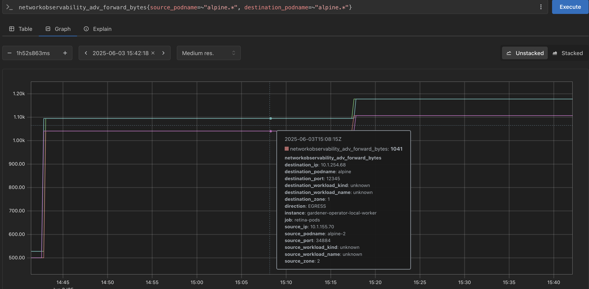

# Hack The Garden 06/2025 Wrap Up

- 🗓️ **Date:** 02.06.2025 – 06.06.2025
- 📍 **Location:** [Schlosshof Freizeitheim, Schelklingen](https://www.schlosshof-info.de/)
- 👤 **Organizer:** [x-cellent](https://www.x-cellent.com/)
- 📘 **Topics:** https://hackmd.io/ugrWYptbRAi9NPi78G-B9g

## ⚡️ Replace OpenVPN with Wireguard

**Problem Statement:**
The Gardener VPN implementation between control and data plane currently uses OpenVPN, which is a well-established but somewhat old solution for VPNs.
Wireguard is a relatively new, but well-liked contender in the VPN space.
It could be possible to replace OpenVPN with Wireguard.
As we do not want to spin up a load balancer per control plane (or use one port per control plane) a reverse proxy like [mwgp](https://github.com/apernet/mwgp) is required.

**Motivation/Benefits:**
🚀 Modernize VPN stack, ⚡️ improved performance and simplicity.

**Achievements:**
We have a POC for VPN via Wireguard connection for one shoot with local setup and the local setup for extensions.
There is a [document](https://github.com/axel7born/vpn2/blob/wireguard/docs/wireguard.md) describing the approach and the deployment. 

**Next Steps:**
* Test network connection: resilience, downtime during new deployment, throughput...
* Aggregate the secrets from all shoots to generate a unified MWGP configuration.
* Currently, MWPG needs to be restarted to get the new configuration. This would have to be done for each new shoot. Check if this is a problem and if it can be avoided.
* Check if the functionality of MWGP can be implemented as Istio plugin.
* Refactor and finalize the implementation to prepare PRs.

**Code/Pull Requests:**
* https://github.com/axel7born/gardener/tree/wireguard
* https://github.com/axel7born/vpn2/tree/wireguard
* https://github.com/majst01/mwgp

## ⛳️ Make `gardener-operator` Single-Node Ready

**Problem Statement:**
By default, when Gardener is deployed, some components of it are deployed for high availability, assuming multiple nodes in the cluster.
This is not necessary or hinders the deployment of Gardener in single-node clusters.
For bare-metal scenarios, sometimes only a single node is available, meaning e.g. multiple replicas of some components are not needed.

**Motivation/Benefits:**
🧩 Enable lightweight/single-node deployments, 🛠️ reduce resource overhead.

**Achievements:**
In addition to several components being made single-node ready, the Prometheus deployments were made configurable via the component configuration.

**Next Steps:**
It needs to be evaluated if the steps taken are sufficient to be used in a real world scenario.

**Code/Pull Requests:**
* https://github.com/gardener/gardener-extension-provider-gcp/pull/1052
* https://github.com/gardener/gardener-extension-provider-openstack/pull/1042
* https://github.com/fluent/fluent-operator/pull/1616
* https://github.com/afritzler/cortex/commit/4000c188086fe383d314efeb40a663f49aa8b35b
* https://github.com/afritzler/cortex/commit/616c0b80d90d036f4275636e1a3be9c5f2aac9e5
* https://github.com/afritzler/vali/commit/35fbce152f783f33fdc2066e09d60ec2ba56b562
* https://github.com/afritzler?tab=packages&repo_name=vali
* https://github.com/gardener/gardener/pull/12248

## 📡 OpenTelemetry Transport for `Shoot` Metrics

**Problem Statement:**
Today the shoot metrics are collected by the control plane Prometheus using the Kubernetes API server `/proxy` endpoint, without any ability to fine tune the collected metrics sets.
Since we introduce OpenTelemetry collector instance on the shoots as a replacement of valitail service and on seeds in the shoot control plane namespace, the goal is to try out collecting and filtering the shoot metrics via OpenTelemetry collector instances also giving the opportunity for filtering and fine-tuning of the metrics sets.
This story is part of [Observability 2.0 initiative](https://github.com/gardener/gardener/blob/master/docs/proposals/34-observability2.0-opentelemtry-operator-and-collectors.md).

**Motivation/Benefits:**
📊 Flexible and modern metrics collection, 🔍 improved observability.

**Achievements:**
Collecting shoot metrics by an OpenTelemetry collector instance running on the shoot and transporting those to the Prometheus [OTLP](https://opentelemetry.io/docs/specs/otlp/) ingestion endpoint on seeds has been proved to be a viable scenario.
The OpenTelemetry collector instance can be configured to filter and fine tune the metrics sets, allowing for more flexibility in the metrics collection.

**Next Steps:**
Introducing OpenTelemetry collector on shoot nodes is now part of the implementation plan for Observability 2.0.
The community is invited to participate in this or any future initiative part of Gardener Observability 2.0 concept.

## 🔬 Cluster Network Observability

**Problem Statement:**
It might be beneficial to be able to get deeper insights into the traffic of a Kubernetes cluster.
For example, traffic across availability zone boundaries may have increased latency or monetary costs.
There are tools, e.g. https://github.com/microsoft/retina, which allow to gain more detailed insights into the pod network, but may lack some features like availability zone tracking (see https://github.com/microsoft/retina/issues/1179).

**Motivation/Benefits:**
👁️‍🗨️ Enhanced network visibility, 📈 actionable insights for optimization.

**Achievements:**
The retina tool was successfully enhanced to also label source and destination zones of the traffic.
This allows to get insights into the traffic across availability zones, to potentially reduce costs.

**Next Steps:**
The PR for retina is still open and needs to be merged.
After that, it can be discussed how to proceed with the integration into Gardener, e.g. in the shape of an extension.

**Issue:**
https://github.com/microsoft/retina/issues/1654

**Code/Pull Requests:**
https://github.com/microsoft/retina/pull/1657

## 📝 Signing of `ManagedResource` Secrets

**Problem Statement:**
The secrets of `ManagedResource`s, are currently used as-is by the Gardener Resource Manager (GRM).
This could lead to a bad-actor manipulating these secrets to deploy resources with the permissions of the GRM.
To prevent one potential scenario of privilege escalation, we want to sign the secrets of `ManagedResource`s with a key that is only known to the Gardener Resource Manager.
This way, the grm can verify that the secrets it receives are not manipulated by a bad actor.

**Motivation/Benefits:**
🔒 Improved security and integrity for managed resources.

**Achievements:**
A PoC was created that demonstrates that signing of `ManagedResource` secrets is possible.

**Next Steps:**
There are still some open questions, as well as testing which needs to be followed up on.

**Code/Pull Requests:**
https://github.com/gardener/gardener/pull/12247

## 🧰 Migrate Control Plane Reconciliation of Provider Extensions to `ManagedResource`s

**Problem Statement:**
Currently we deploy control-plane components using the chart applier instead of managed-resources.
This creates some issues where for example if we want to scale a component, we have to do it "manually", e.g. scaling a controller to 0 needs to be done imperatively.

**Motivation/Benefits:**
🔄 Simplified operations, ⚙️ improved scalability and automation.

**Achievements:**
A PR was created to merge this feature into Gardener.

**Next Steps:**
The PR needs to be reviewed and merged.

**Issue:**
* https://github.com/gardener/gardener/issues/12250 (stretch goal)

**Code/Pull Requests:**
* https://github.com/gardener/gardener/pull/12251
* https://github.com/gardener/gardener/compare/master...metal-stack:gardener:controlplane-objects-provider-interface (stretch goal)

## ✨ Dashboard Usability Improvements

**Problem Statement:**
The Gardener Dashboard assumes static, non-configurable defaults for e.g. Shoot values, which may not be suitable for all deployment scenarios.
Some points that could be improved: Value Defaulting (landscape scope): e.g. AutoScaler min/max replicas; Overrides (project scope): Optional labels for Shoots that can be used as a display name to overcome the project name length limit; Hide UI Elements (landscape scope): e.g. Control Plane HA; Add new UI Elements (stretch goal): would require extensibility concept for the dashboard

**Motivation/Benefits:**
🖥️ Improved user experience, 🛠️ more flexible and customizable dashboard.

**Achievements:** 
* Annotations for project resources can be added that are used by the gardener-dashboard to show a custom display name for projects. This allows to overcome the project name length limit.
* The dashboard can now be configured to use default values for Shoots, e.g. AutoScaler min/max replicas.
* The dashboard can now be configured to hide certain UI elements, e.g. Control Plane HA.

**Next Steps:**
There are some open discussions on how to incorporate the new features into the dashboard.

**Issue:**
https://github.com/gardener/dashboard/issues/2469

**Code/Pull Requests:**
* Project Title – https://github.com/gardener/dashboard/pull/2470
* Value Defaulting – https://github.com/gardener/dashboard/pull/2476
* Hide UI Elements – https://github.com/gardener/dashboard/pull/2478

## ⚖️ Cluster-internal L7 Load-Balancing Endpoints for `kube-apiserver`s

**Problem Statement:**
In the last hackathon we created an L7 load-balancing for the external endpoints of Gardener kube-apiservers (Shoots & Virtual Garden).
However, cluster internal traffic like from gardener-resource-manager and gardener-controller-manager accesses the Kubernetes internal services directly, skips Istio and so the L7 load-balancing.
We noticed at least for gardener-controller-manager that it could generate some load to the gardener-apiserver. Thus, it would be nice to have a cluster internal load-balancing too.
We don't want to use the external endpoint since depending on the infrastructure this could create additional external traffic.

**Motivation/Benefits:**
⚖️ Better resource distribution, 🚦 improved reliability for internal traffic.

**Achievements:**
Cluster internal L7 load balancing was implemented by leveraging generic token kubeconfig, creating a dedicated clusterIP service for Istio ingress gateway pods, and introducing a pod-kube-apiserver-load-balancing webhook to inject necessary configurations into control plane pods. 

**Next Steps:**
Merge the PR.

**Issue:**
https://github.com/gardener/gardener/issues/8810

**Code/Pull Requests:**
https://github.com/gardener/gardener/pull/12260

## 📜 Documentation Revamp

**Problem Statement:**
Usually, the individual content of our documentation is of high quality and helpful.
However, we typically receive complaints about the structure and explorability of our documentation.

**Motivation/Benefits:**
📚 Easier onboarding, 🔎 improved discoverability and structure.

**Achievements:**
* Metadata, e.g. page synonyms and categories for the documentation pages was added / enhanced to allow for better discoverability.
* Glossary was enhanced to explain more terms and concepts used in the documentation.
* A PoC for using VitePress as a documentation generator was created. This allows for a more modern and flexible documentation structure, as well as better developer experience when working on the documentation.

**Next Steps:**
* Take more time to improve metadata as well as the search algorithm.
* Potentially add analytics to the documentation to understand how it is used and where improvements can be made.
* Look into the PoC for VitePress and decide if it should be used as a replacement for the current documentation.

**Code/Pull Requests:**
* https://github.com/gardener/documentation/pull/652
* https://github.com/gardener/documentation/pull/653

## ℹ️ Expose EgressCIDRs in shoot-info `ConfigMap` 🏎️

**Problem Statement:**
Some stakeholders need to know the egress CIDRs of a shoot cluster.
Helps expose meta-level information about the shoot to workloads of the shoot.
This could be useful in case of controllers e.g. crossplane that run on the shoot and need access to some information of the existing infrastructure.

**Motivation/Benefits:**
🏷️ Enable better integration for shoot workloads, 📤 improved transparency.

**Achievements:**
It was implemented and merged during the hackathon.

**Code/Pull Requests:**
https://github.com/gardener/gardener/pull/12252

## 📈 Overcome Maximum of 450 `Node`s on Azure

**Problem Statement:**
Extensions that do not rely on overlay networking for their in-cluster networking usually rely on other mechanisms such as route tables to establish p2p traffic.
Azure being one of them.
We currently face scaling difficulties as clusters generally approach the maximum size of route tables set by the provider, and we need a new network architecture to overcome this limitation.

**Motivation/Benefits:**
🚀 Enable larger clusters, 🏗️ reference for other providers.

**Achievements:**
Analysis and hurdles of the problem were identified, and a potential solution was discussed.
The solution involves using a combination of route tables and virtual networks to overcome the limitations.

**Next Steps:**
A preview feature of Azure is needed to be able to follow up on this.
Until it is enabled, it takes some time.

## 🦜 Multiple Parallel Versions in a Gardener Landscape (fka. Canary Deployments)

**Problem Statement:**
Gardener currently has very tight versioning constraints.
For example, it is not possible to have multiple versions of the same extension type running on the same seed cluster.
Therefore, previous ideas around canary deployments ended with the direction to make control plane migration as easy/fast/reliable as possible so that the control planes can be moved between seeds running with different versions of gardenlet/extensions.
A different approach, favoured by this proposal, would be to make it possible to run multiple version in parallel on a single seed cluster with filters in place so that individual control plane components are still reconciled only by one set of version.
This would allow multiple "channel" in the same landscape, e.g. alpha, beta, GA.

**Motivation/Benefits:**
🦜 Enable canary/parallel versioning, 🔄 safer rollouts.

**Achievements:**
It was discovered that the current implementation allows to roll out different versions across different seeds.

**Next Steps:**
There are still some caveats which require further discussion, which will be followed up on.

## ♻️ GEP-32 – Version Classification Lifecycles 🏎️

**Problem Statement:**
Last Gardener Hackathon we implemented Version Classification Lifecycles in the (Namespaced) Cloud Profile, proposed the GEP-32, but we couldn't find enough time to finish the required pull requests for the actual implementation.

**Motivation/Benefits:**
♻️ Automated version lifecycle management, ⏳ reduced manual effort.

**Achievements:**
The previous PR was rebased and confirmed to still be working. The implementation was cut into several smaller PRs to make it easier to review and merge.

**Next Steps:**
The individual PRs need to be worked on, reviewed and merged. 

**Code/Pull Requests:**
https://github.com/metal-stack/gardener/pull/9

## 🧑‍🔧 Worker Group Node Roll-out 🏎️

**Problem Statement:**
Kubernetes Deployments allow simple rollout of pods with `kubectl rollout restart deployment <name>`.
There are situations when something similar would be nice to have for worker groups in the Gardener context.
For example, the dual-stack migration requires to roll nodes.
It would be easier to have a simple way, e.g. by using an annotation on the shoot resource, to trigger node rollout for a worker group.

**Motivation/Benefits:**
🧑‍🔧 Improved node management, 🚀 streamlined rollouts.

**Achievements:**
A PoC was created that allows to trigger a node roll-out for a worker group by using an annotation on the shoot resource. Now the Shoot resource can be annotated with `gardener.cloud/operation=rollout-workers=<pool1>,<pool2>,...,<poolN>.`
This causes a new status to appear on the Shoot that shows the given worker pools as pending for roll-out.

**Next Steps:**
The PoC needs to be polished and tested, as well as reviewed and merged.

**Code/Pull Requests:**
https://github.com/rrhubenov/gardener/tree/worker-pool-rollout

## 👀 Instance Scheduled Events Watcher

**Problem Statement:**
Cloud providers may need to move, stop, retire, reboot etc.
The means of communication differ, but they are generally available either in the instance objects themselves or more commonly the metadata service.
The general goal of this task is to create an agent that can browse and expose via node events and/or dashboard, shoot condition warnings or similar channels available to stakeholders the VM events.
This will allow users to take action for their critical workloads inside their maintenance windows and not the arbitrary cloudprovider date.

**Motivation/Benefits:**
🕒 Proactive workload management, 🔔 timely notifications for critical events

**Achievements:**
For Azure, a PR was raised to enable this functionality.
It allows to watch for scheduled events on Azure VMs and expose them as node conditions.
This way, users can be notified of upcoming maintenance windows and take action accordingly.

**Next Steps:**
The PR needs to be reviewed and merged.
After that, it can be discussed how to proceed with the integration of other providers.

**Code/Pull Requests:**
https://github.com/kubernetes-sigs/cloud-provider-azure/pull/9170

