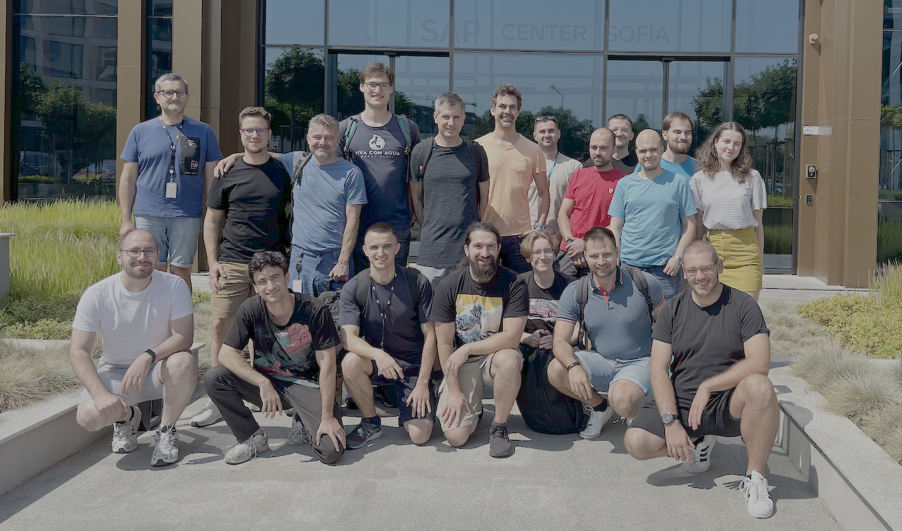

# Hack The Garden Sofia Edition 07/2025 Wrap Up

- 🗓️ **Date:** 21.07.2025 – 25.07.2025
- 📍 **Location:** [SAP Center Sofia](https://maps.app.goo.gl/SPdvQ4F2p7Qqfx4p9)
- 👤 **Organizer:** [SAP](https://www.sap.com/)
- 📘 **Topics:** /



## 🛡️ Viewer kubeconfigs expose requestor's identity (potential privilege leak)

**Problem Statement:**
Viewer kubeconfigs currently include the requestor's username, which can unintentionally grant elevated privileges in the Shoot cluster. We should revisit how identities are issued and anonymize or restrict viewer credentials.

**Motivation/Benefits:**
🙅 Prevent unintended privilege escalation from read-only permissions due to unwanted impersonation (username clash in different identities)
🛡️ Use dedicate user groups to distinguish different personas (project vs system administrators and viewers)

**Achievements:**
* Avoid unwanted impersonation eventually causing privilege escalation by adding randomly generated prefix to the username in the kubeconfig's client certificate issued by the `shoots/adminkubeconfig` and `shoots/viewerkubeconfig` subresources.
* Use dedicated groups for the different user roles: system administrator, project administrator, system viewer and project viewer.

**Next Steps:**
N/A

**Code/Pull Requests:**
https://github.com/gardener/gardener/pull/12597
https://github.com/gardener/gardener/pull/12673
https://github.com/gardener/gardener/pull/12674

## 🚀 PVC Autoscaler

**Problem Statement:**
Reiterate over the API of the existing pvc-autoscaler. Resolve the conceptual issue after reworking the pvc-autoscaler from annotations to CRDs - how can a PersistentVolumeAutoscaler resource track multiple PVCs (n replicas) of StatefulSet.

**Motivation/Benefits:**
🚀 Integrate the pvc-autoscaler into Gardener to:
* handle the volume of the observability stack to ensure its minimum retention period of 14d
* reduce the default initial size of observability stack volumes to reduce costs from short-lived clusters that don't use the whole storage of the observability volumes
* offer pvc-autoscaler to Shoot owners

**Achievements:**
The PersistentVolumeAutoscaler resource was added to track all PVCs mounted inside the pods belonging to a controller. For instance, users can now directly target a StatefulSet or even a Prometheus resource and all of their PVCs will be tracked and potentially scaled up.

**Next Steps:**
* Check if the pvc-autoscaler can scale down volume size using VolumeSnapshots.

**Code/Pull Requests:**
https://github.com/plkokanov/pvc-autoscaler/tree/hackathon/pvc-autoscaler-with-crd

## 🔁 gardener-node-agent crash-loop on configuration changes (Issue [#11025](https://github.com/gardener/gardener/issues/11025))

**Problem Statement:**
If breaking changes are introduced to the `gardener-node-agent` configuration, the agent might crash-loop without recovery. Let's investigate how to detect and safely handle incompatible or missing configuration, and improve robustness during rollouts.

**Motivation/Benefits:**
🔁 Improve the resilience of `gardener-node-agent` during rollout scenarios by using the matching versioned config in order to prevent crash-loop.

**Achievements:**
* Introduce early configuration validation logic to detect and get valid configuration for current version of `gardener-node-agent`.
* Add a fix for forward-compatibility issues, ensuring the `gardener-node-agent` does not crash when the configuration is updated but the binary for it is not updated to a compatible version.

**Next Steps:**
Review the PR and address any additional feedback. Monitor behavior during rollout across landscapes.

**Issue:**
https://github.com/gardener/gardener/issues/11025

**Code/Pull Requests:**
https://github.com/gardener/gardener/pull/12589

## 🧩 `gardener-node-agent` can't create drop-ins for systemd symlinked units (Issue [#11026](https://github.com/gardener/gardener/issues/11026))

**Problem Statement:**
The `gardener-node-agent` attempts to enable and restart `systemd` units when configuration changes are applied. However, if a unit is referenced via an alias or symlink (e.g., sshd.service → ssh.service), attempting to enable it results in a failure with the following error:
```
Failed to enable unit: Refusing to operate on alias name or linked unit file: sshd.service
```

This error prevents the OSC to be successfully applied.

**Motivation/Benefits:**
Improving compatibility with aliased or symlinked units enhances the robustness of `gardener-node-agent`. By avoiding failures during drop-in-based updates, configuration changes can be applied more reliably and consistently.

**Achievements:**
* Gain deeper understanding of `systemd` mechanics:
  * difference between enabling a unit via `systemctl` and by manually creating symlinks
  * how configuration files for units are prioritized and loaded from different "well known" systemd locations
  * the logic behind unit aliases and the results of their explicit enabling
* Monitor behavior of drop-in config files without re-enabling the unit itself.
* Validate in local setup that `systemd` would apply updated drop-ins after `systemctl daemon-reload` and a restart of the unit, without requiring a `systemctl enable` of the unit.

**Next Steps:**
Finalize the implementation by skipping the enabling for units known to be aliases or symlinks.

**Issue:**
https://github.com/gardener/gardener/issues/11026

**Code/Pull Requests:**
A draft implementation exists that skips enabling symlinked units. The approach and its continuation is still under discussion within the development team.

## 🛡️ Internal Penetration Testing

**Problem Statement:**
Let's try to do find new exploits and vulnerabilities in our system.
- Can we escalate privileges somewhere?
- Can we inject a faulty field somewhere (code injection)?
- Can we bypass a validation by a webhook somewhere?

**Motivation/Benefits:**
🕵 Discover any potential security vulnerabilities in our systems

**Achievements:**
The team got familiar with the recently disclosed CVEs: [CVE-2025-47284](https://github.com/gardener/gardener/issues/12136), [CVE-2025-47283](https://github.com/gardener/gardener/issues/12137), [CVE-2025-47282](https://github.com/gardener/external-dns-management/issues/462).
Check if referenced resources can be attack-vector and are vulnerable to exploits.
Go through existing annotations and check if something malicious can be injected via them.

**Next Steps:**
N/A

**Issue:**
N/A

**Code/Pull Requests:**
N/A

## 🛡️ Input Validation

**Problem Statement:**
We don't have a guide for developers how to write good input validation. Let's document what different types of validation we have across the components; how to write good validation code with examples; checklist and best practices. When we have the guide, we could even work on adapting components and codebase to comply with it.

Input validation is a vast area. There are several points for improvements we can make there.
There is a need for a guide for developers how to write validation code - examples, checklist and best practices.
On the other side, there are also many challenging topics in the input validation area. One of these topics is how can extension admission components validate referenced resources in easy and reliable manner.

**Motivation/Benefits:**
🔒 Improved security by validating referenced resources which were not validated by all extensions so far
ensure that extensions have the needed framework to validate referenced resources.

**Achievements:**
We worked on the validation of referenced resources topic. We made an API change proposal in [https://github.com/gardener/gardener/issues/12582](Maintain an extension-specific label on referenced resources).

**Next Steps:**
There was the concern that the proposed solution could not cover very natively extensions with multiple referenced resources of the same kind. For example the registry-cache extension to have references for a TLS Secret and a DNS Secret.
The PoC changes have to be made PR ready - add tests, documentation.

**Issue:**
https://github.com/gardener/gardener/issues/12582

**Code/Pull Requests:**
- https://github.com/ialidzhikov/gardener/tree/enh/extension-resources-3
- https://github.com/ialidzhikov/gardener-extension-registry-cache/tree/enh/extension-resources

## 🧪 TestMachinery Code Duplication Topic

**Problem Statement:**
Right now, in the code base we have different codebase for e2e tests and TM tests. Theoretically, it should be possible to have a single codebase for a test and be able to executed it against a local setup (e2e tests) and against a real landscape (TM test). Let's check if we could consolidate the codebases for e2e tests and TM tests into a single one.

**Motivation/Benefits:**
Improved developer experience, unified testing framework, unified integration (e2e or TM) test layout

**Achievements:**
We managed to adapt one simple test - the Shoot hibernation test ([`test/testmachinery/system/shoot_hibernation`](https://github.com/gardener/gardener/blob/v1.123.0/test/testmachinery/system/shoot_hibernation/hibernation_test.go)). We adapted the test to use the `gardener.ShootFramework` instead of `framework.ShootFramework`.

**Next Steps:**
* Adapt a more complex TM test.
* Open umbrella issue for the story.
* Raise a PR for the hibernation test adaptations.

**Issue:**
https://github.com/gardener/gardener/issues/12610

**Code/Pull Requests:**
https://github.com/ialidzhikov/gardener/tree/enh/tm-code-duplication

## 🌐 Multiple Internal Domain Secrets: Selector-based assignment to `Seed`s

**Problem Statement:**
Introduce a label-selector mechanism for Internal Domain Secrets, allowing them to dynamically match `Seed`s based on labels. This helps automate and scale domain assignment in multi-`Seed` environments.

**Motivation/Benefits:**
📉 Reduce risks of DNS rate limits by using per-`Seed` DNS internal domain credentials
🔒 Improved security by allowing credentials with reduced permission scope to be provided
💻 Explicit API for internal domain credentials over implicit API based on labels and annotations

**Achievements:**
We made API extension proposal for the Seed resource. A PoC has been implemented.

**Next Steps:**
* The PoC changes have to be made PR ready - add tests, documentation.
* Consider applying similar changes to the default domain secret

**Issue:**
https://github.com/gardener/gardener/issues/12596

**Code/Pull Requests:**
https://github.com/dimityrmirchev/gardener/tree/mult-internal-dns

## 📊 `Project`-level ResourceQuota enforcement (Issue [#10878](https://github.com/gardener/gardener/issues/10878))

**Problem Statement:**
Gardener lacks proper `ResourceQuota` enforcement for `Project` resources. This task aims to define quota rules per project (e.g., Shoot limits) and integrate them into admission or controller layers to prevent resource overconsumption.

**Motivation/Benefits:**
🙅 Prevent rough actor that endlessly creates `Project`s until ETCD is filled up

**Achievements:**
We made API proposal in the [Add quota for `project` resources](https://github.com/gardener/gardener/issues/10878) issue.
PoC has been implemented based on the proposal. The API was implemented but the validation has not been yet implemented.

**Next Steps:**
* Discuss at TSC.
* Gather feedback on the proposal in the issue.

**Issue:**
https://github.com/gardener/gardener/issues/10878

**Code/Pull Requests:**


