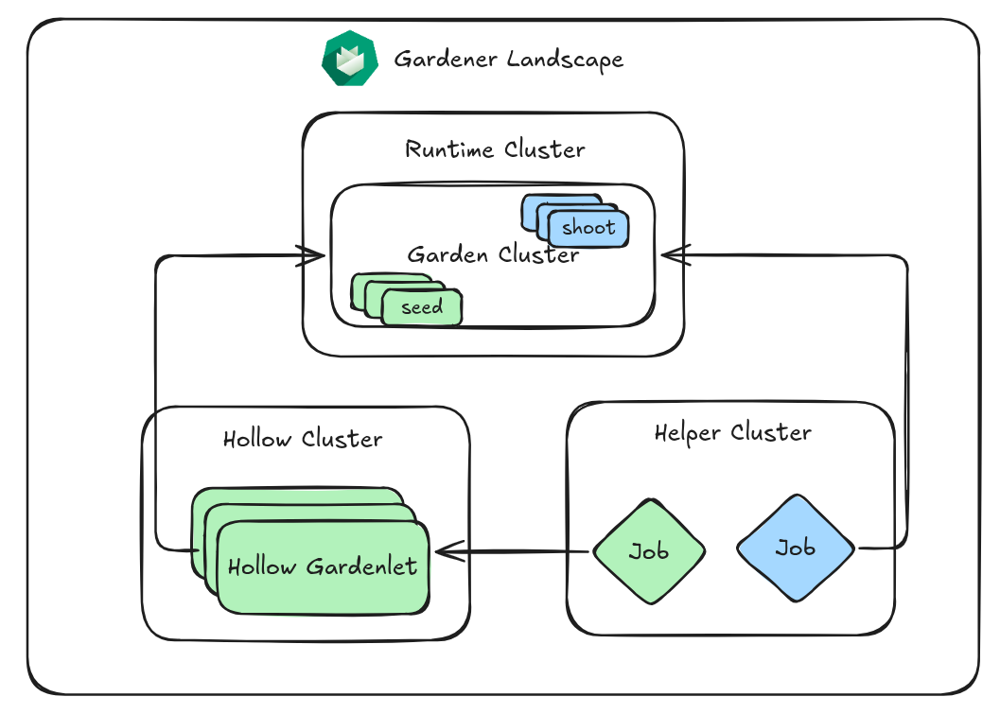
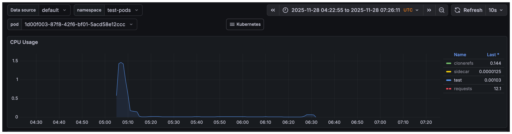

# Hack The Garden 11/2025 Wrap Up

- 🗓️ **Date:** 24.11.2025 – 28.11.2025
- 📍 **Location:** [Schlosshof Freizeitheim, Schelklingen](https://www.schlosshof-info.de/)
- 👤 **Organizer:** [x-cellent](https://www.x-cellent.com/)
- 📘 **Topics:** https://hackmd.io/c-SxOnnDTE-XQbrXnrPprw
- 🎤 **Review Meeting Summary:** https://gardener.cloud/community/review-meetings/2025-reviews/#_2025-12-03-hack-the-garden-wrap-up


## 🐶 Use Self-Hosted Shoot Cluster For Single-Node E2E Tests

### Problem Statement

Our goal is to increase confidence and robustly test self-hosted shoot clusters by integrating them into our existing end-to-end (E2E) testing framework.
We plan to run these E2E tests within a single-node, self-hosted `Shoot` cluster.
We will leverage the ability to create such clusters using `gardenadm`.

### Motivation & Benefits

Running E2E tests in a self-hosted shoot cluster allows us to _"eat our own dog food"_.
This provides a real-world test for the self-hosted shoot functionality.
This will ultimately increase confidence in the stability and reliability of self-hosted shoot clusters.

### Achievements

We made significant progress across several core areas to enable this setup:

* *Setup/bootstrap:* Successfully ran `gardenadm init` in a Docker container. Tracked as `gind` (**G**ardener **in** **D**ocker, inspired by [KinD](https://kind.sigs.k8s.io/)).
* *etcd management:* Made druid-managed etcd optional.
  This allows the system to continue with a bootstrap etcd if no backup is configured in the `Shoot` manifest.
* *Networking/DNS:*
    * Addressed `NetworkPolicies` for CoreDNS.
    * Fixed registry hostnames by always running registries as containers via `docker compose` and exposing them on dedicated hostnames.
    * Cleaned up the provider-local `Service` controller in the traditional `kind`-based setup.
    * Fixed DNS records in `kind` CoreDNS `Corefile` to use hard-coded IPs.
* *Controller conflict management:* Ensured that multiple controllers (e.g., gardener-resource-manager, etcd-druid, vpa) do not conflict.
* *Host network:* Ensured gardener-resource-manager and extensions remain in the host network.

### Next Steps

The following tasks are planned to complete the goal and address ongoing considerations:

* *Extension management:*
    * We need to complete the logic for extension management to prevent extensions from being deployed twice if the self-hosted shoot is also a `Seed`.
    * This involves the `gardenlet` labeling the `Seed` object if it runs in a self-hosted `Shoot`.
    * The gardener-controller-manager (GCM) must then adapt its `ControllerInstallation` creation logic accordingly.
* *E2E integration:* We need to adapt existing E2E tests to create the self-hosted cluster and run tests within it.
* *Tooling:* We will implement `gind` (Gardener/gardenadm in Docker) as a `kind` alternative using `gardenadm`.
* *Controller isolation (future):* We plan to move gardener-resource-manager and etcd-druid of the self-hosted `Shoot` to the garden namespace to avoid potential conflicts/interferences when the self-hosted `Shoot` is also the garden runtime or a `Seed` cluster.

### Code & Pull Requests

* Introduce `--use-bootstrap-etcd` flag for `gardenadm init`: [gardener/gardener#13542](https://github.com/gardener/gardener/pull/13542)
* Always run registries as containers via `docker compose` and expose on dedicated hostnames: [gardener/gardener#13551](https://github.com/gardener/gardener/pull/13551)
* Cleanup `provider-local Service` controller in traditional `kind`-based setup: [gardener/gardener#13549](https://github.com/gardener/gardener/pull/13549)
* Implement `gind` (**G**ardener/`gardenadm` in Docker): [timebertt/gardener:gind](https://github.com/timebertt/gardener/tree/gind)

## 🫆 Enrich Shoot Logs with Istio Access Logs

### Problem Statement

The Istio ingress gateway generates valuable access logs that show all requests passing through it, especially in conjunction with Layer 7 (L7) load balancing.
Currently, these logs are only accessible to `Seed` operators, limiting visibility for `Shoot` cluster users.
We need to move these logs to the corresponding shoot log stream to enhance cluster debugging and operational visibility for `Shoot` owners, particularly in cases where access control is restricted (e.g., by the ACL extension).

### Motivation & Benefits

* Improved debugging and operational visibility for `Shoot` cluster owners by giving them direct access to ingress traffic logs.
* Enhanced compliance and security by making critical access information available within the shoot's boundary, which is necessary when strict access controls are in place.
* This project serves as a pilot for enriching `Shoot` logs with logs from other relevant `Seed` components in the future.

### Achievements

* We successfully implemented the required changes to enrich `Shoot` logs with Istio access logs.
* This functionality was integrated into the main Gardener repository following an initial attempt in the logging extension repository.

### Next Steps

* We should consider extending this approach to include access logs or other relevant logs from other `Seed` components that impact `Shoot` cluster operations.
* The feature needs validation across different `Shoot` configurations to ensure stability and reliable delivery of the access logs to the `Shoot` log stream.

### Code & Pull Requests

* Initial attempt (closed): [gardener/logging#398](https://github.com/gardener/logging/pull/398)
* Final implementation: [gardener/gardener#13548](https://github.com/gardener/gardener/pull/13548)

## 🪣 Allow Relocating Backup Buckets

### Problem Statement

Currently, there is no straightforward way to relocate ETCD backups for shoots, such as changing the backup provider or region.
This can only be achieved using a `Shoot` migration to another `Seed` that has a different backup provider configured.
Such a migration can be difficult because it requires downtime for `Shoot` owners, as all `Shoot`s managed by a `Seed` need to be migrated.
For operator setups, it is not possible to change the backup location either because the respective fields in the `Garden` resource are also immutable.

### Motivation & Benefits

We want to be able to relocate backups more easily and without any downtime for the `Shoot` owners.
During our migration to `gardener-operator`, we created the Garden cluster in a completely new cloud provider project, but existing `Seed`s still point to the old project's backup bucket.
We would like to migrate these buckets to the new project so we can clean up the old one.

### Achievements

We created a small prototype to allow mutating the fields for relocating the backup.
The proposed changes allow mutating the fields such that a redeployment of the ETCD `StatefulSet` gets triggered during the next `Shoot` reconciliation.
This `StatefulSet` includes the new backup configuration.
As soon as the new ETCD pod starts, it continues to run with the data found on the PVC and then directly creates a full snapshot in the new backup bucket after startup.
This behavior needs no modification in the backup-restore sidecar.
The prototype implementation also allows changing the bucket name used by the `Seed`s, which is currently strictly derived from the `Seed` UID.

### Next Steps

We need to finalize the implementation and open a pull request.
It might be worth opening another issue to discuss modifying the backup-restore sidecar to allow it to "claim" the bucket it acts on.

### Code & Pull Requests

* Issue: [gardener/gardener#13579](https://github.com/gardener/gardener/issues/13579)
* Prototype implementation: [metal-stack/gardener:relocate-backups](https://github.com/metal-stack/gardener/tree/relocate-backups)

## 🪞 Pull `gardener-node-agent` From Registry Mirror

### Problem Statement

It is currently not possible to pull the `gardener-node-agent` through a registry mirror configured by the `OperatingSystemConfig` (OSC) extension.
This is because the `gardener-node-agent` is the component responsible for configuring `containerd` with the registry mirrors, creating a chicken-and-egg problem during the initial `Node` provisioning.

### Motivation & Benefits

We want to enable the `gardener-node-agent` to be pulled directly from a configured registry mirror, which simplifies the initial `Node` setup and ensures that all image pulls respect the configured mirroring policies from the very start.
We previously used a workaround where the registry mirror was added as `systemd` files into the userdata via a webhook, but integrating this logic directly into the [`registry-cache` extension](https://github.com/gardener/gardener-extension-registry-cache) is cleaner and more robust.

### Achievements

* Introduced an option in the extension to specify a `Mirror` as `provisionRelevant`. Marking a mirror as `provisionRelevant` causes the mirror configuration to be included as files in the `provision` `OperatingSystemConfig`. This ensures the mirror configuration is available before the `gardener-node-agent` is running, allowing the agent to be pulled via the mirror.
* After the `gardener-node-agent` is running, it will take over and maintain the `containerd` config, updating it if needed.
* Added the possibility to set a CA bundle for a `Mirror`.

### Next Steps

The pull request needs to be finalized, documentation updated, and then merged and released.

### Code & Pull Requests

* Pull request: [gardener/gardener-extension-registry-cache#495](https://github.com/gardener/gardener-extension-registry-cache/pull/495)

## 🗽 Evaluate [Talos](https://www.talos.dev/) As Node Operating System

### Problem Statement

We evaluated the technical feasibility of integrating [Talos OS](https://www.talos.dev/), a modern, minimal, and immutable operating system designed specifically for Kubernetes, as a worker `Node` OS in Gardener `Shoot` clusters.
This required moving away from the traditional `systemd`-based management model.

### Motivation & Benefits

* *Security:* Talos offers enhanced security due to its immutable filesystem, minimal package set, and zero traditional access surfaces (no SSH or Shell).
* *Management:* The OS is fully declarative and configuration is entirely API-based (via GRPC), which aligns with Kubernetes principles.
* *Architecture:* It provides a lightweight solution dedicated solely to running Kubernetes, potentially leading to a smaller attack surface and improved stability.

### Achievements

* We successfully demonstrated that Talos OS is technically feasible as a Gardener worker `Node`.
* *Machine bootstrapping:* Automated the generation of the initial Talos configuration and successfully deployed Talos `Node`s as `Pod`s in a local provider PoC, pushing the configuration while the `Node` was in "insecure" mode.
* *Cluster joining:* Established trust by configuring the `kubelet` with the cluster CA, successfully using bootstrap tokens, and identifying compatible `kubelet` images.
* *CNI & VPN:* Successfully configured the cluster by disabling the Talos-native CNI, enabling the `kubelet` server for VPN/tunneling, and resolving an SNI issue by disabling `KubePrism` and ensuring proper DNS resolution.
* *Control plane trust:* Successfully deployed the `trustd` daemon in the control plane and configured Istio routing to allow Talos `Node`s to reach it securely.

### Next Steps

The Talos OS integration will not be followed up to production at this time, but the architectural findings point to the necessary evolution for future support of declarative operating systems:

* `OperatingSystemConfig` & `gardener-node-agent` evolution: Refactor the existing `OperatingSystemConfig` and Gardener Node Agent (GNA) to abstract away the current dependency on `systemd`, requiring a new agent that leverages Talos's declarative API.
* *Extension compatibility:* Extensions that inject `systemd` units via OSC mutations must be rewritten to use containerized sidecars or `DaemonSet`s.
* *Service Hardening:* Define a standard strategy for securely exposing the Talos API daemon (`apid`) to operators for debugging and create a fully managed deployment for the **`trustd`** component within the control plane.

### Code & Pull Requests

* No specific public pull requests are available, as this was a feasibility evaluation track.

## 📦 Gardener API Types As Standalone Go Module

### Problem Statement

The [main Gardener repository](https://github.com/gardener/gardener) currently contains all API types within its primary Go module.
This forces external projects that only need to import the API types (e.g., extensions, consumers) to download and depend on the entire set of dependencies for the main Gardener component, leading to unnecessary overhead and potential dependency conflicts.

### Motivation & Benefits

Introducing a dedicated Go module for `pkg/apis` (the API types) ensures a minimal set of dependencies for consumers who only need the API definitions.
This significantly reduces the size and complexity of the dependency graph for API-only imports.

### Achievements

We opened a pull request to implement the changes. 🥳

### Next Steps

The following tasks are necessary to fully implement the standalone API module:

* Introduce a dedicated Go module for `pkg/apis` in `gardener/gardener`.
* Strictly limit the dependencies of this API module (e.g., only to `k8s.io/{api,apimachinery,utils}`).
* Enforce dependency restrictions using a `.import-restrictions` file.
* Ensure the API module is released together with the main module, using the proper Go submodule tag (similar to [gardener/cc-utils#1382](https://github.com/gardener/cc-utils/pull/1382)).
* Use the Go workspaces feature in `gardener/gardener` to conveniently develop both the main and the API module together.

### Code & Pull Requests

* Fixes issue: [gardener/gardener#2871](https://github.com/gardener/gardener/issues/2871)
* PR: [gardener/gardener#13536](https://github.com/gardener/gardener/pull/13536)

## 📈 Gardener Scale-Out Tests

### Problem Statement

We don't have a good estimate of how many `Seed`s and `Shoot`s a Gardener environment can support.
We are not aware of any scalability limitations that we might face in the future.
There is no way to prevent regressions in Gardener's scalability.

### Motivation & Benefits

We wanted to implement "hollow" `gardenlet`s, similar to [Kubemark's](https://github.com/kubernetes/community/blob/master/contributors/devel/sig-scalability/kubemark-guide.md) hollow `Node`s, and run many of them to generate load on the Garden cluster.
This approach provides a solid foundation for running automated performance/scalability tests.

### Achievements

We transferred the concept of hollow `Node`s to `Seed`s, meaning that we have a `gardenlet` that registers itself with the Garden and reports itself as ready.
`Shoot`s scheduled to these `Seed`s are also reported healthy, but no real control planes will be spawned.
To simulate a more realistic scenario, we analyzed the queries-per-second (QPS) that the `gardenlet`s perform against the Gardener API server (GAPI).
We registered a runnable in the hollow `gardenlet` that simulates these requests, based on the number of `Shoot`s on the `Seed`s.
In the local operator setup on an M4 Mac with 48 GB of memory, we were able to schedule ~200 hollow `gardenlet`s in the runtime cluster before we ran out of resources.
We figured out that scheduling too many `Shoot`s and `Seed`s in a small amount of time leads to problems, specifically lease requests timing out.
The settings of the Garden were just taken as-is, so tuning for this scenario would probably be possible.
We did a longer running test, aiming for 50 `Shoot`s per minute and 1 `Seed` every 3 minutes, to circumvent the initial problem.
The outcome was 800 `Seed`s and 21,600 `Shoot`s over 10 hours, but around 4 am, the test ran into a meltdown.
We observed unequal request balancing on the Kubernetes API servers (KAPIs), as no Layer 7 (L7) load balancing was active.

### Next Steps

We can try to run the tests in a more controlled environment.
Although we will not continue with this after the hackathon, this artifact can serve as a starting point for the next round.

### Code & Pull Requests

* Hollow `gardenlet` WIP implementation: [acumino/gardener#hollow-gardenlet](https://github.com/acumino/gardener/tree/hollow-gardenlet)



## ❤️‍🩹 `force-restore` Operation Annotation For `Shoot`s

### Problem Statement

The existing mechanism for disaster recovery of a shoot cluster using available backups needs improvement.
We aimed to introduce a clear way for operators to force a restore operation using existing backups, which is particularly critical in disaster scenarios.

### Motivation & Benefits

* Facilitates and simplifies the recovery process for `Shoot` clusters from a disaster event.
* Provides an annotation for operators to initiate a restore using the last known good state from the available backups.
* This feature is general enough to be adopted by provider extensions like OpenStack to manage specific resource recovery flows.

### Achievements

* Identified the necessary changes in the `gardenlet`'s operational logic, specifically around backup handling and migration checks.
* The implementation requires updates to how the `gardenlet` determines if a copy of backups is required. It needs to handle cases where the source `BackupEntry` is not found, preventing errors during recovery attempts.

### Next Steps

* The identified `gardenlet` changes must be fully tested and implemented to enable the core `force-restore` functionality.
* An issue in [gardener-extension-provider-openstack](https://github.com/gardener/gardener-extension-provider-openstack) that hinders control plane migration needs to be fixed.

### Code & Pull Requests

* Related issue for core Gardener functionality: [gardener/gardener#12952](https://github.com/gardener/gardener/issues/12952)
* Identified issue in the OpenStack provider extension: [gardener/gardener-extension-provider-openstack#1217](https://github.com/gardener/gardener-extension-provider-openstack/issues/1217)

## 🗃️ Go Build Cache In Prow

[Shafeeque](https://github.com/shafeeqes) and [Tobias](https://github.com/shegox) explored the build and test caching for [Gardener Prow](https://prow.gardener.cloud/) jobs.
During this process, we discovered some interesting aspects of how Go caching works, its usage, and how the new Go feature [`GOCACHEPROG`](https://pkg.go.dev/cmd/go/internal/cacheprog) operates.

We pursued three goals:

1. Speed up time-to-feedback on pull requests.
2. Reduce load on the Prow build clusters.
3. Do this securely.

For security, it was critical that presubmit (pull request) jobs could read from the cache but never write to it.
This prevents untrusted PRs and potentially broken jobs from polluting the cache.

We first reviewed how other projects handle caching:

- **Istio:** Uses a [hostPath volume](https://github.com/istio/test-infra/blob/c739e67b9aa67b0ffec6917a49f5e235e1fe0872/prow/cluster/jobs/istio/istio/istio.istio.master.gen.yaml#L38-L51) to reuse cache on the same node. This helps somewhat, but suffers from numerous cache misses as jobs are assigned to different nodes. With our autoscaling worker groups, node churn would make misses even more common, so this wouldn’t be effective for us.
- **Kubermatic machine-controller:** Uses scripts to [fetch a cache archive](https://github.com/kubermatic/machine-controller/blob/345eaa102974eda999b6cc59c9e21116b4e81e8e/hack/ci/download-gocache.sh) for the PR's ancestor commit from blob storage before the build, and [upload an updated cache](https://github.com/kubermatic/machine-controller/blob/345eaa102974eda999b6cc59c9e21116b4e81e8e/hack/ci/upload-gocache.sh) on main after the build. This mirrors systems like GitHub Actions’ actions/cache and works with plain file systems, so build tooling doesn’t need remote cache awareness.

We considered using a ReadWriteMany persistent volume for caching to achieve a similar setup to Istio, but across multiple nodes.
On GCP, the practical option is NFS Filestore, which is quite expensive.
Additionally, to make presubmits read-only, we’d have to copy the cache to a local directory before builds—an expensive step for large caches that erodes the performance benefits.

Go recently introduced the `GOCACHEPROG` feature, which allows you to plug in a custom program to read from and write to the build and test cache.
We're using it with the open-source [`saracen/gobuildcache`](https://github.com/saracen/gobuildcache) to store cache entries in Google Cloud Storage.

- This gives us a "remote cache helper" without needing to download/upload an entire cache directory before/after each build.
- Because Go’s cache is highly granular (per compiled/tested unit), we only fetch what's needed rather than relying on commit ancestry heuristics.
- Google Cloud Storage doesn't charge network costs within the same region and only minimal costs for storage and operations.
- Trade-off: many small requests to the remote backend are slower than local filesystem access. However, with our high hit rate, the overall impact is very positive.

We use separate GCP principals, federated from the Prow shoot cluster via Workload Identity Federation, with read-only permissions for presubmit jobs and read-write permissions for postsubmit and periodic jobs.

With this setup, we have already significantly accelerated builds.
However, some parts, like `go test` and linting, didn’t speed up as much.
We found that `go test` only caches results when a limited set of flags is used; in Prow, we rely on `ginkgo.junit-report=junit.xml` to produce JUnit reports for pull requests, and this flag disables test result caching.
In local experiments, removing this flag enabled caching and dramatically reduced unit test time (for example, from approximately 40 minutes to under 5 minutes).

Overall, we’re happy with the first improvements.
Examining Gardener’s jobs, we did not significantly reduce end-to-end feedback time for presubmits; however, the actual CPU time spent on builds decreased by more than 90%.
The impact is particularly clear in the kind-e2e tests: they used to take roughly 1 hour 30 minutes and consume about 65 minutes of CPU time across 12 cores in parallel at the beginning; now they consume under 3 minutes of CPU time across fewer than 2 cores.
This substantially reduces the load on the build cluster.

### kind e2e tests without cache

```terminaloutput
real        85m20.914s
user        64m51.059s
sys          6m42.249s
```


### kind e2e tests with cache

```terminaloutput
real        82m53.159s
user         2m33.118s
sys          1m0.021s
```



## 🛠️ MCM: Update Machines Updates During In-Place Updates

### Problem Statement

The existing in-place node update mechanism in the [gardener/machine-controller-manager](https://github.com/gardener/machine-controller-manager) (MCM) does not support updating underlying infrastructure resources, such as the OS image.
To update these resources, a full node recreation is required, which we want to avoid.

### Motivation & Benefits

We want to enable infrastructure-level updates without requiring a full node recreation, improving efficiency and reducing disruption.
The key benefit of bare metal is achieving a clean OS state by memory booting the machine via the network and updating the image by rebooting the server.

### Achievements

* Extended the MCM provider driver interface by introducing a new `UpdateMachine` method for in-place updates.
* The signature of the new method is `UpdateMachine(context.Context, *UpdateMachineRequest) (*UpdateMachineResponse, error)`.
* Completed the MCM update machine implementation on a feature branch.
* Successfully tested the concept on a local provider environment.
* Released forked container images to test the scenario in a real-world bare metal environment.
* Implemented a "hacky" fix to address the challenge of getting the new `MachineImage` within the `UpdateMachine` call, as only the old image was initially available.
* Mitigated an issue where the [Garden Linux OS extension](https://github.com/gardener/gardener-extension-os-gardenlinux) used an on-disk-only `gardenlinux-update` command by providing a fix to a forked extension.

### Next Steps

We need to revisit the idea of using in-place updates for memory-booted servers and re-evaluate the rolling update approach instead.
The current hacky changes to MCM are not worth contributing upstream, as they might break the core in-place update contract; therefore, we will not pursue them further.

### Code & Pull Requests

* MCM update machine implementation: [afritzler/machine-controller-manager:enh/machine-update](https://github.com/afritzler/machine-controller-manager/tree/enh/machine-update)
* Testing on `provider-local`: [aniruddha2000/gardener:ani/machine-update](https://github.com/aniruddha2000/gardener/tree/ani/machine-update)
* Hacky fix for `MachineImage`: [afritzler/machine-controller-manager@7005bd2](https://github.com/afritzler/machine-controller-manager/commit/7005bd20bea234895bdf9a9fc98e5dc43ceca1e9)
* Fix forked Garden Linux OS extension: [gardener/gardener-extension-os-gardenlinux@6903635](https://github.com/gardener/gardener-extension-os-gardenlinux/commit/6903635885b2a58d4c876612cd91be134f2aa307)

## 🔔 `gardenadm`/Flow Package: Handle `SIGINFO` (`^T`)

### Problem Statement

The existing command-line tools that utilize the Gardener `flow` package for complex, multistep operations currently lack a standardized way to provide clear, real-time feedback to the user about which step is currently executing.
This makes the tools appear static or slow, hindering developer productivity.

### Motivation & Benefits

* Improves the usability and developer experience of Gardener's command-line tools by providing visual confirmation of progress.
* Increases developer productivity by making it easier to monitor long-running processes, quickly see which step failed, and estimate completion time.
* Provides a standardized interface (`CommandLineProgressReporter`) that can be easily integrated into any tool using the `flow` package, ensuring consistency across the ecosystem.

### Achievements

* We successfully implemented the `CommandLineProgressReporter` utility.
* This new reporter integrates with the `flow` package to print the currently executing step to standard output.
* The feature was integrated into the main Gardener repository, making it available for use in all Gardener command-line tools.

### Next Steps

* Integrate the `CommandLineProgressReporter` into all relevant Gardener command-line tools that use the `flow` package to ensure a consistent user experience.

### Code & Pull Requests

* PR: [gardener/gardener#13565](https://github.com/gardener/gardener/pull/13565)

## ⚖️️ Load Balancer Controller For `provider-local`

### Problem Statement

Our goal was to build a functional, real load balancer controller for the `provider-local` extension, moving beyond simple `Service` controller implementations.
This allows us to properly emulate external load-balancing behavior in local development and testing environments, such as [kind](https://kind.sigs.k8s.io/).

### Motivation & Benefits

Implementing a dedicated load balancer controller is essential for accurately testing features that rely on external IP address allocation and port exposure.
This will be crucial for making `ManagedSeed` tests succeed, as they require a reliable load balancer implementation in the test `Shoot` clusters.

### Achievements

Significant progress has been made on implementation, as captured in the work-in-progress branch.
The demo steps illustrate the core functionality achieved:

* IP addresses can now be allocated from a specified range (`172.18.255.64/26`) to `Services` of type `LoadBalancer`.
* External access can be simulated by manually adding the allocated IP addresses to the host's loopback interface (`lo0`) and then accessing the exposed `Service` using those IPs.
* The controller can utilize Docker networking features (`--enable-lb-port-mapping`) to map the load balancer port to the backing container.
* This allows the containerized workload (like [nginx](https://nginx.org/)) to be reached externally via the allocated IP.
* We demonstrated the successful creation and access of multiple `Service`s of type `LoadBalancer` (`nginx`, `nginx2`, etc.), each receiving a unique external IP from the defined pool.
* A user can create a `Deployment`, expose it as a load balancer `Service`, and then curl the assigned external IP.

### Next Steps

The following tasks are planned to complete the load balancer controller:

* The controller needs to correctly handle IPv6.
* We must implement the `LoadBalancer` controller for `Shoot`s to ensure `ManagedSeed` tests succeed.
* Deployment of this functionality is required in the local setup.
* The `provider-local` `Service` controller must be dropped, as its functionality will be superseded by the new, dedicated load balancer controller.

### Code & Pull Requests

* Branch: [timebertt/cloud-provider-kind:allocate-ips](https://github.com/timebertt/cloud-provider-kind/tree/allocate-ips)

## 🔌 Evaluation Of NFT Mode In `kube-proxy`

### Problem Statement

The existing `kube-proxy` modes, `ipvs` and `iptables`, have been the standard, but the Kubernetes community has stabilized the `nftables` mode in version `1.31`.
We needed to assess this new mode for potential adoption within Gardener.

### Motivation & Benefits

`nftables` is recognized as the modern, more efficient, and flexible successor to the legacy `iptables` framework.
Adopting this new proxy mode ensures we keep up with Kubernetes upstream developments and can leverage the performance improvements and simpler rule management that `nftables` offers.

### Achievements

We successfully implemented initial support for the `nftables` proxy mode within Gardener.
Cluster operators can now provision and test `Shoot` clusters using the new `nftables` mode for `kube-proxy`.

### Next Steps

The next logical step is to perform comprehensive testing of the new mode under various loads and configurations.
We will evaluate the possibility of setting `nftables` as the default `kube-proxy` mode for new `Shoot` clusters when they use a sufficiently recent Kubernetes version.

### Code & Pull Requests

* [gardener/gardener#13558](https://github.com/gardener/gardener/pull/13558)

## 🌉 Replace Ingress NGINX controller With Gateway API

### Problem Statement

Following the [deprecation announcement for Ingress NGINX](https://kubernetes.io/blog/2025/11/11/ingress-nginx-retirement/), we need to evaluate and implement the Gateway API as a replacement for ingress traffic management in the Garden runtime/`Seed` clusters.
This involves migrating from existing Istio-native resources (`Gateway`, `VirtualServices`, `DestinationRules`) to Gateway API resources, such as `HTTPRoute`, and overcoming initial integration hurdles with Gardener's Istio configuration.

### Motivation & Benefits

* The primary motivation is to replace the deprecated Ingress NGINX controller with a modern, standard API.
* Adopting the Gateway API drives its maturity and aligns us with the future direction of Kubernetes `Ingress`.
* This evaluation will determine how many Istio-native resources can be replaced, simplifying the configuration and management of ingress traffic over time.

### Achievements

* Successfully identified and fixed an issue preventing the Gateway API from working with Gardener's default Istio configuration due to restrictive `exportTo` settings in the mesh config.
    * We discovered that implicitly allowing the internally created `VirtualService` by setting `defaultVirtualServiceExportTo: '.'` is required for the Istio ingress gateway to export services.
* Created a functional branch showcasing Gateway API usage for Plutono.
* HTTP basic authentication was implemented using an `EnvoyFilter` and an external authorization server, with a special label introduced to reference basic auth secrets.
* Extended the `gardener-resource-manager` network policy controller to generate network policies based on `HTTPRoute` resources, similar to how it handled `Ingress` resources.
* Managed to serve Gateway API resources and Istio resources under the same port.
* Translated the basic redirect logic (used for preventing access to admin routes) by using a redirect to "/" as a workaround for the current Gateway API limitation on direct responses.

### Next Steps

* Fully implement HTTP basic authentication, potentially replacing the custom `EnvoyFilter` with Istio-native external authorization or adopting the experimental `HTTPExternalAuthFilter` when Istio supports it.
* Complete the translation of all remaining NGINX annotations and an existing `Ingress` resource to equivalent Gateway API resources.
* The migration of `DestinationRules` to Gateway API's new traffic policy resources (like `XBackendTrafficPolicy`) needs to be finalized.
* Implement traffic encryption for the external authorization server.
* The deployment and configuration for the dashboard and Prometheus services (including Alertmanager) need to be migrated to the Gateway API.
* The changes must be integrated into the operator reconciliation flow and the `Shoot` reconciliation flow.

### Code & Pull Requests

* WIP branch: [metal-stack/gardener:gateway-api](https://github.com/metal-stack/gardener/tree/gateway-api)

## 🐱 Add Support For Calico Whisker

### Problem Statement

We needed to integrate [Calico Whisker](https://www.tigera.io/blog/calico-whisker-your-new-ally-in-network-observability/) into Gardener-managed clusters to provide traffic monitoring and tracing capabilities, similar to [Cilium's Hubble](https://github.com/cilium/hubble).
Whisker is typically deployed via the [tigera/operator](https://github.com/tigera/operator), which complicates its deployment in our existing Calico extension setup.

### Motivation & Benefits

Adding Calico Whisker provides valuable observability tools for cluster network traffic, which is a feature highly requested by users who prefer Calico as their Container Network Interface (CNI).
This new capability brings Calico clusters closer to feature parity with the network tracing offered by Cilium/Hubble.

### Achievements

* Developed a working prototype by reusing code from the `tigera-operator` to manage the deployment of the required components, which are Calico Whisker and Calico Goldmane.
* The prototype successfully manages the mTLS communication requirement between `calico-node` and `calico-typha` by utilizing the Gardener `security-manager` for certificate provisioning.
* Identified and implemented the necessary network policies to allow communication between the new components, such as the extension to `Shoot` API servers and `calico-node` to `goldmane`.
* The code for the working prototype is available in a feature branch for further development.

### Next Steps

* The next primary step is the productization of the changes into the [main Calico networking extension](https://github.com/gardener/gardener-extension-networking-calico), including integrating certificate management and component deployment logic.
* We need to resolve the issue with the untagged `tigera-operator` API module dependency to ensure stable integration.
* The approach used here, which involves reusing `tigera-operator` code, can potentially be applied to simplify the future addition of support for the Calico API server.

### Code & Pull Requests

* WIP branch: [ScheererJ/gardener-extension-networking-calico:calico/whisker](https://github.com/ScheererJ/gardener-extension-networking-calico/tree/calico/whisker)

## 🏷️ Respect Terminating `Node`s In Load-Balancing

### Problem Statement

When a machine is deleted, the load balancer may not be immediately aware that the corresponding node is no longer available.
This lack of synchronization can lead to unsuccessful new connections because the load balancer may still forward traffic to the terminating `Node`.
The existing `Node` conditions or "drain" signals set by the Machine Controller Manager (MCM) do not reliably trigger a reconciliation in the `cloud-provider` package or cause the `kube-proxy` health check to fail.

### Motivation & Benefits

We want to improve load-balancing behavior during machine terminations to prevent connection failures.
The goal is to provide a reliable signal to both the cloud load balancer (via `cloud-provider`) and the in-cluster service routing (via `kube-proxy`) that a `Node` is being terminated and should be removed from the rotation immediately.

### Achievements

* Identified that the `ToBeDeletedByClusterAutoscaler` taint is recognized and handled by both the Kubernetes `cloud-provider` and `kube-proxy` components for draining traffic.
* Implemented changes in MCM to apply the `ToBeDeletedByClusterAutoscaler` taint to a node when its corresponding `Machine` is marked for deletion.
* Applying this taint triggers the necessary load balancer reconcile and service health check updates, ensuring traffic is stopped before the `Node` is fully gone.

### Next Steps

The pull request needs to be merged and released.

### Code & Pull Requests

* Pull request: [gardener/machine-controller-manager#1054](https://github.com/gardener/machine-controller-manager/pull/1054)
* Reference to `cloud-provider` logic: [kubernetes/cloud-provider:controllers/service/controller.go#L1027](https://github.com/kubernetes/cloud-provider/blob/080e91c4b910bf92dfd43ca79eb74f5d39dcba75/controllers/service/controller.go#L1027)
* Reference to `kube-proxy` logic: [kubernetes/kubernetes:pkg/proxy/healthcheck/proxy_health.go#L187](https://github.com/kubernetes/kubernetes/blob/5bcb7599736327cd8c6d23e398002354a6e40f68/pkg/proxy/healthcheck/proxy_health.go#L187)

## 🧰 Use Go Tools & Drop `VGOPATH`

### Problem Statement

The [main Gardener repository](https://github.com/gardener/gardener) relied on the outdated practice of using the `VGOPATH` environment variable within its build and development environment.
This approach is generally obsolete in modern Go development, as it utilizes the Go modules system for dependency management and tooling.

### Motivation & Benefits

By migrating to standard Go tooling and removing `VGOPATH`, we achieve several benefits:

* *Modernization:* We align our development and build process with current Go best practices (Go modules).
* *Simplification:* We removed the need for custom logic and non-standard environment variables (`VGOPATH`) in our tooling scripts, simplifying the development experience for contributors.
* *Dependency clarity:* We improved the clarity and reliability of our dependency resolution.

### Achievements

This effort was split into two key pull requests that together eliminate `VGOPATH` and standardize the use of Go tools:

* Remove `VGOPATH`:
    * This PR introduced the initial change to remove all occurrences of `VGOPATH` from the `gardener/gardener` repository.
    * It refactored scripts and configurations that previously relied on this variable to use standard, module-aware Go commands.
* Use Go tools:
    * This PR focused on simplifying our dependency setup. We updated our tool dependency management by pinning all necessary tools in the `go.mod` file using the standard `tools` directory pattern.
    * This means we no longer need complex, custom logic to ensure the correct versions of various Go tools (like linters, code generators, etc.) are available during development.
    * Tools are now sourced directly through *Go modules*, simplifying the bootstrapping process for a new developer.

### Next Steps

The primary goal of removing `VGOPATH` and leveraging standard Go tools is now complete with the merging of these two PRs.
The changes are integrated into the repository, ensuring a modernized and simplified development workflow for all contributors.

### Code & Pull Requests

* Use go tools instead of `tools.go`: [gardener/gardener#13545](https://github.com/gardener/gardener/pull/13545)
* Remove `VGOPATH` and `hack/vgopath-setup.sh`: [gardener/gardener#13556](https://github.com/gardener/gardener/pull/13556)

## 🔀 Pod Overlay To Native Routing Without Downtime

### Problem Statement

The current method for switching a `Shoot` cluster's networking mode between pod overlay networking and native routing requires a full reconfiguration and rollout, which results in network downtime.
Many production clusters cannot tolerate this interruption, creating a need for a seamless, zero-downtime transition.

### Motivation & Benefits

Enabling seamless migration allows cluster operators to safely evolve networking configurations in critical production environments without service interruption.
This improves the operational flexibility and resilience of Gardener-managed clusters.
The desired state is that old nodes continue with the old mode while new `Node`s adopt the new mode, maintaining full cross-communication between all `Node`s during the transition.

### Achievements

* Performed initial testing of the migration flow (bidirectional: overlay to native and native to overlay) in a small two-`Node` cluster using both Calico and Cilium CNIs on AWS.
* Calico successfully maintained a long-running connection (netcat) and continuous traffic during the switch in both directions.
* Cilium successfully transitioned from overlay to native routing without resetting the connection, though the reverse transition (native to overlay) consistently resulted in a connection reset.

### Next Steps

* This topic requires further investigation and will be addressed by [Sebastian](https://github.com/docktofuture) during ordinary operations as a direct follow-up to the related pull request ([gardener/gardener#13332](https://github.com/gardener/gardener/pull/13332)).
* The Cilium connection reset issue during the native-to-overlay switch needs to be investigated and resolved to ensure robust zero-downtime migration for all supported CNIs.

### Code & Pull Requests

* The topic is a follow-up to ongoing work: [gardener/gardener#13332](https://github.com/gardener/gardener/pull/13332)

## 🚪 [GEP-28] Expose API server Of Self-Hosted Shoots

### Problem Statement

The API server of a [self-hosted `Shoot` cluster](https://github.com/gardener/gardener/blob/master/docs/proposals/28-self-hosted-shoot-clusters.md) with managed infrastructure needs a mechanism to be reliably exposed for external access.
Currently, there is no standardized way for Gardener components to trigger cloud-specific load-balancing resources for this specific scenario.

### Motivation & Benefits

We want to enable external access to the API server of self-hosted `Shoot`s by reusing existing cloud provider mechanisms, such as the cloud-controller-manager, creating a load balancer `Service` for `default/kubernetes`.
The ability to expose the API server this way allows the `DNSRecord` to be updated with the LoadBalancer's external IP, providing robust, highly available external access.

### Achievements

* Introduced a new resource, `SelfHostedShootExposure`, in the `extensions.gardener.cloud/v1alpha1` API to manage the exposure resources. This resource abstracts the specific cloud exposure implementation (e.g., load balancer or `kube-vip`) into an extension model.
* The `Shoot` API was extended to allow configuration of control plane exposure via `.spec.provider.workers[].controlPlane.exposure`.
* Defined the responsibilities: `gardenadm` or `gardenlet` will create the `SelfHostedShootExposure` object, and a corresponding extension controller will reconcile the necessary cloud resources.
* An `Actuator` interface was defined for the extension controllers with `Reconcile` and `Delete` methods to manage the exposure resources and report the ingress status (`[]corev1.LoadBalancerIngress`).
* The `gardenlet` will also run a new controller to watch control plane `Node`s and automatically update the `SelfHostedShootExposure` resource's `.spec.endpoints[]` with the latest `Node` addresses.

### Next Steps

Finish writing the [Gardener Enhancement Proposal (GEP)](https://github.com/gardener/gardener/blob/master/docs/proposals/README.md) and defend it in front of the [Technical Steering Committee (TSC)](https://gardener.cloud/community/steering/) for approval.

### Code & Pull Requests

* Issue: [gardener/gardener#2906](https://github.com/gardener/gardener/issues/2906)

## 🤖 Tool-Enabled Agent For Shoots

We developed agents to support operators with end-user questions about Gardener or a specific `Shoot` cluster.
They use LLMs to plan actions and use powerful tools.
The primary tools include knowledge-base search, ticket-database search, access to `Garden`/`Seed`/`Shoot` clusters via `bash`/`kubectl`, and the ability to extract metrics, logs, and more.
This allows the agent to drill deep and surface insights that would otherwise require an operator a significant amount of time.
Of course, LLMs won't always draw correct conclusions, but even then, the agent gives the operator a head start from which they can continue the investigation.

**Conclusion:**
The tooling for the platform has been successfully implemented and is currently in use.
However, it is not yet publicly available due to the need to scrub internal data from its knowledge sources.

<hr />


