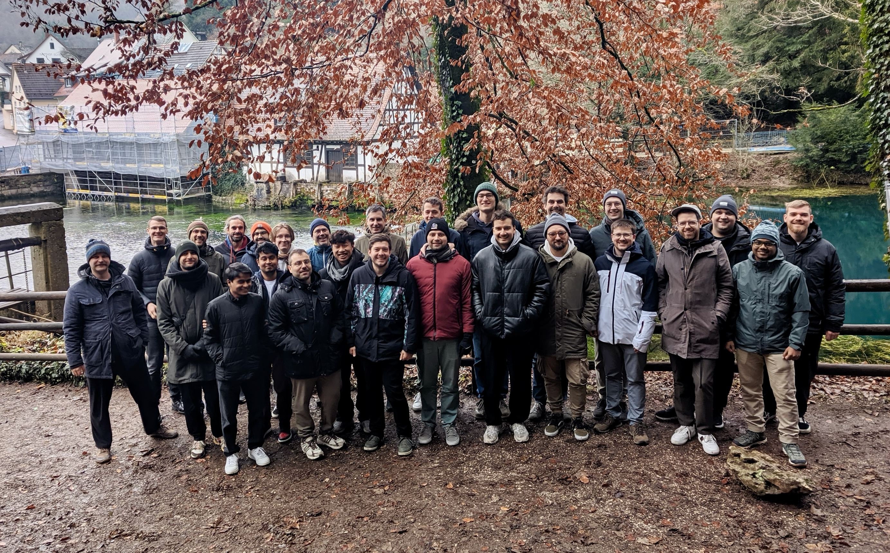
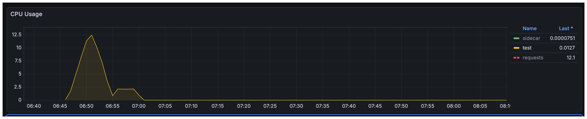

# Hack The Garden 11/2025 Wrap Up

- 🗓️ **Date:** 24.11.2025 – 28.11.2025
- 📍 **Location:** [Schlosshof Freizeitheim, Schelklingen](https://www.schlosshof-info.de/)
- 👤 **Organizer:** [x-cellent](https://www.x-cellent.com/)
- 📘 **Topics:** https://hackmd.io/c-SxOnnDTE-XQbrXnrPprw
- 🎤 **Review Meeting Summary:** https://gardener.cloud/community/review-meetings/2025-reviews/#_2025-12-03-hack-the-garden-wrap-up



<hr />

## 🐶 Use Self-Hosted Shoot Cluster For Single-Node E2E Tests

_TODO_

## 🫆 Enrich Shoot Logs with Istio Access Logs

_TODO_

## 🪣 Allow Relocating Backup Buckets

_TODO_

## 🪞 Pull `gardener-node-agent` From Registry Mirror

_TODO_

## 🗽 Evaluate [Talos](https://www.talos.dev/) As Node Operating System

_TODO_

## 📦 Gardener API Types As Standalone Go Module

_TODO_

## 📈 Gardener Scale-Out Tests

_TODO_

## ❤️‍🩹 `force-restore` Operation Annotation For `Shoot`s

_TODO_

## 🗃️ Go Build Cache In Prow

Shafeeque and Tobias explored the build & test caching for the Gardener prow jobs.
During this we found some interesting things about how go caching works, is used and how the new golang feature [`GOCACHEPROG`](https://pkg.go.dev/cmd/go/internal/cacheprog) works.

We pursued three goals:

- Speed up time-to-feedback on pull requests
- Reduce load on the Prow build clusters
- Do this securely

For security, it was critical that presubmit (pull request) jobs could read from the cache but never write to it.
This prevents untrusted PRs and potentially broken jobs from polluting the cache.

We first reviewed how other projects handle caching:

- Istio: Uses a [hostPath volume](https://github.com/istio/test-infra/blob/master/prow/cluster/jobs/istio/istio/istio.istio.master.gen.yaml#L38-L51) to reuse cache on the same node. This helps somewhat but suffers many cache misses as jobs land on different nodes. With our autoscaling worker groups, node churn would make misses even more common, so this wouldn’t be effective for us.
- Kubermatic machine-controller: Uses scripts to [fetch a cache archive](https://github.com/kubermatic/machine-controller/blob/345eaa102974eda999b6cc59c9e21116b4e81e8e/hack/ci/download-gocache.sh) for the PR’s ancestor commit from blob storage before the build, and [upload an updated cache](https://github.com/kubermatic/machine-controller/blob/345eaa102974eda999b6cc59c9e21116b4e81e8e/hack/ci/upload-gocache.sh) on main after the build. This mirrors systems like GitHub Actions’ actions/cache and works with plain filesystems, so build tooling doesn’t need remote-cache awareness.

We looked at using a ReadWriteMany persistent volume for caching to have a similar setup like Istio, but across nodes. On GCP, the practical option is NFS Filestore, which is quite expensive. Additionally, to make presubmits read-only, we’d have to copy the cache to a local directory before builds—an expensive step for large caches that erodes the performance benefits.

Go recently introduced the `GOCACHEPROG` feature, which allows you to plug in a custom program to read/write the build and test cache. We’re using it with the open-source [`saracen/gobuildcache`](https://github.com/saracen/gobuildcache) to store cache entries in Google Cloud Storage.

- This gives us a “remote cache helper” without needing to download/upload an entire cache directory before/after each build.
- Because Go’s cache is highly granular (per compiled/tested unit), we only fetch what’s needed rather than relying on commit ancestry heuristics.
- Google Cloud Storage doesn't charge network costs within the same region and only minimal costs for storage and operations.
- Trade-off: many small requests to the remote backend are slower than local filesystem access. However, with our high hit rate, the overall impact is very positive.

We use separate GCP prinicipals, federated from the Prow shoot cluster via Workload Identity Federation with Read-only permissions for presubmit jobs and Read-write permissions for postsubmit and periodic jobs.

With this setup we have already significantly accelerated builds. However, some parts, like `go test` and linting, didn’t speed up as much. We found that go test only caches results when a limited set of flags is used; in Prow we rely on `ginkgo.junit-report=junit.xml` to produce JUnit reports for Pull Requests, and this flag disables test result caching. In local experiments, removing this flag enabled caching and reduced unit test time dramatically (for example, from about 40 minutes to under 5 minutes).

Overall, we’re happy with the first improvements. Looking at Gardener’s jobs, we did not dramatically reduce end-to-end feedback time for presubmits, but the actual CPU time spent on builds fell by more than 90%. The impact is particularly clear in the kind-e2e tests: they used to take roughly 1 hour 30 minutes and consume about 65 minutes of CPU time across 12 cores in parallel at the beginning; now they consume under 3 minutes of CPU time across fewer than 2 cores. This substantially reduces load on the build cluster.

### kind e2e tests without cache

```
real        85m20.914s
user        64m51.059s
sys          6m42.249s
```



### kind e2e tests with cache

```
real        82m53.159s
user         2m33.118s
sys          1m0.021s
```


## 🛠️ MCM: Update Machines Updates During In-Place Updates

_TODO_

## 🔔 `gardenadm`/Flow Package: Handle `SIGINFO` (`^T`)

_TODO_

## ⚖️️ Load Balancer Controller For `provider-local`

_TODO_

## 🔌 Evaluation Of NFT Mode In `kube-proxy`

_TODO_

## 🌉 Replace Ingress NGINX controller With Gateway API

_TODO_

## 🐱 Add Support For Calico Whisker

_TODO_

## 🏷️ Respect Terminating `Node`s In Load-Balancing

_TODO_

## 🧰 Use Go Tools & Drop `VGOPATH`

_TODO_

## 🔀 Pod Overlay To Native Routing Without Downtime

_TODO_

## 🚪 [GEP-28] Expose API server Of Self-Hosted Shoots

_TODO_

## 🤖 Tool-Enabled Agent For Shoots

_TODO_

---


