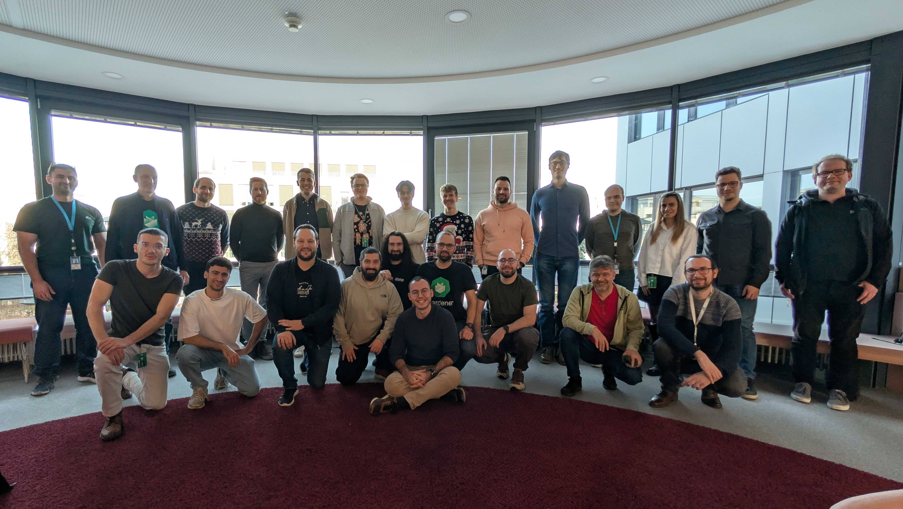

# Hack The Garden 12/2025 Wrap Up

- 🗓️ **Date:** 08.12.2025 – 12.12.2025
- 📍 **Location:** SAP Center Walldorf
- 👤 **Organizer:** SAP

## ⚙️ OIDC Webhook Garden Class Extension

### Problem Statement

Install OIDC in the garden cluster as a Garden class extension to enable proper authentication mechanisms.

### Motivation & Benefits

Enable OIDC authentication for the garden cluster through a proper extension mechanism, improving security and authentication capabilities.

### Achievements

* Extensions were adapted to manage Garden class extensions.
* Successfully installed the OIDC Webhook Authenticator for the garden cluster.
* Identified several gaps in Gardener with respect to Garden Extensions:
  * Garden namespace is not labelled with `extension-type: true` label, so admission webhooks namespace selector does not work.
  * `EnsureKubeAPIServer` handler needs to add support for deployments named `virtual-garden-kube-apiserver`.
  * Health Check controller needs preparation for garden use-case.
  * SecretsManager utility needs to create a manager from the garden resource.
  * Need to avoid collisions when a runtime cluster is also a seed and has multiple extension controllers working on the same resource.

### Next Steps

* Finalize changes in the extension (mainly adapt tests).

### Code & Pull Requests

* [gardener/gardener#13635](https://github.com/gardener/gardener/pull/13635)
* [gardener/gardener#13662](https://github.com/gardener/gardener/pull/13662)

## 🔍 Use Dummy RBAC Resources+Verb to Identify DoD/SRE and Auditor

### Problem Statement

Dashboard & Gardener APIServer rely on RBAC to determine your role (e.g., admin).
This must replace the checks for "Can I list all secrets" and "Can I list all Projects".

### Motivation & Benefits

Improve RBAC-based role detection by using dedicated dummy resources and verbs instead of relying on permission checks for sensitive resources, like secrets and projects.

### Achievements

* The topic was explored and the problem statement was defined.
* A proposition for a solution that will improve the current state was developed.

### Next Steps

* Wait for input by the community on the best approach.

### Code & Pull Requests

* Issue: [gardener/gardener#13657](https://github.com/gardener/gardener/issues/13657)
* Proposed solution: [dimityrmirchev/gardener:virtualrbac](https://github.com/dimityrmirchev/gardener/tree/virtualrbac)

## 🔒 Private API Servers

### Problem Statement

Gardener exposes API servers of shoot clusters to the internet on all infrastructures except for SAP Cloud Infrastructure, where this is only opt-in.
While it is very convenient to be able to reach the API server from everywhere, it has security implications by making it easier for malicious actors to attack the API server.

### Motivation & Benefits

With technical features like private link or private service connect, it should be possible to provide private API servers to shoot clusters, reducing the attack surface for security conscious stakeholders.

### Achievements

Work in progress on implementing private API server support.

### Next Steps

Continue implementation and testing of private API server functionality.

## 🔐 Use GitHub OIDC Federation to Get Rid of GitHub Apps (Again)

### Problem Statement

GHA-Pipelines can make use of trust-based-authentication (for Gardener-CICD, we already do this for shoot clusters and hyperscalers).
However, there is no built-in support for access to either other GitHub-(Enterprise)-Instances, or even cross-repository/cross-organisation-access.

### Motivation & Benefits

Eliminate the need for GitHub-Apps for cross-github-authentication by leveraging OIDC federation, improving security, and reducing maintenance overhead.

### Achievements

* Explored existing PoCs from OSPO and Chainguard's Secure Token Service ([octo-sts](https://github.com/octo-sts)).
* Evaluated the feasibility of setting up a custom instance with an internet-facing token-exchange-endpoint.

### Next Steps

* Set up a custom instance, including support for github.wdf.sap.corp.
* Complete implementation, with the ultimate goal of eliminating GitHub-Apps usage for cross-github-authentication.

### Code & Pull Requests

* Chainguard STS: [github.com/apps/octo-sts](https://github.com/apps/octo-sts)
* Source code: [github.com/octo-sts](https://github.com/octo-sts)

## ✅ Provide Validation Job of Kyverno Policies Without Kyverno

### Problem Statement

It is generally agreed that validating Kubernetes resources based on common policies is a good health measure for Kubernetes deployments and increases security.
Today's options are limited: Kyverno provides this functionality but can be problematic for cluster health and requires significant effort to implement.
Kubernetes admission policies are only applicable to newly deployed resources, not existing ones.

### Motivation & Benefits

Have lightweight jobs that regularly check all resources in the cluster and report violations based on common (Kyverno) policies, without requiring a full Kyverno installation.

### Achievements

* Validated that the Kyverno CLI can verify policies against a target cluster with some limitations (e.g., it cannot check CRDs).
* Identified CLI deficiencies:
  * The report command does not produce valid YAML but includes free text, requiring special parsing.
  * The command returns an error on policy violations, making it hard to distinguish between command errors and failing policies.
* Created a PoC integration of the Kyverno CLI into DIKI.

### Next Steps

* Address the identified CLI limitations.
* Complete the integration into DIKI and prepare for production use.

### Code & Pull Requests

* PoC branch: [dimityrmirchev/diki:kyverno-ruleset-poc](https://github.com/dimityrmirchev/diki/tree/kyverno-ruleset-poc)

## 📡 Observability Signals Externalization

### Problem Statement

Currently, observability signals (logs and metrics) for clients are persisted in the shoot control-plane namespace of the shoot clusters running in the seed.
GEP-34 laid down the foundations of OpenTelemetry support in Gardener, making it possible for signals to be collected and processed by OpenTelemetry collectors.
However, the observability signals we persist still have a fixed retention policy, over which clients don't have any control.

### Motivation & Benefits

Allowing control-plane signals such as metrics and logs to be forwarded and persisted by cluster owners to their own OpenTelemetry-aware endpoint would let clients configure and manage their own retention policies.

### Achievements

* OTel extension is in a functional state with local setup ready.
* ServiceMonitors from shoot control-plane namespace are being discovered by Target Allocator (TA) and scraped by the Collector.
* Implemented authentication between the OTel exporter and remote OTel receiver.
* Implemented mTLS using Gardener secrets manager between Target Allocator and Collector.
* Defined Extension API.

### Next Steps

* Polish the implementation (complete TODO items, clean up the API).
* Increase test coverage.
* Add support for shipping signals to an OTLP gRPC endpoint.
* Add support for shipping logs.
* Follow up on upstream issues related to mTLS.

## 🛰️ Perses Dashboards & Explore Plugin

### Problem Statement

Version [0.53.0-beta2](https://github.com/perses/perses/releases/tag/v0.53.0-beta.2) of Perses now supports VictoriaLogs as a data source, aligning with [GEP-35](https://github.com/gardener/gardener/pull/13242) where VictoriaLogs will replace Vali as the backend of logs from all clusters.
[Plutono](https://github.com/credativ/plutono) is the current UI for displaying metrics from Prometheus and Vali, but we're aiming at replacing it in the same timeframe as Vali.
However, feature parity is not there yet because Perses does not have an explore plugin for logs yet.

### Motivation & Benefits

Achieve a full replacement of Plutono with Perses, including configuration with Prometheus and VictoriaLogs as data sources, migrating all dashboards, and achieving full feature parity with the current solution.

### Achievements

* Evaluated what would be needed to achieve a full replacement of Plutono with Perses.
* Explored existing plugins (prometheus, pyroscope, and tempo) that can be used as a frame of reference for a Log Explorer plugin.
* Identified operator shortcomings that need to be addressed.

### Next Steps

* Contribute the Log Explorer plugin to remove one of the roadblocks on the way to replacing Plutono.
* Address operator shortcomings:
  * Add `emptyDir` support to avoid reliance on PersistentVolumes for config files.
  * Find solutions for creating global datasources needed for explore mode.
* Complete dashboard migration and feature parity assessment.

## 🔭 Gardener OpenTelemetry Receiver

### Problem Statement

The gardener-metrics-exporter provides information about the condition of Shoots, Seeds, and other Gardener resources in the Prometheus metric format.
There is an ongoing initiative to replace gardener-metrics-exporter with kube-state-metrics and its custom resource state monitoring feature to avoid maintaining a custom exporter.
The OpenTelemetry Collector introduced a receiver concept, which is an alternative to Prometheus exporters and can provide OTLP metrics without any conversions.

### Motivation & Benefits

Develop a custom receiver for the OpenTelemetry Collector that provides similar information as the gardener-metrics-exporter and evaluate if our planned migration to kube-state-metrics is still the right choice with our Observability 2.0 strategy.
The custom receiver could be used by stakeholders to monitor the condition of their Shoots and ingest the metrics into a managed backend like Dynatrace or the BTP Cloud Logging Service, requiring only a (lightweight) OpenTelemetry Collector instead of a full Prometheus instance.

### Achievements

* Implemented OTel receiver [prototype](https://github.com/chrkl/gardener-opentelemetry-collector/tree/gardener-receiver) by following the tutorials from the OTel community for [building a receiver](https://opentelemetry.io/docs/collector/building/receiver/) and [building a custom collector](https://opentelemetry.io/docs/collector/custom-collector/).
* Emitting metrics with shoot and seed information.
* Demo setup to push Gardener metrics to Prometheus using its OTLP API.

### Next Steps

* Align within the monitoring team on whether to continue with this approach.
* Add missing metrics to reach feature parity with gardener-metrics-exporter.
* Re-think the metric modeling to follow best practices of the OTel ecosystem.
* Bring the prototype into a proper shape (e.g., proper use of k8s client with informers, adding tests, update to latest collector dependencies).

## 🔄 PoC: Replace Prometheus Exporters by OpenTelemetry Receivers in Gardener Monitoring Stack

### Problem Statement

The Gardener monitoring stack uses various upstream Prometheus exporters to collect typical metrics of a Kubernetes cluster, including node_exporter, kube-state-metrics, and cAdvisor.
The OpenTelemetry project introduced the receiver concept in the Collector component to gather telemetry data.
The opentelemetry-collector-contrib GitHub repository already contains multiple receivers that serve a similar purpose as the mentioned Prometheus exporters.

### Motivation & Benefits

Build a PoC setup purely based on native OpenTelemetry components to monitor a Kubernetes cluster and gather experience about the best telemetry data sources when implementing the Observability 2.0 strategy.

### Achievements

* Results: [HackMD](https://hackmd.io/@DyOu5KAIQCK5iNWapbO6sg/r1y0zH9NZe)

### Next Steps

* Identify potential gaps in the metrics provided by the OpenTelemetry receivers.
* Complete the comparison and document findings.
* Decide on the adoption strategy for Observability 2.0.

## 🔕 PoC: Investigate Alertmanager Silence-Operator

### Problem Statement

Investigate the operational cost benefit of eliminating alertmanager silence PVs and assess if it's worth introducing the silence operator for alertmanager.

### Motivation & Benefits

Reduce operational costs and complexity by potentially eliminating the need for PersistentVolumes for alertmanager silences.

### Achievements

* Results: [HackMD](https://hackmd.io/6_CbsnAuT5qh9wwz70k5gw)

### Next Steps

* Review findings with the team.
* Decide on adoption strategy based on cost-benefit analysis.

## 🔀 PoC: Investigate OpenTelemetry as Replacement for Federation to Garden from Aggregate Prometheus

### Problem Statement

Current federation from aggregate to garden Prometheus requires access from the runtime cluster to seeds.
Typically in Gardener, the connection originates from seeds to the runtime cluster.
This creates an undesired communication direction.

### Motivation & Benefits

Assess the feasibility of replacing current federation by using OpenTelemetry to push metrics into the garden Prometheus, effectively turning the communication direction around.
Also compare this approach to using Prometheus native remote write.

### Achievements

* Results: [HackMD](https://hackmd.io/Yth83WkZSkqGcE_8PToKog?view)

### Next Steps

* Review findings with the team.
* Decide on the implementation approach based on the comparison.
* Plan migration strategy if approach is adopted.
