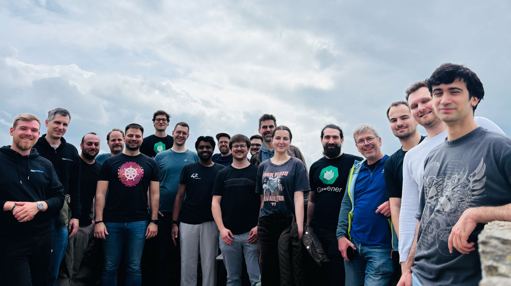

# Hack The Garden 05/2026 Wrap Up

- 🗓️ **Date:** 04.05.2026 – 08.05.2026
- 📍 **Location:** [Schlosshof Freizeitheim, Schelklingen](https://www.schlosshof-info.de/)
- 👤 **Organizer:** [x-cellent](https://www.x-cellent.com/)
- 📘 **Topics:** [hackathon#72](https://github.com/gardener/hackathon/discussions/72)
- 🎤 **Review Meeting Summary:** https://gardener.cloud/community/review-meetings/2026-reviews/#_2026-05-13-hack-the-garden-wrap-up

  
  

## 🌱 Complete the `ManagedSeedSet` Implementation ([#52](https://github.com/gardener/hackathon/issues/52))

## 🔍 Improve Debugability of Failed Node Joins ([#68](https://github.com/gardener/hackathon/issues/68))

## 🔒 Add Support for Virtual Garden to ACL Extension ([#47](https://github.com/gardener/hackathon/issues/47))

## 🛡️ Replace OpenVPN with WireGuard ([#70](https://github.com/gardener/hackathon/issues/70))

## 🌐 Make Internal Domain Optional/Mutable ([#53](https://github.com/gardener/hackathon/issues/53))

## 🌿 [GEP-28] Experiment with `shoot/shoot` Controller in Self-Hosted Shoot Clusters ([#45](https://github.com/gardener/hackathon/issues/45))

## 🔑 [GEP-28] Implement Public CA Bundle Discovery Mechanism ([#15](https://github.com/gardener/hackathon/issues/15))

## 🐝 [GEP-28] `SelfHostedShootExposure` in Cilium Extension ([#46](https://github.com/gardener/hackathon/issues/46))

## 🤝 [GEP-28] Support Joining Control Plane Nodes in Managed Infrastructure ([#54](https://github.com/gardener/hackathon/issues/54))

## ⚙️ [GEP-28] Run `Garden` and `Seed` in Self-Hosted Shoot Cluster on Managed Infrastructure ([#55](https://github.com/gardener/hackathon/issues/55))

## 👁️ Allow Admins to Easily Use a Viewer Kubeconfig by Default ([#71](https://github.com/gardener/hackathon/issues/71))

## 📝 Stage `confineSpecUpdateRollout` Changes in Annotation ([#64](https://github.com/gardener/hackathon/issues/64))

## 💾 `GardenState` Resource for Automated Garden Cluster Disaster Recovery ([#44](https://github.com/gardener/hackathon/issues/44))

## 🔐 Separately Encrypt etcd Backups ([#69](https://github.com/gardener/hackathon/issues/69))

## ⚡ Reduce `Secret` Watch Pressure by Splitting `ManagedResource` Data ([#61](https://github.com/gardener/hackathon/issues/61))

