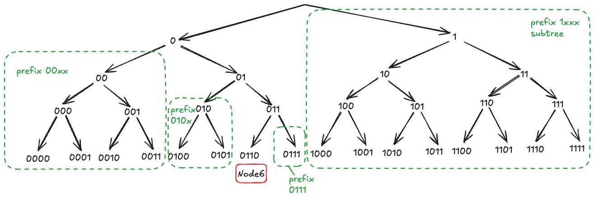
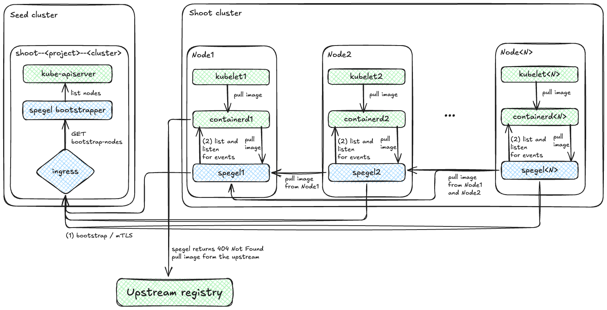

- ✍🏻 **Author(s):** [@dimitar-kostadinov](https://github.com/dimitar-kostadinov) Dimitar Kostadinov, [@ialidzhikov](https://github.com/ialidzhikov) Ismail Alidzhikov
- 🗓️ **Presentation:** 2026-02-17, 15:00 - 16:00 CET
- 🎥 **Recording:** [click here]()
- 👨‍⚖️ **Decisions:**
  - _pending_

# Spegel Registry Support in the registry-cache extension

## Table of Contents

- [Motivation](#motivation)
- [Proposal](#proposal)
  - [Introduction](#introduction)
  - [Registry Spegel API Design](#registry-spegel-api-design)
  - [Architecture Overview](#architecture-overview)
  - [Spegel Binary and Systemd Units](#spegel-binary-and-systemd-units)
  - [Containerd Configuration](#containerd-configuration)
  - [Spegel Bootstrapper](#spegel-bootstrapper)
  - [Observability and Monitoring](#observability-and-monitoring)
  - [Future Enhancement](#future-enhancement)
- [Impact and Alternatives](#impact-and-alternatives)
- [Decision Request](#decision-request)
- [Appendix (Optional)](#appendix-optional)

## Motivation

Current solution for image cache is based on [distribution/distribution](https://github.com/distribution/distribution) pull-through cache.

### The Problem

The adoption of the registry cache extension is around 10% and not all used upstreams are covered by the extension's configurations. This is likely due to:
- **Complex configuration**: A separate [configuration](https://github.com/gardener/gardener-extension-registry-cache/blob/main/docs/usage/registry-cache/configuration.md#shoot-configuration) needs to be set for each upstream registry.
- **Additional resources**: A StatefulSet is created for each of the configured upstream. The PV size (defaults to 10Gi) should be monitored and [increased](https://github.com/gardener/gardener-extension-registry-cache/blob/main/docs/usage/registry-cache/configuration.md#increase-the-cache-disk-size) if necessary, otherwise the cache becomes ineffective.
- **[Limitations](https://github.com/gardener/gardener-extension-registry-cache/blob/main/docs/usage/registry-cache/configuration.md#limitations)**:
  - It is not possible to cache most images of `kube-system` pods, as the cache can be used after Kubernetes services can be accessed (i.e., after kube-proxy configures iptables/IPVS rules).
  - Only one set of upstream [credentials](https://github.com/gardener/gardener-extension-registry-cache/blob/main/docs/usage/registry-cache/upstream-credentials.md#how-to-provide-credentials-for-upstream-registry) is supported, therefore some private images cannot be cached.
  - Amazon ECR mirroring is not supported - [ref](https://github.com/gardener/gardener-extension-registry-cache/issues/259).
  - Dynatrace registry mirroring is not effective, as incorrect `Content-Length: 0` header is returned for most of the image layers.
  - It is not possible to mirror private registries authenticated with a kubelet image credential provider - [ref](https://github.com/gardener/gardener-extension-registry-cache/issues/240).
  - Registry pods scaling is limited to `2` when [HighAvailability](https://github.com/gardener/gardener-extension-registry-cache/blob/8c5ef623b2f8d6b236eb9f2c4c1a8610b72515ce/pkg/apis/registry/v1alpha3/types.go#L103) is enabled. However, when pulling large images from many Nodes simultaneously, 2 registry replicas are not enough and the download speed becomes significantly slower.
  - [TTL](https://github.com/gardener/gardener-extension-registry-cache/blob/main/docs/usage/registry-cache/configuration.md#garbage-collection) garbage collection setting is inefficient because it is not extended on access. Hence, an image is always deleted from the cache when its TTL expires, and will be re-pulled from upstream if requested again.

### Why Should We Care

Due to the low adoption rate and incomplete coverage of upstream registers, there are significant NAT Gateways traffic costs for downloading images.
Additionally, there are costs for outbound traffic from image registries like `Amazon Elastic Container Registry`, `Google Cloud Artifact Registry`, and `Azure Container Registry`.
Even if the pull-through cache is configured, there are also costs for cross zonal traffic.

Providing a p2p image caching solution that is enabled by default and spans all upstream registries will reduce cloud costs and reduce latency when pulling images.

### Who Benefits

- **End users** benefit from the reduced latency when pulling images.
- **Stakeholders** see reduced costs for NAT Gateways and registries.
- **Gardener operators** are no longer engaged in monitoring notifications of PV sizes in the registry caches.

## Proposal

The proposal is to extend the existing [registry-cache](https://github.com/gardener/gardener-extension-registry-cache) extension with a p2p image cache based on Spegel. A new extension type `registry-spegel` will be enabled by default for all Shoot clusters and will be used as the [`_default`][setup-default-mirror-for-all-registries] mirror configuration in `containerd`.

### Introduction

A brief overview of the components used in this proposal.

#### Spegel overview
[Spegel][spegel] is a p2p image cache. It runs a local image registry on each node in a Kubernetes cluster. The local registry subscribes for containerd's image related events and serves image blobs and manifests that are available in the containerd image store.
Content discovery in Kubernetes cluster is based on [Kademlia DHT][content-provider-routing]. When an image content (blob, manifest or index) is available in the containerd image store, Spegel adds its `digest` to the DHT provider store, announcing that the node provides the content corresponding to the `digest`. Then, when the same `digest` is needed by another node, Spegel searches the DHT for peers that provide the content and pulls it from them.

The straightforward way to deploy Spegel to a Kubernetes cluster is by using the provided helm chart. However, this has some [drawbacks](https://spegel.dev/docs/faq/#what-should-i-do-if-other-pods-are-scheduled-on-new-nodes-before-spegel) when a new node join the cluster. 
Our goal is to be able to use Spegel for all images pulled from the kubelet, including the `registry.k8s.io/pause` image. Therefore it was decided to [run][run-spegel-on-host] Spegel registry as a systemd unit service on the node. This requires contributing a new Spegel `bootstrapper` or extending the existing [HTTP bootstrapper](https://github.com/spegel-org/spegel/blob/6f02215fa3fc1d3bbdb11fa62dfa7c07dbe3b7c2/pkg/routing/bootstrap.go#L131-L135).

#### Kademlia Distributed Hash Table Overview
[Kademlia DHT][kad-dht] is part of libp2p library and is used by Spegel for peer routing and content provider advertisement and discovery. 
A unique 256 bits ID is [generated](https://github.com/libp2p/go-libp2p/blob/636d44e15abc7bfbd1da09cc9fef674249625ae6/core/peer/peer.go#L163) for each peer node (this is the `Ed25519` public key in Spegel case). Based on the node ID, a routing table consisting of `k`-Buckets is maintained. Peers nodes are placed into `k`-Buckets based on how similar their IDs are to the local node's ID, using `XOR` distance to measure proximity. 

- An example with 4 bits ID 0110 there will be 4 buckets for prefixes 1xxx (distance >= 8), 00xx (distance in [4,5,6,7]), 010x (distance in [2,3]) and 0111 (distance = 1)

  

For each prefix, at most `k` nodes are included. The default value for `k` is [20](https://github.com/libp2p/go-libp2p-kad-dht/blob/77a76e94564531977d4bb65f740674798a39543a/amino/defaults.go#L26).

When a node joins the cluster, it must know the address of at least one peer (also known as [bootstrap peer](https://github.com/libp2p/go-libp2p-kad-dht/blob/0ad6ca5eeecff43283a334120a12f8c0add79f1b/dht.go#L521-L542)). The new node connects to the bootstrap peers and adds them to the routing table. It sends [`FIND_NODE`](https://github.com/libp2p/go-libp2p-kad-dht/blob/0ad6ca5eeecff43283a334120a12f8c0add79f1b/rtrefresh/rt_refresh_manager.go#L246) to bootstrap nodes for its own ID and receive information for the `k` closest nodes, adding them to the routing table. The new node then sends [`FIND_NODE`](https://github.com/libp2p/go-libp2p-kad-dht/blob/0ad6ca5eeecff43283a334120a12f8c0add79f1b/rtrefresh/rt_refresh_manager.go#L263) to the appropriate peers in the routing table for random keys within ranges corresponding to its empty `k`-Buckets. During the peer connection process, other peers may [add](https://github.com/libp2p/go-libp2p-kad-dht/blob/23423e3911906b85db01a829f6e36e3917185cf5/dht.go#L503-L507) the new node ID to their routing tables.

When an image, manifest, or blob becomes available on a node, it sends an [`ADD_PROVIDER`](https://github.com/libp2p/go-libp2p-kad-dht/blob/0ad6ca5eeecff43283a334120a12f8c0add79f1b/routing.go#L437-L466) message to the `k` peers that are closest to the content `digest`. Then, if the `digest` is needed by another node, it sends a [`GET_PROVIDERS`](https://github.com/libp2p/go-libp2p-kad-dht/blob/0ad6ca5eeecff43283a334120a12f8c0add79f1b/routing.go#L538-L619) message to the peers closest to the `digest` and receives a set of peers that provides the content.

### Registry Spegel API Design

The `registry-spegel` API design is simple and provides options to overwrite default values for Spegel's `registryPort`, libp2p `routerPort`, and `metricsPort`.
```go
// SpegelConfig contains information about the Spegel listening addresses of each Node.
type SpegelConfig struct {
	metav1.TypeMeta `json:",inline"`

	// RegistryPort is the port that serves the OCI registry on each Node.
	// `registryPort` should be a valid port number (1-65535, inclusive).
	// Defaults to 5000.
	// +optional
	RegistryPort *int32 `json:"registryPort,omitempty"`
	// RouterPort is the port for P2P router on each Node.
	// `routerPort` should be a valid port number (1-65535, inclusive).
	// Defaults to 5001.
	// +optional
	RouterPort *int32 `json:"routerPort,omitempty"`
	// MetricsPort is the metrics port on each Node.
	// `metricsPort` should be a valid port number (1-65535, inclusive).
	// Defaults to 9090.
	// +optional
	MetricsPort *int32 `json:"metricsPort,omitempty"`
}
```

### Architecture Overview 

The `registry-spegel` extension type will be enabled by default for all Shoot clusters in the operator extension resource:
```yaml
apiVersion: operator.gardener.cloud/v1alpha1
kind: Extension
metadata:
  name: extension-registry-cache
  annotations:
    security.gardener.cloud/pod-security-enforce: baseline
spec:
  resources:
  - kind: Extension
    type: registry-spegel
    autoEnable: [shoot]
    clusterCompatibility: [shoot]
  - kind: Extension
    type: registry-cache
    clusterCompatibility: [shoot]
  - kind: Extension
    type: registry-mirror
    clusterCompatibility: [shoot]
...
```
Spegel `bootstrapper` is deployed into the Shoot namespace in the Seed cluster. In the Shoot cluster nodes the `containerd`, `spegel`, and `kubelet` systemd units are started.
When `spegel` is starting, it gets the bootstrap peers from the `bootstrapper` and registers for image related events in `containerd`. It also lists existing content in the image store and advertises it to the DHT.



Let `kubelet1` on Node1 pull an image. It sends a CRI PullImage request to `containerd1`. Then `containerd1` checks the mirror configuration in `hosts.toml` and sends a request to the local `spegel1` registry. The image doesn't exists on any node, so 404 NotFound is returned. The `containerd1` then pulls the image from the upstream and fires `/images/create` and `/content/create` events. Events are processed by `spegel1` and it is added as a content provider to the DHT for the image.
Let `kubelet2` on Node2 pull the same image. In this case, `spegel2` looks up the image content in the DHT and finds that the content is available on Node1. It then fetches the contents from the `spegel1` registry on Node1 and streams it directly into the response to `containerd2`. The `containerd2` then fires the image events and `spegel2` added itself as a content provider to the DHT.
Finally, let `kubelet<N>` on Node<N> pull the same image. Here, when `spegel<N>` looks for content, it finds that it is available on Node1 and Node2. It will then fetch some layers from Node1 and some from Node2.

### Spegel Binary and Systemd Units

The `spegel` binary will be provided to the node in the `/opt/bin/` folder via the `OperatingSystemConfig` mutation. The same goes for the `spegel_metrics.sh` script used to write metrics to the node-exporter's textfile collector.
The same approach is used for systemd units:

- `spegel.service` systemd unit service depends on containerd service and must be started before the kubelet service:

```sh
[Unit]
Description=spegel daemon
Documentation=https://github.com/spegel-org/spegel
After=containerd.service
Requires=containerd.service
Before=kubelet.service
[Install]
WantedBy=multi-user.target
[Service]
Restart=always
RestartSec=5
MemoryHigh=80M
MemoryMax=100M
ExecStart=/opt/bin/spegel registry <params-list>
```

- `spegel-metrics.service` systemd unit service forward Spegel metrics to the node exporter in `/var/lib/node-exporter/textfile-collector/spegel.prom` file:
```sh
[Unit]
Description=spegel metrics daemon
Documentation=https://github.com/spegel-org/spegel
After=spegel.service
BindsTo=spegel.service
[Install]
WantedBy=multi-user.target spegel.service
[Service]
Restart=always
RestartSec=5
ExecStart=/opt/bin/spegel_metrics.sh
```

Certificates used for `mTLS` with the `Bootstrapper` is also provided.

### Containerd Configuration

The `registry-spegel` extension ensures that the [`discard_unpacked_layers`](https://github.com/containerd/containerd/blob/cb15e731a101d3cfdb94e4c905e43318929104aa/internal/cri/config/config.go#L293-L296) setting is set to false. This is done via `CRIConfig.Containerd.Plugins` in `OperatingSystemConfig`.
`discard_unpacked_layers` is false by default on gardenlinux:
```bash
$ cat /etc/containerd/config.toml
disabled_plugins = []
...
version = 3
...
[plugins]

  [plugins."io.containerd.cri.v1.images"]
    concurrent_layer_fetch_buffer = 0
    disable_snapshot_annotations = true
    discard_unpacked_layers = false
...
``` 

The `registry-spegel` extension will configure the containerd with a [`_default`][setup-default-mirror-for-all-registries] mirror configuration for local `spegel` registry:
```bash
$ tree /etc/containerd/certs.d
/etc/containerd/certs.d
└── _default
    └── hosts.toml

$ cat /etc/containerd/certs.d/_default/hosts.toml
[host."http://localhost:50000"]
  capabilities = ["pull", "resolve"]
```

For existing mirror configurations (e.g., provided by `registry-cache` and `image-rewriter` extensions) it will inject the local spegel registry as a first host entry in the `hosts.toml` file. This will be done via the mutation of `CRIConfig.Containerd.Registries` in `OperatingSystemConfig` and requires also a change in the components that set registry configurations.

### Spegel Bootstrapper

In the Shoot control plane a Spegel `bootstrapper` is provided. It consist of:
- deployment
- service
- ingress

The `spegel` registries send a GET request to `https://<ingress-host>/bootstrap-nodes` to get the bootstrap peers. Traffic is encrypted using mTLS.
The `bootstrapper` uses client-go to access the `kube-apiserver` and list the Kubernetes nodes. It sorts the nodes and returns a subset of the first few node `net.IPAddr` addresses, similar to what is done in [`DNSBootstrapper`](https://github.com/spegel-org/spegel/blob/main/pkg/routing/bootstrap.go#L77-L80).

### Observability and Monitoring

The `spegel` registry exposes the following noticeable metrics:
- `http_response_size_bytes` - The size of the HTTP responses - histogram type.
- `http_request_duration_seconds` - The latency of the HTTP requests - histogram type.
- `spegel_mirror_requests_total` - Total number of mirror requests - counter type.
- `spegel_resolve_duration_seconds` - The duration for router to resolve a peer - histogram type.
- `spegel_advertised_keys` - Number of keys advertised to be available - gauge type.

With these metrics, Spegel cache efficiency can be tracked.

### Future Enhancement
In the [Network topology awareness][network-topology-awareness] issue there are options to implement zone aware routing (e.g., enhance Kademlia DHT with Soft Partitioning).

A simple approach was tested locally on GCP infrastructure. When the content is available on the node, it registers `<digest>` and `<zone><digest>` as keys in the DHT. The disadvantage of this approach, besides duplication of keys, is that when searching for content, the `<zone><digest>` key is tried first, and if nothing is found, a new search is performed for the `<digest>` key.

### Proof of Concept
There is **PoC** of the above proposal available here:
- https://github.com/dimitar-kostadinov/gardener-extension-registry-cache/tree/spegel_api_poc
- https://github.com/dimitar-kostadinov/spegel/tree/poc

## Impact and Alternatives

### Risks, Downsides and Trade-offs
The external `Bootstrapper` should be contributed to Spegel.

### Alternative approaches
[`Dragonfly`][dragonfly] was evaluated as an alternative. Unlike Spegel, it is not stateless and requires central components such as:
- manager - to manage the p2p network.
- scheduler - for optimal parent peer selection.

They require `mysql` and `redis` storages. Another disadvantage is the additional image store on the node's root disk.

## Decision Request

We are seeking approval from the Technical Steering Committee to validate and approve the architectural approach in this proposal.

### Next steps

1. Contribute external `Bootstrapper` to Spegel.
2. Productization of the PoC.
3. Explore and contribute options for topology awareness routing (Future Enhancement).

## Appendix (Optional)

### Supporting Materials (Linked or Embedded)
- [Spegel][spegel]
- [Setup Default Mirror for All Registries][setup-default-mirror-for-all-registries]
- [Content provider routing][content-provider-routing]
- [Kademlia DHT][kad-dht]
- [Kademlia DHT Message Types][kad-dht]
- [Dragonfly][dragonfly]

### References to Related Issues
- [Run Spegel directly on host][run-spegel-on-host]
- [Network topology awareness][network-topology-awareness]

[setup-default-mirror-for-all-registries]: https://github.com/containerd/containerd/blob/main/docs/hosts.md#setup-default-mirror-for-all-registries
[spegel]: https://github.com/spegel-org/spegel#spegel
[content-provider-routing]: https://docs.libp2p.io/concepts/discovery-routing/kaddht/#content-provider-routing
[run-spegel-on-host]: https://github.com/spegel-org/spegel/issues/829
[kad-dht]: https://github.com/libp2p/specs/blob/master/kad-dht/README.md
[kad-dht-messages]: https://github.com/libp2p/go-libp2p-kad-dht/blob/master/pb/dht.pb.go#L28-L33
[network-topology-awareness]: https://github.com/spegel-org/spegel/issues/669
[dragonfly]: https://github.com/dragonflyoss/dragonfly?tab=readme-ov-file#dragonfly