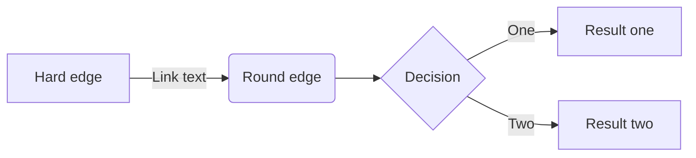
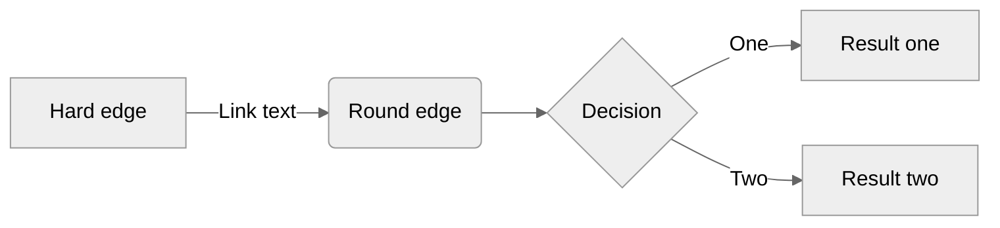

Shortcodes are the Hugo way to extend the limitations of Markdown before resorting to HTML. There are a number of built-in shortcodes available from Hugo. This list is extended with Gardener website shortcodes designed specifically for its content.
Find a complete reference to the Hugo built-in shortcodes on its [website](https://gohugo.io/content-management/shortcodes/).

Below is a reference to the shortcodes developed for the Gardener website.

## alert
```
{}
text
{}
```
produces
{}
A notice disclaimer
{}

All the color options are `info`|`warning`|`primary`

You can also omit the title section from an alert, useful when creating notes. 

It is important to note that the text that the "alerts" shortcode wraps will not be processed during site building. Do not use shortcodes in it.

### Alert Examples

{}
Info color
{}

{}
Warning color
{}

{}
Primary color
{}

## mermaid
Reference documentation [here](https://mermaid-js.github.io/mermaid/#/README). The [GitHub mermaid](https://github.blog/2022-02-14-include-diagrams-markdown-files-mermaid/) fenced code block syntax is used.

~~~

~~~

produces:


Default settings can be overridden using the %%init%% header at the start of the diagram definition.
See the [Mermaid theming documentation](https://mermaid-js.github.io/mermaid/#/theming?id=themes-at-the-local-or-current-level)

~~~

~~~

produces:

