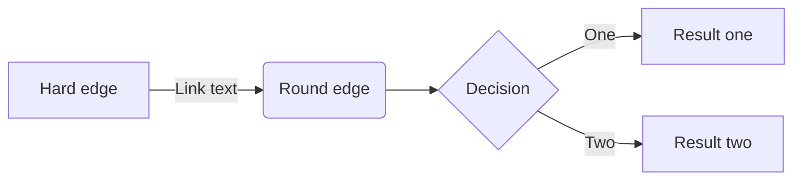
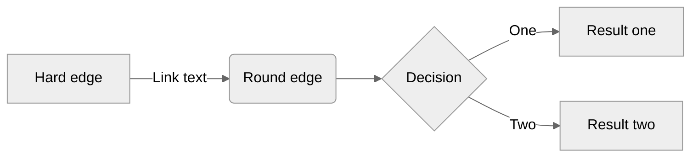

Shortcodes are the Hugo way to extend the limitations of Markdown before resorting to HTML. There are a number of built-in shortcodes available from Hugo. This list is extended with Gardener website shortcodes designed specifically for its content.
Find a complete reference to the Hugo built-in shortcodes on its [website](https://gohugo.io/content-management/shortcodes/).

Below is a reference to the shortcodes developed for the Gardener website.

## Alerts

For alerts and other notes, use the [standard Hugo blockquote syntax for alerts](https://gohugo.io/render-hooks/blockquotes/#basic-syntax).

## mermaid

The [GitHub mermaid](https://github.blog/2022-02-14-include-diagrams-markdown-files-mermaid/) fenced code block syntax is used. You can find additional documentation at [mermaid's official website](https://mermaid.js.org/#/README).

~~~

~~~

produces:

Default settings can be overridden using the %%init%% header at the start of the diagram definition.
See the [mermaid theming documentation](https://mermaid.js.org/config/theming.html#themes-at-the-local-or-current-level).

~~~

~~~

produces:

