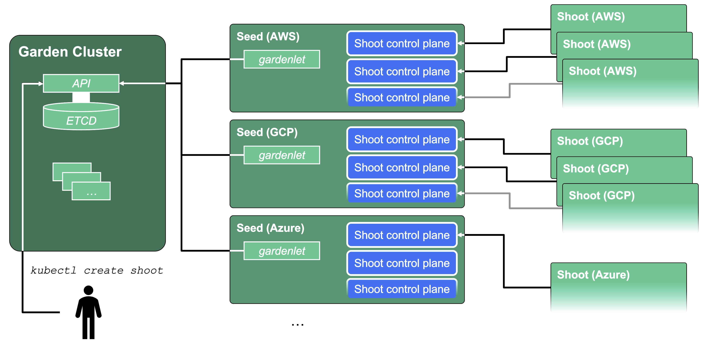
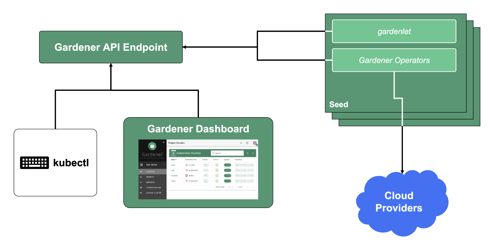
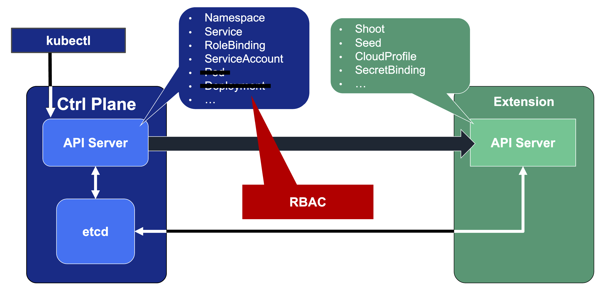
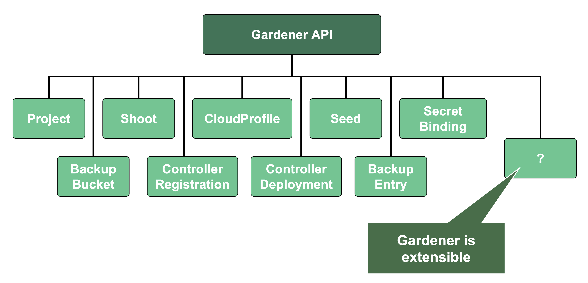

## Kubeception

Kubeception - Kubernetes in Kubernetes in Kubernetes

In the classic setup, there is a dedicated host / VM to host the master components / control plane of a Kubernetes cluster. However, these are just normal programs that can easily be put into containers. Once in containers, Kubernetes Deployments and StatefulSets (for the etcd) can be made to watch over them. And by putting all that into a separate, dedicated Kubernetes cluster you get Kubernetes on Kubernetes, aka Kubeception (named after the famous movie Inception with Leonardo DiCaprio).

But what are the advantages of running Kubernetes on Kubernetes? For one, it makes use of resources more reasonably. Instead of providing a dedicated computer or virtual machine for the control plane of a Kubernetes cluster - which will probably never be the right size but either too small or too big - you can dynamically scale the individual control plane components based on demand and maximize resource usage by combining the control planes of multiple Kubernetes clusters.

In addition to that, it helps introducing a first layer of high availability. What happens if the API server suddenly stops responding to requests? In a traditional setup, someone would have to find out and manually restart the API server. In the Kubeception model, the API server is a Kubernetes Deployment and of course, it has sophisticated liveness- and readiness-probes. Should the API server fail, its liveness-probe will fail too and the pod in question simply gets restarted automatically - sometimes even before anybody would have noticed about the API server being unresponsive.

In Gardener's terminology, the cluster hosting the control plane components is called a seed cluster. The cluster that end users actually use (and whose control plane is hosted in the seed) is called a shoot cluster.

The worker nodes of a shoot cluster are plain, simple virtual machines in a hyperscaler (EC2 instances in AWS, GCE instances in GCP or ECS instances in Alibaba Cloud). They run an operating system, a container runtime (e.g., containerd), and the kubelet that gets configured during node bootstrap to connect to the shoot's API server. The API server in turn runs in the seed cluster and is exposed through an ingress. This connection happens over public internet and is - of course - TLS encrypted.

In other terms: you use Kubernetes to run Kubernetes.

## Cluster Hierarchy in Gardener

Gardener uses many Kubernetes clusters to eventually provide you with your very own shoot cluster.

At the heart of Gardener's cluster hierarchy is the garden cluster. Since Gardener is 100% Kubernetes native, a Kubernetes cluster is needed to store all Gardener related resources. The garden cluster is actually nodeless - it only consist of a control plane, an API server (actually two), an etcd, and a bunch of controllers. The garden cluster is the central brain of a Gardener landscape and the one you connect to in order to create, modify or delete shoot clusters - either with kubectl and a dedicated kubeconfig or though the Gardener dashboard.

The seed clusters are next in the hierarchy - they are the clusters which will host the "kubeceptioned" control planes of the shoot clusters. For every hyperscaler supported in a Gardener landscape, there would be at least one seed cluster. However, to reduce latencies as well as for scaling, Gardener landscapes have several different seeds in different regions across the globe to keep the distance between control planes and actual worker nodes small.

Finally, there are the shoot clusters - what Gardener is all about. Shoot clusters are the clusters which you create through Gardener and which your workload gets deployed to.

## Gardener Components Overview

From a very high level point of view, the important components of Gardener are:

### The Gardener API Endpoint

You can connect to the Gardener API Endpoint (i.e., the API server in the garden cluster) either through the dashboard or with kubectl, given that you have a proper kubeconfig for it.

### The Seeds Running the Shoot Cluster Control Planes

Inside each seed is one of the most important controllers in Gardener - the gardenlet. It spawns many other controllers, which will eventually create all resources for a shoot cluster, including all resources on the cloud providers such as virtual networks, security groups, and virtual machines.

## Gardener's API Endpoint

Kubernetes' API can be extended - either by CRDs or by API aggregation.

API aggregation involves setting up a so called extension-API-server and registering it with the main Kubernetes API server. The extension API server will then serve resources of custom-defined API groups on its own. While the main Kubernetes API server is still used to handle RBAC, authorization, namespacing, quotas, limits, etc., all custom resources will be delegated to the extension-API-server. This is done through an APIService resource in the main API server - it specifies that, e.g., the API group `core.gardener.cloud` is served by a dedicated extension-API-server and all requests concerning this API group should be forwarded the specified IP address or Kubernetes service name. Extension API servers can persist their resources in their very own etcd but they do not have to - instead, they can use the main API servers etcd as well.

Gardener uses its very own extension API server for its resources like Shoot, Seed, CloudProfile, SecretBinding, etc... However, Gardener does not set up a dedicated etcd for its own extension API server - instead, it reuses the existing etcd of the main Kubernetes API server. This is absolutely possible since the resources of Gardener's API are part of the API group `gardener.cloud` and thus will not interfere with any resources of the main Kubernetes API in etcd.

In case you are interested, you can read more on:
- [API Extension](https://kubernetes.io/docs/tasks/extend-kubernetes/setup-extension-api-server/)
- [API Aggregation ](https://kubernetes.io/docs/concepts/extend-kubernetes/api-extension/apiserver-aggregation)
- [APIService Resource](https://kubernetes.io/docs/tasks/extend-kubernetes/configure-aggregation-layer/#register-apiservice-objects)

## Gardener API Resources

Since Gardener's API endpoint is a regular Kubernetes cluster, it would theoretically serve all resources from the Kubernetes core API, including Pods, Deployments, etc. However, Gardener implements RBAC rules and disables certain controllers that make these resources inaccessible. Objects like Secrets, Namespaces, and ResourceQuotas are still available, though, as they play a vital role in Gardener.

In addition, through Gardener's extension API server, the API endpoint also serves Gardener's custom resources like Projects, Shoots, CloudProfiles, Seeds, SecretBindings (those are relevant for users), ControllerRegistrations, ControllerDeployments, BackupBuckets, BackupEntries (those are relevant to an operator), etc.
