## Overview

A cluster has a data plane and a control plane. The data plane is like a space station. It has certain components which keep everyone / everything alive and can operate autonomously to a certain extent. However, without mission control (and the occasional delivery of supplies) it cannot share information or receive new instructions.

So let's see what the mission control (control plane) of a Kubernetes cluster looks like.

## Kubeception

[Kubeception - Kubernetes in Kubernetes in Kubernetes](../architecture/_index.md#kubeception)

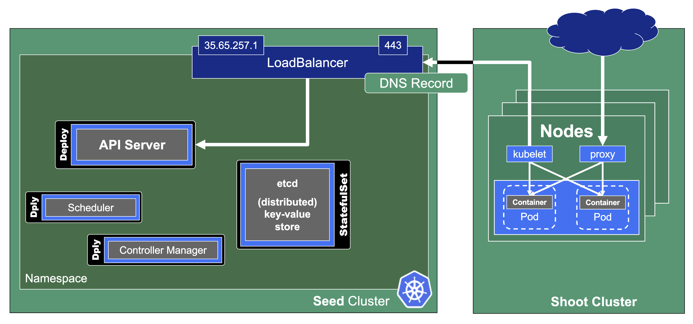

In the classic setup, there is a dedicated host / VM to host the master components / control plane of a Kubernetes cluster. However, these are just normal programs that can easily be put into containers. Once in containers, we can make Kubernetes Deployments and StatefulSets (for the etcd) watch over them. And now we put all that into a separate, dedicated Kubernetes cluster - et voilà, we have Kubernetes in Kubernetes, aka Kubeception (named after the famous movie Inception with Leonardo DiCaprio).

In Gardener's terminology, the cluster hosting the control plane components is called a seed cluster. The cluster that end users actually use (and whose control plane is hosted in the seed) is called a shoot cluster.

## Control Plane Components on the Seed

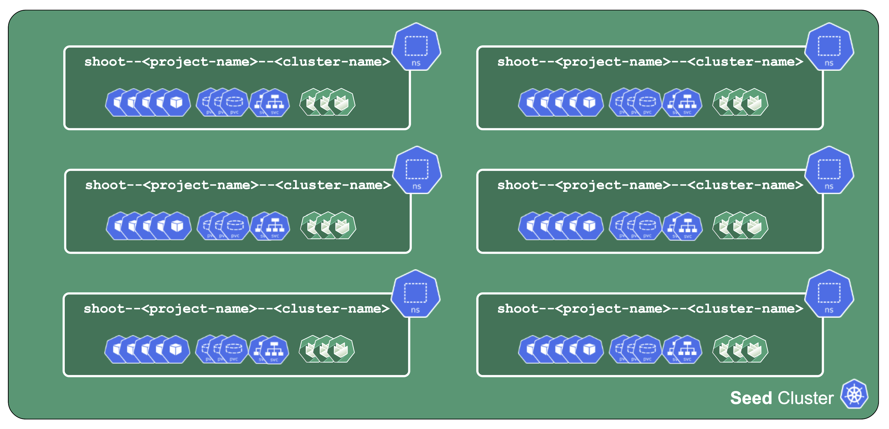

All control-plane components of a shoot cluster run in a dedicated namespace on the seed.

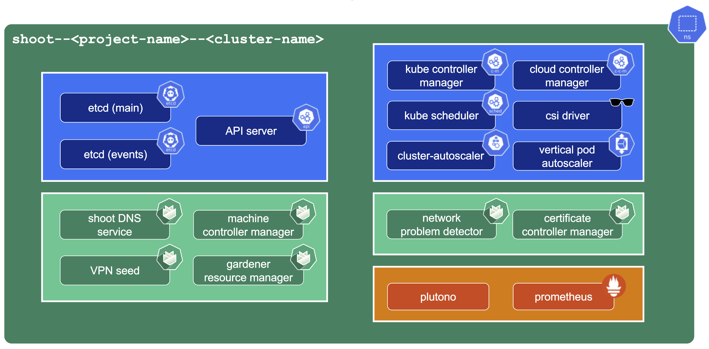

A control plane has lots of components:
- Everything needed to run vanilla Kubernetes
- etcd main & events (split for performance reasons)
- Kube-.*-manager
- CSI driver

Additionally, we deploy components needed to manage the cluster:
- Gardener Resource Manager (GRM)
- Machine Controller Manager (MCM)
- DNS Management
- VPN

There is also a set of components making our life easier (logging, monitoring) or adding additional features (cert manager).

## Core Components

Let's take a close look at the API server as well as etcd.

Secrets are encrypted at rest. When asking etcd for the data, the reply is still encrypted. Decryption is done by the API server which knows the necessary key.

For non-HA clusters etcd has only 1 replica, while for HA clusters there are 3 replicas.

One special remark is needed for Gardener's deployment of etcd. The pods coming from the etcd-main StatefulSet contain two containers - one runs etcd, the other runs a program that periodically backs up etcd's contents to an object store that is set up per seed cluster to make sure no data is lost. After all, etcd is the Achilles heel of all Kubernetes clusters. The backup container is also capable of performing a restore from the object store as well as defragment and compact the etcd datastore. For performance reasons, Gardener stores Kubernetes events in a separate etcd instance. By default, events are retained for 1h but can be kept longer if defined in the `shoot.spec`.

The kube API server (often called "kapi") scales both horizontally and vertically.

The kube API server is not directly exposed / reachable via its public hostname. Instead, Gardener runs a single LoadBalancer service backed by an istio gateway / envoy, which uses SNI to forward traffic.

The [kube-controller-manager](https://kubernetes.io/docs/concepts/overview/components/#kube-controller-manager) (aka [KCM](https://kubernetes.io/docs/reference/command-line-tools-reference/kube-controller-manager/)) is the component that contains all the controllers for the core Kubernetes objects such as Deployments, Services, PVCs, etc.

The [Kubernetes scheduler](https://kubernetes.io/docs/concepts/scheduling-eviction/kube-scheduler/) will assign pods to nodes.

The [Cloud Controller Manager](https://kubernetes.io/docs/concepts/architecture/cloud-controller/) (aka CCM) is the component that contains all functionality to talk to Cloud environments (e.g., create LoadBalancer services).

The CSI driver is the storage subsystem of Kubernetes. It provisions and manages anything related to persistence.

Without the cluster autoscaler, nodes could not be added or removed based on current pressure on the cluster resources. Without the VPA, pods would have fixed resource limits that could not change on demand.

## Gardener-Specific Components

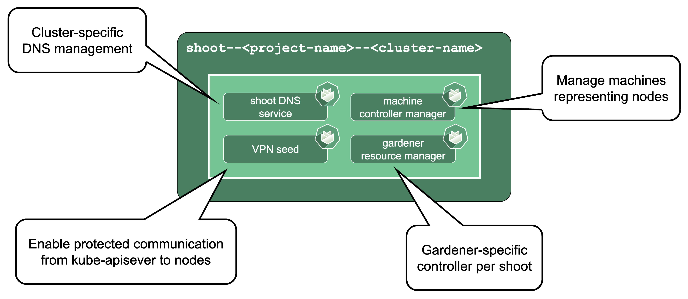

**Shoot DNS service:** External DNS management for resources within the cluster.

**Machine Controller Manager:** Responsible for managing VMs which will become nodes in the cluster.

**Virtual Private Network deployments** (aka [VPN](https://github.com/gardener/vpn)): Almost every communication between Kubernetes controllers and the API server is unidirectional - the controllers are given a kubeconfig and will establish a connection to the API server, which is exposed to all nodes of the cluster through a LoadBalancer. However, there are a few operations that require the API server to connect to the kubelet instead (e.g., for every webhook, when using kubectl exec or kubectl logs). Since every good Kubernetes cluster will have its worker nodes shielded behind firewalls to reduce the attack surface, Gardener establishes a VPN connection from the shoot's internal network to the API server in the seed. For that, every shoot, as well as every control plane namespace in the seed, have openVPN pods in them that connect to each other (with the connection being established from the shoot to the seed).

**Gardener Resource Manager:** Tooling to deploy and manage Kubernetes resources required for cluster functionality.

## Machines

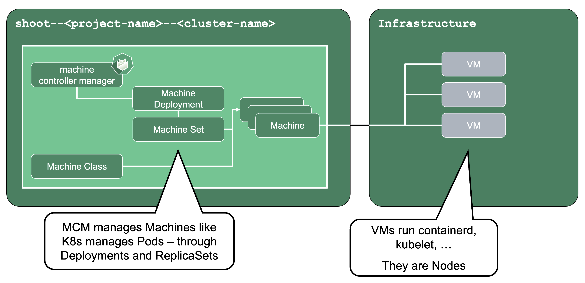

**Machine Controller Manager** (aka [MCM](https://github.com/gardener/machine-controller-manager)):

The machine controller manager, which lives on the seed in a shoot's control plane namespace, is the key component responsible for provisioning and removing worker nodes for a Kubernetes cluster. It acts on MachineClass, MachineDeployment, and MachineSet resources in the seed (think of them as the equivalent of Deployments and ReplicaSets) and controls the lifecycle of machine objects. Through a system of plugins, the MCM is the component that phones to the cloud provider's API and bootstraps virtual machines.

For more information, see [MCM](https://github.com/gardener/machine-controller-manager/blob/master/docs/FAQ.md) and [Cluster-autoscaler](https://github.com/gardener/autoscaler/blob/machine-controller-manager-provider/cluster-autoscaler/FAQ.md).

## ManagedResources

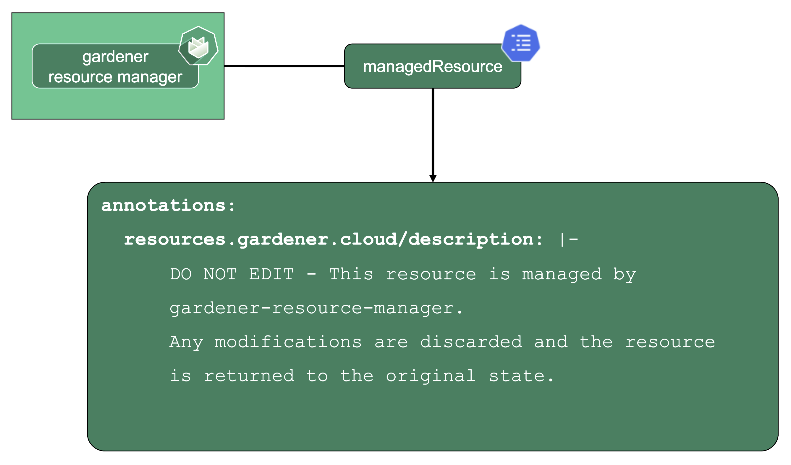

**Gardener Resource Manager** (aka [GRM](https://github.com/gardener/gardener/blob/master/docs/concepts/resource-manager.md)):

Gardener not only deploys components into the control plane namespace of the seed but also to the shoot (e.g., the counterpart of the VPN). Together with the components in the seed, Gardener needs to have a way to reconcile them.

Enter the GRM - it reconciles on ManagedResources objects, which are descriptions of Kubernetes resources which are deployed into the seed or shoot by GRM. If any of these resources are modified or deleted by accident, the usual observe-analyze-act cycle will revert these potentially malicious changes back to the values that Gardener envisioned. In fact, all the components found in a shoot's kube-system namespace are ManagedResources governed by the GRM. The actual resource definition is contained in Secrets (as they may contain "secret" data), while the ManagedResources contain a reference to the secret containing the actual resource to be deployed and reconciled.

## DNS Records - "Internal" and "External"

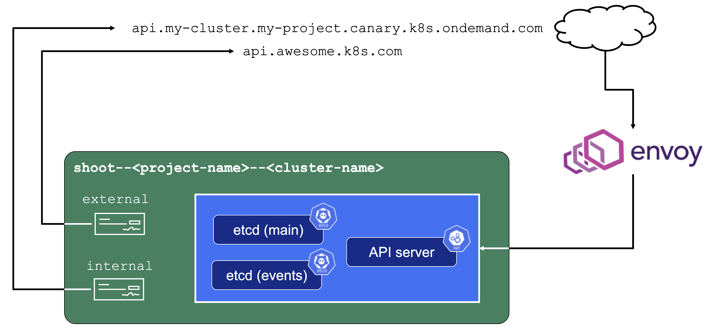

The internal domain name is used by all Gardener components to talk to the API server. Even though it is called "internal", it is still publicly routable.

But most importantly, it is pre-defined and not configurable by the end user.

Therefore, the "external" domain name exists. It is either a user owned domain or can be pre-defined for a Gardener landscape. It is used by any end user accessing the cluster's API server.

For more information, see [Contract: DNSRecord Resources](https://github.com/gardener/gardener/blob/master/docs/extensions/dnsrecord.md).

## Features and Observability

Gardener runs various health checks to ensure that the cluster works properly. The Network Problem Detector gives information about connectivity within the cluster and to the API server.

**Certificate Management:** allows to request certificates via the ACME protocol (e.g., issued by Let's Encrypt) from within the cluster. For detailed information, have a look at the [cert-manager project](https://github.com/gardener/cert-management#certificate-management).

**Observability stack:** Gardener deploys observability components and gathers logs and metrics for the control-plane & kube-system namespace. Also provided out-of-the-box is a UI based on Plutono (fork of Grafana) with pre-defined dashboards to access and query the monitoring data. For more information, see [Observability](../observability/_index.md).

## HA Control Plane

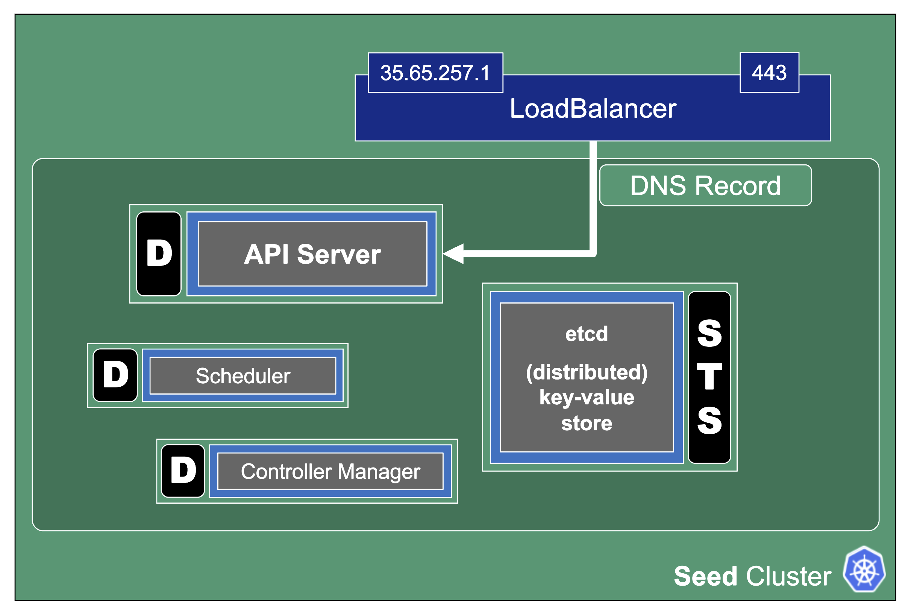

As the title indicates, the HA control plane feature is only about the control plane. Setting up the data plane to span multiple zones is part of the worker spec of a shoot.

HA control planes can be configured as part of the shoot's spec. The available types are:
- Node
- Zone

Both work similarly and just differ in the failure domain the concepts are applied to.

For detailed guidance and more information, see the [High Availability Guides](https://gardener.cloud/docs/guides/high-availability/).

## Zonal HA Control Planes

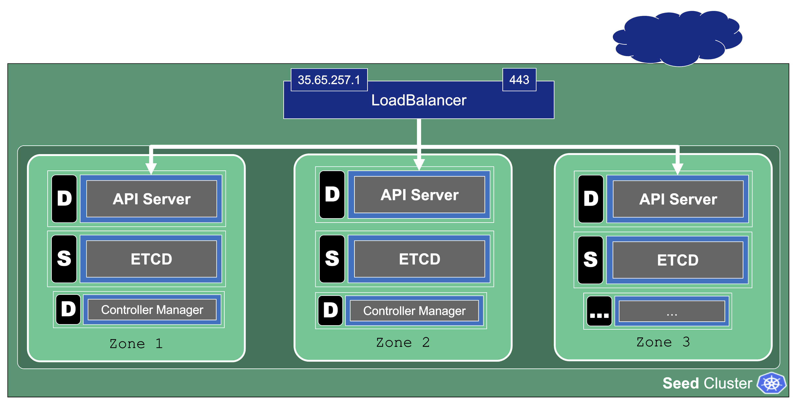

Zonal HA is the most likely setup for shoots with `purpose: production`.

The starting point is a regular (non-HA) control plane. etcd and most controllers are singletons and the kube-apiserver might have been scaled up to several replicas.

To get to an HA setup we need:
- A minimum of 3 replicas of the API server
- 3 replicas for etcd (both main and events)
- A second instance for each controller (e.g., controller manager, csi-driver, scheduler, etc.) that can take over in case of failure (active / passive).

To distribute those pods across zones, well-known concepts like PodTopologySpreadConstraints or Affinities are applied.

## kube-system Namespace

For a fully functional cluster, a few components need to run on the data plane side of the diagram. They all exist in the kube-system namespace. Let's have a closer look at them.

### Networking

On each node we need a CNI (container network interface) plugin. Gardener offers Calico or Cilium as network provider for a shoot. When using Calico, a kube-proxy is deployed. Cilium does not need a kube-proxy, as it takes care of its tasks as well.

The CNI plugin ensures pod-to-pod communication within the cluster. As part of it, it assigns cluster-internal IP addresses to the pods and manages the network devices associated with them. When an overlay network is enabled, calico will also manage the routing of pod traffic between different nodes.

On the other hand, kube-proxy implements the actual service routing (cilium can do this as well and no kube-proxy is needed). Whenever packets go to a service's IP address, they are re-routed based on IPtables rules maintained by kube-proxy to reach the actual pods backing the service. kube-proxy operates on endpoint-slices and manages IPtables on EVERY node. In addition, kube-proxy provides a health check endpoint for services with `externalTrafficPolicy=local`, where traffic only gets to nodes that run a pod matching the selector of the service.

The egress filter implements basic filtering of outgoing traffic to be compliant with SAP's policies.

And what happens if the pods crashloop, are missing or otherwise broken?

Well, in case kube-proxy is broken, service traffic will degrade over time (depending on the pod churn rate and how many kube-proxy pods are broken).

When calico is failing on a node, no new pods can start there as they don't get any IP address assigned. It might also fail to add routes to newly added nodes. Depending on the error, deleting the pod might help.

### DNS System

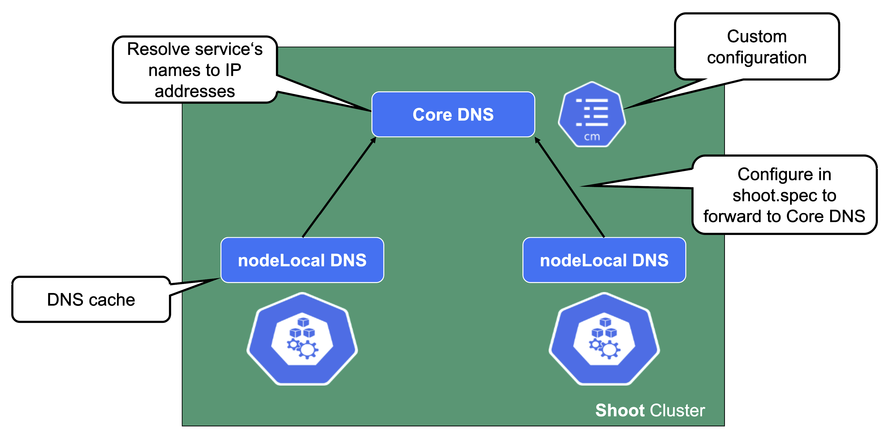

For a normal service in Kubernetes, a cluster-internal DNS record that resolves to the service's ClusterIP address is being created. In Gardener (similar to most other Kubernetes offerings) CoreDNS takes care of this aspect. To reduce the load when it comes to upstream DNS queries, Gardener deploys a DNS cache to each node by default. It will also forward queries outside the cluster's search domain directly to the upstream DNS server. For more information, see [NodeLocalDNS Configuration](https://github.com/gardener/gardener/blob/master/docs/usage/node-local-dns.md) and [DNS autoscaling](https://github.com/gardener/gardener/blob/master/docs/usage/dns-autoscaling.md).

In addition to this optimization, Gardener allows [custom DNS configuration to be added to CoreDNS](https://github.com/gardener/gardener/blob/master/docs/usage/custom-dns-config.md) via a dedicated ConfigMap.

In case this customization is related to non-Kubernetes entities, you may configure the shoot's NodeLocalDNS to forward to CoreDNS instead of upstream (`disableForwardToUpstreamDNS: true`).

A broken DNS system on any level will cause disruption / service degradation for applications within the cluster.

### Health Checks and Metrics

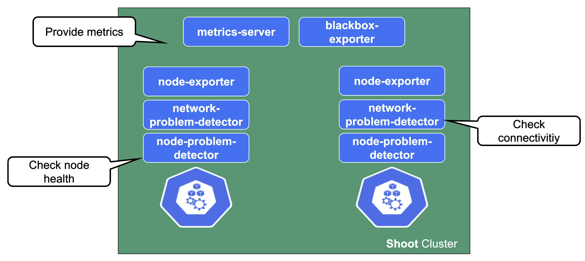

Gardener deploys probes checking the health of individual nodes. In a similar fashion, a network health check probes connectivity within the cluster (node to node, pod to pod, pod to api-server, ...).

They provide the data foundation for Gardener's monitoring stack together with the metrics collecting / exporting components.

### Connectivity Components

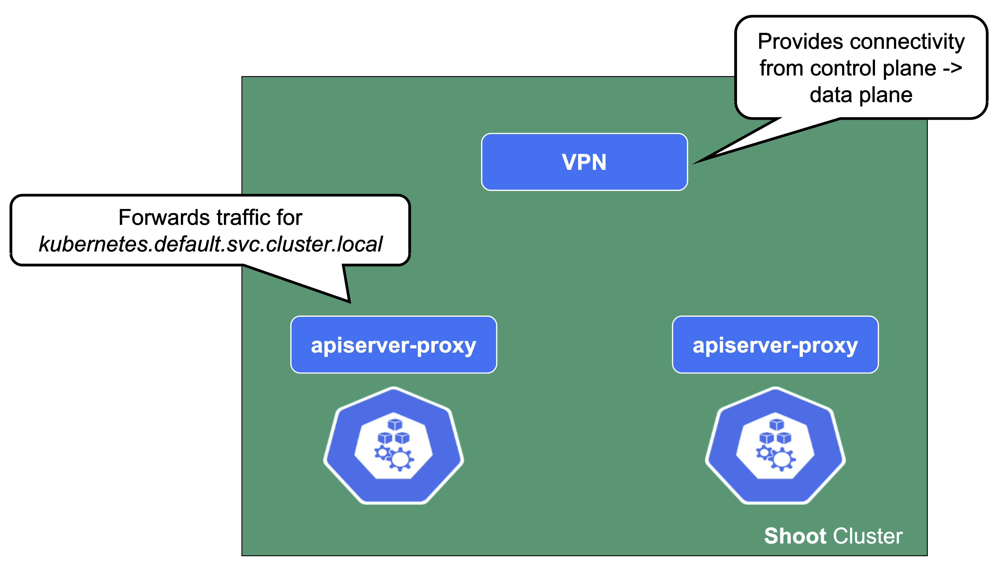

From the perspective of the data plane, the shoot's API server is reachable via the cluster-internal service `kubernetes.default.svc.cluster.local`. The apiserver-proxy intercepts connections to this destination and changes it so that the traffic is forwarded to the kube-apiserver service in the seed cluster. For more information, see [kube-apiserver via apiserver-proxy](https://github.com/gardener/gardener/blob/764df0ee5ebc13b2634eba98169b409244f19bfe/docs/usage/control-plane-endpoints-and-ports.md#kube-apiserver-via-apiserver-proxy).

The second component here is the VPN shoot. It initiates a VPN connection to its counterpart in the seed. This way, there is no open port / Loadbalancer needed on the data plane. The VPN connection is used for any traffic flowing from the control plane to the data plane. If the VPN connection is broken, port-forwarding or log querying with kubectl will not work. In addition, webhooks will stop functioning properly.

### csi-driver

The last component to mention here is the csi-driver that is deployed as a Daemonset to all nodes. It registers with the kubelet and takes care of the mounting of volume types it is responsible for.