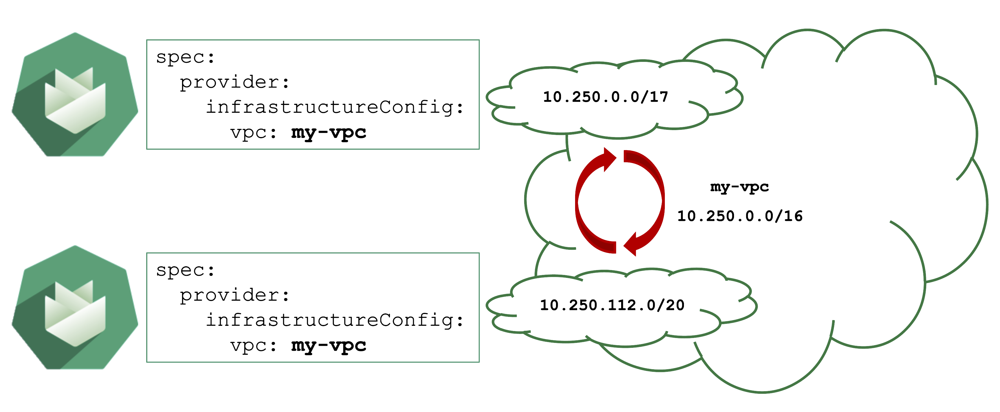
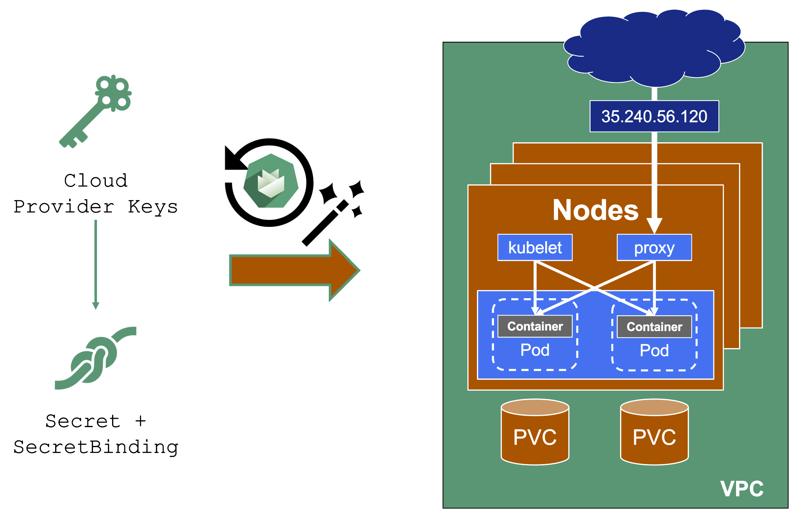

## Architecture

### Containers will NOT fix a broken architecture!

Running a highly distributed system has advantages, but of course, those come at a cost. In order to succeed, one would need:
- Logging
- Tracing
- No singleton
- Tolerance to failure of individual instances
- Automated config / change management
- Kubernetes knowledge

## Scalability

Most scalability dimensions are interconnected with others. If a cluster grows beyond reasonable defaults, it can still function very well. But tuning it comes at the cost of time and can influence stability negatively. 

Take the number of nodes and pods, for example. Both are connected and you cannot grow both towards their individual limits, as you would face issues way before reaching any theoretical limits.

Reading the [Scalability of Gardener Managed Kubernetes Clusters](https://github.com/gardener/documentation/blob/master/website/documentation/guides/administer-shoots/scalability/_index.md) guide is strongly recommended in order to understand the topic of scalability within Kubernetes and Gardener.

### A Small Sample of Things That Can Grow Beyond Reasonable Limits

When scaling a cluster, there are plenty of resources that can be exhausted or reach a limit:
- The API server will be scaled horizontally and vertically by Gardener. However, it can still consume too much resources to fit onto a single node on the seed. In this case, a user can only reduce the load on the API server. This should not happen with regular usage patterns though.
- ETCD disk space: 8GB is the limit. If you have too many resources or a high churn rate, a cluster can run out of ETCD capacity. In such a scenario it will stop working until defragmented, compacted, and cleaned up.
- The number of nodes is limited by the network configuration (pod cidr range & node cidr mask). Also, there is a reasonable number of nodes (300) that most workloads should not exceed. It is possible to go beyond but doing so requires careful tuning and consideration of connected scaling dimensions (like the number of pods per node).

**The availability of your cluster is directly impacted by the way you use it.**

### Infrastructure Capacity and Quotas

Sometimes requests cannot be fulfilled due to shortages on the infrastructure side. For example, a certain instance type might not be available and new Kubernetes nodes of this type cannot be added. It is a good practice to use the [cluster-autoscaler's priority expander](https://github.com/gardener/autoscaler/blob/machine-controller-manager-provider/cluster-autoscaler/expander/priority/readme.md) and have a secondary node pool.

Sometimes, it is not the physical capacity but exhausted quotas within an infrastructure account that result in limits. Obviously, there should be sufficient quota to create as many VMs as needed. But there are also other resources that are created in the infrastructure that need proper quotas:
- Loadbalancers
- VPC
- Disks
- Routes (often forgotten, but very important for clusters without overlay network; typically defaults to around 50 routes, meaning that 50 nodes is the maximum a cluster can have)
- ...

### NodeCIDRMaskSize

Upon cluster creation, there are several settings that are network related. For example, the address space for Pods has to be defined. In this case, it is a `/16` subnet that includes a total of 65.536 hosts. However, that does not imply that you can easily use all addresses at the same point in time. 

As part of the Kubernetes network setup, the `/16` network is divided into smaller subnets and each node gets a distinct subnet. The size of this subnet defaults to `/24`. It can also be specified (but not changed later).

Now, as you create more nodes, you have a total of 256 subnets that can be assigned to nodes, thus limiting the total number of nodes of this cluster to 256.

For more information, see [Shoot Networking](https://github.com/gardener/gardener/blob/master/docs/usage/shoot_networking.md).

## Overlapping VPCs

### Avoid Overlapping CIDR Ranges in VPCs

Gardener can create shoot cluster resources in an existing / user-created VPC. However, the user has to make sure that the CIDR ranges used by the shoots nodes or subnets for zones do not overlap with other shoots deployed to the same VPC.

In case of an overlap, there might be strange routing effects, and packets ending up at a wrong location.

## Expired Credentials 

Credentials expire or get revoked. When this happens to the actively used infrastructure credentials of a shoot, the cluster will stop working after a while. New nodes cannot be added, LoadBalancers cannot be created, and so on.

A user can update the credentials stored in the project namespace and reconcile the cluster to replicate the new keys to all relevant controllers. Similarly, when doing a planned rotation one should wait until the shoot reconciled successfully before invalidating the old credentials.

## AutoUpdate Breaking Clusters

Gardener can automatically update a shoot's Kubernetes patch version, when a new patch version is labeled as "supported". Automatically updating of the OS images works in a similar way. Both are triggered by the "supported" classification in the respective cloud profile and can be enabled / disabled as part a shoot's spec.

Additionally, when a minor Kubernetes / OS version expires, Gardener will force-update the shoot to the next supported version. 

Turning on AutoUpdate for a shoot may be convenient but comes at the risk of potentially unwanted changes. While it is possible to switch to another OS version, updates to the Kubernetes version are a one way operation and cannot be reverted.

{}
Control the version lifecycle separately for any cluster that hosts important workload.
{}

## Node Draining 

### Node Draining and Pod Disruption Budget

Typically, nodes are drained when:
- There is a update of the OS / Kubernetes minor version
- An Operator cordons & drains a node
- The cluster-autoscaler wants to scale down

Without a PodDistruptionBudget, pods will be terminated as fast as possible. If an application has 2 out of 2 replicas running on the drained node, this will probably cause availability issues.

### Node Draining with PDB

PodDisruptionBudgets can help to manage a graceful node drain. However, if no disruptions are allowed there, the node drain will be blocked until it reaches a timeout. Only then will the nodes be terminated but without respecting PDB thresholds.

{}
Configure PDBs and allow disruptions.
{}

## Pod Resource Requests and Limits

### Resource Consumption

Pods consume resources and, of course, there are only so many resources available on a single node. Setting requests will make the scheduling much better, as the scheduler has more information available. 

Specifying limits can help, but can also limit an application in unintended ways. A recommendation to start with:
- Do not set CPU limits (CPU is compressible and throttling is really hard to detect)
- Set memory limits and monitor OOM kills / restarts of workload (typically detectable by container status exit code 137 and corresponding events). This will decrease the likelihood of OOM situations on the node itself. However, for critical workloads it might be better to have uncapped growth and rather risk a node going OOM.

Next, consider if assigning the workload to quality of service class `guaranteed` is needed. Again - this can help or be counterproductive. It is important to be aware of its implications. For more information, see [Pod Quality of Service Classes](https://kubernetes.io/docs/concepts/workloads/pods/pod-qos/).

Tune `shoot.spec.Kubernetes.kubeReserved` to protect the node (kubelet) in case of a workload pod consuming too much resources. It is very helpful to ensure a high level of stability.

If the usage profile changes over time, the VPA can help a lot to adapt the resource requests / limits automatically.

## Webhooks

### User-Deployed Webhooks in Kubernetes

By default, any request to the API server will go through a chain of checks. Let's take the example of creating a pod. 
When the resource is submitted to the API server, it will be checked 
- is the user authorized to perform this action? 
- is the pod definitionactually valid?
- are the specified values allowed?
Additionally, there is the defaulting - like the injection of a the `default` service account's name, if nothing else is specified.

This chain of admission control and mutation can be enhanced by the user. Read about [dynamic admission control for more details](https://kubernetes.io/docs/reference/access-authn-authz/extensible-admission-controllers/).

`ValidatingWebhookConfiguration`: allow / deny based on custom rules

`MutatingWebhookConfiguration`: change а resource before it is actually stored in etcd (that is, before any other controller acts upon)

`ValidatingWebhookConfiguration` / `MutatingWebhookConfiguration`: 
- specify for which resources and operations these checks should be executed. 
- specify how the checks are executed (service)
- webhook serving pod: perform a review and reply to the `admissionReview` request

What can go wrong (i.e., the webhook is not reachable and thus blocking the creation of the pod or any other operation that the webhook is responsible for)?

- VPN / connection issues can happen both on the side of the seed as well as the shoot
- The traffic cannot reach the pod (network issue, pod not available)
- The pod is processing too slow (e.g., because there are too many requests)

### Timeout

Webhooks are a very helpful feature of Kubernetes. However, they can easily be configured to break a shoot cluster. Take the timeout, for example. High timeouts (>15s) can lead to blocking requests of control plane components. That's because most control-plane API calls are made with a client-side timeout of 30s, so if a webhook has `timeoutSeconds=30`, the overall request might still fail as there is overhead in communication with the API server and other potential webhooks.

{}
Webhooks (esp. mutating) may be called sequentially and thus adding up their individual timeouts. Even if the `faliurePolicy` is ignored, the timeout will stop the request.
{}

### Recommendations

Problematic webhooks are reported as part of a shoot's status. In addition to timeouts, it is crucial to exclude the `kube-system` namespace and (potentially non-namespaced) resources that are necessary for the cluster to function properly. Those should not be subject to a user-defined webhook. 

**Example:**

A webhook checks node objects upon creation and has a `failurePolicy: fail`. If the webhook does not answer in time (either due to latency or because there is no pod serving it), new nodes cannot join the cluster.

For more information, see [Shoot Status](https://github.com/gardener/gardener/blob/master/docs/usage/shoot_status.md#constraints).

## Conversion Webhooks

### Who installs a conversion webhook?

If you have written your own CRD and made a version upgrade, you will also have consciously written & deployed the conversion webhook.

However, sometimes, you simply use helm or kustomize to install a (third-party) dependency that contains CRDs as well. Of course, those can contain conversion webhooks as well. As a user of a cluster, please make sure to be aware what you deploy.

### CRD with a Conversion Webhook

Conversion webhooks are tricky. Similarly to regular webhooks, they should have a low timeout. However, they cannot be remediated automatically and can cause strange errors. For example, if a webhook is invoked but not available, it can block the garbage collection run by the kube-controller-manager. 

In turn, when deleting deployments, pods will not be deleted automatically.

{}
Try to avoid conversion webhooks. They are valid and can be used, but should not stay in place forever. Complete the upgrade to a new version of the CRD as soon as possible.
{}

For more information, see the [Webhook Conversion](https://kubernetes.io/docs/tasks/extend-kubernetes/custom-resources/custom-resource-definition-versioning/#webhook-conversion), [Upgrade Existing Objects to a New Stored Version](https://kubernetes.io/docs/tasks/extend-kubernetes/custom-resources/custom-resource-definition-versioning/#upgrade-existing-objects-to-a-new-stored-version), and [Version Priority](https://kubernetes.io/docs/tasks/extend-kubernetes/custom-resources/custom-resource-definition-versioning/#version-priority) topics in the Kubernetes documentation.