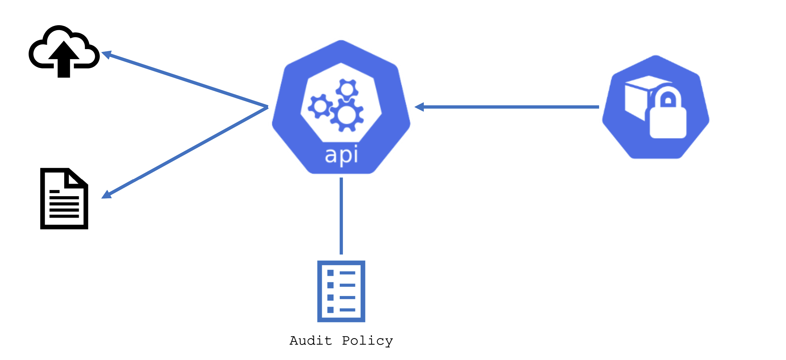
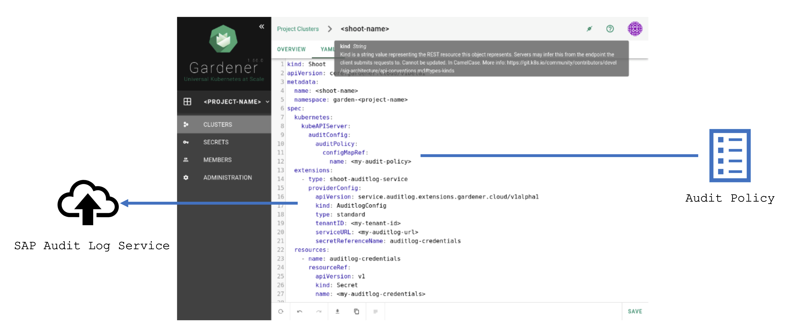

## Auditing in K8s Control Planes

By default, Gardener is set up with an empty audit policy, which produces no audit logs. A user may change this and specify a suitable policy. This will cause the K8s API server to produce audit logs for matching events. Audit events will be sent to a remote backend or stored to disk.

For more information, see [Auditing](https://kubernetes.io/docs/tasks/debug/debug-cluster/audit/).

## Configure Audit Logs for Gardener Shoots

Gardener allows you to specify the audit policy in a `configMap` in the Garden Cluster. It can be referenced by one or many Shoots within a Project.

Additionally, there is an internally available extension that allows you to forward audit logs to the central audit log service (ALS). 

For a detailed guide, see [Audit the Control Plane of a Shoot Cluster](https://github.tools.sap/kubernetes/documentation/blob/master/website/documentation/guides/sap-internal/cluster-operations/audit-kube-apiserver/_index.md).