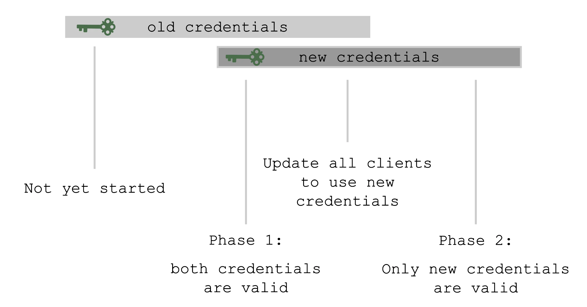
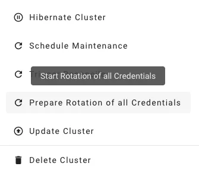
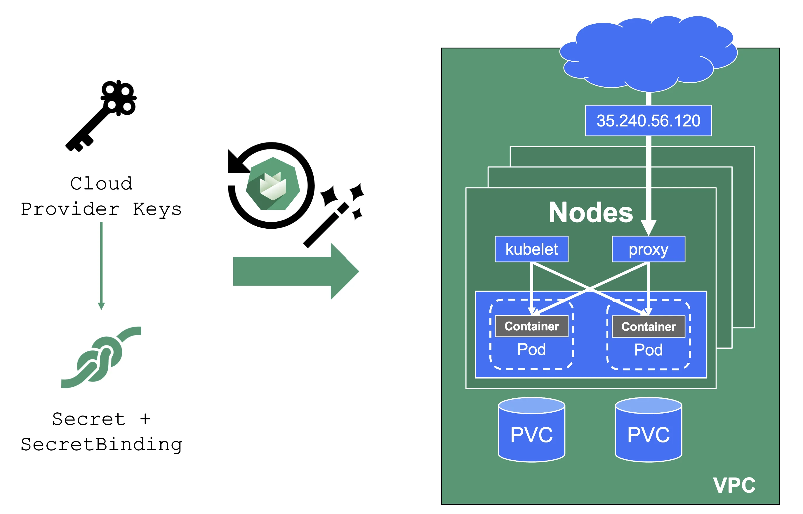

## Overview

Gardener deals with two distinct classes of credentials for Shoot clusters. They differ in scope, ownership, and how they are rotated:

| Class | Examples | Scope | Who rotates |
|---|---|---|---|
| **Infrastructure credentials** | Cloud provider keys (AWS, Azure, GCP, OpenStack) | Project-scoped — shared across Shoots via `CredentialsBinding` | You |
| **Shoot credentials** | CAs, SSH key pair, ETCD encryption key, ServiceAccount signing key, observability passwords | Per-Shoot — generated and managed by Gardener | You, via `kubectl annotate` operations on the Shoot |

Infrastructure credentials are **not** part of the Shoot itself — they are `Secret`s in the garden cluster's project namespace, referenced by Shoots via a `CredentialsBinding`. Shoot credentials are generated per Shoot by Gardener and rotate through well-defined phases.

For step-by-step instructions, go directly to the relevant section in the [Credentials Rotation for Shoot Clusters](https://github.com/gardener/gardener/blob/master/docs/usage/shoot-operations/shoot_credentials_rotation.md) documentation:
- [Infrastructure credentials](https://github.com/gardener/gardener/blob/master/docs/usage/shoot-operations/shoot_credentials_rotation.md#infrastructure-credentials-project-scoped) (cloud provider keys)
- [Shoot credentials](https://github.com/gardener/gardener/blob/master/docs/usage/shoot-operations/shoot_credentials_rotation.md#shoot-credentials-gardener-managed) (CAs, SSH, ETCD, etc.)

## Two-Phase Rotation Model

For Gardener-managed credentials, rotation happens in two phases where possible.

In the **Preparing phase**, new credentials are created alongside the old ones — both sets are valid simultaneously.
This gives you time to update any API clients, kubeconfigs, or tooling that depend on the old credentials before they are invalidated.

In the **Completing phase**, the old credentials are invalidated and only the new set remains.
You should only trigger this phase after all clients have been updated to use the new credentials.

The shoot's status always reflects the current rotation phase, readable at `.status.credentials.rotation`.

You can also conveniently trigger rotation from the Gardener dashboard:

## Automatic Rotation

Some Gardener-managed credential types support automatic rotation during the maintenance window via `.spec.maintenance.autoRotation.credentials`:

- SSH key pair
- ETCD encryption key (enabled by default on new shoots)
- Observability passwords

Certificate authorities and the ServiceAccount signing key require user action between phases and therefore cannot be rotated automatically.

For configuration details, see [Automatic Credentials Rotation](https://github.com/gardener/gardener/blob/master/docs/usage/shoot/shoot_maintenance.md#automatic-credentials-rotation).

## Infrastructure Credentials

Infrastructure credentials are cloud provider keys you supply to Gardener so it can manage your cluster's infrastructure (networks, VMs, disks, load balancers).
These keys are stored in a `Secret` in the garden cluster's project namespace and referenced by your Shoot via a `CredentialsBinding`. A single `Secret` can be shared across multiple Shoots.

When you rotate these credentials, you update the `Secret` with new keys, wait for all Shoots referencing that `Secret` to reconcile successfully, and only then deactivate the old keys in your cloud provider account.

> [!NOTE]
> It is not possible to move a Shoot to a different infrastructure account.

For the full rotation procedure, see [Infrastructure Credentials (Project-Scoped)](https://github.com/gardener/gardener/blob/master/docs/usage/shoot-operations/shoot_credentials_rotation.md#infrastructure-credentials-project-scoped) in the Credentials Rotation guide.
