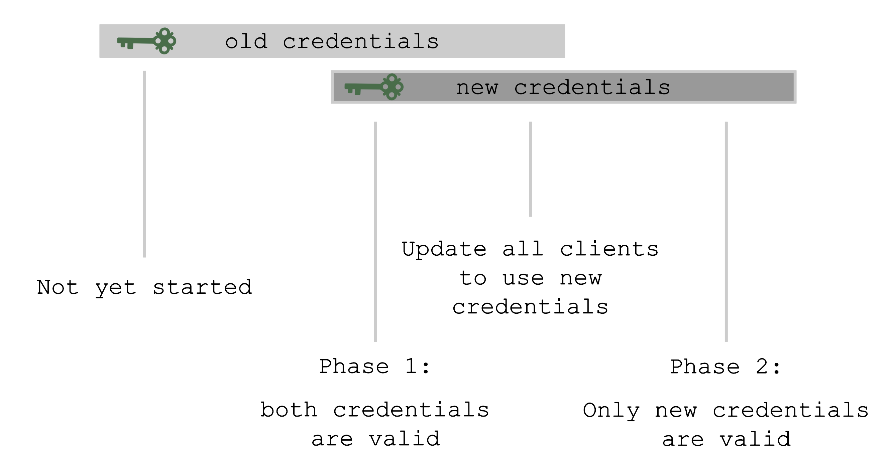

## Keys

There are plenty of keys in Gardener. The ETCD needs one to store resources like secrets encrypted at rest. Gardener generates certificate authorities (CAs) to ensure secured communication between the various components and actors and service account tokens are signed with a dedicated key. There is also an SSH key pair to allow debugging of nodes and the observability stack has its own passwords too.


All of these keys share a common property: they are managed by Gardener. Rotating them, however, is potentially very disruptive. Hence, Gardener does not do it automatically, but offers you means to perform these tasks easily. For a single cluster, you may conveniently use the dashboard. Of course, it is also possible to do the same by annotating the shoot resource accordingly:

```bash
kubectl -n <shoot-namespace> annotate shoot <shoot-name> gardener.cloud/operation=rotate-credentials-start
```

```bash
kubectl -n <shoot-namespace> annotate shoot <shoot-name> gardener.cloud/operation=rotate-credentials-complete​
```

Where possible, the rotation happens in two phases. Phase 1 introduces new keys while the old ones are still valid. Users can safely exchange keys / CA bundles wherever they are used. Afterwards, phase 2 will invalidate the old keys / CA bundles.

## Rotation Phases



At the beginning, only the old set of credentials exists. By triggering the rotation, new credentials are created in phase 1 and both sets are valid. Now, all clients have to update and start using the new credentials. Only afterwards it is safe to trigger phase 2, which invalidates the old credentials.

The shoot's status will always show the current status / phase of the rotation.

For more information, see [Credentials Rotation for Shoot Clusters](https://github.com/gardener/gardener/blob/master/docs/usage/shoot_credentials_rotation.md).

## User-Provided Credentials


You grant Gardener permissions to create resources by handing over cloud provider keys. These keys are stored in a secret and referenced to a shoot via a SecretBinding. Gardener uses the keys to create the network for the cluster resources, routes, VMs, disks, and IP addresses.

When you rotate credentials, the new keys have to be stored in the same secret and the shoot needs to reconcile successfully to ensure the replication to every controller. Afterwards, the old keys can be deleted safely from Gardener's perspective.

While the reconciliation can be triggered manually, there is no need for it (if you're not in a hurry). Each shoot reconciles once within 24h and the new keys will be picked up during the next maintenance window.

{}
It is not possible to move a shoot to a different infrastructure account (at all!).
{}
